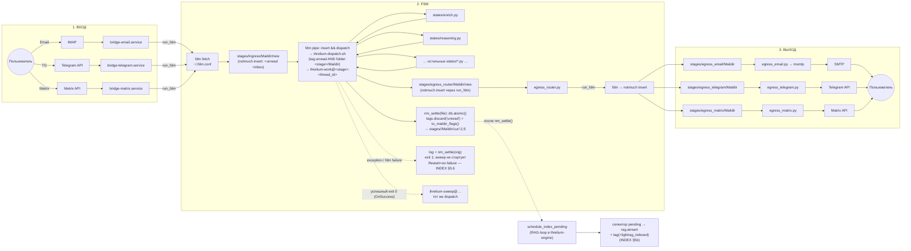

# Threlium — архитектура

Документ описывает **верхнеуровневую архитектуру агента** (целевая архитектура: контракт хранилища, индексации и LightRAG-воркера — мастер-источник [`INDEX.md`](INDEX.md)): назначение, ключевые абстракции, высокоуровневые потоки данных, контур FSM и интеграции с LLM / LightRAG / CLI. Всё, что конкретизируется в других местах, сюда не дублируется — здесь только интегральная картина и связи.

**Источники истины (при расхождении переопределяют этот документ):**


| Документ                                 | Зона ответственности                                                                                                                                                                                                        |
| ---------------------------------------- | --------------------------------------------------------------------------------------------------------------------------------------------------------------------------------------------------------------------------- |
| [FSM.md](FSM.md)                       | FSM-уровень: граф состояний, контракт стадии как функции-состояния `(EmailMessage, stage: FsmStage) → EmailMessage | None`, минимальный каркас модуля `threlium.states.<stage>`, билдеры MIME из `threlium.common`, контракт тела между стадиями. |
| [INDEX.md](INDEX.md)                   | **Мастер-контракт** хранилища писем (durable stage Maildirs под единым notmuch root) и графа знаний (LightRAG в RAG-loop демона). Тег-таксономия, **fdm** (`fdm.conf`), stage worker, enrich (`unified_messages` + `aquery`), recovery, dependencies, glossary. |
| [MESSAGES.md](MESSAGES.md)             | Раскладка `$THRELIUM_HOME`, канонизация `Message-ID` / `In-Reply-To` / `References` (`threlium.types`), имена файлов в Maildir, fdm.conf / §3 snippet, stage worker и RAG-loop в `threlium-engine`, [§8](MESSAGES.md#8-canonical-x-threlium-headers-glossary) — глоссарий `X-Threlium-*` на wire. |
| [ORCHESTRATION.md](ORCHESTRATION.md)   | Оркестрация стадий: **fdm** (`notmuch insert && threlium-dispatch.sh` в `pipe`) → `threlium-work@` (submit) → `threlium-engine` (`python -m threlium.runners.engine`), `threlium-sweep@` backstop, serial-per-thread, гонки, лимиты.                                    |
| [SUBAGENT_TABLE.md](SUBAGENT_TABLE.md) | Матрица FSM делегирования, таблицы правил `ingress_router` / `egress_router`, маркеры `subagent_intent` / `subagent_end`, `X-Threlium-Hop-Budget`, HITL.                                                           |
| [MEMORY_TABLE.md](MEMORY_TABLE.md)     | Матрицы переходов `thread_memory` и `global_memory`, связь с LightRAG-индексацией (текущая модель; ранее — GraphRAG-экспортом).                                                                                                                                            |
| [PLAYBOOK.md](PLAYBOOK.md)             | Ansible playbook как система развёртывания: push-модель без `git clone` на target, фазы `site.yml`, переменные, карта артефактов, acceptance.                                                                              |


---

## 1. Назначение системы

**Threlium** — локальный или серверный AI-агент, который:

- принимает пользовательский поток из разных каналов (почта, Telegram, Matrix) через симметричные `ingress_<chan>` / `egress_<chan>`-мосты и работает с ним как с **цепочкой RFC 5322 сообщений**;
- ведёт рассуждение как **конечный автомат (FSM)**, где каждое состояние — handler `main(msg: EmailMessage, stage: FsmStage) → EmailMessage | None` в модуле `threlium.states.<stage>`, вызываемый **in-process** из `threlium.runners.engine` (демон `threlium-engine.service`); следующее письмо в очередь следующей стадии уходит через `run_fdm` → `notmuch insert`;
- хранит долговременную историю в **union-индексе** (`stages/<stage>/Maildir/{new,cur}/` всех стадий — durable mailboxes под единым `notmuch database.path = ~/threlium/stages`, см. [`INDEX.md` §10 решение 7](INDEX.md#10-architectural-decisions-log)), индексируемом Python-библиотекой `notmuch2`;
- общается с LLM через `litellm` (OpenAI-compatible HTTP API) с нативной поддержкой **tool calls**;
- обладает **трёхслойной памятью** (локальный тред, глобальные факты пользователя, диалоговый контекст через LightRAG); LightRAG-индексация выполняется **внутри** `threlium-engine.service` выделенным asyncio-loop ([`INDEX.md` §5b](INDEX.md#5b-lightrag-worker)) после `nm_settle()` на шаге FSM (`schedule_index_pending`), а стадия `enrich` запрашивает граф (`rag.aquery`) и собирает хронологию треда (`unified_messages`) в один MIME для `reasoning` (литералы — [`FSM.md` §5.2](FSM.md#52-контракт-тела-enrich--reasoning), алгоритм — [`INDEX.md` §7](INDEX.md#7-enrich-notmuch-context--query--lightrag)).

**Философия:** Unix-way + Python-native. Сообщения — файлы в Maildir; стадии — независимые Python-функции; маршрутизация — **`fdm`** → `notmuch insert` (одной транзакцией); оркестрация — `systemd --user`.

### 1.1. Ключевые архитектурные решения


| Решение                                       | Смысл                                                                                                                                                                                                                                                                                                                                                                                                                       |
| --------------------------------------------- | --------------------------------------------------------------------------------------------------------------------------------------------------------------------------------------------------------------------------------------------------------------------------------------------------------------------------------------------------------------------------------------------------------------------------- |
| **`systemd --user`**                          | Оркестрация без root; после `notmuch insert` **fdm** `pipe` вызывает `threlium-dispatch.sh`, который стартует инстансы **`threlium-work@`** (`Type=exec`); единый user manager. Активация пользовательских сервисов без логина — `loginctl enable-linger $USER` (один раз при настройке хоста).                                                                                                                                                                                                                        |
| **Unit-файлы в репозитории**                  | Один Git репозиторий — единый источник правды; на хосте — симлинки в `~/.config/systemd/user/`.                                                                                                                                                                                                                                                                                                                             |
| **FSM как переходы между Maildir'ами**        | Стадия реализована Python-модулем (`threlium.states.<stage>`) с handler `main(msg: EmailMessage, stage: FsmStage) → EmailMessage | None`. Движок FSM читает Maildir-файл, парсит через `parse_rfc822`, вызывает handler in-process и при непустом результате сериализует `EmailMessage` → `run_fdm` (`None` — без второго `run_fdm`; на `egress_<channel>` после успешной доставки наружу handler возвращает письмо на `archive@localhost`, затем **`archive`** возвращает `None`, см. [§2.6](ARCHITECTURE.md#26-каналы-единая-маршрутизация-ingress-egress)). Контракт стадии (минимальный каркас модуля, билдеры MIME) — [FSM.md](FSM.md). Оркестрация и транзакционность (**fdm** `notmuch insert && dispatch` → `threlium-dispatch.sh` → `python -m threlium.runners.engine_submit` → `threlium.runners.engine`, `systemd`-инстанс как per-thread мьютекс, `threlium-sweep@` backstop, окружение через `EnvironmentFile=`) — [ORCHESTRATION.md §3](ORCHESTRATION.md#3-механизм-post-insert-hook--dispatch-script), [§6](ORCHESTRATION.md#6-юниты-systemd-пути-имена-окружение). |
| **`fdm`**                                | Только маршрутизация по `~/.fdm.conf`: **одно терминирующее** `pipe` → `notmuch insert --folder=stages/<stage>/Maildir … && threlium-dispatch.sh` на каждое письмо — атомарная запись файла в `new/` стадии + индексация одной транзакцией notmuch ([`INDEX.md` §4](INDEX.md#4-mailfilter-terminating-insert), [`MESSAGES.md` §3](MESSAGES.md#3-mailfilter-snippet)). Никакого `cc "$ARCHIVE"` — выделенного archive-Maildir'а нет; union notmuch index делает stage Maildir'ы логическим архивом. Внешние фильтры вроде `xfilter` **не** используются. |
| **Единый venv в корне репозитория** (`.venv`) | `litellm`, `lightrag-hku`, `notmuch2`, `pybase62`, `msgspec` и все `ExecStart` используют одно окружение Python.                                                                                                                                                                                                                                                                                                            |
| **Union notmuch index = canonical event store** | `notmuch database.path = ~/threlium/stages` индексирует все stage Maildir'ы вместе. Stage worker не удаляет файлы — после успешной обработки делает `nm_settle()` ([`INDEX.md` §5.5.3](INDEX.md#553-notmuch-consistency-через-notmuch2mutabletagset)) и файл переезжает `new/<id>` → `cur/<id>:2,S` durable. Логический «архив» = `notmuch search '*'`. |
| **Чекпоинтов вне union index нет**            | Ни `offset`/`since` для мостов, ни «pending»-БД HITL. Всё восстанавливается `notmuch2`-поиском по заголовкам в union index'е (см. [MESSAGES.md §2](MESSAGES.md#2-канонизация-идентификаторов-на-границах-системы)).                                                                                                                                                                                                              |


### 1.2. Жизненный цикл хоста: bootstrap через Ansible и автономная эволюция

- **Bootstrap (однократное развёртывание).** Первичная инсталляция Threlium на новый хост — один проход `ansible-playbook ansible/playbooks/site.yml` с control node: выкладка скриптов, конфигов, симлинков в `~/.config/systemd/user/`, `loginctl enable-linger`, `daemon-reload` и `enable --now` на path/timer/мосты, acceptance. После успешного прогона роль плейбука заканчивается — Ansible **не** является постоянным governor'ом хоста.
- **После bootstrap — локальный git на target как источник правды.** В `threlium_repo_path` плейбуком однократно (идемпотентно, по `creates: .git`) выполняется локальный `git init`. Все последующие правки unit-файлов, конфигов и Python-скриптов на конкретном хосте коммитятся в **этот** локальный репозиторий оператором или самим агентом. `git remote` проекта на target не добавляется; обратной синхронизации с control node нет.
- **Саморазвитие агента.** Threlium имеет право модифицировать собственный код и конфигурацию в `threlium_repo_path` через стадию `cli_exec` — при `privileged: true` в `cli_intent` (system scope) и ресурсных лимитах transient `systemd-run` (`MemoryMax`/`CPUQuota`/`TasksMax`, см. [ORCHESTRATION.md §5](ORCHESTRATION.md#5-гонки-восстановление-лимит-параллелизма)). Применение правок — штатными `systemctl --user daemon-reload` (+ `restart` при необходимости) из той же цепочки `cli_exec` и локальный `git commit`. Запрещено профилем — правки делает только оператор, локально на target.
- **Legacy cleanup — зона эксплуатации хоста.** Удаление устаревших unit-ов после схемной правки делается **локально на target** (`systemctl --user disable --now`, удаление файла в `threlium_repo_path/systemd/user/`, локальный коммит), а не новым прогоном Ansible. Контрольная копия плейбука описывает **bootstrap-контракт** (как развернуть **новый** чистый хост), а не актуальное состояние уже живущих инсталляций.
- **Повторный прогон `ansible-playbook site.yml` на живом хосте — это disaster-recovery**, не «штатная раскатка правки». Он заново перекладывает артефакты поверх target'а и **затирает локальные коммиты** в `threlium_repo_path/.git`, если они были — и это корректное поведение для recovery в обмен на потерю локального дрейфа.

### 1.3. Политика тестирования

**Единственный** автоматизированный pytest-слой — **e2e** в `tests/e2e` (маркеры `e2e`, `e2e_live`, при необходимости `mailflow`): живой или поднимаемый стек, сквозной контур, WireMock State Extension по [E2E_ISOLATION.md](E2E_ISOLATION.md). Отдельного каталога unit/integration-тестов нет. Статический контроль кода (`mypy` / `pyright` / `ruff` по каталогу скриптов) — отдельно и не заменяет e2e. Подробнее — [TESTING.md](TESTING.md).

---

## 2. Ключевые абстракции

### 2.1. Событие = письмо

Любое действие в системе оформляется как **одно MIME-сообщение** (RFC 5322): заголовки + тело + опциональные вложения. Переход между состояниями FSM — это **доставка нового письма** в `stages/<next>/Maildir/new/`.

### 2.2. Maildir как очередь

Формат **Maildir** (`tmp/`, `new/`, `cur/`): запись в `tmp/`, атомарный `rename(2)` в `new/`, consumer переносит в `cur/`. Естественная очередь задач без отдельного брокера.

### 2.3. Каноническое письмо

**Каноническое сообщение** — уже приведённое к RFC 5322 событие, с которым работает общий FSM-конвейер. Его формирует **не** общая стадия `ingress@localhost`, а **мост канала** `threlium.bridges.<chan>`: именно там учитывается природа транспорта. Любой bridge ставит **`From: <chan>@localhost`** и передаёт маршрут в **`X-Threlium-Route`**, `To: ingress@localhost` — и передаёт полученное письмо в **`run_fdm`** (`fdm -m -a stdin fetch`, `~/.fdm.conf`). В **fdm.conf** FSM-инвариант «ровно один канонический адресат» — все последующие стадии читают имя текущей стадии из `To: <stage>@localhost` (см. [FSM.md §4.2](FSM.md#42-что-делает-воркер-перед-вызовом-handler-а)).

- **Почта (`threlium.bridges.email`):** long-running IMAP IDLE bridge (`threlium-bridge@email.service` → `python -m threlium.runners.bridge email`); IMAP UID-watermark (`imap_uid` в `X-Threlium-Route`, читается из notmuch) → `UID SEARCH UID <wm+1>:*` → notmuch-дедуп по каноническому `Message-ID` → полный fetch при новизне → канонизация MIME (stdlib `email`, `canonicalize_mime`) → **`run_fdm`** → `UID MOVE` обработанного письма из INBOX в `bridges.email.imap_processed_folder` (если задан; иначе legacy `\Seen`). Без fetchmail и stdio-конвейера.
- **Мессенджеры (`threlium.bridges.telegram`, `threlium.bridges.matrix`):** свой pipeline (long-poll / `matrix-nio` sync-loop, лимиты длины, нормализация) — до одного канонического письма.

Мосты могут добавлять вторую MIME-часть — `text/plain` attachment с фиксированным именем файла (`RawIngressCaptureAttachmentFilename`): для почты — все заголовки входящего сообщения плюс только текстовое тело; для TG/Matrix — JSON маршрута и тела. Эта полная структура остаётся в durable-записи `stages/ingress/Maildir`; стадия `ingress` на пути в `enrich` сохраняет входящий MIME (`emit_transition_preserving_payload`) и дописывает distill в `<history>` (sync LLM `tool_choice=required`); в `cli_resume` по-прежнему `ingress_pipeline_email` + только `<system>`.

В `stages/ingress/Maildir/` оказываются **только** такие уже-канонические письма; повторной очистки тела и повторного разбора MIME там нет. Выделенного `archive/Maildir` нет — settled-копия в `cur/` соответствующей стадии служит canonical event store (см. [§2.4](#24-одноконтурная-модель-durable-stage-maildirs-под-union-notmuch-index)).

Каноничная форма `Message-ID` / `In-Reply-To` / `References` — **`<b62(raw_native_id)@localhost>`** для мостов и FSM-порождённых писем — зона ответственности [MESSAGES.md §2](MESSAGES.md#2-канонизация-идентификаторов-на-границах-системы) и :mod:`threlium.types` (``RfcMessageIdWire`` и др.).

### 2.4. Одноконтурная модель: durable stage Maildirs под union notmuch index

Полный контракт хранения и индексации (durable stage Maildirs, **fdm** terminating insert, `nm_settle()`, LightRAG-воркер) — [`INDEX.md` §1-2](INDEX.md#1-motivation), [§4](INDEX.md#4-mailfilter-terminating-insert), [§5b](INDEX.md#5b-lightrag-worker). Здесь — только три контура одной фразой:

- **Durable stage Maildirs** (`$THRELIUM_HOME/stages/<stage>/Maildir/{new,cur}/`) — оперативная очередь и canonical event-store одновременно: после `nm_settle()` файл живёт в `cur/<id>:2,S` durable, индексируется в общий `notmuch database.path = ~/threlium/stages`.
- **Неканоническая доставка** — ветка `match unmatched` в **fdm.conf** переписывает только `To: ingress@localhost`, вставляет в `stages/ingress/Maildir` с тегом `+error`; дальше — тот же `ingress`, что и штатный трафик ([`MESSAGES.md` §3](MESSAGES.md#3-mailfilter-snippet)).
- **LightRAG `working_dir`** (`$THRELIUM_HOME/lightrag/working_dir/`) — общий граф, наполняется **одним** инстансом LightRAG в RAG-loop демона `threlium-engine` после settle ([`INDEX.md` §5b](INDEX.md#5b-lightrag-worker)).

Треды объединяются автоматически базой `notmuch2` по `Message-ID` / `In-Reply-To`; физическая раскладка по подпапкам уже даётся `stages/<stage>/`, дополнительно `From:` prefix фильтрует через `notmuch`-запросы. Выделенного `archive/Maildir` нет — логический «архив» = `notmuch search '*'` по union index'у.

### 2.5. Фреймы и IRT-дерево

В архитектуре чистых функций нет жёстко прошитого маршрута возврата. Адресат ответа определяется динамически через **depth-классификатор по IRT-цепочке** (`subagent_intent` → depth+1, `subagent_end` → depth−1):

- **L0 (основной диалог).** depth == 0. `reasoning` отправляет ответ в `egress_router`, который маршрутизирует наружу пользователю (в канал по `X-Threlium-Route`).
- **L1, L2, … (субагенты).** Вызов субагента — маркер `subagent_intent` в IRT-цепочке с изолированным hop-budget. Субагент не знает, кто его вызвал. По завершении `reasoning` субагента отправляет ответ в `egress_router`, который по depth > 0 маршрутизирует в `subagent_end`; тот находит соответствующий `subagent_intent` по IRT, копирует hop-budget родителя 1-в-1 и возвращает письмо в `ingress@localhost`.

Маршрутизация возврата обеспечивается линейным обходом IRT-цепочки. Полная матрица переходов — [SUBAGENT_TABLE.md](SUBAGENT_TABLE.md).

### 2.6. Каналы: единая маршрутизация ingress/egress

Все транспорты — симметричные функции вокруг единого FSM-контура (`ingress@localhost` → … → `egress_router@localhost`):


| Направление | Канал    | `From` (мосты) | Системный компонент                                                                                   |
| ----------- | -------- | -------------- | ----------------------------------------------------------------------------------------------------- |
| **Вход**    | Email    | `email@localhost` | IMAP IDLE bridge `threlium-bridge@email.service` → `python -m threlium.runners.bridge email` → **`run_fdm`** (см. [ORCHESTRATION.md §6](ORCHESTRATION.md#6-юниты-systemd-пути-имена-окружение)). |
| **Вход**    | Telegram | `telegram@localhost` | Long-poll-воркер `threlium-bridge@telegram.service` → `python -m threlium.runners.bridge telegram` → **`run_fdm`**. |
| **Вход**    | Matrix   | `matrix@localhost` | Sync-loop-воркер `threlium-bridge@matrix.service` → `python -m threlium.runners.bridge matrix` → **`run_fdm`** (`matrix-nio`).     |
| **Выход**   | Email    | (SMTP From из `Config`) | `egress_router` → `egress_email@localhost`; воркер вызывает `egress_email.py` (`msmtp`).              |
| **Выход**   | Telegram | (Bot API) | `egress_router` → `egress_telegram@localhost`; воркер вызывает `egress_telegram.py` (Bot API).        |
| **Выход**   | Matrix   | (homeserver) | `egress_router` → `egress_matrix@localhost`; воркер вызывает `egress_matrix.py` (Client-Server API).  |

**Запись отправки в стадию `archive`.** После успешной доставки наружу `egress_email` / `egress_telegram` / `egress_matrix` возвращают новое письмо с **`To: archive@localhost`**, **`From:`** — mailbox соответствующего `egress_<chan>@localhost`, `In-Reply-To:` на `Message-ID` исходного задания. Тема и тело — Jinja из `$THRELIUM_HOME/prompts/egress/self_archive_subject.j2` и `self_archive_body.j2` (деплой из `ansible/.../prompts/egress/`); в контексте как минимум `egress_stage`, `channel_label`, `sent_raw` (сырой wire после отправки). Движок сериализует MIME и вызывает **`run_fdm`** → **fdm** вставляет письмо в `stages/archive/Maildir` с тегом **`+lightrag_indexed`** (отдельное действие `ins_stage_archive` в `fdm.conf.j2`), чтобы RAG-loop не брал эти MIME в селектор pending. Стадия **`archive`** только возвращает `None` ( settle входного файла в `archive/cur`). Сырой захват на ingress не урезается по байтам (полный UTF-8 в теле/архиве моста).

Каждый мост нормализует внешний сигнал: **email** — канонизирует `Message-ID` / `In-Reply-To` через `RfcMessageIdWire.from_native(EmailNativeId(v=1, …))`, `References` на IMAP-копии не перекодируются; **Telegram / Matrix** — `Message-ID` / `In-Reply-To` через `RfcMessageIdWire.from_inner_for_bridge` (и смежные VO); далее ставит **`From: <channel>@localhost`** и **`X-Threlium-Route`** (`IngressRouteB62Wire.from_ingress_route`) и отправляет результат в **`run_fdm`** с `To: ingress@localhost`. Отдельных Maildir-очередей для приёма каналов **нет** — все приходят в единую стадию `ingress`.

**Источник канала для egress — поле `channel` в JSON `X-Threlium-Route`**, восстановленном через `resolve_route_for_egress_fsm_from_email` (якорь RA или лист, затем `resolve_route_from_in_reply_to_ancestors`; цепочка `In-Reply-To`, на носителе маршрута — `tag:route`). Local-part `From:` (без учёта регистра) должен совпадать с этим полем (инвариант bridge).

**Stateless-чекпоинты мостов.** Отдельной БД `offset`/`since` у мостов нет: при рестарте мост делает `notmuch2`-поиск по каналу (`from:telegram@localhost` и т.д.) и извлекает курсор из **`X-Threlium-Route`** последнего доставленного письма (`IngressRouteB62Wire.decode_b62_wire`): `update_id` (Telegram), `sync_batch` (Matrix). Формат маршрута — [MESSAGES.md §2.2](MESSAGES.md#22-схемы-raw_native_id-по-каналам); архив выступает единственным state-хранилищем.

**Чеклист добавления нового канала** (Slack / Discord / …) — в [MESSAGES.md §7](MESSAGES.md#7-новый-канал-чеклист).

### 2.7. Infrastructure as Code: развёртывание через Ansible

Threlium **не клонируется `git clone`**-ом на целевом хосте. Разворачивание выполняется push-моделью — `ansible-playbook ansible/playbooks/site.yml` с control node заливает на target каталог артефактов (`threlium_repo_path`), корень данных (`$THRELIUM_HOME`), симлинки в `~/.config/systemd/user/` / `~/.fdm.conf` / `~/.msmtprc`, единый `.venv`, user-systemd-юниты и выполняет acceptance. Раскладка данных — в [MESSAGES.md §1](MESSAGES.md#1-раскладка-хранения).

Полная спецификация (архитектурные решения, фазы, переменные, acceptance, post-deploy bundle, режим e2e, границы ответственности плейбука после bootstrap) — **источник истины** [PLAYBOOK.md](PLAYBOOK.md).

---

## 3. Высокоуровневая схема потоков




**Типовая строка конвейера:**

```
Событие → ingress_<chan>-мост → **run_fdm** (`fdm -m -a stdin fetch`, `~/.fdm.conf`)
       (цепочка `match` → `pipe` → `notmuch insert --folder=stages/ingress/Maildir … && dispatch`)
       → stages/ingress/Maildir/new/<notmuch-insert-name>  [+unread +inbox]
       → notmuch insert && threlium-dispatch.sh → threlium-work@ingress:<thread_id>
       → threlium.runners.engine (parse_rfc822 → main → run_fdm)
       → **run_fdm** (`notmuch insert` в следующую стадию через тот же fdm-контур)
         + nm_settle(оригинал) → stages/ingress/Maildir/cur/<id>:2,S
       → … повтор для каждой следующей стадии (enrich, reasoning, …) …
       → egress_router → egress_<chan> → внешний мир
       (после settle шага) schedule_index_pending → RAG-loop → rag.ainsert(...)
```

Детали перехода между стадиями и транзакционности — [ORCHESTRATION.md §3](ORCHESTRATION.md#3-механизм-post-insert-hook--dispatch-script).

---

## 4. Конечный автомат

Threlium — **IRT-tree FSM** без глобального координатора: состояние = Maildir-очередь `stages/<stage>/Maildir` (durable, в union notmuch index), стадия = Python-модуль `threlium.states.<stage>`, переход = доставка нового письма в следующую очередь через **`run_fdm`** (`fdm` + `notmuch insert` в `pipe` — одна транзакция файл + индекс) с последующим `nm_settle()` оригинала. Рекурсия `L0 → L1 → L2 …` и HITL-прерывания реализованы через непрерывную IRT-цепочку с маркерами `subagent_intent` / `subagent_end` и заголовком `X-Threlium-Hop-Budget` без промежуточного in-memory state. Выбор ребра в `reasoning@localhost` — строго по `tool_calls` ответа LLM (`litellm.completion(..., tools=[...])`, см. [§8.7](#87-llm-и-lightrag)).

**Источники истины FSM:**

- **[FSM.md](FSM.md)** — полная визуальная схема графа состояний, принципы стадии (функция-состояние `(EmailMessage, stage: FsmStage) → EmailMessage | None` над stdlib-моделью `email.message.EmailMessage`), контракт handler'а (единый парсинг `policy=default` и сериализация `RFC822_FOR_INSERT` из `threlium.mime_reform` в воркере), минимальный каркас модуля `threlium.states.<stage>`, билдеры MIME из `threlium.common`, контракт тела между стадиями (в т. ч. `enrich → reasoning`).
- **[SUBAGENT_TABLE.md](SUBAGENT_TABLE.md)** — таблицы правил `ingress_router` / `egress_router`, матрица делегирования `L0 → L1 → L2` + HITL, маркеры `subagent_intent` / `subagent_end`, заголовки `X-Threlium-*`.
- **[MEMORY_TABLE.md](MEMORY_TABLE.md)** — матрицы переходов `thread_memory` и `global_memory`, связь с LightRAG-индексацией (текущая модель; ранее — GraphRAG-экспортом).
- **[ORCHESTRATION.md §3](ORCHESTRATION.md#3-механизм-post-insert-hook--dispatch-script)** — как именно стадия запускается: **fdm** (`notmuch insert && threlium-dispatch.sh`, query dispatch `tag:unread AND folder:<stage>/Maildir`) → `threlium-work@.service` (`python -m threlium.runners.engine_submit %i` → сокет → `threlium.runners.engine`; воркер ищет письмо по `to:<stage>@localhost` + `thread:`), `threlium-sweep@` backstop (запуск из **`OnSuccess=`** воркера после **`exit 0`**), serial-per-thread через имя инстанса.

### 4.1. Маршрутизаторы (краткая сводка)

- **`ingress@localhost`** — единая точка входа. Анализирует `In-Reply-To` → IRT-обход до предка `From: cli_hitl_out@localhost` для HITL-детекции и выбирает: «новый корневой диалог», «HITL-возврат», «обычное продолжение». Точные правила — [SUBAGENT_TABLE.md](SUBAGENT_TABLE.md), раздел `ingress_router`.
- **`egress_router@localhost`** — единая точка выхода. Depth-классификатор по IRT-цепочке (`subagent_intent` → depth+1, `subagent_end` → depth−1): `depth > 0` → маршрут в `subagent_end`; `depth == 0` → внешний ответ пользователю: `resolve_route_for_egress_fsm_from_email` → JSON `X-Threlium-Route` → маршрутизация в `egress_<chan>@localhost` (адресата/API берёт только терминальный `egress_*` из wire). Правила — [SUBAGENT_TABLE.md](SUBAGENT_TABLE.md), раздел `egress_router`.

### 4.2. Состояния памяти (краткая сводка)

`thread_memory` и `global_memory` — равноправные узлы графа FSM; структурно симметричны (`reasoning` отправляет письмо → стадия нормализует тело → возврат в `ingress`), стеки `X-Threlium-*` не трогаются. Тело в `ingress@` собирается Jinja2 (`thread_memory/base.j2` / `global_memory/base.j2`); **на диск** не добавляется `X-Threlium-Thread-Id`. Разведение для графа — по mailbox стадии и `From:`; при индексации RAG-loop в `threlium-engine` вставляет в LightRAG **синтетический** RFC822 с `X-Threlium-Thread-Id` только в строке `ainsert` (см. [`INDEX.md` §5b](INDEX.md#5b-lightrag-worker), [§7.6](INDEX.md#76-per-thread-scoping-soft-через-маркеры), [ADR 0001](adr/0001-lightrag-ingest-chunking-enrich.md)). Дополнительных тегов под скопы не вводится. Матрицы переходов и свойства схемы — [MEMORY_TABLE.md](MEMORY_TABLE.md); связка с индексацией и enrich — [MESSAGES.md §5](MESSAGES.md#5-stage-worker-и-lightrag-worker). История бывшей errors-стадии — [MESSAGES.md §5b](MESSAGES.md).

---

## 5. Контекст для диалога

### 5.1. Разделение LightRAG на два контура

Подготовка данных для LightRAG разделена между двумя независимыми компонентами:

1. **После settle шага FSM** — `schedule_index_pending` на выделенном asyncio-loop в `threlium-engine` (single writer на `lightrag/working_dir/`) сливает pending-документы в граф. Stage handler'ы сами `ainsert` не вызывают.
2. **Синхронно в FSM-шаге** — `enrich` вызывает `rag.aquery(...)` (через `run_rag_coroutine`) и собирает гранулярные MIME-части (`<graph-answer>`, `<unified-mail-context>`, `<thread-memory>`, `<global-memory>`) через `build_enriched_multipart` (см. [`INDEX.md` §7](INDEX.md#7-enrich-notmuch-context--query--lightrag); Content-ID контракт — [`FSM.md` §5.2](FSM.md#52-контракт-тела-enrich--reasoning)).

Полный контракт обоих контуров (селектор pending, синтетический ingest-RFC822, кастомный `chunking_func`, цепочка enrich Jinja+LLM+`aquery` + `unified_messages`) — [`INDEX.md` §5b](INDEX.md#5b-lightrag-worker) и [§7](INDEX.md#7-enrich-notmuch-context--query--lightrag).

#### 5.1.1. Отказ от линейных цепочек и форков треда

Ранее для сборки контекста приходилось жёстко отслеживать одну линейную цепочку `In-Reply-To` (от листа до корня), чтобы избежать путаницы при форках. С внедрением LightRAG эта сложность исчезает: **весь RFC-тред целиком** со всеми форками индексируется как единая база знаний, а LLM опирается на семантический граф, а не на хронологическую последовательность.

Для конкретного обрабатываемого письма `enrich` собирает **опорную линию диалога** — проход родитель → … → корень ветки в union notmuch index (`stages/**`) через `notmuch2` — и использует её для формулировки запросов к LightRAG за счет вызова LLM.

Следствие для конвейера: **mutex на весь `thread:` от `ingress` до ответа не нужен.** Разные письма, форкающие диалог, обрабатываются параллельно — у каждого свой якорь и свой путь к корню, но общий LightRAG `working_dir/` и они видят за счёт этого весь диалог включая форки. Serial-per-thread в оркестрации стадий — отдельный, более узкий инвариант (серийно внутри одного **notmuch `thread_id`**, гарантируется именем инстанса `threlium-work@<stage>:<thread_id>.service`); обоснование и разбор случая `m1 ← {m2, m3}` — [ORCHESTRATION.md §§1–3](ORCHESTRATION.md#1-целевые-инварианты).

#### 5.1.2. Контракт тела enrich и reasoning

`enrich` передаёт в `reasoning` **`multipart/mixed`** MIME-сообщение с гранулярными `text/plain` частями по `Content-ID` (до 7 частей: `<user-message>`, `<graph-answer>`, `<unified-mail-context>`, `<thread-memory>`, `<global-memory>`, `<response-state>`, `<plan-state>`). `reasoning` извлекает каждую часть через `extract_part_by_content_id`, применяет per-part trim и собирает промпт через Jinja2-шаблон. Подробный контракт и перечисление билдеров MIME — [FSM.md §5.2](FSM.md#52-контракт-тела-enrich--reasoning).

### 5.1.3. User-editable prompts (раскладка по стадиям FSM `$THRELIUM_HOME/prompts/`)

Всё формирование пользовательского/LLM-видимого контента писем (тела, динамические Subject, FSM/wire-format маркеры внутри тел) вынесено в Jinja2-шаблоны под раскладкой по стадиям FSM `$THRELIUM_HOME/prompts/<stage>/<purpose>.j2` (например, `reflect/continue.j2`, `reflect/final.j2`, `ingress/orphan_notice.j2`, `cli_intent/*.j2`, `cli_resume/*.j2`, `cli_hitl_out/*.j2`, `cli_exec/observation.j2`, `formal_reason/observation_*.j2`, `reasoning/formal_reason_gate.j2`, `memory_query/observation.j2`, `subagent_intent/budget_exhausted.j2`, `reasoning/system.j2`, `reasoning/user.j2`, `reasoning/<route>/{tool_spec,email_body,email_subject}.j2`, `lightrag/ingest_body.j2`, `lightrag/enrich_*.j2`, `lightrag/mail_context.j2`). Конверт bridge→`ingress@` собирается в Python (`threlium.bridges.build_bridge_ingress_email`), не через Jinja.

Контракты:

- Секционные маркеры для LLM формируются автоматически: `extract_part_by_content_id` извлекает каждую MIME-часть по `Content-ID`; reasoning собирает промпт через per-part trim + Jinja2-шаблон, Content-ID каждой части используется как семантический маркер секции. RFC822-заголовки бриджей (`From:`, `To:`, `Message-ID:`, `Date:`, `In-Reply-To:`, `References:`, `Content-Type:`) — **статика**; пустые части опускаются в `build_enriched_multipart`. Код не собирает маркеры вручную.
- Единый рендерер — `threlium.prompts.render_prompt(name, **vars)` (вынесен в отдельный модуль во избежание циклических импортов; `Environment(FileSystemLoader($THRELIUM_HOME/prompts), StrictUndefined, autoescape=False, keep_trailing_newline=True)`).
- Деплой — одна Ansible-таска копирует `roles/threlium/files/prompts/` → `$THRELIUM_HOME/prompts/`; acceptance-loop проверяет существование всех имён из `threlium_required_prompts`.
- Тесты сверяют либо содержимое самих шаблонов, либо стабильные признаки (например, наличие `[Threlium notice`) — точная редакция текста делается правкой шаблона без изменения кода и тестов.

#### 5.1.3.1. LLM- и LightRAG-промпты как user-editable

Помимо «обычных» письменных шаблонов, под ту же раскладку `$THRELIUM_HOME/prompts/` вынесены три класса LLM/LightRAG-артефактов (`docs/INDEX.md` §5b.4.2 / §5b.4.5 / §7):

- **LightRAG enrich** — seed-план задач (`lightrag/enrich_task_plan.j2`) формируется **до** графа, его подзадачи входят в графовый запрос; далее цепочка `lightrag/enrich_query_plan.j2` → один LLM → `lightrag/enrich_aquery_user.j2` (= вопрос + подзадачи) → `aquery` с `lightrag/rag_response.j2` как `system_prompt` → JSON envelope в `<graph-answer>` + `lightrag/mail_context.j2` для контекстных частей (см. [`states/enrich.py`](../ansible/roles/threlium/files/scripts/threlium/states/enrich.py), [`INDEX.md` §7.5](INDEX.md#75-query-call-always-on)). Подсказки к user-вопросу графа — `THRELIUM_LIGHTRAG_AQUERY_HINTS` в `enrich_aquery_user.j2`.
- **LightRAG internal PROMPTS overlay** — `prompts/lightrag/<key>.j2` (12 файлов, верифицированных как копии `lightrag.prompt.PROMPTS` для `lightrag-hku v1.4.15`). Модуль `threlium.lightrag_prompts.install_overlay()` вызывается из `runners/lightrag.py::_build_rag` *до* `LightRAG(...)`; он подменяет каждый ключ из известного набора, который **обязан** присутствовать в текущем `lightrag.prompt.PROMPTS`, иначе `RuntimeError` (нет частичного overlay при апгрейде библиотеки). `entity_extraction_examples` и `keywords_extraction_examples` остаются list-typed (рендер заворачивается в список из одного элемента — внутри LightRAG они склеиваются через `"\n".join`). Для отключения overlay'я и работы на «чистой» библиотеке — `THRELIUM_LIGHTRAG_PROMPTS_OVERLAY=0`.
- **LightRAG addon_params** — `runners/lightrag/addon_params.j2`. Defaults (`language=Russian`, фиксированный список `entity_types`) живут в самом шаблоне; `_addon_params()` лишь рендерит его и парсит как JSON. ENV `THRELIUM_LIGHTRAG_LANGUAGE` и CSV-список `THRELIUM_LIGHTRAG_ENTITY_TYPES` пробрасываются как Jinja2-переменные `language`/`entity_types`. Любое изменение `entity_types` на лету — известный риск дрейфа схемы графа (`docs/INDEX.md` §10.1).
- **Reasoning per-route tool-spec** — `prompts/reasoning/<route>/{tool_spec,email_body,email_subject}.j2` (6 routes × 3 файла = 18 артефактов). На каждый ключ из `ROUTE_TO_ADDRESS` отдельный JSON-tool-spec со своей JSON-Schema (`additionalProperties: false`, `maxLength`-лимиты), и пара `email_subject` + `email_body` для рендера итогового письма. Инвариант: `function.name == route_key` (identity mapping), нарушение → `RuntimeError` на старте. `litellm.completion(... tools=tools, tool_choice="required")` (и ingress/LightRAG tool stages); успешный путь — ровно один валидный `tool_call`. Ответ без `tool_call` (включая непустой plain-text) → `ReasoningStageError` (политика tool-only). Аргументы `tool_call` валидируются `jsonschema`; ошибки схемы пробрасываются как `jsonschema.ValidationError`.
- **Разделение WHEN / HOW для knowledge-маршрутов** (`memory_query`, `formal_reason`, `reflect`). Решение «какой маршрут выбрать» (decision-tree, MUST/MUST NOT, связь с hop budget) живёт в `prompts/reasoning/system.j2` — секции `<knowledge_route_decision>`, `<reflect_strategy>`, `<formal_reason_strategy>` и `<route_priorities>`. Описание «как заполнять аргументы» (SHACL/Turtle/SPARQL, inference, query для `formal_reason`) держится компактным в `tool_spec.j2`, а развёрнутый авторинг-референс (`turtle_syntax.md`, `shacl_sparql.md`, `sparql_functions.md`, `formal_reason_workflows.md`, корпус `rdflib_*` / `pyshacl_*` / `patterns_*`) вынесен в индексируемую базу знаний и достаётся через `memory_query`. Так строка маршрута в списке инструментов остаётся короткой и не конкурирует за внимание модели с триггерами выбора.
- **Стадия `formal_reason@localhost`** (бывш. `logic_validate`; gate/relay — [`FORMAL_REASON_GATE.md`](FORMAL_REASON_GATE.md)): reasoning tool → JSON payload (`FormalReasonStagePayload`: `facts_ttl`, `shapes_ttl`, опционально `ontology_ttl`, `inference`, `return_derived`, `query`) → `threlium.states.formal_reason` (pySHACL + rdflib) → observation (`observation_*.j2` по `FormalReasonOutcome`) + `<system>` `FormalReasonResultPayload` → `enrich_fast` (релей history+system) → reasoning. При `technical_failed` — `compute_allowed_routes` / `formal_reason_gate_active`: только tools `formal_reason` + `memory_query` (`reasoning/formal_reason_gate.j2`); SHACL negative (`conforms=false`) gate не включает. Единый прогон `pyshacl.validate`: когда inference питает `return_derived`/`query`, валидация идёт `inplace=True` на копии baseline-графа (`rdf_graphs.delta_ttl_from_expanded` берёт дельту без повторного прогона, SPARQL — на том же расширенном графе). Ошибки `query`/`derived` — **supplemental**: рендерятся отдельными секциями и не затирают успешную SHACL-валидацию (фатальны только `parse`/`shape`/`runtime`, см. `FormalReasonErrorKind`). Лимиты вывода: `formal_report_max_chars`, `formal_derived_max_chars`, `formal_query_max_chars` (env `THRELIUM_KNOWLEDGE__*`).

Все обязательные шаблоны перечислены в `roles/threlium/defaults/main.yml::threlium_required_prompts`; acceptance-loop проверяет их наличие в `$THRELIUM_HOME/prompts/`. Регрессии связки «шаблон ↔ код» отражаются в e2e и при необходимости в статическом анализе; изменение j2-подстрок, участвующих в классификации запросов к LiteLLM, синхронизируют со стабами WireMock (`tests/e2e/wiremock_stubs/`, см. [E2E_ISOLATION.md](E2E_ISOLATION.md)).

### 5.2. Управление фреймами (субагенты, HITL, egress)

Архитектура реализует **IRT-tree FSM**: рекурсия L0 → L1 → L2 … и прерывания (HITL) без промежуточного in-memory state. Всё состояние фрейма (бюджет шагов, capability-scope) — **в заголовках** RFC 5322; границы фреймов — маркеры `subagent_intent` / `subagent_end` в IRT-цепочке.

Полная спецификация (`subagent_intent` — маркер начала фрейма, `subagent_end` — маркер завершения, HITL-мост через `cli_hitl_out` → `egress_router` → `egress_<chan>` → `ingress_<chan>` → `cli_resume`, изоляция фреймов) — [SUBAGENT_TABLE.md](SUBAGENT_TABLE.md).

---

## 6. Слой CLI и безопасность исполнения

Слой CLI построен на строгом разделении **решение / политика / исполнение**. `reasoning@localhost` **никогда** не вызывает бинарники напрямую.


| Стадия                 | Ответственность                                                                                                                                                                               |
| ---------------------- | --------------------------------------------------------------------------------------------------------------------------------------------------------------------------------------------- |
| `reasoning@localhost`  | Формирует **намерение** через LLM tool calls (какой инструмент, какой следующий mailbox). Выбор маршрута — результат tool call, а не прошитая ветка FSM ([§8.7](#87-llm-и-lightrag)). |
| `cli_intent@localhost` | **Только политика**: sandbox → `cli_exec`; `privileged: true` → HITL (если `cli.privileged_hitl_enabled`) или сразу `cli_exec` (system scope); route-collision → `enrich_fast`. **Команды не исполняет.** |
| `cli_exec@localhost`   | **Только исполнение**; sandbox (`systemd-run --user --wait --pipe` + `ProtectSystem=strict`) или privileged (`--wait --pipe --uid=0`); observation → `enrich_fast@localhost`.                                                            |


Полная матрица шагов CLI (включая HITL-прерывание, возврат ответа пользователя в `cli_resume` и hop-budget) — шаги 10–18 и правила роутеров в [SUBAGENT_TABLE.md](SUBAGENT_TABLE.md).

**Политика `cli_intent`.** `classify_cli_policy`: по умолчанию **sandbox** (`privileged: false` в JSON payload) → `cli_exec` в user scope с `ProtectSystem=strict`; **`privileged: true`** → HITL (если `cli.privileged_hitl_enabled`) или сразу system scope. Коллизия имени FSM-маршрута в `argv[0]` → `enrich_fast` с observation-note.

**Ключевой инвариант HITL-возврата** (из [SUBAGENT_TABLE.md](SUBAGENT_TABLE.md)): маршрут в `cli_resume` определяется не заголовками входящего от пользователя письма (снаружи они могут быть искажены), а `notmuch`-lookup-ом **предков** по `In-Reply-To`: IRT-обход вверх до `From: cli_hitl_out@localhost` → проверка найдена. Отдельная БД «pending-команд» не нужна.

**Исключение для LightRAG.** `rag.aquery(...)` в стадии `enrich` и `rag.ainsert(...)` при drain — доверенные Python-вызовы в едином venv на общем RAG-loop, **не** проходят через `cli_intent` → `cli_exec`. Все остальные shell/CLI-инструменты — только через `cli_intent` → `cli_exec`.

**Память — не часть CLI-слоя.** `thread_memory` и `global_memory` — обычные FSM-состояния, см. [§4.2](#42-состояния-памяти-краткая-сводка) и [MEMORY_TABLE.md](MEMORY_TABLE.md).

**Лимиты ресурсов на конкретный CLI-запуск** — `timeout` + transient `systemd-run` с cgroup (`MemoryMax=…`, `CPUQuota=…`, `TasksMax=…`) из `CliSettings`. Общесистемный лимит параллелизма воркеров — slice `threlium-work.slice` ([ORCHESTRATION.md §5](ORCHESTRATION.md#5-гонки-восстановление-лимит-параллелизма)); он касается FSM-стадий, а не транзитентных CLI-запусков.

**Два режима `cli_exec`.** По умолчанию — **sandbox**: `systemd-run --user --wait --pipe` + `ProtectSystem=strict`, `ProtectHome=read-only`, `ReadWritePaths`, опционально `PrivateNetwork=yes`. При `privileged: true` в payload — **system scope**: `systemd-run --wait --pipe --uid=0`; на хосте — Polkit (`threlium_polkit_agent_systemd_enabled`, см. [`PLAYBOOK.md` §4.2.13a](PLAYBOOK.md#42-порядок-задач-в-siteyml)). HITL для privileged — `cli.privileged_hitl_enabled` (default true).

---

## 7. Служебные заголовки FSM

Заголовки — часть RFC 5322 сообщения. **Входящие от пользователя снаружи** нельзя строить на обязательных произвольных `X-*`: клиент может их не передать или исказить. Внутренняя логика опирается на собственный архив (через `notmuch2`) и каноничный `In-Reply-To`.

Канонические **имена** служебных заголовков `X-Threlium-*` на wire и краткие определения — в [MESSAGES.md §8](MESSAGES.md#8-canonical-x-threlium-headers-glossary). Пошаговая семантика фреймов (маркеры `subagent_intent` / `subagent_end`, декремент бюджета, HITL) — в [SUBAGENT_TABLE.md](SUBAGENT_TABLE.md); здесь таблица не дублируется.

Канал-специфичных заголовков (`X-Threlium-Telegram-*`, `X-Threlium-Matrix-*` и т.п.) в системе **нет**. Native-метаданные канала (`update_id`, `event_id`, `sync_batch`, `chat_id`, `room_id`, `message_thread_id`) живут в распакованном **`X-Threlium-Route`** (`*IngressRoute`). На egress и при bridge-recovery они читаются из этого заголовка на последнем доставленном письме с `tag:route`. `Message-ID` для Telegram/Matrix — `RfcMessageIdWire.from_inner_for_bridge(inner)` (`@localhost`).

**Логи.** Для корреляции строк лога используется усечённый b62-идентификатор из канонического `Message-ID`, а не отдельная «correlation-id» как модель данных.

---

## 8. Компоненты и утилиты

### 8.1. Почтовый контур


| Утилита     | Назначение                                                                                                                         | Пример                                              |
| ----------- | ---------------------------------------------------------------------------------------------------------------------------------- | --------------------------------------------------- |
| `threlium.bridges.email` | Long-running IMAP IDLE bridge (`imap-tools`): UID-watermark (`imap_uid` из notmuch) → `UID SEARCH UID <wm+1>:*` → notmuch-дедуп → полный fetch → канонизация → **`run_fdm`** (через раннер) → `UID MOVE` в `imap_processed_folder` (если задан; иначе `\Seen`). | `python -m threlium.runners.bridge email` (systemd `threlium-bridge@email.service`) |
| `fdm`  | Чтение одного уже-каноничного письма со stdin, правила **`~/.fdm.conf`**, **одна терминирующая** доставка через `pipe` → `notmuch insert --folder=stages/<stage>/Maildir … && threlium-dispatch.sh` (атомарная запись + индексация одной транзакцией; отдельного `cc "$ARCHIVE"` нет). Для «остатка» — составное действие `remove-header` / `add-header` + тот же `pipe` с `+error` ([`MESSAGES.md` §3](MESSAGES.md#3-mailfilter-snippet)). | `fdm -m -a stdin fetch` (stdin — байты `RFC822_FOR_INSERT`, см. `mime_reform`) |
| `msmtp`     | SMTP-клиент, совместимый с sendmail; вызывается из `egress_email.py`.                                                              | `msmtp -t < message.eml`                            |
| `msmtp-mta` | Симлинк `/usr/sbin/sendmail` → `msmtp` для совместимости.                                                                          |                                                     |


### 8.2. Разбор и сборка MIME

Для работы с RFC 5322 / MIME и манипуляций заголовками-стеками используется **только** стандартный модуль Python `email` (`BytesParser` + `policy.default` для полного разбора входа в воркере; на границе с **fdm** / `notmuch insert` и SMTP — сериализация **`RFC822_FOR_INSERT`** из `threlium.mime_reform`, без внешнего `reformail`). Метаданные из notmuch-индекса — через :mod:`threlium.nm` и :meth:`notmuch2.Message.header` (см. `header_field_optional`), **без** `BytesHeaderParser` по путям Maildir. Переписывание `To:` для BUG-ветки (`+error`) делается **в fdm.conf** (составное действие), не в handler'ах стадий.

**Заголовки вне полного `parse_rfc822`.** Воркер читает файл целиком (`email_message_from_bytes`); **до** `FsmStage.from_incoming_to` отсутствие непустого `Message-ID` (inner) — `RuntimeError` ([`FSM.md` §4.2](FSM.md#42-что-делает-воркер-перед-вызовом-handler-а)). Lookup union-notmuch (мосты, `index_headers_by_inner_ids_route_tag`) — через `notmuch2.Message`, не через чтение заголовков с диска.

### 8.3. Maildir: создание и вложенные папки

Все stage Maildir'ы из `threlium_fsm_mailbox_stages` создаются в плейбуке модулем `ansible.builtin.file` (каталоги `cur`/`new`/`tmp` под каждым `stages/<id>/Maildir`, `mode` `0700`, владелец — агент). Это тот же стандартный каркас Maildir, что раньше давала `maildirmake`, без внешней утилиты. Выделенного `archive/Maildir` нет.


| Действие                        | Команда                                                       |
| ------------------------------- | ------------------------------------------------------------- |
| Новый stage Maildir             | в деплое — `site.yml` (`file` + `product` на `cur`/`new`/`tmp`); вручную — `mkdir -p .../Maildir/{cur,new,tmp}` |
| Подпапка в существующем Maildir | при наличии утилиты — `maildirmake -f ИмяПапки /path/to/Maildir`; иначе — дерево `.ИмяПапки/{cur,new,tmp}` по соглашению Maildir |
| Иерархия подпапок               | вложенные имена в `-f` у `maildirmake` (точки) или эквивалентное дерево каталогов |


В Threlium **не используются** Courier-специфичные shared folders (`-S`, `-s`, `courierimapsubscribed`) — достаточно plain Maildir-дерева.

Каталоги без семантики Maildir (`logs/`) создаются модулем `file` в том же плейбуке; стадийные Maildir — отдельной задачей `file` на `cur`/`new`/`tmp` в `site.yml`.

<span id="84-доставка-maildrop"></span>

### 8.4. Доставка: `fdm`

**fdm** используется в режиме **fetch на stdin** (`fdm -m -a stdin fetch`): конфиг **`~/.fdm.conf`** (шаблон [`fdm.conf.j2`](../ansible/roles/threlium/templates/config/fdm.conf.j2)), account `stdin` disabled stdin. После цепочки `match` срабатывает **одно терминирующее** `pipe` → `notmuch insert --folder=stages/<stage>/Maildir … && threlium-dispatch.sh` на каждую стадийную ветку; для «остатка» — составное действие с переписыванием `To: ingress@localhost` и insert с `+error` ([`MESSAGES.md` §3](MESSAGES.md#3-mailfilter-snippet); полное обоснование — [`INDEX.md` §4](INDEX.md#4-mailfilter-terminating-insert)).

События с внешних каналов в систему — **`run_fdm`** (`subprocess.run` на `fdm`, stdin — байты **`RFC822_FOR_INSERT`**) с `To: ingress@localhost` (мосты: `threlium.delivery`). Транзакционность перехода (insert + `nm_settle()` оригинала) и universal error handling — [`INDEX.md` §5/§5.5/§5.6](INDEX.md#5-stage-workers-durable-maildirs); реализация и idempotent recovery — [ORCHESTRATION.md §3](ORCHESTRATION.md#3-механизм-post-insert-hook--dispatch-script).

### 8.5. Индексация и поиск (`notmuch` / `notmuch2`)

Индексация **union** stage Maildir'ов: `notmuch database.path = ~/threlium/stages` покрывает все `stages/<stage>/Maildir/` сразу. Три канала операций:

- **Запись** — внешний `notmuch insert` через **fdm** `pipe` (атомарная транзакция файл + индекс, [`INDEX.md` §4](INDEX.md#4-mailfilter-terminating-insert)). `db.add_message()` из Python **не используется** во избежание двух writer'ов.
- **Settle** (`new/` → `cur/`) — helper `threlium.nm.nm_settle()` через `notmuch2.MutableTagSet` под `db.atomic()`; контракт и таблица tag↔flag — [`INDEX.md` §5.5.3](INDEX.md#553-notmuch-consistency-через-notmuch2mutabletagset).
- **Чтение** — `notmuch2.Database(path, mode="rw")` + `db.messages(query)`; recovery через `from_maildir_flags()` — [`INDEX.md` §9.1](INDEX.md#91-crash-matrix).

База `notmuch` **не** заменяет файлы Maildir — это индекс поверх них; канонические копии остаются Maildir-файлами в `stages/<stage>/Maildir/{new,cur}/`. Логический «архив» = `notmuch search '*'`. Glob-справка (для LightRAG-селектора `*` и `NOT tag:unread` как «settled»-критерий) — [`INDEX.md` §11.2](INDEX.md#112-notmuch-query-syntax--glob-ограничения).

### 8.6. Оркестрация

Полный контракт — [ORCHESTRATION.md §3](ORCHESTRATION.md#3-механизм-post-insert-hook--dispatch-script). Краткая раскладка юнитов:


| Юнит                                                 | Тип                                          | Назначение                                                                                                                                                                                                                                                                |
| ---------------------------------------------------- | -------------------------------------------- | ------------------------------------------------------------------------------------------------------------------------------------------------------------------------------------------------------------------------------------------------------------------------- |
| `~/.fdm.conf` + `threlium-dispatch.sh`    | Terminating **fdm** `pipe`: `notmuch insert … && …/threlium-dispatch.sh`. Dispatch: `notmuch search --output=threads "tag:unread AND folder:<stage>/Maildir"`, затем **один** `systemctl start --no-block` для `threlium-work@…`. Заменяет прежние `threlium-stage@<stage>.path`/`.service` и `dispatcher.py`. |
| `threlium-work@.service`                             | единый template, один инстанс = один тред   | `Type=exec`: `ExecStart=… python -m threlium.runners.engine_submit %i`; **`BindsTo=`**/**`After=`** `threlium-engine.service`. Обработка письма — в **`threlium-engine.service`** (`python -m threlium.runners.engine`): на запрос — `settle_recovery_for_stage`, `nm.first_message_path` (oldest-first), `_run_stage` → при необходимости `run_fdm`, затем `nm_settle`. При исключении — JSON-ошибка на сокете → submit `exit 1` ([`INDEX.md` §5.6](INDEX.md#56-universal-error-handling-в-runnersworkerpy)). `Restart=on-failure`, `RestartSec=1s`; при **`exit 0`** — **`OnSuccess=threlium-sweep@%i.service`**. Окружение — `EnvironmentFile` + `PATH` ([ORCHESTRATION.md §6](ORCHESTRATION.md#6-юниты-systemd-пути-имена-окружение)). |
| `threlium-sweep@.service`                            | единый template, backstop                    | `Type=exec`, `ExecStart=…/threlium-dispatch.sh %i`. Активируется **`OnSuccess=`** с `threlium-work@` после успешного submit (`exit 0`); тот же dispatch-скрипт с `%i` (`<stage>:<thread_id>`) — race backstop для осушения хвоста очереди. |
| **`threlium-engine.service`** (RAG-loop)             | long-running                                 | Помимо обработки запросов сокета: выделенный поток с одним `asyncio` event loop, общий `LightRAG`, `schedule_index_pending` после `nm_settle`, `aquery` для enrich через `run_coroutine_threadsafe` ([`INDEX.md` §5b](INDEX.md#5b-lightrag-worker)). Отдельных `threlium-lightrag*` юнитов нет. |
| `threlium-work.slice`                                | `slice`                                      | Ограничение параллелизма воркеров (`TasksMax=N`, `MemoryMax=…`, `CPUQuota=…`). Меняется drop-in'ом без правок кода.                                                                                                                                                       |


Параметризация — через `EnvironmentFile=%h/src/threlium/env/threlium.env` и `%h`. После правок в Git: `systemctl --user daemon-reload` и (при необходимости) `systemctl --user restart …`.

### 8.7. LLM и LightRAG


| Компонент              | Роль                                                                                                                                                |
| ---------------------- | --------------------------------------------------------------------------------------------------------------------------------------------------- |
| `litellm`              | Python-библиотека для HTTP API в стиле OpenAI (Chat Completions, `tools`/`tool_choice`, разбор `tool_calls`). Используется напрямую из `states/reasoning.py`. |
| `lightrag-hku` (pip)   | Embedded library; один общий `LightRAG(working_dir=…)` на процесс демона. Запись и чтение — на одном RAG-loop в `threlium-engine`. Полный API (`ainsert`/`aquery`, ingest-строка, `chunking_func`, `QueryParam`) — [`INDEX.md` §5b](INDEX.md#5b-lightrag-worker), [§7](INDEX.md#7-enrich-notmuch-context--query--lightrag). |


Окружение — единый venv в корне клона (`.venv`): `litellm`, `lightrag-hku`, `notmuch2`, `pybase62`, `msgspec` и все `states/*.py`-скрипты живут в нём.

**LLM tool calls как единственный механизм выбора ребра FSM.** `states/reasoning.py` передаёт в `litellm.completion` список `tools` с JSON Schema аргументов; по полю `tool_calls` в ответе билдер тела стадии (`threlium.common`) **детерминированно** формирует ровно одно каноническое письмо с `To: <next_stage>@localhost`, которое handler возвращает на stdout. Дальше воркер делает **`run_fdm`** (stdin — байты `RFC822_FOR_INSERT`) и `nm_settle()` оригинала. Парсинг свободного текста ответа LLM для выбора ребра не используется — это принципиальная граница между «LLM как источник намерения» и «FSM как исполнитель». Сопоставление конкретных tool'ов с адресатами (`cli_intent`, `thread_memory`, `global_memory`, `subagent_intent`, `egress_router`), семантика маркеров `subagent_intent` / `subagent_end` и полный маршрут см. [SUBAGENT_TABLE.md](SUBAGENT_TABLE.md) (раздел «Матрица FSM»). Контракт тела, которое `reasoning` получает от предыдущего ребра — в [§5.1.2](#512-контракт-тела-enrich-и-reasoning).

---

## 9. Структура хранения

Раскладка `$THRELIUM_HOME/` (durable stage Maildirs, LightRAG `working_dir/`) — [MESSAGES.md §1](MESSAGES.md#1-раскладка-хранения). Сниппет **fdm.conf** — [MESSAGES.md §3](MESSAGES.md#3-mailfilter-snippet). Семантика stage worker и индексации через RAG-loop в движке — [MESSAGES.md §5](MESSAGES.md#5-stage-worker-и-lightrag-worker); снятая с производства errors-цепочка — [MESSAGES.md §5b](MESSAGES.md). Полные инварианты union notmuch index — [`INDEX.md` §2](INDEX.md#2-invariants).

---

## 10. Параллелизм и порядок

Контракт инвариантов оркестрации — [ORCHESTRATION.md §1](ORCHESTRATION.md#1-целевые-инварианты). Кратко:

- **Serial-per-thread.** В пределах одного локального треда строгий порядок (oldest-first FIFO). Гарантируется именем инстанса воркера (`threlium-work@<stage>:<thread_id>.service`) — одинаковый `<stage>:<thread_id>` = одинаковый `%i` = `systemd` сериализует активации.
- **Parallel-across-threads.** Несвязанные треды обрабатываются независимо. Лимит параллелизма — `threlium-work.slice` → `TasksMax=N` (drop-in).
- **Maildir** допускает параллельную запись несколькими продюсерами без собственной синхронизации.
- **Между тредами порядок не важен:** нет глобального fairness-планировщика, кто свободен — того `systemd` и поднимает.

Форк треда (`m1 ← {m2, m3}`) и гонки активаций — автоматически обрабатываются теми же правилами, разбор — [ORCHESTRATION.md §§3, 5](ORCHESTRATION.md#3-механизм-post-insert-hook--dispatch-script).

---

## 11. Отказоустойчивость и наблюдаемость

- **Крэш / таймаут стадии.** Файл остаётся в `stages/<stage>/Maildir/new/` под штатным Maildir-именем (settle не успел произойти). После **успешного** завершения воркера (`exit 0`) `threlium-sweep@` через **`OnSuccess=`** снова вызывает dispatch-скрипт, который через notmuch query обнаружит оставшиеся `tag:unread` треды и при необходимости запустит воркер снова; при **`exit 1`** sweep **не** стартует — только **`Restart=on-failure`**. Дополнительных таймеров не нужно ([`INDEX.md` §10 решение 8](INDEX.md#10-architectural-decisions-log)). Если консистентность Maildir-флагов и notmuch-тегов разъехалась после крэша между файловыми операциями и notmuch-транзакцией — `tags.from_maildir_flags()` восстанавливает её ([`INDEX.md` §9.1](INDEX.md#91-crash-matrix)).
- **Универсальный error handling в движке FSM.** Исключение в handler'е или сбой до `nm_settle`: JSON-ошибка на сокете, submit **`exit 1`** — юнит в `failed` при `Restart=on-failure`; см. [`INDEX.md` §5.6](INDEX.md#56-universal-error-handling-в-runnersworkerpy). Отдельного error-mail, Rule 0 в ingress и стадии `errors/` нет.
- **Bridge-recovery.** Цепочка здоровья для мостов: bridge-нормализация → **`run_fdm`** → `notmuch insert` в `stages/ingress/Maildir/new/` через fdm `pipe` → файл сразу проиндексирован в union notmuch index. Токен возобновления (`update_id` / `sync_batch`) извлекается из **`X-Threlium-Route`** последнего письма канала после `IngressRouteB62Wire.decode_b62_wire`. Отдельная БД не нужна. При ошибке обработки одного сообщения bridge логирует контекст и завершается с **`sys.exit(1)`** — срабатывает `Restart=on-failure` у `threlium-bridge@` ([`INDEX.md` §5.6](INDEX.md#56-universal-error-handling-в-runnersworkerpy)).
- **Sweep как race backstop.** `threlium-sweep@<stage>:<thread_id>.service` активируется **`OnSuccess=`** после **`exit 0`** того же `threlium-work@…` и повторно вызывает dispatch-скрипт — осушает хвост очереди при race-условиях без лишнего dispatch при ошибке submit. Обоснование — [ORCHESTRATION.md §§3, 5](ORCHESTRATION.md#5-гонки-восстановление-лимит-параллелизма).
- **Логи.** `journalctl --user -u 'threlium-work@<stage>:<thread_id>'` / `threlium-sweep@<stage>:<thread_id>'` / `threlium-engine.service`. Структурированные логи — по короткому b62-префиксу `Message-ID`.

---

## 12. Связь документов


| Файл                                             | Роль                                                                                                                                                                                           |
| ------------------------------------------------ | ---------------------------------------------------------------------------------------------------------------------------------------------------------------------------------------------- |
| [ARCHITECTURE.md](ARCHITECTURE.md)             | Этот документ: верхнеуровневая архитектура, интеграция компонентов, общая картина.                                                                                                             |
| [INDEX.md](INDEX.md)                           | **Мастер-контракт** ([`INDEX.md`](INDEX.md)): durable stage Maildirs, **fdm** terminating insert, stage worker `nm_settle()`, RAG-loop в `threlium-engine`, universal error handling, enrich (`unified_messages` + `aquery`), recovery, dependencies, glossary. |
| [FSM.md](FSM.md)                               | Источник истины: FSM-уровень — граф состояний, контракт стадии как функции-состояния `(EmailMessage, stage: FsmStage) → EmailMessage | None`, минимальный каркас модуля `threlium.states.<stage>`, билдеры MIME, контракт тела между стадиями. |
| [MESSAGES.md](MESSAGES.md)                     | Источник истины: раскладка `$THRELIUM_HOME` (без отдельного `archive/`), канонизация `Message-ID` и типы `threlium.types` (wire id), имена файлов в Maildir, **fdm.conf** / §3 snippet, stage worker и RAG-loop в движке. |
| [ORCHESTRATION.md](ORCHESTRATION.md)           | Источник истины: оркестрация стадий FSM через **fdm** (`notmuch insert && dispatch`) → `threlium-dispatch.sh` → `threlium-work@.service` (submit → `threlium.runners.engine`), `threlium-sweep@` backstop, `nm_settle()` вместо `os.rename`/`os.remove`, serial-per-thread, гонки и восстановление, `schedule_index_pending` / RAG-loop. |
| [SUBAGENT_TABLE.md](SUBAGENT_TABLE.md)         | Источник истины: правила `ingress_router` / `egress_router`, 31-шаговая матрица делегирования L0 → L1 → L2 + HITL, заголовки `X-Threlium-`*.                                                   |
| [MEMORY_TABLE.md](MEMORY_TABLE.md)             | Источник истины: матрицы `thread_memory` и `global_memory`, связь с LightRAG-индексацией (текущая модель; ранее — GraphRAG-экспортом).                                                          |
| [PLAYBOOK.md](PLAYBOOK.md)                     | Источник истины: Ansible playbook как система развёртывания — архитектурные решения push-модели (без `git clone` на target), фазы, переменные, acceptance, post-deploy bundle, режим e2e.     |
| [TESTING.md](TESTING.md)                       | Источник истины: e2e-harness (Docker Compose + GreenMail + WireMock), маркеры pytest, изоляция по [E2E_ISOLATION.md](E2E_ISOLATION.md), baked-образ SUT. |


