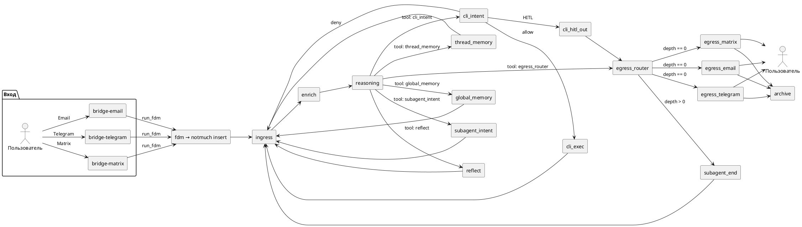
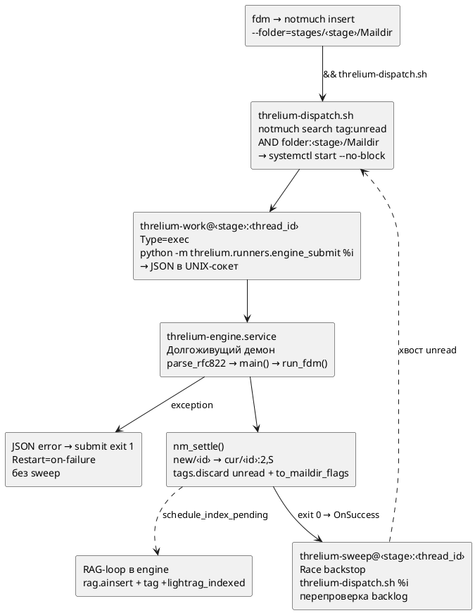
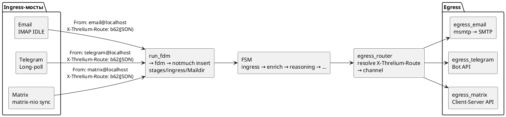
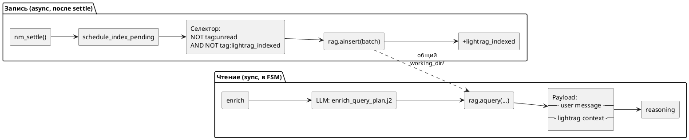
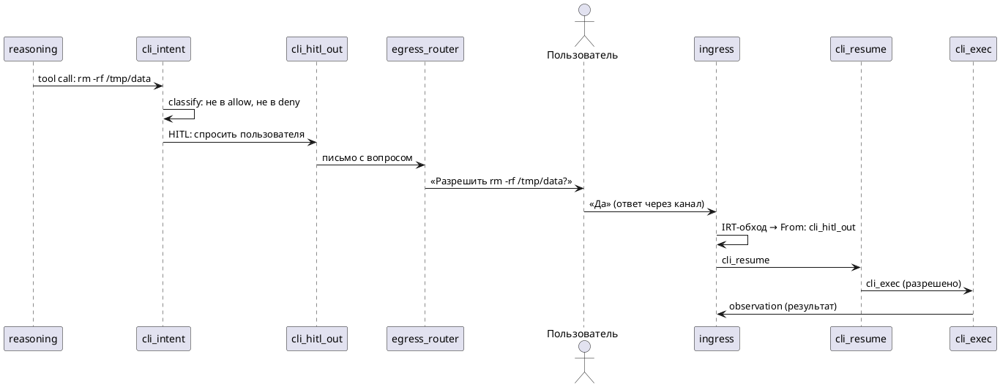
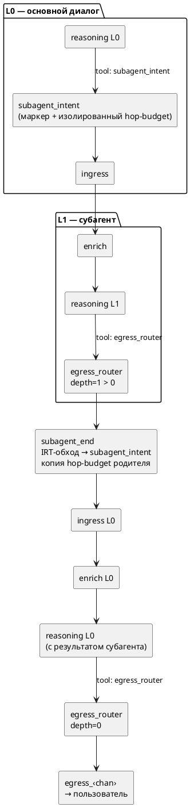
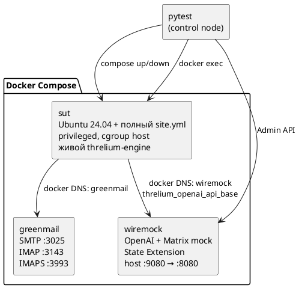
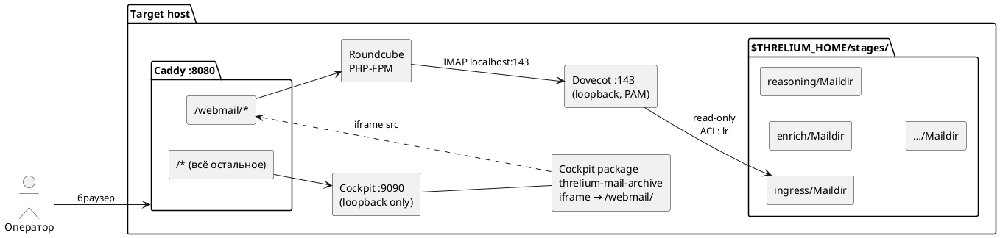
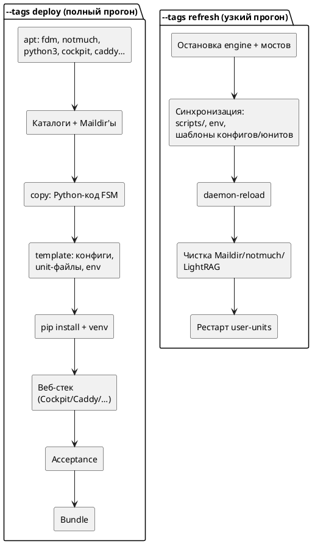

# Свой AI-агент на почте, systemd и LLM

В прошлых статьях я строил домашнее облако на Proxmox. Теперь внутри него живёт кое-что поинтереснее — полностью автономный AI-агент, которого я могу пнуть письмом из обычного почтового клиента или сообщением в Telegram, и он ответит, подумав. Причём подумав по-настоящему: с многошаговым рассуждением, долговременной памятью и возможностью выполнять команды. Зовут его Threlium, и устроен он чертовски необычно и просто, например может модифицировать сам себя.

Зачем, почему и что получилось — расскажу ниже.

---

## Зачем свой агент

Все облачные LLM-ассистенты — чужие. Данные уходят на сервера провайдера, контекст ограничен одним окном чата, настоящей долговременной памяти нет, а запустить shell-команду от вашего имени на вашем сервере — невозможно. При этом умные модели уже бегают локально на средненьком GPU: Qwen, Llama, Mistral. Возникает вопрос: а нельзя ли собрать агента, который будет жить на моём сервере, работать с моими данными и при этом иметь настоящий цикл рассуждений — не просто «спросил → ответил», а полноценный конечный автомат с ветвлениями, памятью и инструментами Причем хочется что бы кода в нем было, почти не было по сравнению с аналогами.

Оказывается, можно. Причём из довольно простых Unix-кирпичиков.

---

## Что дает ниже описанный поход

1. Мало кода, если выкинуть клеекод и типизацию (модуль types), то останется примерно 6к строк пайтон скриптов. У аналогов примерно то же быстро становится сотнями тысяч строк.
2. Наблюдаемоесть, вся работа агента сразу видна и никаких инфраструктур для отслеживания его работы просто не нужно.
3. Простота конструкции, это просто набор конфигов и немного скриптов. В качестве инсталлятора ansible playbook.
4. Минимальное потребление ресурсов, агент влезет на самую дешевую VPS.
5. Агент может править себя.
6. Вся эта конструкция не требует инфраструктуры вовсе, никаких сложных миллионов контейнеров, мониторинг вытекает их ее свойств, отлаживать проблемы этой штуки очень легко. Достаточно дать ssh на сервер агенту и показать папку где отлаживаемый агент развернут наблюдаемость у системы просто отличная.

---

## Философия: событие = письмо

Самое неожиданное архитектурное решение Threlium — в его основе лежит электронная почта. Не как транспорт «для связи с пользователем», а как фундаментальная модель данных.

Любое событие в системе — это RFC 5322 сообщение. Буквально MIME-файл с заголовками и телом. Переход между состояниями конечного автомата — доставка нового письма в другой Maildir. Хранилище — тоже Maildir (формат `tmp/`, `new/`, `cur/`, атомарная запись через `rename(2)`). Индекс — notmuch поверх всех этих Maildir'ов. Это просто обыкновенная переписка между почтовыми ящиками, которая может моделировать как конечный автомат, так и модель акторов если хочется.

Звучит безумно? Возможно. Но вот что это даёт:

- Каждое событие — файл на диске. Можно открыть mutt'ом, grep'нуть, написать скрипт.
- Никакого отдельного брокера сообщений. Maildir — это и очередь, и canonical event store.
- Идемпотентность из коробки: файл либо в `new/`, либо в `cur/`, третьего не дано.
- Отказоустойчивость: упал процесс — файл остался в `new/`, следующий запуск подберёт.
- Полная история навсегда: после обработки файл переезжает в `cur/<id>:2,S`, не удаляется.

Один `notmuch search '*'` — и вы видите абсолютно все события системы за всё время. Это логический «архив». Просая почта позволяет просто открыть веб-интерфейс и посмотреть все "размышления" агента.

---

## Конечный автомат на Maildir'ах

Threlium — IRT-tree FSM. Расшифрую: конечный автомат, у которого состояния — очереди Maildir, а граф переходов определяется In-Reply-To цепочками писем. Глобального координатора нет. Состояние фрейма (бюджет шагов) живёт в заголовке `X-Threlium-Hop-Budget`; CLI-исполнение — sandbox/privileged через `cli_intent` (`CliSettings` в `threlium.yaml`), без отдельного capability-заголовка.

### Стадии FSM

Пока что их немного, я просто закончил базу и так как буду развивать ее далее, решил не тянуть и описать ее.

- **`ingress`** — единая точка входа. Сюда приходят все сообщения от всех каналов.
- **`enrich`** — обогащение контекстом. Здесь подключается LightRAG (граф знаний) и хронология треда.
- **`reasoning`** — собственно рассуждение. LLM получает промпт с контекстом и отвечает через tool calls.
- **`egress_router`** — маршрутизатор выхода. По depth IRT-цепочки решает: ответ пользователю или возврат в субагент.
- **`egress_email`**, **`egress_telegram`**, **`egress_matrix`** — терминальные стадии доставки наружу.
- **`cli_intent`** — политика: можно ли выполнять команду?
- **`cli_exec`** — песочница для исполнения shell-команд.
- **`thread_memory`**, **`global_memory`** — FSM-состояния для работы с памятью.
- **`archive`** — финальная запись об отправке.

### Контракт стадии

Каждая стадия — Python-модуль `threlium.states.<stage>` с одной функцией:

```python
def main(msg: EmailMessage, stage: FsmStage, *, config: Config) -> EmailMessage | None:
```

Принимает письмо — возвращает новое письмо (переход дальше) или `None` (терминальная стадия). Всё остальное — транспорт и оркестрация — за пределами стадии. Стадия не трогает файлы, не вызывает systemctl, не знает про fdm. Чистая функция над stdlib `email.message.EmailMessage`. По возможности конечно.

### Граф переходов FSM

<details>
<summary>PlantUML-исходник: Граф переходов FSM</summary>


</details>


---

## Маршрутизация: fdm + notmuch insert

Для доставки писем между стадиями используется `fdm` — лёгкий mail delivery agent. Конфиг `~/.fdm.conf` (генерируется Ansible из Jinja2-шаблона) содержит правила маршрутизации по заголовку `To:`:

```
match "To" ... action pipe "notmuch insert --folder=stages/reasoning/Maildir ... && threlium-dispatch.sh"
```

Ключевое: `notmuch insert` — это атомарная операция. Файл записывается в Maildir **и** индексируется в notmuch одной транзакцией. Никакого `notmuch new` отдельно не нужно. После успешного insert тут же вызывается dispatch-скрипт, который поднимает воркер для обработки.

Почту давно придумали, не нужно писать ее снова для модели акторов. Нам нет острой необходимости экономить миллисекунды так как агенты работают десяткти минут.

---

## Оркестрация: systemd --user

Никаких Celery, RabbitMQ, Kubernetes. Оркестрация — это `systemd --user`. Вот как работает цепочка:

<details>
<summary>PlantUML-исходник: Оркестрация systemd</summary>


</details>


Имя инстанса воркера `threlium-work@enrich:000000000012ab.service` — это одновременно и мьютекс. systemd гарантирует: один инстанс с данным именем — один тред. Параллельно обрабатываются разные треды (разные `thread_id`), последовательно — письма одного треда (oldest-first FIFO).

Никакого `flock`. Никакого пула потоков. Никакого coordinator. Всё бесплатно из systemd: перезапуски при сбоях (`Restart=on-failure`), лимиты ресурсов (`threlium-work.slice` с `TasksMax`, `MemoryMax`, `CPUQuota`), cgroup-изоляция, логи через `journalctl`.

Никакого в сотый раз написанного с нуля с косяками superviser for actors не нужно, KISS...my ass. Причем systemd --user выбран не просто так, это именно пользовательские unit, они живут в папке пользователя и в одном git репозитории все, так что их легко править и коммитить самому агенту если нужно.

---

## Многоканальный вход: Email, Telegram, Matrix

Threlium принимает сообщения из трёх каналов. Каждый канал — это мост (`threlium-bridge@<chan>.service`), который нормализует входящий сигнал в каноническое RFC 5322 письмо:

| Канал    | Транспорт                    | `From:`                |
| -------- | ---------------------------- | ---------------------- |
| Email    | IMAP IDLE (imap-tools)       | `email@localhost`      |
| Telegram | Long-poll (Bot API)          | `telegram@localhost`   |
| Matrix   | Sync-loop (matrix-nio)       | `matrix@localhost`     |

Маршрутная информация канала (`chat_id`, `room_id`, `update_id`, reply targets) кодируется в заголовок `X-Threlium-Route` как `base62(JSON)`. Это позволяет при ответе вернуть сообщение ровно в тот чат/комнату/ящик, откуда оно пришло.

На выходе `egress_router` определяет канал по `X-Threlium-Route` и маршрутизирует в `egress_email`, `egress_telegram` или `egress_matrix`. Симметрия: вход и выход устроены одинаково.

<details>
<summary>PlantUML-исходник: Ingress/Egress мосты</summary>


</details>


Чекпоинтов вне union-индекса нет. При рестарте мост восстанавливает курсор из `X-Threlium-Route` последнего доставленного письма через notmuch-поиск. Никакой отдельной БД offset'ов. Тот же KISS.

---

## LLM: tool calls как единственный механизм

Стадия `reasoning` — точка контакта с LLM. Используется `litellm` (Python SDK для OpenAI-совместимых API, версия 1.83 уже без взломов :) ). Модель получает:

1. **System-промпт** из Jinja2-шаблона `reasoning/system.j2`.
2. **User-промпт** с обогащённым контекстом из `enrich` (контекст графа знаний + хронология треда).
3. **Список tool_specs** для каждого возможного маршрута: `egress_router`, `cli_intent`, `thread_memory`, `global_memory`, `subagent_intent`.

Модель отвечает **tool call'ом**, а не свободным текстом. Это принципиальное решение: LLM — источник намерения, FSM — исполнитель. Парсинга свободного текста для выбора маршрута нет. Если модель вернула текст без tool call — `ReasoningStageError`, письмо остаётся в `new/+unread`, воркер завершается с `exit 1`, systemd делает retry. Позже я сделаю дополнительные стадии FSM для формирования больших ответов, но пока что есть минимум.

Аргументы tool call валидируются `jsonschema` (JSON Schema с `additionalProperties: false` и `maxLength`-лимитами). Прошла валидация — из аргументов собирается новое письмо с `To: <next_stage>@localhost` и отправляется через `run_fdm` в следующую стадию.

Для разных маршрутов — разные JSON-Schema инструментов, разные шаблоны тела и темы письма. Всё живёт в `prompts/reasoning/<route>/tool_spec.j2`, `email_body.j2`, `email_subject.j2`. Оператор может редактировать промпты без правки Python-кода.

---

## Трёхслойная память

У агента три уровня памяти:

### 1. Локальный тред

Хронология текущего диалога собирается из union notmuch index'а. Стадия `enrich` проходит по цепочке `In-Reply-To` до корня ветки и формирует `unified_messages` — полную хронологию.

### 2. Глобальные факты

`global_memory` и `thread_memory` — обычные FSM-состояния. `reasoning` может вызвать tool call `thread_memory` или `global_memory`, записать факт, и он вернётся в `ingress` для следующей итерации.

### 3. Граф знаний (LightRAG)

Embedded LightRAG (`lightrag-hku`) работает как single-writer внутри `threlium-engine`. После каждого `nm_settle()` (когда письмо обработано и переехало в `cur/`) запускается `schedule_index_pending` — RAG-loop подбирает settled-сообщения, которые ещё не проиндексированы (`NOT tag:unread AND NOT tag:lightrag_indexed`), и вставляет их в граф через `rag.ainsert()`. Это не просто RAG, а граф связанных знаний.

<details>
<summary>PlantUML-исходник: LightRAG write/read</summary>


</details>


Стадия `enrich` при формировании контекста для `reasoning` вызывает `rag.aquery()` — семантический запрос к графу. Результат вместе с хронологией треда упаковывается в тело письма для `reasoning` через Jinja2-шаблоны. Пока что опять же это простейшее решение несмотря на мощь GraphRAG подхода, нужно дорабатывать подходы к экономии контекста, но когда кода совсем мало это не сложно, даже не шибко умные нейронки вайбкодят при таких объемах проекта легко.

Линейных цепочек для контекста отслеживать не нужно — весь тред со всеми форками индексируется как единая база знаний (глобальные знания агента). Mutex на весь тред от ingress до ответа не нужен.

---

## Безопасность: решение / политика / исполнение

Слой CLI построен на строгом разделении:

| Стадия       | Ответственность                                                    |
| ------------ | ------------------------------------------------------------------ |
| `reasoning`  | Формирует намерение через tool call: «хочу выполнить echo hello»   |
| `cli_intent` | Политика: allow / deny / ask-human. Команды **не исполняет**       |
| `cli_exec`   | Исполнение разрешённой команды в песочнице `systemd-run --user --wait --pipe`    |

`cli_intent` использует грубый фильтр: запрещённые подстроки (`;`, `|`, `$(`, `&&`), белый список базовых команд. Осознанно жёсткий — ложные срабатывания лучше, чем пропущенная инъекция. Если команда не попала ни в allow, ни в deny — уходит на подтверждение к человеку (HITL). Это решение я пока оставил совсем простым так же как и другие, суть в использовании systemd-run в будущем, пока просто заготовка.

### HITL-прерывание

<details>
<summary>PlantUML-исходник: HITL-прерывание</summary>


</details>


`cli_exec` запускает команду через `systemd-run`: по умолчанию user-scope sandbox (`--user --wait --pipe`, `ProtectSystem=strict`, `PrivateNetwork`, `ReadWritePaths` из `threlium_cli`); при `privileged: true` в payload — `--wait --pipe --uid=0` (system scope). HITL для privileged настраивается `privileged_hitl_enabled`.

---

## Субагенты: рекурсия через IRT-цепочку

Threlium поддерживает вложенные вызовы агентов (L0 → L1 → L2). Реализация — маркеры `subagent_intent` / `subagent_end` в IRT-дереве:

- `reasoning` на L0 вызывает tool `subagent_intent` → маркер в IRT-цепочке с изолированным hop-budget.
- Субагент на L1 не знает, кто его вызвал. Работает как обычный агент.
- По завершении `egress_router` по depth > 0 маршрутизирует результат не наружу, а в `subagent_end`.
- `subagent_end` находит соответствующий `subagent_intent` по IRT, копирует hop-budget родителя и возвращает письмо в `ingress`.

<details>
<summary>PlantUML-исходник: Субагенты L0/L1</summary>


</details>


Глубина определяется линейным обходом IRT-цепочки: каждый `subagent_intent` → depth+1, каждый `subagent_end` → depth−1. Промежуточного in-memory state нет. Пока что решение довольно линейное и предназначено как и вся идея subagen для изоляции контекста, subagent начинает как бы работать "от запроса пользвоателя", просто пользователь это другой агент. Позжн можно реализовать параллельные агенты это в целом уже придумано, сделаю когда захочется, все можно построить на форках почтового треда и стадии слияния в FSM - это ведь по сути просто "обсуждение в почте". Пос равнению с почтой тут только будет ромб в графе, но это решаемо и совсем просто.

---

## Идентификаторы: base62 и msgspec

Внутри системы все `Message-ID` канонизированы в форму `<base62(payload)@localhost>`:

- **Email:** `payload = msgspec JSON EmailNativeId(v=1, message_id="<оригинальный MID>")`
- **Telegram/Matrix:** `payload = utf8(composite_inner)`

Схема обратима: `base62.decodebytes` + `msgspec.json.decode` восстанавливают исходный struct. На egress для email — полное восстановление оригинального `Message-ID`, `In-Reply-To`, `References` для корректной цепочки в почтовом клиенте получателя.

`base62` использует алфавит `[0-9A-Za-z]` — строгое подмножество `atext` RFC 5322, так что канонический `Message-ID` всегда валиден. Двоеточия Matrix, слэши msgid, `$` Matrix-v3 — всё безопасно уходит в base62.

Сериализация через `msgspec` — детерминистическая (фиксированный порядок полей, без пробелов). Никаких mapping-таблиц и state: всё выводится из самого id через обратное преобразование. Это позволяет превратить в внутреннее почтовое сообщение любое сообщение из внешнего канала. Внутри агент это просто набор папок с eml файлами на диске и все.

---

## Промпты: Jinja2 шаблоны, редактируемые оператором

Всё, что видит LLM и пользователь, генерируется из Jinja2-шаблонов в `$THRELIUM_HOME/prompts/<stage>/<purpose>.j2`. Код вызывает только `render_prompt(name, **vars)`. Шаблоны деплоятся Ansible из `roles/threlium/files/prompts/`.

Это касается не только «обычных» промптов, но и:

- **Overlay внутренних промптов LightRAG** — 12 файлов, копии `lightrag.prompt.PROMPTS` для текущей версии `lightrag-hku`.
- **`addon_params`** для LightRAG — language, entity_types — JSON из Jinja2.
- **Per-route tool-specs** для reasoning — 6 маршрутов × 3 файла = 18 артефактов.

Смена поведения агента — правка шаблона и `systemctl --user restart threlium-engine.service`. Без коммита в Python. Но можно и скрипты свободно править конечно, это не компилируемый язык и это сознательное решение, так как сам агент можнт это делать, а так как ресурсов он ест мало, то на той же машине можно завести второго и когда один агент доломал себя, второго попросить просто откатить git репозиторий в котором живет почивший. Никаких компиляций сложной отладки и прочего.

---

## Развёртывание: Ansible push-модель

Threlium не клонируется `git clone`-ом на целевой хост. Развёртывание — push-модель: `ansible-playbook ansible/playbooks/site.yml` с control node заливает всё на target.

### Что попадает на target

- Python-пакет `threlium` (editable install в единый `.venv`).
- Конфигурации: `threlium.yaml`, `env/*.env`, `~/.fdm.conf`, `~/.msmtprc`.
- systemd-юниты (симлинки в `~/.config/systemd/user/`).
- Промпты (Jinja2-шаблоны).
- Dispatch-скрипт и вспомогательные утилиты.

### Жизненный цикл хоста

После первого деплоя Ansible свою роль заканчивает. Дальше хост живёт автономно: правки коммитятся в локальный git в `threlium_repo_path`, применяются оператором или самим агентом (через `cli_exec`, если capability-профиль разрешает). Повторный прогон Ansible — disaster-recovery.

### Конфигурация LLM

Конфигурация LLM (endpoints, модели, таймауты) живёт в `threlium.yaml`, который генерируется из структурных Ansible-переменных. Два слота для одной модели с разными параметрами? Пожалуйста:

```yaml
llm_endpoints:
  - model: "openai/qwen3-35b"
    api_base: "http://vllm-host:8000/v1"
    score: 0.0
    chat_template_kwargs:
      enable_thinking: false
  - model: "openai/qwen3-35b"
    api_base: "http://vllm-host:8000/v1"
    score: 1.0
    chat_template_kwargs:
      enable_thinking: true
```

Маршрутизация вызовов — по `LitellmRoutingSite` (reasoning, enrich_plan, lightrag_llm и т.д.), каждый site может ехать на свой endpoint с разным score. Это все проработано пока скорее как концепт конечно, но уже работает, дорогие вызовы делает reasoning, а дешевые делает GraphRAG.

---

## Тестирование: e2e через Docker и WireMock

Единственный автоматизированный pytest-gate — e2e в `tests/e2e/`. Никаких unit-тестов отдельно, просто они для вайбкоженного проекта все равно бесполезны, было 400 юнит-тестов и они просто проверяли, что проект верно не работает. Поведение системы эмерджентно: связка fdm + notmuch + systemd + FSM + LLM — её невозможно адекватно замокать по частям.

### Тестовый стек

<details>
<summary>PlantUML-исходник: Тестовый стек</summary>


</details>


**Стратегия baked-образа SUT:** один раз прогоняется полный `site.yml` на голом Ubuntu → `docker commit` → `threlium/e2e-sut:baked`. Дальше тесты стартуют мгновенно из baked-образа.

**WireMock с State Extension** обеспечивает изоляцию параллельных сценариев: контекст State привязан к `X-Threlium-Route` конкретного теста. Десять xdist-воркеров бьют в один SUT параллельно — каждый со своим notmuch-тредом и своим контекстом в WireMock. Работает с переменным успехом, но мне хватает.

### L0 happy-path

```plantuml
@startuml
left to right direction

rectangle "SMTP inject" as SMTP
rectangle "GreenMail\nINBOX" as GM1
rectangle "IMAP bridge\n(IDLE → fetch)" as IMAP
rectangle "ingress" as ING
rectangle "enrich\n(LightRAG aquery)" as ENR
rectangle "reasoning\n(WireMock: tool call)" as REA
rectangle "egress_router" as EGR
rectangle "egress_email\n(msmtp)" as EE
rectangle "GreenMail\nINBOX pytest@" as GM2
rectangle "pytest\nassert In-Reply-To" as ASSERT

SMTP --> GM1
GM1 --> IMAP
IMAP --> ING
ING --> ENR
ENR --> REA
REA --> EGR
EGR --> EE
EE --> GM2
GM2 --> ASSERT
@enduml
```

<details>
<summary>PlantUML-исходник: L0 happy-path</summary>


</details>


---

## Отказоустойчивость

- **Крэш стадии:** файл остаётся в `new/+unread`. `Restart=on-failure` повторяет попытку. Sweep (после успеха) перепроверяет backlog.
- **Крэш между `rename(2)` и Xapian-commit:** файл уже в `cur/`, но notmuch думает, что он в `new/`. `settle_recovery_for_stage()` на старте воркера лечит через `from_maildir_flags()`.
- **Крэш моста:** `sys.exit(1)` + `Restart=on-failure`. Курсор восстанавливается из notmuch.
- **Крэш движка:** все submit'ы получают `BindsTo` на `threlium-engine.service`. При рестарте движка воркеры перезапускаются автоматически.
- **LightRAG drain прервался:** тег `+lightrag_indexed` не поставлен → следующий drain повторит `ainsert`. LightRAG dedup гарантирует безопасность.

Отдельной стадии `errors/` и error-mail нет. Сбои — structured log в journald и ненулевой exit code. Просто и предсказуемо, а весь процесс "мышления" видно просто в почте.

---

## Админка: Cockpit + Caddy + Roundcube + Dovecot

Раз каждое событие — письмо, логично дать оператору смотреть «мысли» агента через обычный почтовый веб-интерфейс. Для этого на target поднимается стек из четырёх компонентов, которые вместе превращаются в полноценную админ-панель.

### Dovecot: IMAP поверх Maildir'ов стадий

Dovecot подключается к тем же Maildir'ам, что и FSM. Единственный конфиг — drop-in `99-threlium-webmail.conf`:

```
namespace inbox {
  inbox = yes
  location = maildir:$THRELIUM_HOME/stages:LAYOUT=fs:DIRNAME=Maildir
}
```

Каждая стадия FSM (`ingress`, `enrich`, `reasoning`, …) становится IMAP-папкой. Дополнительно настроен virtual namespace — виртуальная папка «All», которая собирает письма из всех стадий в единую ленту. Авторизация — через PAM (тот же POSIX-пользователь, что и агент).

ACL выставлены в режим read-only: `lr` (list + read) — можно просматривать, но не менять флаги, не удалять, не вставлять. Maildir пишут только Threlium и notmuch, Dovecot — чисто на чтение.

### Roundcube: веб-интерфейс для почты агента

Roundcube подключается к локальному Dovecot (localhost:143, plaintext — всё на loopback). SMTP отключён — это read-only интерфейс. Из коробки настроен:

- Режим `threads` с сортировкой по дате — цепочки рассуждений видны как нити писем.
- Виртуальная папка `Virtual/All` подключена как архив и в `default_folders`.
- `mail_read_time = -1` — Roundcube не ставит флаг «прочитано» при открытии (в паре с ACL Dovecot).
- SQLite для хранения сессий — никакого MySQL/PostgreSQL.

### Caddy: единый edge-proxy

Caddy работает как точка входа, объединяя Cockpit и Roundcube на одном порту:

```
:8080 {
    handle_path /webmail/* {
        root * /usr/share/roundcube
        php_fastcgi unix//run/php/php-fpm.sock
        file_server
    }
    route * {
        reverse_proxy 127.0.0.1:9090 {
            transport http { tls_insecure_skip_verify }
        }
    }
}
```

Маршрутизация простая: `/webmail/*` → Roundcube через PHP-FPM, всё остальное → Cockpit на `:9090`. TLS — `tls internal` (self-signed) для прода, отключён в e2e. Порт настраивается через `threlium_mail_archive_caddy_bind_port`.

### Cockpit: системная админ-панель с Roundcube внутри

Cockpit даёт из коробки: терминал, просмотр journald-логов (а значит всех логов агента), управление systemd-юнитами (можно рестартовать стадии, мосты, engine), мониторинг ресурсов, файловый менеджер (если доступен `cockpit-files` из backports).

В Cockpit регистрируется кастомный пакет `threlium-mail-archive` — это `manifest.json` + `index.html` с iframe на `/webmail/`. В итоге Roundcube появляется прямо как вкладка в Cockpit. Оператор видит в одном окне: системные метрики, логи, юниты и полную переписку агента. Это все вовсе без сложной инфры, оно еще и не ест ресурсов почти.

Cockpit слушает только на `127.0.0.1:9090` — наружу не торчит. Origin-проверка (защита от CSWSH) настраивается через `threlium_mail_archive_cockpit_origins_extra` в host_vars. Специальный oneshot-юнит `threlium-cockpit-tls-clean.service` чистит `/run/cockpit/tls` перед стартом Cockpit — workaround для известного бага с `cockpit-certificate-ensure`.

### Как это выглядит вместе

<details>
<summary>PlantUML-исходник: Админка: стек Cockpit/Caddy/Roundcube/Dovecot</summary>


</details>


Весь стек включается одной переменной `threlium_mail_archive_web_enabled: true` (по умолчанию включён) и деплоится только при полном прогоне (`--tags deploy`). При `--tags refresh` веб-стек не трогается.

---

## Ansible playbook: структура и режимы работы

Я уже упоминал push-модель развёртывания, но стоит рассказать подробнее о самом плейбуке — он устроен осознанно непохоже на типичный Ansible-проект.

### Один плейбук, одна роль

Весь деплой — единственный файл `ansible/playbooks/site.yml`. Задачи живут прямо в нём, а не в `roles/threlium/tasks/`. Почему? Файл короткий, читается как последовательный сценарий, а перенос в роль дал бы `include_role` с тем же числом строк и сломал бы относительные пути. Роль `threlium` используется только для хранения переменных, шаблонов, файлов и дефолтов.

```
ansible/
  playbooks/
    site.yml                    # единственный сценарий
    tasks/
      refresh.yml               # узкий тег: чистка + рестарт
      mail_archive_web.yml      # веб-стек (Cockpit/Caddy/…)
      mail_archive_web_acceptance.yml
      ssh_hardening.yml
  roles/threlium/
    defaults/main.yml           # дефолтные переменные
    vars/main.yml               # канон FSM-стадий
    files/
      scripts/                  # Python-код FSM + bash-скрипты
      prompts/                  # Jinja2-промпты для LLM
      mail-archive/             # статика: dovecot-virtual
    templates/
      config/                   # fdm.conf, msmtprc, threlium.yaml
      systemd/user/             # шаблоны unit-файлов
      mail-archive/             # Caddyfile, cockpit.conf, …
      env/threlium.env.j2
      pyproject.toml.j2
  host_vars/                    # per-host: LLM endpoints, секреты
  group_vars/                   # общие переменные и e2e-оверрайды
  inventory/                    # hosts (прод и e2e)
```

### Фазы деплоя

Каждая фаза — предусловие для следующей:

| # | Фаза | Что делает |
| - | ---- | ---------- |
| 1 | Assert | Проваливает прогон **до** изменений при пустых обязательных переменных |
| 2 | Bootstrap ОС | `apt`: fdm, msmtp, notmuch, python3, python3-venv |
| 3 | Каталог артефактов | `threlium_repo_path/` + идемпотентный `git init` |
| 4 | Раскладка `$THRELIUM_HOME` | Стадийные Maildir'ы из `vars/main.yml` |
| 5 | Код FSM | `copy` Python-пакета + dispatch-скрипт |
| 6 | Конфиги | `template`: fdm.conf, msmtprc, threlium.yaml, threlium.env |
| 7 | Unit-файлы | Шаблоны systemd: engine, work@, sweep@, bridge@ |
| 8 | Симлинки | `~/.fdm.conf`, `~/.msmtprc`, все юниты в `~/.config/systemd/user/` |
| 9 | Venv + pip | `pyproject.toml.j2` → target, `pip install .` |
| 10 | linger + start | `loginctl enable-linger` + `daemon-reload` + `state: started` |
| 11 | Веб-стек | Cockpit + Caddy + Roundcube + Dovecot (если включён) |
| 12 | Acceptance | Сквозная самопроверка: Maildir'ы, юниты, notmuch, fdm.conf, Python |
| 13 | Bundle | `tar.gz` снимок установки → fetch на control node |

### Два закона идемпотентности

Плейбук разделяет два класса операций:

**Класс A — внешние зависимости** (apt, pip): `state: present` — «install if missing». Стандартная идемпотентность Ansible. Не обновляет уже установленное.

**Класс B — артефакты Threlium** (код, конфиги, юниты, симлинки): **перетирание** каждый прогон. Файл на target сравнивается с репо и перезаписывается при расхождении. Никаких `creates:` или маркерных файлов — через baked-образ они превращаются в зашитый T₀.

Исключения из класса B: локальный `.git` (не стирать историю оператора) и физическая раскладка durable Maildir'ов (не пересоздавать event store с данными).

### Два режима: deploy и refresh

<details>
<summary>PlantUML-исходник: Deploy vs Refresh</summary>


</details>


**deploy** — полный bootstrap: apt, venv, pip, веб-стек, acceptance, bundle. Используется для нового хоста или disaster-recovery.

**refresh** — узкий прогон: синхронизация кода и конфигов с control node + сброс Maildir/notmuch/LightRAG + рестарт user-units. **Без** apt, **без** pip, **без** веб-стека. Основной режим для e2e-тестов: baked-образ SUT переиспользуется, refresh накатывает актуальные артефакты идемпотентно.

Разметка тегов — три контракта:

| Разметка | Полный прогон | `--tags refresh` |
| -------- | ------------- | ---------------- |
| `deploy` только | да | нет |
| `deploy` + `refresh` | да | да |
| `never` + `refresh` | нет | да |

### После bootstrap: автономная эволюция

Ключевое отличие от типичных Ansible-проектов: **плейбук — не governor хоста**. После bootstrap ответственность переходит локальному `git` в `threlium_repo_path`.

- **Оператор** правит скрипт/конфиг прямо на target → `daemon-reload` → `git commit`. Симлинки сразу видят новое.
- **Агент** — через `cli_exec` в рамках capability-профиля. Может менять свои промпты, конфиги, даже Python-код, коммитя изменения в локальный git.
- **Обратной синхронизации** target → control нет и не предполагается. Каждая установка эволюционирует независимо.

Повторный полный `ansible-playbook site.yml` на живом хосте — **только disaster-recovery**. Он перетрёт локальные коммиты. Для штатного обновления кода — локальные правки или refresh.

### Канон стадий — одна точка правды

Все FSM-стадии определены в единственном месте: `roles/threlium/vars/main.yml` (`threlium_fsm_mailbox_stages`). Все задачи плейбука — циклы по этому списку. Добавить стадию = добавить строчку. Рассинхронизация между Maildir'ами, fdm.conf и systemd-юнитами невозможна по конструкции.

---

## Что имеем в итоге

Threlium — самохостный AI-агент, построенный из Unix-примитивов:

| Компонент          | Реализация                                    |
| ------------------ | --------------------------------------------- |
| Хранилище событий  | Maildir (файлы на диске)                      |
| Индекс             | notmuch (Xapian)                              |
| Очередь            | Maildir `new/` → `cur/`                       |
| Оркестрация        | systemd --user                                |
| Маршрутизация      | fdm (`~/.fdm.conf`)                           |
| Рассуждение        | litellm + tool calls                          |
| Память             | LightRAG (NanoVectorDB + NetworkX)            |
| Каналы             | IMAP IDLE, Telegram Bot API, Matrix (nio)     |
| Промпты            | Jinja2 шаблоны                                |
| Развёртывание      | Ansible push-модель                           |
| Конфигурация       | pydantic-settings + YAML (`threlium.yaml`)    |
| Тестирование       | pytest e2e + Docker + WireMock + GreenMail    |
| Безопасность CLI   | cli_intent (политика) → cli_exec (песочница)  |

Вся система — один Python-пакет с единым venv, один `systemd --user` manager, один notmuch union-индекс. Никаких Docker-compose'ов в продакшене, никаких баз данных, никаких внешних брокеров. Файлы на диске, процессы в systemd, промпты в Jinja2.

Работает ли это? Работает. Я пишу агенту письмо — он думает, обогащает контекст из графа знаний, рассуждает, при необходимости выполняет команды (с подтверждением или без), и отвечает. Telegram и Matrix — пока не проверял :) Все каналы симметричны, история хранится вечно, контекст глобален.

*P.S. Рекомендую LLM для консультаций при настройке. Особенно когда дебажишь, почему notmuch insert повесил `+unread`, а dispatch-скрипт не поднял воркер. Оказалось — опечатка в `folder:` термине. Эта конструкция домашнего агента совершенно прозрачна для отладки и модификации другими агентами! :)*
