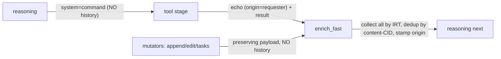
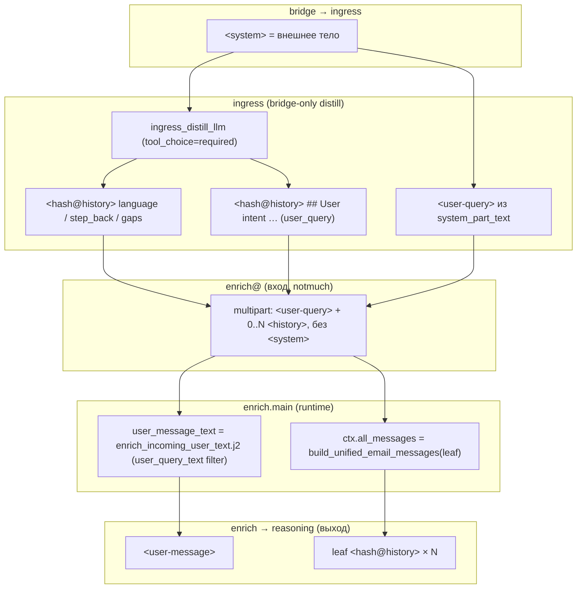

# CONTEXT_CONTRACT: наполнение контекста и содержимого писем

> **Источник истины** по тому, *что лежит в FSM-письме* и *кто собирает это в контекст
> reasoning*. Итог двух рефакторингов: унификация `history`/`system` и модель «callee
> владеет историей». Остальные документы ([`FSM.md`](FSM.md), [`RESPONSE_TABLE.md`](RESPONSE_TABLE.md),
> [`MEMORY_TABLE.md`](MEMORY_TABLE.md), [`SUBAGENT_TABLE.md`](SUBAGENT_TABLE.md)) ссылаются
> сюда, а не дублируют. Цикл `formal_reason` и FSM gate — [`FORMAL_REASON_GATE.md`](FORMAL_REASON_GATE.md)
> (не дублировать здесь). Термины — [`INDEX.md` §глоссарий](INDEX.md). Типы/VO — [`TYPES.md`](TYPES.md).

Все имена/функции в этом документе соответствуют коду
`ansible/roles/threlium/files/scripts/threlium/` (не «по памяти»).

---

## 1. Инвариант контракта письма

Каждое FSM-письмо между стадиями — `multipart/mixed`:

```
канонический конверт (From/To/Subject/Message-ID/In-Reply-To/X-Threlium-*)
+ 0..N  <{sha256(body)}@history>   — неисполняемая ПАМЯТЬ
+ 0/1   <{sha256(body)}@system>    — исполняемая payload-КОМАНДА адресату
```

Голое message-level тело payload **больше не носит**: и память, и команда живут в
именованных MIME-частях по `Content-ID`. Это убирает зависимость от «первого text/plain»
и даёт единые инструменты чтения/сбора/дедупа для всех стадий.

**Формат CID — `local@domain`** (`EnrichContentId`, `mime_reform.py`):
- local-part = `sha256(тело-части)` (hex);
- domain = `history` или `system` (`EnrichPartId.HISTORY`/`SYSTEM`).

**Почему хеш только по телу** (`from_history_body` / `from_system_body`): `X-Threlium-Origin`
штампуется *постфактум* (`enrich_fast` или предштамп callee), поэтому у производителя и его
relay-копии **тела совпадают, а заголовки — нет**. Хеш по телу делает их одним CID → дедуп
схлопывает копии. Одинаковое тело в `history` и в `system` даёт **разные** CID (разный
domain) — поэтому пара «команда + её history-копия» не схлопывается: одна часть для механики,
одна для памяти.

Структурные core-CID полного enrich (`<user-message>` и т.д., §4) — **отдельный** механизм:
это пресобранный контекст enrich→reasoning, а не контракт `history`/`system`.

---

## 2. `<system>` — носитель команды

- **Ровно одна** `<system>`-часть на письмо (когда адресат потребляет payload).
- Читается строго `system_part_text(msg)` (`mime_reform.py`): **fail-fast** — отсутствие или
  >1 части → `RuntimeError` (инвариант «payload только в `<system>`»). Это замена
  `extract_plain_body` для всех внутренних чтений payload.
- **Не релеится и не индексируется**: `system` не входит в `RELAY_FAMILIES`; LightRAG-drain
  его игнорирует (память несёт парную `<history>`-копию через **request_echo** на исходящем L_M2, §7–§8).
- Создаётся `build_fsm_step_to_stage(..., system=...)` или legacy `build_fsm_plain_to_stage`
  (тоже оборачивает body в `<system>`).
- **Внешняя граница**: мост (`bridge`) на входе извлекает тело внешнего письма
  (`extract_plain_body`) и оборачивает **только в `<system>`** (без `<user-query>` — его
  создаёт `ingress` на переходе ingress→enrich). Терминальные `egress_email`/`egress_telegram`/`egress_matrix` строят чистое
  внешнее письмо **только из `<system>`** (`system_part_text`), не пробрасывая внутренний MIME.

---

## 3. `<history>` — память (модель «callee владеет историей»)

`<history>` — неисполняемая память агента. Per-part заголовки (граница через `MailHeaderName`,
без сырых строк, переживают `out.attach`):

- **`X-Threlium-Content-Score`** — базовый вес части, ставит **источник** из настроек
  (`settings.history.score_for(from_stage)`, `HistorySettings`: `score_default` +
  per-stage override `score_by_stage`). Финальный вес считает потребитель (recency × size ×
  score, token ledger в `enrich`).
- **`X-Threlium-Origin`** — стадия-автор части. По умолчанию **штампует `enrich_fast`** из
  конвертного `From:` несущего письма, только на частях **без** origin (единая точка origin).
  Исключение — эхо-запрос (ниже): его предзаштамповывает callee.

### Кто решает, что попадает в историю

Историю формирует **стадия, которая знает свою семантику (callee)**, а не вызывающий:

- `reasoning → tool`: **только `<system>`** (команда). Никакого `<history>`. Иначе сырой
  буфер ответа (`response_append`/`edit`/`tasks_upsert`) протекал бы в контекст.
- callee кладёт в исходящее письмо **0..2** `<hash@history>`-части:
  - **эхо-запрос** (что у меня спросили) — опционально, через `build_fsm_step_to_stage(
    request_echo=...)`; **предзаштампован** `X-Threlium-Origin = incoming From` (истинный
    автор запроса — вызывающий), score = `score_for(автор запроса)`;
  - **ответ** (результат) — `history=...`; origin проставит `enrich_fast` (= callee).
- Разные тела → разные `<hash@history>` → дедуп их не схлопывает.



### Матрица по ВСЕМ стадиям (`threlium/states/*.py`)

`echo` = request-echo (`<history>` с предштампом `origin=incoming From`); `resp` = собственный
`<history>`-ответ (origin проставит enrich_fast); `sys` = `<system>`-payload; «релей» =
`emit_*_preserving_payload` (части входящего письма пробрасываются как есть). Пусто = не
применимо. Источник — фактические вызовы emit в коде.

**Вход / сборка контекста (инфраструктура, не tool-callee).**

| Стадия | To: | echo | resp | sys | Роль |
|---|---|:--:|:--:|:--:|---|
| `ingress` | `enrich` (или `cli_resume`) | — | да | **нет** | **Только bridge + HITL router:** distill gateway (`From:` email/telegram/matrix@localhost) → `enrich` с `<user-query>` + distill `<history>`; HITL → `cli_resume` только `<system>`. Internal стадии в ingress **не** эмитят. |
| `enrich` | `reasoning` / `summarize_context` | — | — | да² | → `reasoning`: **`<system>` НЕТ** — backpack (§4): core-CID + гранулярные `<history>` leaf; reasoning собирает `<conversation_history>` из частей без `X-Threlium-Origin`, `<conversation_delta>` — с origin (enrich_fast). ²Только → `summarize_context` есть `<system>`. |
| `enrich_fast` | `reasoning` | — | — | **релей** | Relay-сборщик дельты: `<history>` + `<system>` из окна (штампует `origin`); replace `<response-state>`/`<task-state>`. Старые `@system` из `E_prev` не копируются — только свежие из дельты. `reasoning` не кладёт их в LLM-промпт, но читает для FSM gate (`formal_reason`). |
| `reasoning` | tool | **нет** | **нет** | да | Чистый `<system>`-эмиттер tool-call (команда адресату). История — забота callee. На ВХОДЕ сам `<system>` не читает. |

> **`<system>` на входе `reasoning` не нужен.** `reasoning` собирает контекст из core-CID частей
> (`<user-message>`/`<graph-answer>`/… §4) и хронологии `<history>` (`ReasoningEnrichContext.from_email`),
> и **никогда** не вызывает `system_part_text`. Поэтому и `enrich`, и `enrich_fast` шлют в `reasoning`
> письмо **без** `<system>` — это разрешённый случай «0» из «0/1 `<system>`», а не нарушение контракта.
> `<system>` присутствует строго там, где адресат исполняет payload-команду (tool-входы, egress,
> `summarize_*`, `cli_*`, мутаторы через relay).

**Tool-callee (вызываются `reasoning`).**

| Стадия | To: | echo | resp | sys | Роль |
|---|---|:--:|:--:|:--:|---|
| `formal_reason` | `enrich_fast` | **да** (payload) | да | **да** | Echo + observation (`<history>`) + `FormalReasonResultPayload` в `<system>` (origin на relay — `enrich_fast`; gate — [`FORMAL_REASON_GATE.md`](FORMAL_REASON_GATE.md)). |
| `memory_query` | `enrich_fast` | **да** (query) | да | — | Запрос (echo, origin=reasoning) + RAG-ответ (observation, origin=memory_query). |
| `thread_memory` / `global_memory` | `enrich_fast` | **да** (note) | нет | — | Для памяти ценен запрос: note = что агент решил запомнить; origin=reasoning; «recorded»-ответа нет. |
| `response_observe` | `enrich_fast` | нет | да | — | Нарратив-обзор буфера + task-ledger. |
| `response_append` | `enrich_fast` | нет | нет | релей | Мутатор буфера; буфер виден как `<response-state>`. Сырой чанк в history не идёт. |
| `response_edit` | `enrich_fast` / `enrich` | нет | нет | релей / да | Мутатор буфера; ошибка валидации → `enrich` (`<user-query>` = notice, local turn). |
| `tasks_upsert` | `enrich_fast` / `enrich` | нет | нет | релей / да | Мутатор ledger (`<task-state>`); ошибка → `enrich`. |
| `response_finalize` | `egress_router` / `enrich` | нет | да | да | Итоговый ответ (`<history>`+`<system>`); task-gate/ошибка → `enrich`. |
| `reflect` | `enrich` | нет | **нет** | — | Re-enrich без ingress: `<user-query>` = rendered reflect body (local turn), без distill. |
| `cli_intent` | `enrich_fast` / `cli_exec` / `cli_hitl_out` | нет | да³ | да | Роутер CLI. ³route-collision / invalid → `enrich_fast` (`<history>`-note); sandbox→`cli_exec`; privileged (+ HITL если включён)→`cli_hitl_out`→`cli_resume`→`cli_exec`. `cli_exec` / `cli_resume` (reject) → `enrich_fast`. |
| `subagent_intent` | `enrich` | **да** (task) | нет / да | релей | Делегирование субагенту: `<user-query>` = текст задачи; request-echo в `<history>`. Budget exhausted → notice в `<user-query>`. |

**CLI / HITL цепочка.**

| Стадия | To: | echo | resp | sys | Роль |
|---|---|:--:|:--:|:--:|---|
| `cli_exec` | `enrich_fast` | —⁴ | да | да | Результат команды (observation: cmd_line+stdout/stderr/exit) → `<history>` (origin=cli_exec) + `<system>`. ⁴cmd_line уже в observation, отдельный echo избыточен. |
| `cli_hitl_out` | `egress_router` | — | да | да | Вопрос пользователю: `<system>` = тело отправки, `<history>` = копия вопроса. |
| `cli_resume` | `ingress` / `cli_exec` | — | нет | да | Возобновление после HITL: `<system>` = ответ пользователя; пустой ответ → `enrich_fast` без LLM; иначе sync LLM tool `confirm_cli_hitl` (score 0, retry bridge). Исходный intent по IRT-предку читается из `<system>` (`system_part_text_from_path`), не из первого `text/plain`. Отказ пользователя (`confirmed=false`) → `enrich_fast`; ошибка classify после retry → падение стадии. |

**Субагент-возврат / сжатие / терминальные.**

| Стадия | To: | echo | resp | sys | Роль |
|---|---|:--:|:--:|:--:|---|
| `subagent_end` | `enrich` | — | релей | релей | Возврат результата субагента (preserving). `<user-query>` = текст результата; relay `<history>`. |
| `summarize_context` | `summarize_memory` | — | да | да | Сводка хвоста → `<history>` (durable) + `user_query` в `<system>` payload. |
| `summarize_memory` | `enrich` | — | да | — | Дренаж в enrich: `user_query` из payload → `<user-query>` CID (re-trigger повторяет тот же ход; §5). |
| `egress_router` | `egress_*` / `subagent_end` | — | релей | релей | Маршрутизация по каналам; части письма не меняет. |
| `egress_email` / `egress_telegram` / `egress_matrix` | — (терминал) | — | — | читает | Строят внешнее письмо **только из `<system>`** (`system_part_text`); ничего не эмитят. |
| `archive` | — (терминал) | — | — | — | Оседает в Maildir/union-index; ничего не эмитит. |

---

## 4. Core-CID полного enrich → reasoning

Полный `enrich` собирает структурный контекст для reasoning как фиксированные секции
(`build_context_backpack_multipart`, `EnrichPartId`) — это **не** контракт `<system>` и **не**
`<history>`-память:

| Content-ID | Источник |
|---|---|
| `<user-message>` | canonical user text (§4.1: `enrich_incoming_user_text.j2` + `<user-query>` CID) |
| `<graph-answer>` | Prose-сэмпл LightRAG (`graph_answer*.j2`: query + subgraph + answer) |
| `<{hash}@history>` × N | хронология треда из `<history>`-частей писем (`message_has_history`), гранулярно |
| `<thread-memory>` / `<global-memory>` | memory-письма (намеренное дублирование маркеров) |
| `<response-state>` | детерминированный пересчёт CRDT-буфера |
| `<task-init>` / `<task-state>` | стартовый набор задач (seed `enrich_task_plan` до RAG + late `enrich_task_hypotheses` после RAG, одним `TaskInitOp`) + reduced-ledger |

Бюджет — токенный (`context_token_count.py`, единый `lightrag.tiktoken_model_name`): enrich
считает token-ledger (mandatory FULL + гранулярная `<history>`) и при overflow `X>0` шлёт
старые `<history>` CID в `summarize_context`, иначе кладёт всю историю гранулярными leaf-CID
в backpack (`build_context_backpack_multipart`), без merged `<unified-mail-context>` и без MCKP.
Деталь секций — [`FSM.md` §5.2](FSM.md#52-контракт-тела-enrich--reasoning).

### 4.1 Distill → enrich: контур передачи

Distill **не передаёт** в enrich отдельный JSON или заголовок: результат — только
`<history>`-части на том же `EmailMessage`, который fdm кладёт в `stages/enrich/Maildir`.
Части `<user-message>` / гранулярная unified-история появляются **позже**, на выходе полного
enrich→reasoning (`build_context_backpack_multipart`, §4).



**Шаг 1 — ingress (`states/ingress.py`, `ingress_distill.py`).**

1. Мост кладёт **только `<system>`** (внешнее тело); `ingress` читает `system_part_text` →
   `EnrichUserQueryText` (`ingress_bridge_user_query.enrich_user_query_from_bridge_system`).
   Distill envelope: `full_body` = тот же текст (+ опц. orphan-notice).
2. `ingress_distill_llm`: один LLM-вызов с обязательным tool `ingress_distill` (или
   fail-safe fallback) — **только** на bridge-path; internal re-enrich идёт напрямую в enrich.
3. Каждое поле tool → отдельный `IngressDistillHistoryPart` → Jinja-шаблон history
   (`ingress/distill_history_*.j2`) → distill parts; **без request_echo** на bridge-path.
4. Переход `ingress → enrich`: **`## Original user message`** (сырой bridge `<system>`) + distill `<history>` + **attach `<user-query>`** (преобразованный bridge system VO, опц. orphan-prefix; §3).

Порядок history-частей (ветка distill): **`original_user_message`** → `user_reply_language` →
`step_back_notes` → `open_gaps` → **`user_intent`**. Canonical user turn = **`<user-query>` CID**
(не последняя `<history>`).

| Поле tool `ingress_distill` | Heading в `<history>` | Кто читает на enrich |
|---|---|---|
| (bridge `<system>`, не tool) | `## Original user message` | leaf-`<history>` / `<conversation_history>` |
| `user_intent` | `## User intent` | unified / task plan; **не** `<user-message>` |
| `user_reply_language` | `## User reply language` | reasoning egress / `response_finalize` |
| `step_back_notes` | `## Step-back context` | leaf-`<history>`, reasoning history |
| `open_gaps` | `## Open gaps` | leaf-`<history>`, reasoning history |
| `<user-query>` (bridge) | (fixed CID) | **`user_query_text` → `<user-message>`** |

**Шаг 2 — вход enrich (`states/enrich.py`).** Handler читает **текущее** письмо листа
(`Message-ID` = ход ingress→enrich) из notmuch. На диске: только `<history>` + RFC822-конверт.
`<user-message>` **ещё нет** — это не часть контракта ingress→enrich.

Два **параллельных** чтения одного `msg` (не два канала от distill):

1. **Canonical user turn** — `user_message_text = render_prompt(
   PromptPath.LIGHTRAG_ENRICH_INCOMING_USER_TEXT, incoming=msg)`. Шаблон
   `lightrag/enrich_incoming_user_text.j2`: заголовки конверта + фильтр
   `user_query_text` (= `require_enrich_user_query_text` → `<user-query>` CID).
   Используется для query plan, task plan, бюджета `EnrichPartId.USER_MESSAGE`.

2. **Unified-бакет** — `ctx = build_unified_email_messages(leaf_inner=текущий MID,
   thread_id=…)` (`enrich_context.py`): обход IRT **старые→новые**, лист (текущий
   ingress→enrich) **включается**; из каждого письма — все непустые `<history>` (дедуп по
   `EnrichContentId`, без `tag:context_summarized`, memory — отдельные бакеты). Рендер в
   хронология — leaf-`<history>` в backpack; hypotheses — `lightrag/mail_context.j2` + `history_text` (§5).

Последняя history листа **может кратко дублировать** тело `<user-message>` (один и тот же
`user_query`, разная обёртка: у `<user-message>` есть envelope-заголовки в шаблоне).

**Шаг 11 — выход enrich→reasoning.** После LightRAG + token ledger `build_context_backpack_multipart` создаёт
core-CID (§4): в т.ч. `<user-message>` из `user_message_text` и гранулярные `<history>` из
`ctx.all_messages`. Distill-части листа попадают в хронологию **как leaf-CID**, а не
как отдельный «пакет distill».

**Fallback distill** (`ingress_distill_llm` после исчерпания retry): одна `<history>` =
`ingress/distill_history_user_query.j2` с `user_intent = trim_context_text(full_body,
distill_fallback_max_chars)`; `<user-query>` = преобразованный bridge system (VO), без IRT-relay.

**Связь с overflow summarize** (§5): `_emit_summarize_overflow` берёт
`concat_history_parts_text(m)` по письмам из `ctx.all_messages` — те же `<history>` на диске,
что и для token-ledger overflow (§5), **не** из merged blob и **не** из distill как
отдельного артефакта. Summarize сжимает **старый хвост** треда при переполнении токенного
бюджета: batch = самые старые гранулярные `<history>` CID из `ctx.all_messages` (oldest→newest)
до покрытия избытка `X` токенов; в payload — `SummarizeHistoryUnit` (cid + text + source_mid). E2e:
`test_summarize_overflow_full_pipeline` — **3 prior-хода + main**, накопление unified под cap
distill, overflow на enrich главного хода (брифинг:
`docs/briefing/summarize_context_overflow_e2e_briefing.md`).

**Цикл user_query.** Суммаризация не меняет ход пользователя, поэтому канонический `user_query`
(`<user-query>` CID текущего enrich-листа) едет неизменным по `enrich → summarize_context →
summarize_memory → enrich`: enrich кладёт его в `SummarizeContextStagePayload.user_query`,
`summarize_context` релеит его в `<system>` (рядом со сводкой в `<history>`), `summarize_memory`
возвращает его enrich как `<user-query>` CID. Re-trigger enrich читает тот же turn через
`require_enrich_user_query_text` и не переполняется снова (оригиналы помечены `context_summarized`, сводка
уже в unified).

Код: `states/ingress.py` (`_emit_to_enrich`), `ingress_distill.py`, `types/ingress_distill.py`,
`prompts/lightrag/enrich_incoming_user_text.j2`, `enrich_context.py`, `states/enrich.py`.

---

## 5. Сбор и дедуп

Единый предикат «письмо содержательно» = `message_has_history(msg)` (≥1 непустая
`<history>`-часть). Заменяет старую классификацию по `To:`-стадии (`SERVICE`/`CONTEXT_ROLE`).

- **`enrich_fast`** (`splice_e_prev_with_history`, `mime_reform.py`): окно-дельта по IRT с
  прошлого `To: reasoning` (= `E_prev`, в multi-cycle — выход прошлого `enrich_fast`).
  Собирает все `<history>`-части окна **сырыми** (`collect_unified_delta_msgs`), штампует
  `X-Threlium-Origin` из `From:`, дописывает в хвост `E_prev`; **replace** `<response-state>`
  / `<task-state>` (пересчёт CRDT). Остальные части `E_prev` не трогает.
- **`enrich`** (`enrich_context.py`): полный обход IRT (лист + предки, старые→новые), берёт
  `<history>`-части из **всех** писем (включая лист ingress→enrich и `To: enrich_fast`),
  исключая `tag:context_summarized` и memory-бакеты (лист ingress→enrich и дедуп — §4.1).
  Однопроходный графовый запрос (`lightrag_query.j2`, token-capped) и overflow summarize
  (`enrich._emit_summarize_overflow`) читают те же `<history>`-части через
  `concat_history_parts_text` / Jinja `history_text`, **не** `get_body`.
  В overflow-batch письма без непустого `<history>` пропускаются (`summarize_overflow_skip_no_history`);
  пустой batch после фильтра — ошибка, summarize не эмитится.
- **Дедуп — в обоих** по равенству `EnrichContentId` (контент-хеш тела): relay-копия
  схлопывается с оригиналом. Приоритет при коллизии — более раннее письмо (origin автора).

---

## 6. Презентация reasoning

`reasoning/user.j2` рендерит `<history>`-части **единым хронологическим потоком**:
- `<conversation_history>` — полный хвост (после полного enrich);
- `<conversation_delta>` — дельта с прошлого хода (после `enrich_fast`).

Каждая запись подписана `[from: <origin>]` (`X-Threlium-Origin`). **Видов-таксономии по
стадии** (`<observation>` / `<memory_note>` / `<plan_state>`) больше нет: семантику даёт
origin + tool spec, известный модели. Бюджет — tail-keep новейших (`context_max_chars`).

---

## 7. LightRAG-индексация

Drain (`runners/lightrag/_drain.py`, `lightrag_drain_query.py`) индексирует письмо тем же
предикатом `message_has_history`. notmuch не индексирует MIME по Content-ID, поэтому selector
даёт лишь tag-негативы (дешёвый pre-filter), а финальный `message_has_history` применяется
load-time. Ingest-строка (`lightrag_ingest.py`) — synthetic `multipart/mixed`: **каждая**
`<history>`-часть письма переезжает как отдельная inline `text/plain` с тем же контент-адресным
CID `<{sha256(body)}@history>` (без слияния в одно plain-тело). Чанкинг
(`threlium_email_chunking_func`) идёт **по отдельным** `<history>`-частям: малая часть
(`tokens ≤ chunk_token_size`) → один чанк, большая → окно/overlap внутри части; нумерация
`X-Threlium-LightRAG-Chunk` сквозная 1..N по документу. Bootstrap (`runners/lightrag/_bootstrap.py`)
оборачивает файл в ту же одну `<history>`-часть — единый путь chunking, без fallback на первый
`text/plain`. `<system>` **не индексируется**: его смысл несёт парная `<history>`-копия. Письма
без history → `lightrag_skipped` (не вечный pending).

---

## 8. Сквозные примеры по CID

**Ход пользователя (внешний → ingress → enrich).** Полный контур distill→enrich, canonical
`<user-message>` vs unified — **§4.1**. Сводка полей tool:

| Поле distill | History heading | Потребитель | Язык |
|---|---|---|---|
| `user_query` | `## User intent` | enrich `<user-message>`, reasoning `<user_message>`, graph query | English (internal) |
| `user_reply_language` | `## User reply language` | reasoning egress / `response_finalize` | как у пользователя |
| `step_back_notes` | `## Step-back context` | unified, reasoning history | English (internal) |
| `open_gaps` | `## Open gaps` | unified, reasoning history | English (internal) |

**Tool-цикл (reasoning → formal_reason → enrich_fast → reasoning).** Каноническое описание
(gate, `FormalReasonResultPayload`, relay `<system>`) — [`FORMAL_REASON_GATE.md`](FORMAL_REASON_GATE.md).
Кратко: `reasoning → formal_reason` — только `<system>`-команда; callee — echo + observation +
result JSON; `enrich_fast` релеит дельту (§5); prose в `<conversation_delta>`, gate по `<system>`.

**Буфер ответа (append×N + observe + finalize).** `reasoning → response_append`: `<system>` =
чанк. `response_append → enrich_fast`: preserving payload, **без** history (чанк не в памяти).
Буфер виден как `<response-state>`. `response_observe → enrich_fast`: `<history>` = нарратив.
`response_finalize → egress_router`: `<history>` (итог в память) + `<system>` (тело отправки).

**Egress (`<system>` тело + `<history>` копия).** `egress_router` пробрасывает обе части;
`egress_<chan>` строит внешнее письмо **только из `<system>`**; `<history>`-копия остаётся
в треде для контекста следующего хода.

**Память (thread/global).** `reasoning → thread_memory`: `<system>` = note. `thread_memory →
enrich_fast`: `<history>` = note как **request-echo** (предштамп `origin=reasoning` — автор
факта; «recorded»-ответа нет, для памяти ценен сам запрос). Fast-cycle даёт мгновенную
видимость; durable-факт async-индексируется LightRAG из `cur/` независимо от routing
([`MEMORY_TABLE.md` §1-2](MEMORY_TABLE.md)).

---

## 9. Инварианты (чек-лист)

- payload только в `<system>`, читается `system_part_text` (fail-fast);
- память только в `<hash@history>`; CID = хеш тела; origin/score — per-part заголовки;
- `reasoning → tool` никогда не несёт `<history>` (callee владеет историей);
- мутаторы буфера/ledger не несут `<history>`;
- сбор/дедуп — `message_has_history` + равенство `EnrichContentId` (enrich и enrich_fast);
- `<system>` не индексируется и не релеится; LightRAG = `message_has_history`;
- origin/score/CID — через VO (`FsmStage`-mailbox, `ThreliumContentScoreWire`,
  `EnrichContentId`), без сырых строк ([`TYPES.md`](TYPES.md)).
