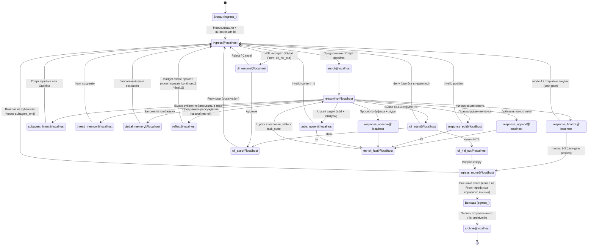

# Threlium: конечный автомат (FSM) — граф состояний и Python-стадии-функции

Документ задаёт **FSM-уровень архитектуры** (контракт хранилища писем и LightRAG в движке — мастер-источник [`INDEX.md`](INDEX.md)): парадигму «событие = письмо, состояние = стадия-функция», полный граф переходов, контракт Python-модуля стадии (`threlium.states.<stage>`) и контракт тела между стадиями. Всё, что касается того, **как именно** стадия вызывается (**fdm** `notmuch insert && threlium-dispatch.sh` → `threlium-work@` / `threlium.runners.engine_submit` → `threlium.runners.engine`, serial-per-thread, гонки, лимиты), — `[ORCHESTRATION.md](ORCHESTRATION.md)`; всё, что касается **содержимого** писем (канонизация id, имена файлов, **fdm.conf** / §3 snippet, split stage submit / RAG-loop в `threlium-engine`, журналирование ошибок через systemd/journald — см. [`INDEX.md` §5.6](INDEX.md#56-universal-error-handling-в-runnersworkerpy)), — `[MESSAGES.md](MESSAGES.md)`.

**Источники истины (при расхождении переопределяют этот документ):**


| Документ                               | Зона ответственности                                                                                                                                                                                                         |
| -------------------------------------- | ---------------------------------------------------------------------------------------------------------------------------------------------------------------------------------------------------------------------------- |
| [INDEX.md](INDEX.md)                   | **Мастер-контракт**: durable stage Maildirs под единым notmuch root, **fdm** terminating insert, stage worker `nm_settle()`, LightRAG worker (single-writer, NOT template), обработка ошибок worker/bridge (journald + failed units), enrich + `unified_messages` / `aquery`, recovery, dependencies, glossary. |
| [ORCHESTRATION.md](ORCHESTRATION.md)   | Оркестрация стадий: **fdm** → `threlium-dispatch.sh` (notmuch query `tag:unread AND folder:<stage>/Maildir`) → `threlium-work@<stage>:<thread_id>.service` (submit → `threlium.runners.engine`; воркер сужает по `to:` + `thread:`), `threlium-sweep@` как backstop, `nm_settle()` вместо `os.rename`/`os.remove`, serial-per-thread, гонки, лимиты.                                                       |
| [MESSAGES.md](MESSAGES.md)             | Раскладка `$THRELIUM_HOME` (без **legacy** `archive/Maildir` вне `stages/`; хвост отправки — `stages/archive/Maildir`), канонизация `Message-ID` / `In-Reply-To` / `References` (`threlium.types` — `RfcMessageIdWire` и др.), имена файлов в Maildir, **fdm.conf** (цепочка `match` → `pipe` → `notmuch insert … && dispatch` + `+error` для «остатка»; для `archive@` — insert с `+lightrag_indexed`), split stage submit / RAG-loop в движке. |
| [SUBAGENT_TABLE.md](SUBAGENT_TABLE.md) | Правила `ingress_router` / `egress_router`, матрица делегирования L0 → L1 → L2 + HITL, маркеры `subagent_intent` / `subagent_end`, заголовки `X-Threlium-`*.                                                                              |
| [MEMORY_TABLE.md](MEMORY_TABLE.md)     | Матрицы переходов `thread_memory`, `global_memory` и `reflect` (продолжение рассуждения через свежий `enrich`), связь с LightRAG-индексацией (текущая модель; ранее — GraphRAG-экспортом).                                    |


Наоборот, **`ARCHITECTURE.md` сам опирается на этот документ** во всех вопросах FSM (парадигма «событие = письмо», граф, контракт стадии, границы handler'а); при расхождении приоритет у `FSM.md`, а `ARCHITECTURE.md` держит только верхнеуровневую рамку (интеграции, CLI-контур, служебные заголовки, общую схему потоков).

---

## 1. Парадигма: событие = письмо, состояние = стадия-функция

### 1.0 Матрица обязательных полей и msgspec (указатель)

| Зона | Обязательно непустое (после strip на границе JSON/wire) | Опционально |
| --- | --- | --- |
| `X-Threlium-Route` (email) | `channel`, `origin` в `EmailIngressRoute` | — |
| `X-Threlium-Route` (matrix) | `channel`, `room_id`, `event_id` в `MatrixIngressRoute` | `sync_batch`, `reply_to_event_id` |
| `X-Threlium-Route` (telegram) | `channel` и поля курсора в `TelegramIngressRoute` | `message_thread_id` |
| `egress_email` | `X-Threlium-Route`, `References` и **SMTP `Subject`** с **того же** предка `tag:route` в notmuch (IRT вверх от `Message-ID` задачи; не с задачного конверта); тип `EmailIngressRoute`, непустой `origin`; Subject на FSM-конвертах без изменений | `Message-ID` только для журнала |
| Цепочка предков | — | старт обхода — inner ``Message-ID`` текущего письма (лист); без узла с `tag:route` и маршрутом по цепочке `resolve_route_from_in_reply_to_ancestors` бросает `RuntimeError` |

Типы и непустые строки на границе wire JSON — `msgspec` (`threlium.types.rfc` / `threlium.types.ingress`, `threlium.types.NonEmptyStr`). Полный каталог нормализации доменных строк — `threlium.types`: `EmailStruct` / сценарные `Struct` (`IngressRouterChildMsg`, `ReferencesInReplyHeaders`, …), семантические VO с `parse` / `from_os` (атомарные несут полезную нагрузку в ``.value``; примеры — `RfcFromWire`, `RfcSubjectWire`, `FsmPlainToStageSubjectLine`, `ThreliumCapRootCapabilityEnv`, `UnionNotmuchRouteHeaderWire`, …; см. `docs/TYPES.md`), hop через `HopBudgetLine` / `HopTailToken`, notmuch через `NotmuchMessageIds.from_notmuch`, токены окружения через именованные типы (`ThreliumTelegramBotTokenEnv`, `MatrixBridgeHomeserverEnv`, …; strip до `msgspec.convert`, пустое не попадает в dict). Исключения в воркере не перехватываются ради «мягкого» продолжения: падает процесс, рестарт и политика повторов — у systemd ([`INDEX.md` §5.6](INDEX.md#56-universal-error-handling-в-runnersworkerpy)).

Ключевое архитектурное решение Threlium:

- **Событие** — одно MIME-сообщение (RFC 5322): заголовки + тело + опциональные вложения. Внешний сигнал (входящая почта, Telegram-update, Matrix-event) нормализуется мостом `ingress_<chan>` в такое каноническое письмо **один раз** на границе системы.
- **Состояние FSM** — пара «Maildir-очередь `stages/<stage>/Maildir` (durable, под union notmuch index) + Python-модуль `threlium.states.<stage>`». Имя стадии — localpart виртуального адреса (`enrich@localhost`, `reasoning@localhost`, `cli_exec@localhost`, …). Внешние каналы **не** имеют своих очередей: мосты `ingress_<chan>` доставляют каноническое письмо в `stages/ingress/Maildir/` **через `run_fdm`** (`fdm -m -a stdin fetch`, `To: ingress@localhost`, `~/.fdm.conf` после `match` делает одно терминирующее **`pipe`** → `notmuch insert --folder=stages/ingress/Maildir … && threlium-dispatch.sh` — атомарная запись файла в `new/` + индексация одной транзакцией notmuch; см. `[ARCHITECTURE.md §8.4](ARCHITECTURE.md#84-доставка-maildrop)` и [`INDEX.md` §4](INDEX.md#4-mailfilter-terminating-insert)). Прямой записи в `new/` **нет** — это нарушило бы Maildir-контракт и атомарность **fdm**+notmuch, и привело бы к чтению недописанного файла диспетчером `stages/ingress`.
- **Переход** — доставка нового письма в `stages/<next>/Maildir/new/` через **`run_fdm`** (handler возвращает `EmailMessage`, движок сериализует в `RFC822_FOR_INSERT` и передаёт байты в `fdm`; **fdm.conf** после `match` выполняет одно терминирующее **`pipe`** → `notmuch insert --folder=stages/<next>/Maildir … && threlium-dispatch.sh`); сразу после этого движок делает `nm_settle(file_path)` оригинала — `new/<id>` переезжает в `cur/<id>:2,S` durable. Контракт `nm_settle()` (`db.atomic()` + `discard("unread")` + `to_maildir_flags()`) — [`INDEX.md` §5.5.3](INDEX.md#553-notmuch-consistency-через-notmuch2mutabletagset). Никаких in-process вызовов между стадиями; единственный канал связи — файл в следующем Maildir'е под управлением union notmuch index.
- **Стадия — функция-состояние с сигнатурой `(EmailMessage, stage: FsmStage, *, config: ThreliumSettings) → EmailMessage | None`,** где keyword-only `config` в штатном пути берётся из снимка при старте демона `threlium-engine` (`load_settings()` один раз); в тестах передают узкий ручной `ThreliumSettings(...)`. «Функция» — в смысле типового контракта handler'а, не в смысле функциональной чистоты: стадии **можно** иметь побочные эффекты (HTTP/SMTP-вызовы, `systemd-run`, чтение union index'а через `notmuch`, LightRAG-запросы `rag.aquery(...)` в `enrich` и т. д.) — запреты касаются только транспортного слоя FSM (см. [§4.5](#45-границы-стадии-транспорт--снаружи-остальное--внутри)). Входом handler'а является **уже-разобранный** объект модели `email.message.EmailMessage` из stdlib-библиотеки `email` (политика `email.policy.default`), вторым параметром — VO локальной части стадии (`threlium.types.FsmStage`), переданный из JSON запроса движку и сверяемый с `FsmStage.from_incoming_to(msg)`; для строковых интерфейсов (notmuch-теги, `STAGE_MAIN_MODULES`) используется `stage.value`. Парсинг RFC 5322 из Maildir-файла и обратная сериализация результата handler'а — **один раз** на стадию, внутри `threlium.runners.engine` (см. [§4](#4-контракт-стадии-handler-main)). Нетерминальная стадия возвращает один новый `EmailMessage` (движок сериализует его и делает **`run_fdm`** → **fdm.conf** выполняет `notmuch insert` в следующую стадию → движок делает `nm_settle()` оригинала); терминальная стадия возвращает `None` — оркестратор **не** вызывает **`run_fdm`**, но `nm_settle()` оригинала всё равно делает (см. `[ORCHESTRATION.md §3](ORCHESTRATION.md#3-механизм-post-insert-hook--dispatch-script)`). `None` на выходе handler'а — у **`archive`** (замыкание хвоста после `egress_*`). **`egress_<channel>`** после успешной доставки наружу возвращают письмо на **`archive@localhost`**, а не `None`. Все остальные узлы — включая `thread_memory` / `global_memory`, отказы политики в `cli_intent`, drop-подобные ветки роутеров — **не** терминальны в смысле `None`: стадии памяти возвращают поток в `ingress@localhost` (см. матрицы в `[MEMORY_TABLE.md](MEMORY_TABLE.md)`), отказ в команде от `cli_intent` — это отказ именно в команде, а не в обслуживании, и рассуждение продолжается письмом **в `ingress@localhost`**, далее `enrich` → `reasoning` ([SUBAGENT_TABLE.md](SUBAGENT_TABLE.md)). Воркер `_run_stage` логирует стадию и `Message-ID` входа, а после handler — **terminal** или **transition** (следующий `To:`), см. `fsm.py`.
- **LLM tool calls как единственный механизм выбора ребра.** `reasoning@localhost` передаёт в `litellm.completion` список `tools` с JSON Schema; по полю `tool_calls` в ответе движок FSM детерминированно выбирает ровно один следующий переход и формирует ровно одно каноническое письмо с `To: <next>@localhost`. Парсинг свободного текста LLM для выбора ребра **не используется** — принципиальная граница между «LLM как источник намерения» и «FSM как исполнитель». Сопоставление tool'ов с адресатами — [SUBAGENT_TABLE.md](SUBAGENT_TABLE.md).

Следствия, на которые опираются остальные разделы:

- **Stateless-стадия.** У стадии нет персистентного состояния вне входного письма и union notmuch index'а: вся память — это `notmuch2`-поиск по union'у `*` или содержимое собственных заголовков входа. Перезапуск, recovery после крэша, форк треда — обрабатываются штатной механикой `systemd` + dispatch-скрипта (dispatch ищет pending-треды по `tag:unread AND folder:<stage>/Maildir`; воркер — по `to:<stage>@localhost` внутри треда; settled треды живут в `cur/` и подбираются LightRAG-воркером по cur/-PathChanged-триггеру, `[ORCHESTRATION.md §3](ORCHESTRATION.md#3-механизм-post-insert-hook--dispatch-script)`).
- **IRT-tree FSM.** Рекурсия L0 → L1 → L2 … (субагенты, HITL-прерывания) без in-memory state: непрерывная цепочка `In-Reply-To` с маркерами `subagent_intent` (начало) / `subagent_end` (завершение); бюджет шагов — в `X-Threlium-Hop-Budget`. Depth-классификатор в `egress_router` определяет маршрут возврата. Полные правила — [SUBAGENT_TABLE.md](SUBAGENT_TABLE.md). Инвариант линейности `In-Reply-To` и связь внешнего почтового треда с внутренним FSM-тредом через glue-записи — [THREAD_MODEL.md](THREAD_MODEL.md).
- **Никакого глобального координатора FSM.** Нет «оркестратора», который решает, какой стадии запускаться следующей: следующий адрес всегда в `To:` текущего исходящего письма, а вся остальная работа (инотифай, сериализация per-thread, параллелизм across-thread) — `systemd`. Документы разнесены по зонам ответственности: FSM-уровень (этот документ) → граф и контракт стадии; оркестрационный уровень → как стадия реально запускается.

### 1.1. Мосты bridge→ingress, `References` и поиск предка

Мосты **Telegram** и **Matrix** не материализуют заголовок `References` на ingress: для связи в union-notmuch достаточно корректного `In-Reply-To` на wire `Message-ID` предка. **Email**-мост сохраняет `References` с IMAP как сырец. Раннер `threlium.runners.bridge` не изменяет MIME. Поиск route-предка и внешней цепочки в FSM — по `In-Reply-To` и обходу вверх в notmuch; при необходимости серверного `References` для исходящей почты — из сохранённого письма предка (часто email-ingress), а не через искусственное копирование `References` на каждой стадии. Стадии `egress_*` не читают `X-Threlium-Route` с задачного письма: сначала `require_resolved_route_for_egress_task` (тот же якорь RA, что и в `egress_router`), затем notmuch по inner id предка.

**Egress:** параметры вызова внешних API берутся из `X-Threlium-Route` **сообщения-предка** с `tag:route` (тот же id, что вернул `require_resolved_route_for_egress_task`), после `decode_ingress_route_from_header` / `decode_ingress_route_b62`; для SMTP база `References` и наружный `Subject` — заголовки **того же** route-предка (IRT-резолв), затем §M4 в `egress_email` для `References`. `egress_router` **не** копирует маршрут на конверт к `egress_*`. Wire `Message-ID` / `In-Reply-To` служат графу в notmuch. Общий обязательный шаг «всегда `decanonicalize` wire mid в egress» не задаётся.

---

## 2. Полная схема графа FSM




Свойства графа:

- `**ingress@localhost` — внешняя граница + HITL router + distill gateway.** Сюда попадают только bridge-события (`From: <channel>@localhost`) и HITL-ответы пользователя. Internal re-enrich (`reflect`, `subagent_*`, validation errors) идёт **напрямую в `enrich@`**. Маршрутизация — [SUBAGENT_TABLE.md](SUBAGENT_TABLE.md), раздел `ingress_router`.
- `**egress_router@localhost` — единственная точка выхода.** Depth-классификатор по IRT-цепочке: если `depth > 0` (внутри субагента) → маршрут в `subagent_end`; если `depth == 0` → внешний ответ пользователю (канал определяется из `X-Threlium-Route` корневого письма треда по `notmuch`-lookup: `resolve_route_for_egress_fsm_from_email`, затем `channel: email` → `egress_email`, …). На конверт к `egress_*` заголовок `X-Threlium-Route` **не** кладётся — терминал берёт маршрут с предка через `require_resolved_route_for_egress_task` (якорь — `Message-ID` текущего письма). Полные правила — [SUBAGENT_TABLE.md](SUBAGENT_TABLE.md), раздел `egress_router`.
- **Состояния памяти `thread_memory` / `global_memory` — равноправные узлы графа.** Симметричны: `reasoning` отправляет письмо в одну из стадий памяти, та нормализует тело и возвращает поток в `ingress`. Стеки `X-Threlium-*` при этом **не трогаются** — стек исключительно для делегирования субагентов. Матрицы переходов и правила LightRAG (общий граф, thread id в синтетическом ingest, soft-приоритет в `lightrag/rag_response.j2`, см. [`INDEX.md` §7.6](INDEX.md#76-per-thread-scoping-soft-через-маркеры)) — [MEMORY_TABLE.md](MEMORY_TABLE.md).
- **`reflect@localhost` — re-enrich напрямую (`reflect → enrich → reasoning`), без ingress/distill.** Стадия читает остаток `X-Threlium-Hop-Budget` (внутренняя FSM-механика выбора шаблона, в тело модели бюджет не пробрасывается), relay `<user-query>` из IRT и запускает свежий enrich-цикл. Self-route `reasoning → reasoning` отсутствует сознательно: он минует `enrich` (а вместе с ним — сбор `unified_messages`, `rag.aquery(...)` и шаблонный payload для `reasoning`, [`INDEX.md` §7](INDEX.md#7-enrich-notmuch-context--query--lightrag)) и нарушает SoT-инвариант [§5](#5-контракт-тела-между-стадиями) («в `stages/reasoning` почта попадает только с ребра `enrich → reasoning`»). Подробности — [MEMORY_TABLE.md §3](MEMORY_TABLE.md#3-reflect-продолжение-рассуждения).
- **CLI-ветка — строгое трёхстадийное разделение.** `reasoning` формирует намерение (tool call) → `cli_intent` реализует **только политику** (sandbox / privileged, route-collision → `enrich_fast`, optional HITL) → `cli_exec` реализует **только исполнение** через transient `systemd-run` (sandbox: `--user --wait --pipe` + ProtectSystem=strict + PrivateNetwork; privileged: `--uid=0`). HITL-контур замыкается через `cli_hitl_out` → `egress_router` → внешний канал → ответ пользователя → `ingress_router` (детекция по RA tail + `From: cli_hitl_out@localhost` родителя в union notmuch index) → `cli_resume`. Observation и ошибки CLI → **`enrich_fast@localhost`** (не `ingress`). Полная матрица — [SUBAGENT_TABLE.md](SUBAGENT_TABLE.md), контекст — [ARCHITECTURE.md §6](ARCHITECTURE.md#6-слой-cli-и-безопасность-исполнения).
- **Response buffer — CRDT-подобная инкрементальная сборка ответа.** `reasoning` **никогда** не вызывает `egress_router` напрямую. Все ответы пользователю проходят через `response_finalize`. Длинные ответы собираются итеративно: `response_append` × N → `response_finalize`. `enrich_fast` обеспечивает быстрый цикл обратной связи без повторного RAG (берёт предыдущий enriched-контекст `E_prev` и добавляет MIME-part `<response-state>`). Полная матрица переходов — [RESPONSE_TABLE.md](RESPONSE_TABLE.md).
- **Task-ledger — content-addressed CRDT против дрифта задач.** Параллельно буферу ответа `reasoning` ведёт durable-план: `enrich` сеет стартовые подзадачи (`<task-init>`) **до** обращения к LightRAG, а их тексты подмешиваются в графовый запрос; стадия `tasks_upsert` за один вызов добавляет новые и меняет статусы существующих (решётка `pending→in_progress→done|cancelled`, identity = hash текста). `response_finalize` **жёстко (fail-closed)** блокирует ответ, если ledger пуст, есть открытая работа или все `cancelled` без `done` — проверка по IRT, не по тексту LLM; даже trivial-ответ фиксирует одну `done`-подзадачу. `response_observe` обозревает буфер **и** задачи. Полностью — [RESPONSE_TABLE.md §8](RESPONSE_TABLE.md).
- **Ошибки handler'а.** Исключения в `runners/engine` логируются (traceback в ответе submit → `exit 1`), оригинал при ошибке до `nm_settle` остаётся с `+unread` ([`INDEX.md` §5.6](INDEX.md#56-universal-error-handling-в-runnersworkerpy)). Мосты — лог + **`exit 1`** и `Restart=on-failure` у `threlium-bridge@`. Отдельной стадии `errors` и error-mail в FSM нет.
- **Внешние каналы не имеют собственных очередей-входов в FSM.** Все мосты (`threlium.bridges.{email,telegram,matrix}`) — long-running services, **отдают байты в `run_fdm` из Python** (`threlium.delivery.run_fdm`, см. [ARCHITECTURE.md §2.6](ARCHITECTURE.md#26-каналы-единая-маршрутизация-ingress-egress)). Каноническое письмо: **`From: <channel>@localhost`**, **`X-Threlium-Route`** = b62(JSON) `*IngressRoute`, `To: ingress@localhost` — **`fdm`** по `~/.fdm.conf` после `match` делает одно терминирующее **`pipe`** → `notmuch insert --folder=stages/ingress/Maildir … && …/threlium-dispatch.sh` (атомарная запись + индексация одной транзакцией notmuch, затем dispatch). Писать в `stages/ingress/Maildir/new/` напрямую мосты **не имеют права**: `notmuch insert` выполняет атомарную запись + индексацию одной транзакцией, а dispatch-скрипт (`threlium-dispatch.sh`, вызываемый в том же пайпе после insert, `[ORCHESTRATION.md §3](ORCHESTRATION.md#3-механизм-post-insert-hook--dispatch-script)`) подхватил бы полузаписанный файл; единственная корректная точка доставки — **`fdm`**, он же единый источник уникальных Maildir-имён и единая транзакция файл+notmuch index. У выхода — очереди `egress_<chan>@localhost` и отдельная **`archive@localhost`** (`stages/archive/Maildir`): после внешней доставки `egress_*` эмитят MIME на `archive@`, **`fdm`** кладёт его в `archive/` (см. **fdm** `ins_stage_archive` в [`MESSAGES.md` §3](MESSAGES.md#3-mailfilter-snippet)); `egress_*` повторно читают wire маршрута с предка `tag:route` по inner id.

### 2.1. Канонический состав стадий (`threlium_fsm_mailbox_stages`)

Состав узлов FSM — фиксированный контракт, источник истины — список модулей `threlium/states/*.py`. Эта же последовательность зеркалируется в Ansible-переменной `threlium_fsm_mailbox_stages` (файл `ansible/roles/threlium/vars/main.yml`), по которой раскатываются правила **`fdm.conf.j2`** и `threlium-dispatch.sh`; **отдельных** `threlium-lightrag@<stage>.path` нет ([`INDEX.md` §6.3](INDEX.md#63-активация-через-ansible)).

| Стадия | Роль |
|---|---|
| `ingress` | Bridge distill + HITL router; `From:` ≠ bridge → fail-fast. Internal стадии в ingress не эмитят. |
| `enrich` | LightRAG-обогащение: `unified_messages` + `rag.aquery(...)` + финальный Jinja payload ([`INDEX.md` §7](INDEX.md#7-enrich-notmuch-context--query--lightrag)). Единственный legal-вход в `reasoning`. |
| `reasoning` | LLM-рассуждение через `litellm.completion(..., tools=[...])`; выбор следующего ребра — детерминированно по `tool_calls`. |
| `reflect` | Tool «думать ещё один цикл»: `<user-query>` из IRT → `enrich → reasoning` ([MEMORY_TABLE.md §3](MEMORY_TABLE.md#3-reflect-продолжение-рассуждения)). |
| `thread_memory` | Запись факта в локальную память треда; возврат потока в `ingress@` ([MEMORY_TABLE.md §1](MEMORY_TABLE.md#1-локальная-память-thread_memory)). |
| `global_memory` | Запись глобального факта пользователя; возврат в `ingress@` ([MEMORY_TABLE.md §2](MEMORY_TABLE.md#2-глобальная-память-global_memory)). |
| `subagent_intent` | Маркер начала фрейма субагента L+1: изолированный hop-budget, непрерывный `In-Reply-To`. |
| `cli_intent` | Политика для CLI-намерения от `reasoning`: SANDBOX → `cli_exec`; PRIVILEGED + `privileged_hitl_enabled` → `cli_hitl_out`; PRIVILEGED без HITL → `cli_exec` (uid=0); route-collision / invalid → `enrich_fast`. |
| `cli_hitl_out` | HITL-вопрос пользователю наружу через `egress_router` (`From: cli_hitl_out@localhost` — маркер HITL-происхождения для детекции в `ingress`). |
| `cli_resume` | Приём ответа пользователя на HITL (IRT-обход до `From: cli_hitl_out@localhost`); LLM-классификатор (`LitellmRoutingSite.CLI_HITL_RESUME`, tool `confirm_cli_hitl`) → `cli_exec` при approve, иначе `enrich_fast`. |
| `cli_exec` | Исполнение команды через transient `systemd-run` (sandbox: `--user --wait --pipe`; privileged: `--uid=0`); observation → `enrich_fast@localhost`. |
| `response_append` | Приём чанка ответа от reasoning, forward в `enrich_fast`. Content сохраняется в Maildir (durable). |
| `response_edit` | Правка/удаление чанка по 0-based position; валидация через `collect_ops`; ошибка → `enrich`, ok → `enrich_fast`. |
| `response_observe` | Обзор буфера ответа **+ task-ledger** (план) → нарратив `<response-observation>` → `enrich_fast`. |
| `tasks_upsert` | Ведение task-ledger (anti-drift): add новых подзадач + смена статусов существующих (`done`/`in_progress`/`cancelled` по `content_id`); валидация против ledger, ошибка → `enrich`, ok → `enrich_fast` ([RESPONSE_TABLE.md §8](RESPONSE_TABLE.md)). |
| `enrich_fast` | Быстрый цикл: берёт `E_prev` (multipart/mixed от enrich), пересобирает `<response-state>` / `<task-state>` MIME-part → `reasoning`. |
| `response_finalize` | Финализация ответа: 4 режима (см. [RESPONSE_TABLE.md](RESPONSE_TABLE.md)). Modes 1-3 → `egress_router`, mode 4 → `enrich`. |
| `egress_router` | Depth-классификатор по IRT; `depth > 0` → `subagent_end`, `depth == 0` → внешний ответ через `egress_<chan>`. |
| `egress_email` | Доставка через `msmtp -t`, затем emit записи в `archive@localhost` (`build_fsm_plain_to_stage`). |
| `egress_telegram` | Доставка через Telegram Bot API, затем emit в `archive@localhost`. |
| `egress_matrix` | Доставка через Matrix client-server API, затем emit в `archive@localhost`. |
| `archive` | Терминал хвоста отправки: handler возвращает `None`; durable MIME уже в `stages/archive/Maildir` после `run_fdm` (`+lightrag_indexed` на insert в **fdm**). |

**Контракт расширения** (новая стадия `<X>`):

1. `ansible/roles/threlium/files/scripts/threlium/states/<X>.py` — handler `main(msg, stage, *, config=Config(...))` (см. [§4](#4-контракт-стадии-handler-main)).
2. Добавить `<X>` в `threlium_fsm_mailbox_stages` (`vars/main.yml`).
3. Добавить `match`/`action` в [`fdm.conf.j2`](../ansible/roles/threlium/templates/config/fdm.conf.j2) и перераскатить роль; отдельного шага для LightRAG path-юнитов нет.

Пошаговая процедура со всеми ветками (особый **fdm** для `ingress`/`archive`, `reasoning`, тесты) — [`HOWTO_ADD_FSM_STAGE.md`](HOWTO_ADD_FSM_STAGE.md).

---

## 3. Принципы организации состояний

Каждое состояние — отдельный модуль `threlium.states.<stage>` (файл `ansible/roles/threlium/files/scripts/threlium/states/<stage>.py`), где `<stage>` совпадает с именем Maildir-очереди (`stages/<stage>/Maildir`) и с localpart адреса (`<stage>@localhost`). Движок FSM определяет стадию по `To:` каждого входного письма (FSM-инвариант bridges/билдеров — одно `To: <stage>@localhost` без плюс-адресации, см. [§4.2](#42-что-делает-воркер-перед-вызовом-handler-а)) через `FsmStage.from_incoming_to` и сверяет с `FsmStage` из запроса (эквивалент `%i`). Вызов стадии — in-process в `threlium.runners.engine` (штатный путь — `python -m threlium.runners.engine_submit` → сокет → `process_thread_message`); движок читает Maildir-файл, парсит через `parse_rfc822`, передаёт `config=GLOBAL_CFG` и при непустом результате сериализует `EmailMessage` и зовёт `run_fdm`. Пакет `threlium` устанавливается через `pip install -e .` из `ansible/roles/threlium/files/scripts/`, а инициализация окружения (`THRELIUM_HOME`, `EnvironmentFile=env/threlium.env`, `PATH=.venv/bin`) задаётся systemd-юнитом (см. `[ORCHESTRATION.md §6](ORCHESTRATION.md#6-юниты-systemd-пути-имена-окружение)`), а не скриптом стадии.

Стадия делает ровно четыре шага:

1. **Получение разобранного входного письма.** Движок `threlium.runners.engine` (§4) читает байты из Maildir-файла (`file_path.read_bytes()`), парсит их **один раз** через `parse_rfc822` (`email.message_from_bytes(data, policy=email.policy.default)`) и передаёт handler'у готовый объект `email.message.EmailMessage` плюс `FsmStage` из запроса. Handler работает с типизированной моделью: `msg["Message-ID"]`, `msg.get_all("References")`, `msg.get_body(preferencelist=("plain",))`, `msg.iter_attachments()` и т. п. — без ручного парсинга bytes, без внешних утилит для разбора заголовков и без повторного разбора MIME. Сам файл в `stages/<stage>/Maildir/new/*` handler не открывает (его уже прочитал и распарсил движок).
2. **Бизнес-логика.** LLM-вызов (`reasoning` через `litellm`), LightRAG-запрос (`enrich` через `rag.aquery(prompt, query_param=...)` и notmuch-контекст, [`INDEX.md` §7](INDEX.md#7-enrich-notmuch-context--query--lightrag)), политика (`cli_intent`), исполнение в transient scope (`cli_exec`), нормализация памяти (`thread_memory` / `global_memory`), обёртывание в tool-observation (`cli_resume`) и т. п. **Функциональная чистота здесь не требуется:** стадия может иметь любые побочные эффекты (HTTP/SMTP-вызовы, `systemd-run`, запросы к `notmuch` поверх union index'а, временные файлы, `subprocess`). Единственная граница — **транспорт FSM**: бизнес-функции не трогают `stages/*/Maildir/`, не делают `nm_settle()` и не зовут **`run_fdm`**/`systemctl` (правила — [§4.5](#45-границы-стадии-транспорт--снаружи-остальное--внутри)); transition emit и `nm_settle()` оригинала — забота движка FSM.
3. **Формирование нового письма.** Каноничные заголовки собираются централизованными билдерами из `threlium.fsm_emit`; **оба** основных билдера принимают входной `EmailMessage` и возвращают новый `EmailMessage` (детали — [§5](#5-контракт-тела-между-стадиями)). Заголовки, которые проставляют билдеры:
  - `Message-ID` — через `RfcMessageIdWire.internal_for_fsm()` (`<b62@localhost>`);
  - `In-Reply-To` — каноничный id входного письма (`incoming["Message-ID"]`);
  - `References` — при необходимости ;
  - `To:` — mailbox следующей стадии (выбор по tool call LLM в `reasoning`, по политике в `cli_intent`, по depth-классификатору в `egress_router`);
  - `X-Threlium-Route`, `X-Threlium-Hop-Budget` — по правилам [SUBAGENT_TABLE.md](SUBAGENT_TABLE.md) — соответствующими билдерами (`emit_transition_preserving_payload`, `build_fsm_plain_to_stage`). Канал не хранится в отдельном заголовке — `egress_router` определяет его из `X-Threlium-Route` корневого письма треда (lookup по `X-Threlium-Route`, [MESSAGES.md §6](MESSAGES.md#6-канал-и-другие-метаданные-не-внутри-id)). Для memory-стадий тело собирается шаблонами `thread_memory/base.j2` / `global_memory/base.j2` (`render_prompt`, без служебных X-заголовков на wire). Имя текущей стадии (`from_stage=`) handler берёт из второго позиционного аргумента `main(..., stage, ...)` — воркер его подставляет.
4. **Возврат `EmailMessage` (или `None`).** Handler возвращает **один** новый `EmailMessage` — воркер сериализует его через :func:`~threlium.mail.serialize_rfc822_for_wire` (`RFC822_FOR_INSERT`) и вызывает **`run_fdm`** — **fdm.conf** после `match` выполняет одно терминирующее **`pipe`** → `notmuch insert --folder=stages/<next>/Maildir … && threlium-dispatch.sh` — атомарная запись файла в `new/` следующей стадии + индексация одной транзакцией notmuch, затем dispatch. Сразу после этого воркер делает `nm_settle(file_path)` оригинала. Для терминальных стадий handler возвращает `None`: воркер не вызывает **`run_fdm`**, но `nm_settle()` оригинала всё равно делает (см. [§4](#4-контракт-стадии-handler-main) и `[ORCHESTRATION.md §3](ORCHESTRATION.md#3-механизм-post-insert-hook--dispatch-script)`).

Инварианты стадии:

- **Никаких прямых обращений к Maildir'у стадии.** Скрипт не читает `stages/<stage>/Maildir/{new,cur}/` напрямую, не двигает файлы, не делает `nm_settle()`, не запускает **`run_fdm`**. Всё это — забота воркера (`[ORCHESTRATION.md §3](ORCHESTRATION.md#3-механизм-post-insert-hook--dispatch-script)`) и **`~/.fdm.conf`** (`[INDEX.md §4](INDEX.md#4-mailfilter-terminating-insert)`).
- **Один конверт на входе — один (или ноль) конверт на выходе.** Нет «пакетной обработки». Пакетирование несовместимо с per-thread сериализацией (`[ORCHESTRATION.md §1](ORCHESTRATION.md#1-целевые-инварианты)`).
- **Стадия не знает о соседних стадиях.** Имя следующей стадии — только внутри её собственной бизнес-логики (и только там, где это часть контракта: `reasoning` — по tool call, `cli_intent` — по политике, `egress_router` — по стеку и по `notmuch`-lookup `X-Threlium-Route` → `From:`-префикс корневого письма → канал в union index, см. [SUBAGENT_TABLE.md](SUBAGENT_TABLE.md) `egress_router`). Статических прошитых маршрутов «из A всегда в B» нет.
- **Стадия не знает о `systemd`.** Ни скрипт стадии, ни его хелперы не вызывают `systemctl`, не читают юнит-метаданные и не проверяют окружение воркера: стадия должна одинаково работать как под `threlium-work@<stage>:<thread_id>`, так и при ручном вызове `main(msg, FsmStage.parse("<id>"))` (опционально `config=load_settings()` или узкий `ThreliumSettings(...)`) в интерактивном Python.
- **Стадия не индексирует ни union notmuch, ни LightRAG.** Запись в `notmuch` делает только **fdm** `pipe` через `notmuch insert` (атомарная транзакция, [`INDEX.md` §4](INDEX.md#4-mailfilter-terminating-insert)); запись в LightRAG-граф (`ainsert`) и тег `+lightrag_indexed` по умолчанию — RAG-loop внутри `threlium-engine` ([`INDEX.md` §5b](INDEX.md#5b-lightrag-worker)). **Исключение:** письма с `To: archive@localhost` получают `+lightrag_indexed` уже в **fdm** (`ins_stage_archive` в `fdm.conf.j2`), чтобы RAG-loop не брал их в селектор pending. Стадии разрешено только **читать** union index через `notmuch2`-API (например, `enrich` — для `unified_messages` / тредового контекста, `egress_router` — для lookup по `X-Threlium-Route`) и **читать** граф через `rag.aquery(...)` (в `enrich` — через `run_rag_coroutine` на том же инстансе, что и индексация).

---

## 4. Контракт стадии: handler `main`

Унификация, описанная в [§3](#3-принципы-организации-состояний), реализована в [`runners/engine/fsm.py`](../ansible/roles/threlium/files/scripts/threlium/runners/engine/fsm.py) (`_run_stage`, `process_thread_message`). Чтение стадии из канонического `To:` — :meth:`~threlium.types.fsm_stage.FsmStage.from_incoming_to` в [`types/fsm_stage.py`](../ansible/roles/threlium/files/scripts/threlium/types/fsm_stage.py); билдеры MIME и связанные хелперы — в [`fsm_emit.py`](../ansible/roles/threlium/files/scripts/threlium/fsm_emit.py); см. также [§5](#5-контракт-тела-между-стадиями). Движок берёт на себя весь I/O-обвяз стадии и MIME-парсинг/сериализацию — оставляя автору скрипта только handler с сигнатурой `(EmailMessage, stage: FsmStage, *, config: ThreliumSettings) → EmailMessage | None` над готовой моделью из stdlib-библиотеки `email`. Handler вызывается **in-process** через `STAGE_MAIN_MODULES[stage_vo]` → `main(msg, stage, config=cfg)` — контракт «одна функция одного RFC 5322-конверта» держится на уровне Python (типизированный `email.message.EmailMessage` внутри handler'а); байтовая граница — между движком и **`fdm`** (сериализация `out.as_bytes(policy=RFC822_FOR_INSERT)` → `run_fdm`; маршрут — по `To:` / `~/.fdm.conf`).

### 4.1. Контракт handler'а

Типовая сигнатура в `threlium.fsm_emit` (Protocol :class:`StateHandler`):

```python
from email.message import EmailMessage
from typing import Protocol

from threlium.settings import ThreliumSettings, load_settings
from threlium.types import FsmStage


class StateHandler(Protocol):
    def __call__(
        self,
        msg: EmailMessage,
        stage: FsmStage,
        *,
        config: ThreliumSettings,
    ) -> EmailMessage | None: ...
```

- **Вход** — `msg: EmailMessage` и `stage: FsmStage`: уже-разобранная модель входного RFC 5322-конверта плюс VO локальной части стадии (воркер парсит `%i` в `FsmStage.parse`, см. `threlium.runners.engine` / submit JSON). Воркер читает байты из Maildir-файла (`file_path.read_bytes()`), парсит их **один раз** через `parse_rfc822` → `email.message_from_bytes(data, policy=email.policy.default)` (`policy.default` принципиально важна — именно она возвращает современный `EmailMessage`, а не legacy-класс `email.message.Message` из compat32-режима) и отдаёт handler'у готовый объект вместе с `stage`. Сверка с `To:` выполняется через `FsmStage.from_incoming_to(msg)` и сравнение с `stage` — fail-fast при mis-routing. Handler это значение никогда не вычисляет сам. Заголовки уже каноничны (см. `[MESSAGES.md §2](MESSAGES.md#2-канонизация-идентификаторов-на-границах-системы)`); тело — как его построила предыдущая стадия или `ingress_<chan>`-мост. Handler обращается к полям через штатный API `email`:
  - `msg["Message-ID"]`, `msg["In-Reply-To"]`, `msg.get_all("References", [])`, `msg["X-Threlium-Route"]` — заголовки; канал определяется из `X-Threlium-Route` корневого письма треда (lookup по `X-Threlium-Route` в union index, [SUBAGENT_TABLE.md](SUBAGENT_TABLE.md)), отдельного заголовка канала нет;
  - `msg.get_body(preferencelist=("plain",))` — основное текстовое тело; `msg.iter_attachments()` — вложения;
  - `msg.is_multipart()`, `msg.get_content_type()`, `msg.get_content()` / `get_payload(decode=True)` — контент;
  - прямой доступ к байтам входа **не даётся** — и не нужен; если стадии внутренне нужен сырой RFC (передать содержимое в сторонний тул), она вызывает :func:`~threlium.mail.serialize_rfc822_for_wire` — это по-прежнему «работа над своей копией `EmailMessage`», а не доступ к файлу из очереди.
- **Выход** — одна из двух взаимоисключающих веток:
  - **Нетерминальная стадия** возвращает новый `EmailMessage` — одно каноническое RFC 5322-сообщение, собранное билдерами [§5](#5-контракт-тела-между-стадиями). Воркер сериализует его через `out.as_bytes(policy=RFC822_FOR_INSERT)` и вызывает **`run_fdm`** + `nm_settle(file_path)` оригинала (см. `[ORCHESTRATION.md §3](ORCHESTRATION.md#3-механизм-post-insert-hook--dispatch-script)` шаг 3–3a). Ровно одно сообщение за вызов.
  - **Терминальная стадия** возвращает `None`; стадия считается закрывшей текущий путь FSM. Терминал хвоста отправки — **`archive`**: запись о фактически отправленном сообщении уже лежит в `stages/archive/Maildir`, handler лишь возвращает `None`. Стадии **`egress_<channel>`** после доставки наружу возвращают **новый** `EmailMessage` на `archive@localhost` (не `None`). Других терминалов с `None` нет — в частности, **не** терминальны:
    - `thread_memory` / `global_memory` — факт памяти живёт durable в `cur/` стадии (после `nm_settle()`), индексируется LightRAG-воркером по cur/-PathChanged-триггеру, а сам handler эмитит новое письмо в `ingress@localhost`, чтобы рассуждение продолжилось уже с зафиксированным фактом (матрицы — `[MEMORY_TABLE.md §1](MEMORY_TABLE.md#1-локальная-память-thread_memory)` / [§2](MEMORY_TABLE.md#2-глобальная-память-global_memory));
    - `cli_intent` при отказе в команде — отказ исполнения команды не является отказом в обслуживании; handler эмитит письмо **в `ingress@localhost`** с причиной отказа, далее `ingress` → `enrich` → `reasoning` ([SUBAGENT_TABLE.md](SUBAGENT_TABLE.md) шаг 11, `ingress_router` п.4);
    - `ingress_router` / `egress_router` — они всегда выбирают следующее ребро по правилам (`SUBAGENT_TABLE.md`), а не «закрывают путь»; «drop-ветки» в их контексте означают «не подошло данное правило, сработает следующее», а не `return None`.
- `**None` — единая first-class семантика терминальной стадии.** На уровне Python handler возвращает `None`; воркер проверяет результат (`_run_stage` возвращает `b""`) и **не вызывает `run_fdm`**, но всё равно делает `nm_settle(file_path)` оригинала (см. `[ORCHESTRATION.md §3](ORCHESTRATION.md#3-механизм-post-insert-hook--dispatch-script)` шаг 6). Соответственно handler **не должен** возвращать пустой/неинициализированный `EmailMessage` в надежде «тихо продолжить» — пустой результат означает «это был терминал», и воркер сделает settle оригинала, не эмитируя следующего MIME. Если нужен именно no-op-переход, его эмитируют как `EmailMessage` с каноничными заголовками и пустым `text/plain`-телом.
- **Типовые проверки и нормализация входа — задача билдеров и общих хелперов, а не handler'а.** `threlium.fsm_emit` / `threlium.mime_reform` предоставляют `build_fsm_*`; wire round-trip — :mod:`threlium.mail` (`canonicalize_mime`, см. [§5](#5-контракт-тела-между-стадиями)); метаданные писем в union-notmuch-индексе смотрятся через :mod:`threlium.nm` и :meth:`notmuch2.Message.header` (хелпер ``header_field_optional``); handler не парсит строки заголовков руками, не обращается к `msg.policy`, не тасует transfer-encoding. Работа с **самим сообщением, которое идёт через FSM** (вход и то, что handler возвращает на выход), — исключительно через модель `EmailMessage`: handler не открывает файлы в `stages/*/Maildir/{new,cur,tmp}/`, не зовёт внешние утилиты вроде `msmtp` напрямую и не выполняет байтовые трюки над входным файлом. Это — транспортный слой, полные правила и единственный разрешённый прямой FS-доступ (read-only чтение union index'а по `notmuch2.msg.path`) — в [§4.5](#45-границы-стадии-транспорт--снаружи-остальное--внутри). Внутри стадии любые другие инструменты (`subprocess`, HTTP/SMTP-библиотеки, `notmuch`, `lightrag-hku`) разрешены. Исходный файл в `stages/<stage>/Maildir/new/`* handler **не знает и не открывает**: воркер уже прочитал его и передал разобранную модель в handler. Запись факта памяти и LightRAG-индексация **не** являются pre-return побочными эффектами: факт живёт в `cur/` стадии после `nm_settle()` (durable), индексируется отдельным `threlium-lightrag.service` (см. `[INDEX.md §5b](INDEX.md#5b-lightrag-worker)`, `[MESSAGES.md §5](MESSAGES.md#5-stage-worker-и-lightrag-worker)` и `[MEMORY_TABLE.md](MEMORY_TABLE.md)`).

### 4.2. Что делает воркер перед вызовом handler'а

Логика вызова стадии реализована в функции `_run_stage` в **`threlium/runners/engine/fsm.py`** (≈30 строк):

```python
# threlium/runners/engine/fsm.py  (упрощённо)
import importlib
from email.message import EmailMessage
from threlium.mail import email_message_from_bytes
from threlium.types import FsmStage, RfcMessageIdWire, NotmuchMessageIdInner
# … _require_non_empty_message_id: RfcMessageIdWire + NotmuchMessageIdInner → RuntimeError

def _run_stage(stage_vo: FsmStage, file_path: Path) -> bytes:
    data = file_path.read_bytes()
    msg = email_message_from_bytes(data) if data else EmailMessage()
    # непустой Message-ID (inner) → иначе RuntimeError
    incoming_stage = FsmStage.from_incoming_to(msg)
    ...
```

Воркер выполняет пять вещей, ни одну из которых автору стадии повторять не нужно:

1. **Имя стадии читается из канонического `To:` входного письма.** `FsmStage.from_incoming_to(msg)` (в [`types/fsm_stage.py`](../ansible/roles/threlium/files/scripts/threlium/types/fsm_stage.py)) извлекает ровно один адрес из `msg.get_all("To", [])` через `email.utils.getaddresses`, требует домен `localhost` и запрещает плюс-адресацию. Это источник истины FSM: bridges (`threlium.bridges.{email,telegram,matrix}`) и билдеры §5 строят письма так, что `To: <stage>@localhost` — ровно один, без плюсов. Имя стадии — та же величина, что попадает в `X-Threlium-Route:` будущего перехода и используется handler'ом как `from_stage=stage` в билдерах. Воркер сверяет извлечённое имя с тем, которое было передано ему при запуске, — fail-fast при mis-routing. Плюс-адресация (например, `<stage>+worker@localhost`) в FSM запрещена архитектурно — параллелизм воркеров обеспечивает `systemd`-template'ом на thread_id (`threlium-work@<stage>:<thread_id>.service`, `[ORCHESTRATION.md §3](ORCHESTRATION.md#3-механизм-post-insert-hook--dispatch-script)`), а не заголовками письма.
2. **Парсинг RFC 5322 — один раз на стадию; до handler'а воркер требует непустой `Message-ID` (inner), иначе `RuntimeError`.** `email_message_from_bytes` / :func:`~threlium.mail.parse_rfc822` с `email.policy.default` (см. :mod:`threlium.mail`). Политика `email.policy.default` выбрана принципиально: `email.policy.compat32` (default для `message_from_bytes` без `policy=`) вернул бы legacy `Message` и сломал бы `get_body()` / `iter_attachments()` / современную работу с заголовками. Никаких ручных `email.parser.BytesParser` в коде стадий, никаких внешних header-утилит — вся типизированная работа с MIME идёт через этот один объект. Метаданные из индекса notmuch без чтения файла — через :mod:`threlium.nm` / :meth:`notmuch2.Message.header`; для inner ``Message-ID`` у объекта из индекса обязательна :func:`threlium.nm.require_inner_message_id_from_notmuch_message` — без парсящегося id это ``RuntimeError``, не skip. Заголовки «с диска» только в местах, где нужен полный байтовый разбор (воркер: тело; enrich `unified_messages` / lightrag ingest: тело).
3. **Журнал `_run_stage` (`threlium.logutil.log`).** После валидации `Message-ID` — строка `fsm enter Message-ID=…` с именем стадии из запроса; после возврата handler'а — `fsm result terminal` при `None` или `fsm result transition next=…` по каноническому `To:` исходящего `EmailMessage` (`fsm.py`).
4. **Ветвление по результату и сериализация один раз на стадию.** Если handler вернул `None` — `_run_stage` возвращает пустой `b""` (терминал — **`archive`**, §4.1). Иначе — runtime-проверка `isinstance(out, EmailMessage)` с указанием стадии в сообщении (ловит случаи «handler забыл обернуть в билдер и вернул `dict`/`bytes`/`str`»), затем :func:`~threlium.mail.serialize_rfc822_for_wire` (`RFC822_FOR_INSERT`). Политика **`RFC822_FOR_INSERT`** (на базе `email.policy.SMTP` с `max_line_length=0` и LF в `linesep`) даёт Unix LF и **не refold'ит** длинные однострочные заголовки — инвариант для `notmuch insert` на wire (см. [`INDEX.md` §4](INDEX.md#4-mailfilter-terminating-insert)). Ошибки внутри handler'а прокидываются в `threlium.runners.engine` (`server.py` ловит, JSON-ошибка клиенту) — см. `[ORCHESTRATION.md §3](ORCHESTRATION.md#3-механизм-post-insert-hook--dispatch-script)` и [`INDEX.md` §5.6](INDEX.md#56-universal-error-handling-в-runnersworkerpy).
5. **Динамический импорт модуля стадии.** `importlib.import_module(f"threlium.states.{stage}")` загружает модуль по имени стадии; `getattr(mod, "main")` извлекает handler. Если модуль не содержит `main` — `RuntimeError` с именем модуля. Стадия вызывается in-process, в том же Python-интерпретаторе, что и воркер.

### 4.3. Канонический каркас скрипта стадии

Все файлы в `ansible/roles/threlium/files/scripts/threlium/states/*.py` сведены к минимуму — ровно два блока (docstring, импорты + `main`-функция). Весь служебный boilerplate (`sys.path`-bootstrap, `common.init()`, извлечение `STAGE` из `__file__`) вынесен из скрипта:

- пути импорта обеспечивает сам Python-пакет `threlium` — он устанавливается в `.venv` через `pip install -e ansible/roles/threlium/files/scripts`, все модули стадий доступны как `threlium.states.<stage>`, `sys.path`-хаков больше нет;
- инициализация окружения (`THRELIUM_HOME`, `EnvironmentFile=env/threlium.env`, `Environment=PATH=…/.venv/bin:/usr/bin:…`) задана в systemd-юните `threlium-work@.service` (см. `[ORCHESTRATION.md §6](ORCHESTRATION.md#6-юниты-systemd-пути-имена-окружение)`); пакет при импорте только проверяет, что `THRELIUM_HOME` задан, и падает с понятным сообщением, если забыли про `EnvironmentFile=`;
- имя стадии воркер извлекает из канонического `To:` входного письма (см. [§4.2](#42-что-делает-воркер-перед-вызовом-handler-а)) и передаёт handler'у вторым параметром — локальная константа не нужна.

Канонический шаблон стадии:

```python
"""<stage>@localhost: короткое описание перехода → <next-stage>@localhost."""
from __future__ import annotations

from email.message import EmailMessage

from threlium.fsm_emit_semantic import emit_transition_simple_step_preserving_payload
    # … header_*, notmuch_*, build_fsm_plain_to_stage,
    #   require_header, log, require_exe …
)


from threlium.settings import ThreliumSettings


def main(msg: EmailMessage, stage: FsmStage, *, config: ThreliumSettings) -> EmailMessage | None:
    # … прочитать нужные заголовки/тело через API EmailMessage, выполнить бизнес-логику,
    #   собрать новый EmailMessage через билдер §5 и вернуть его;
    #   либо вернуть None только на стадии archive (терминал хвоста после egress_*).
    return emit_transition_simple_step_preserving_payload(
        msg,
        to_addr="<next-stage>@localhost",
        from_stage=stage,
    )
```

**Что и почему остаётся видимым в скрипте:**

- **Docstring.** Для `pydoc` и grep'а по переходам (`"<stage>@localhost: … → <next>@localhost"`). Обязателен.
- **Импорты.** `from email.message import EmailMessage` — тип handler'а, автор стадии всегда его использует явно. `from threlium.fsm_emit import …`, `from threlium.logutil import log`, `from threlium.mime_reform import …` (по необходимости), и т. д. — только те символы, что реально нужны стадии (билдеры §5, хелперы `log`, `require_header`). Пакет `threlium` при импорте проверяет `THRELIUM_HOME` через :func:`threlium._require_home`.
- **Ровно одна функция `main(msg, stage, *, config=…)`.** Двух точек входа у FSM-стадии не бывает: один модуль = один переход = один handler. Если стадии нужна подстройка поведения по каналу / режиму — это ветвление **внутри** `main`, а не второй handler. Сигнатура `main(msg: EmailMessage, stage: FsmStage, *, config: ThreliumSettings) -> EmailMessage | None` — единственная разрешённая форма: стадия прокидывается воркером и передаётся в билдеры как `from_stage=stage`; `config` собирает воркер через `load_settings()` (см. `threlium.settings`).
- **Бизнес-функции, если они нужны, добавляются между импортами и `main`** — они работают над `EmailMessage`/его примитивными полями. Функциональной чистоты от них не требуется (побочные эффекты допустимы — см. [§4.5](#45-границы-стадии-транспорт--снаружи-остальное--внутри)); важно лишь не принимать `bytes`/строку RFC 5322 — это снова заставит каждую стадию парсить письмо самостоятельно.

**Бриджи внешних каналов (`threlium/bridges/email.py`, `threlium/bridges/telegram.py`, `threlium/bridges/matrix.py`) живут отдельно** — все три являются long-running services под инстансами **`threlium-bridge@<chan>.service`** (единый шаблон `threlium-bridge@.service`, `ExecStart=python -m threlium.runners.bridge <chan>`). Email bridge использует IMAP IDLE (`imap-tools`) с notmuch-дедупликацией; Telegram/Matrix — long-poll / `/sync`. На каждое событие все мосты вызывают **`run_fdm`** из Python (`threlium.delivery`, см. `[MESSAGES.md §2](MESSAGES.md#2-канонизация-идентификаторов-на-границах-системы)`). Все они проставляют **`From: <channel>@localhost`**, **`X-Threlium-Route`**, `To: ingress@localhost`. Канал в маршруте согласован с local-part `From:` (см. `ingress_route_resolve`). FSM-контракта handler вида `main(msg, stage, *, config=…)` у них нет: они не стадии, а внешние мосты.

### 4.4. Почему такой контракт удобен для оркестрации и поддержки

Оркестрация (`[ORCHESTRATION.md §3](ORCHESTRATION.md#3-механизм-post-insert-hook--dispatch-script)`) завязана на то, что скрипт стадии не трогает ни `new/`, ни `cur/`, ни `nm_settle()`, ни `fdm`-конфиг, а на уровне Python — на то, что MIME-парсинг живёт в одном месте. In-process вызов из воркера делает оба свойства программно проверяемыми:

- **Handler получает `EmailMessage` и возвращает `EmailMessage | None` — единственный легальный контракт стадии для FSM-транспорта.** Байтовый уровень, Maildir и `nm_settle()` скрыты воркером. Прямой FS-доступ к очередям стадий запрещён (правила и единственный разрешённый read-only путь — чтение union notmuch index'а по `notmuch2.msg.path` — в [§4.5](#45-границы-стадии-транспорт--снаружи-остальное--внутри)); при этом внутри handler'а разрешены любые сторонние вызовы, нужные стадии (`notmuch2`-индекс read-only, LightRAG-запрос `rag.aquery(...)` в `enrich`, SMTP/HTTP-клиенты, `systemd-run` в `cli_exec`), — запрет касается только транспорта FSM, записи в notmuch (только **fdm** `pipe` / `notmuch insert`) и записи в LightRAG (`ainsert` / теги — RAG-loop в `threlium-engine`, см. [`INDEX.md` §5b](INDEX.md#5b-lightrag-worker); тег `+lightrag_indexed` для `archive@` — см. **fdm** `ins_stage_archive` в [MESSAGES.md §3](MESSAGES.md#3-mailfilter-snippet)).
- **MIME-парсинг и сериализация — ровно один раз на стадию, в одном месте.** Граница «bytes ↔ модель» ровно одна — в `_run_stage` движка (`parse_rfc822(data)` → `message_from_bytes(..., policy=default)` на входе, `out.as_bytes(policy=RFC822_FOR_INSERT)` на выходе в **`run_fdm`**). Политики парсинга/сериализации выбраны централизованно и не зависят от стадии: автор скрипта не думает ни про `policy=default` vs `policy=compat32`, ни про `as_string()` vs `as_bytes()`, ни про line-endings. Это исключает класс ошибок «одна стадия случайно использовала legacy `Message` API, вторая — `EmailMessage`, несовместимо бьётся на мультипарт-телах».
- **Типизированный контракт ловит ошибки билдеров на runtime.** Проверка `isinstance(out, EmailMessage)` в `_run_stage` срабатывает с указанием имени стадии: если handler по ошибке вернёт `dict` / `bytes` / сырую строку (типичная регрессия при частичном рефакторинге билдеров), падение будет немедленным и локализованным, а не через три перехода в виде «**fdm** положил мусор в next-stage».
- **`None` — first-class сигнал «терминальная стадия `archive`», а не граничный случай.** Ветвление «эмитировать следующий MIME vs. закрыть хвост после egress» живёт в Python: `return <EmailMessage>` (следующий шаг FSM) или `return None` (запись о доставке уже в `stages/archive/Maildir` после предыдущего **`run_fdm`** от `egress_*`). Воркер узнаёт о `None` пустым `b""` от `_run_stage` и единообразно пропускает **`run_fdm`**, но всё равно делает `nm_settle(file_path)` оригинала в `archive/` (`[ORCHESTRATION.md §3](ORCHESTRATION.md#3-механизм-post-insert-hook--dispatch-script)`). Python-воркер не ведёт списка терминальных стадий — «handler вернул `None`», и переходная механика (**`run_fdm`** + `nm_settle`) отрабатывает без специальных веток. Новый канал `egress_<chan>` добавляется без правок воркера — модуль после доставки наружу возвращает `EmailMessage` на `archive@localhost`.
- **Идемпотентность движка** (`[ORCHESTRATION.md §5](ORCHESTRATION.md#5-гонки-восстановление-лимит-параллелизма)`) **не зависит от поведения handler'а** при повторной доставке того же файла. Повторный прогон — обычный повторный прогон handler'а. Побочные эффекты стадии на ретрае выполняются повторно — at-least-once; идемпотентность на стороне стадии — [§6.1](#61-как-именно-стадия-запускается). Исключение handler'а обрабатывается политикой [`INDEX.md` §5.6](INDEX.md#56-universal-error-handling-в-runnersworkerpy) — **`Restart=on-failure`** у `threlium-work@` без лишнего sweep при **`exit 1`** (**`OnSuccess`** только после **`exit 0`**).
- **Бенчмарк «стадия за один Python-модуль + один runner» выдерживается.** Автор новой стадии пишет ровно одно тело `main(msg: EmailMessage, stage: FsmStage, *, config: ThreliumSettings) -> EmailMessage | None`; всё остальное (I/O, валидация, парсинг/сериализация с фиксированными политиками, `nm_settle()`, условный **`run_fdm`**) уже реализовано в `threlium/fsm_emit.py`, `threlium/delivery.py` и `threlium/runners/engine/fsm.py`.
- **Тестируемость.** Unit-тесты стадии вызывают `main(msg, FsmStage.parse("<id>"), config=load_settings())` (или узкий ручной `ThreliumSettings(...)`) напрямую, передавая вручную собранный `EmailMessage` — без работы с байтами. Интеграционные e2e-тесты (см. `[TESTING.md](TESTING.md)`) поднимают полный контур `threlium-engine` + `threlium-work@…`, где байтовый уровень отрабатывает реальный `_run_stage`; обе модели проверяются симметрично.

### 4.5. Границы стадии: транспорт — снаружи, остальное — внутри

Запреты действуют **только** на транспорт и прямой FS-доступ к очередям стадий; внутри handler'а — никаких ограничений на тулинг.

**Запрет (транспорт FSM).** Handler не открывает файлы в `stages/*/Maildir/{new,cur,tmp}/` ни своей, ни чужой стадии, не пишет в них, не делает `nm_settle()`, не вызывает `notmuch insert`, не зовёт **`run_fdm`** / `systemctl` / `mv` над этими деревьями. Единственный способ эмитировать следующий MIME — `return <EmailMessage>`; сериализацию + **`run_fdm`** (внутри — **fdm** `pipe` с `notmuch insert … && threlium-dispatch.sh`) + `nm_settle(file_path)` оригинала делает движок (`[ORCHESTRATION.md §3](ORCHESTRATION.md#3-механизм-post-insert-hook--dispatch-script)` шаг 3–3a). Терминальная ветка (`return None`) — только **`archive`** (§4.1).

**Разрешено (union notmuch index, только чтение).** Единственный легальный прямой FS-доступ handler'а к письму — **чтение** `stages/<stage>/Maildir/cur/*.eml` (или `new/*.eml` для своего же текущего файла, но это не нужно — воркер уже прочитал и распарсил его) по пути, полученному из `notmuch2` (`msg.path` / `get_filename()`). Нужен, когда надо достать тело / вложение / непроиндексированный `X-`*-заголовок параметрически. Писать в union index нельзя — индекс наполняется только штатным `notmuch insert` через **fdm** `pipe` ([`INDEX.md §4`](INDEX.md#4-mailfilter-terminating-insert)), писать в Maildir файлы напрямую нельзя — settle делает воркер через `nm_settle()` ([`INDEX.md §5.5.3`](INDEX.md#553-notmuch-consistency-через-notmuch2mutabletagset)).

**Разрешено (всё остальное).** Внутри стадии специальных запретов нет: `subprocess` / `systemd-run` (`cli_exec` — штатный механизм исполнения команд в transient scope, см. `[ARCHITECTURE.md §6](ARCHITECTURE.md#6-слой-cli-и-безопасность-исполнения)`), `smtplib` / `requests` / `httpx` (в `egress_<chan>` и бизнес-функциях), `lightrag-hku` SDK (`rag.aquery(...)` — только в `enrich`), `notmuch` CLI/bindings (read-only), временные файлы — всё, что стадии нужно для её бизнес-логики.

`**notmuch2` как «бесплатные заголовки и тред-id».** Xapian-индекс отдаёт `msg.header("Message-ID")`, `msg.header("Subject")`, `msg.threadid`, `msg.tags` мгновенно и **без** открытия `.eml`-файла. Кастомные `X-`*-заголовки (в т. ч. `X-Threlium-*`) делаются читаемыми и поисковыми штатной [`notmuch-config(1)`](https://notmuchmail.org/manpages/notmuch-config-1/)-настройкой `index.header.<Prefix>=<Header>`; конкретные настройки и переиндексация — забота bootstrap-плейбука ([`PLAYBOOK.md`](PLAYBOOK.md)), а не handler'а.

После этого `notmuch search Threlium:<value>` и `msg.get_header("X-Threlium-Route")` работают без FS-доступа. Соответственно поиск корня треда, проверка тегов, выборка писем по `thread:<id>` / `tag:<tag>` / `id:<msgid>` / `*` в стадиях делаются через `notmuch2.Database(...)` — без внешних header-утилит и без ручного парсинга MIME; открытие файла-с-диска остаётся только для **тела** и вложений (см. выше). Область индекса — **весь union** stage Maildir'ов: `notmuch database.path = ~/threlium/stages` индексирует все `stages/<stage>/Maildir/` сразу. Логический «архив» = `notmuch search '*'` по union index'у. Notmuch glob справка — [`INDEX.md §11.2`](INDEX.md#112-notmuch-query-syntax--glob-ограничения).

**Итог для автора стадии.** Один видимый паттерн доставки: `return <EmailMessage>` для любого продолжения FSM (включая переходы на `ingress@localhost` от стадий памяти и отказы политики из `cli_intent`), `return None` — только для **`archive`** (хвост после `egress_*`). Всё остальное (тулинг, subprocess, HTTP, read-only чтение union notmuch index'а, `rag.aquery(...)` в `enrich`) — на усмотрение самой стадии.

---

## 5. Контракт тела между стадиями

### 5.1. Общее правило: одно MIME-сообщение, каноничные заголовки

Выход **нетерминальной** стадии — **один** новый `EmailMessage`, собираемый централизованными билдерами из `threlium.fsm_emit`. Это нужно для того, чтобы ни одна стадия не строила `Message-ID` / `In-Reply-To` / `References` / `X-Threlium-`* «руками» и не забыла обновить `X-Threlium-Hop-Budget`, стеки и `X-Threlium-Route` (а для egress — канал определяется в `egress_router` из `X-Threlium-Route` корневого письма по [SUBAGENT_TABLE.md](SUBAGENT_TABLE.md) `notmuch`-lookup'ом по union index'у, без отдельного заголовка канала). Канонические имена служебных заголовков — [`MESSAGES.md` §8](MESSAGES.md#8-canonical-x-threlium-headers-glossary).

**Типовая подпись билдера**:

```python
from email.message import EmailMessage
from threlium.fsm_emit import ManagedFsmHeaderPatch
from threlium.types import FsmStage

def emit_transition_preserving_payload(
    incoming: EmailMessage,
    *,
    to_addr: FsmStage,
    from_stage: FsmStage,
    managed_headers: ManagedFsmHeaderPatch | None = None,
) -> EmailMessage: ...
```
(`MailHeaderName` → `ManagedFsmHeaderValue` в `threlium.fsm_emit`. Дефолты прежнего билдера без явной карты — в `threlium.fsm_emit_semantic`, например `emit_transition_simple_step_preserving_payload`.)

Опциональный `managed_headers` задаёт только те managed-поля, которые попадут в выход; пустой/`None` — только envelope и whitelist Subject, **без** неявного `In-Reply-To` / RA / hop / cap с входа.

Билдер получает входной `EmailMessage`, читает из него нужные поля API-методами (`incoming["Message-ID"]`, `incoming.get("X-Threlium-Route")`, `incoming.get_body(...)`), конструирует **новый** `EmailMessage(policy=email.policy.default)` с корректными заголовками и телом и возвращает его handler'у. Входной объект не мутируется — это делает билдеры безопасными для повторных вызовов и для сценариев, когда handler сначала получает `EmailMessage`, а потом решает, эмитировать переход или вернуть `None`.

**Терминальные стадии билдеры тела не вызывают.** Терминальны только `egress_<channel>` (`egress_email`, `egress_telegram`, `egress_matrix`) — они выполняют доставку наружу (SMTP / Bot API / client-server API) **внутри** `main(msg, stage, *, config=…)` и затем возвращают `None`. Handler возвращает `None`, **`run_fdm`** не вызывается, следующего MIME не существует (см. [§4.1](#41-контракт-handler-а) и `[ORCHESTRATION.md §3](ORCHESTRATION.md#3-механизм-post-insert-hook--dispatch-script)` шаг 3a). Все остальные стадии, включая `thread_memory` / `global_memory` и `cli_intent`-отказы, строят и возвращают новый `EmailMessage` **одним из двух** билдеров ниже: как правило `to_addr=ingress@localhost` для возвратов в общий контур, **`to_addr=reasoning@localhost` — только** у исходящего письма **со стадии `enrich`**, в соответствии с [SUBAGENT_TABLE.md](SUBAGENT_TABLE.md) (почта в очередь `stages/reasoning` попадает **только** с ребра `enrich` → `reasoning`).

Два основных билдера (документированный контракт; смотри также семантические обёртки в `threlium.fsm_emit_semantic`):


| Функция                                                                | Когда использовать                                                                                                                                                                                                                                                                             |
| ---------------------------------------------------------------------- | ---------------------------------------------------------------------------------------------------------------------------------------------------------------------------------------------------------------------------------------------------------------------------------------------- |
| `emit_transition_preserving_payload(incoming, *, to_addr, from_stage, managed_headers=None)` | Переход между стадиями с **сохранением того же MIME-тела**; envelope (`From`, `To`, `Date`, новый `Message-ID`), whitelist Subject из входа, затем только явная карта managed VO (`In-Reply-To`, RA, Hop-Budget). **`References` между стадиями не ставится.** На практике стадии вызывают обёртки (`emit_transition_simple_step_preserving_payload`, egress-хелперы и т. д.) или собирают карту сами. |
| `build_fsm_plain_to_stage(incoming, *, body, to_addr, from_stage)`     | Переход с **новым text/plain-телом** и тредовыми заголовками от входа. Стадии памяти — `ingress@`; `cli_exec` (observation), route-collision / invalid `cli_intent`, ошибки `cli_resume` — `enrich_fast@`, далее [SUBAGENT_TABLE.md](SUBAGENT_TABLE.md) / [MEMORY_TABLE.md](MEMORY_TABLE.md).                                                                                    |


**Согласованное поведение тредовых заголовков** (на уровне модели `EmailMessage`; подробности — в обёртках `fsm_emit_semantic` и в `build_fsm_plain_to_stage`):

- Низкоуровневый `emit_transition_preserving_payload` **без** `managed_headers` не выставляет `In-Reply-To`, RA, hop; типичный переход собирает карту VO в `fsm_emit_semantic` (или передаёт её явно в тестах). **`build_fsm_plain_to_stage`** сам выставляет `In-Reply-To` из `Message-ID` входа и декрементирует hop по правилам plain-перехода.
- Заголовок **`References` не переносят** (промежуточные MIME FSM его не несут; RFC-цепочка для SMTP email подставляется в `egress_router` с предка `tag:route`, см. [MESSAGES.md](MESSAGES.md) и код `threlium.fsm_emit`).
- Генерируют новый `Message-ID` через `RfcMessageIdWire.internal_for_fsm()` — каноничная форма `<b62@localhost>` для FSM-порождённых писем (см. `[MESSAGES.md §2](MESSAGES.md#2-канонизация-идентификаторов-на-границах-системы)`).
- На обычных переходах без смены фрейма hop-budget обновляется по матрице ([SUBAGENT_TABLE.md](SUBAGENT_TABLE.md)): декремент текущего уровня в новый конверт.
- Канал **не** хранится в отдельном заголовке на FSM-конвертах: для внешнего ответа `egress_router` определяет канал из `X-Threlium-Route` корневого письма треда (lookup в union index; `email` → `egress_email`, `telegram` → `egress_telegram`, `matrix` → `egress_matrix`; [SUBAGENT_TABLE.md](SUBAGENT_TABLE.md), [MESSAGES.md §6](MESSAGES.md#6-канал-и-другие-метаданные-не-внутри-id)).
- Ставят `From` в `<from_stage>@localhost`.

Управление фреймами субагентов (`subagent_intent` — маркер начала с изолированным hop-budget, `subagent_end` — маркер завершения с восстановлением hop-budget родителя, `egress_router` — depth-классификатор по IRT) описано в [SUBAGENT_TABLE.md](SUBAGENT_TABLE.md). Билдеры на простых переходах **не** управляют фреймами: они переносят уже подготовленные значения hop. Замена заголовков в коде стадий и в билдерах — через API `EmailMessage` (`msg["X-Threlium-Hop-Budget"]`, присваивание через `del msg["..."]; msg["..."] = new_value` — стандартная идиома stdlib'а).

### 5.2. Контракт тела `enrich` → `reasoning`

Результат стадии `enrich` передаётся в `reasoning` как **`multipart/mixed`** MIME-сообщение с гранулярными `text/plain` частями по `Content-ID` (`build_enriched_multipart` в `threlium/mime_reform.py`). Лимит символов — `enrich.context_max_chars` / `trim_context_text`.

#### После полного `enrich` (reflect → enrich → reasoning): до 7 частей

| Content-ID | Источник | Примечание |
|---|---|---|
| `<user-message>` | `lightrag/enrich_incoming_user_text.j2` | ВСЕГДА. Canonical user message. |
| `<graph-answer>` | JSON envelope из `_build_lightrag_envelope` | Если RAG не пуст. Внутри `threlium.formulated_query`. |
| `<unified-mail-context>` | `lightrag/mail_context.j2` по `ctx.all_messages` | Полная хронология треда + memory-письма. |
| `<thread-memory>` | `lightrag/mail_context.j2` по `ctx.thread_memory_msgs` | Только `to:thread_memory@localhost` текущего треда. |
| `<global-memory>` | `lightrag/mail_context.j2` по `ctx.global_memory_msgs` | `to:global_memory@localhost` из ВСЕХ тредов. |
| `<response-state>` | Пересчёт из CRDT (`_collect_extra_parts`) | Если буфер не пуст. |

Дублирование `<thread-memory>` / `<global-memory>` с содержимым `<unified-mail-context>` — **намеренное**: явные маркеры повышают усвоение LLM при рассуждениях; `<global-memory>` содержит записи из **всех** тредов, не только текущего.

#### После `enrich_fast` (без reflect): до 9 частей

Все части из e_prev (от последнего `enrich`) + splice (`splice_e_prev_with_history`):
- `<response-state>` / `<task-state>` — пересчёт из CRDT (**replace** единственной части).
- `<history>`-части окна-дельты — **аддитивно**: всё содержательное (`message_has_history`), появившееся с прошлого `To: reasoning` (E_prev) до текущего листа, едет **сырыми** `<history>`-частями с контент-адресным `Content-ID` `<{sha256(body)}@history>`. `enrich_fast` (stage-agnostic) собирает их по окну IRT (`collect_unified_delta_msgs`), штампует `X-Threlium-Origin` из конвертного `From:` и дописывает в хвост. Дедуп — по равенству `EnrichContentId` (= по телу): relay-копия схлопывается с оригиналом, без `To:`-логики. Граница окна — ближайший `To: reasoning` (в multi-cycle = выход прошлого `enrich_fast`), прошлые дельты уже лежат частями E_prev.

`reasoning` рендерит `<history>`-части единым хронологическим потоком в `<conversation_delta>`, каждая запись подписана `[from: origin]` (`X-Threlium-Origin`); семантику стадии модель знает из tool spec. Видов-таксономии по стадии (`<observation>`/`<memory_note>`/`<plan_state>`) больше нет. History на границе reasoning **без** `_budget_history` — все `<history>`-части письма как есть; лимитирование хвоста — ответственность `enrich` / `enrich_fast` (TBD). FSM gate `formal_reason` читает relayed `<system>` (не prose из delta); отсутствие или
битый `FormalReasonResultPayload` после formal_reason в дельте enrich_fast — `RuntimeError`.
См. [`FORMAL_REASON_GATE.md`](FORMAL_REASON_GATE.md).

#### Секционные маркеры

`extract_part_by_content_id` извлекает каждую MIME-часть по `Content-ID`; reasoning собирает промпт через per-part trim + Jinja2-шаблон. LLM видит единый текстовый поток с семантическими границами:

```
<user-message>
From: user@example.com
Subject: Help with report
...

<graph-answer>
{"query_api": "aquery", "ok": true, ...}

<unified-mail-context>
--- message 1 ---
From: user@example.com
...

<thread-memory>
--- message 1 ---
From: reasoning@localhost
To: thread_memory@localhost
...

<global-memory>
--- message 1 ---
From: reasoning@localhost
To: global_memory@localhost
...

<response-state>
Response buffer (3 chunks, ~1200 chars):
...

<conversation_delta>
[from: response_observe] Assessment: response is 60% complete...
[from: formal_reason] SHACL validation passed; inferred ...
```

Полная архитектура наполнения контекста (CID `history`/`system`, score/origin, дедуп, модель «callee владеет историей», LightRAG-индексация) — [`CONTEXT_CONTRACT.md`](CONTEXT_CONTRACT.md).

Связанная модель: асинхронный **индексатор** на выделенном asyncio-loop внутри `threlium-engine` (`schedule_index_pending` после settle) и **enrich** с `rag.aquery` на том же инстансе — [`ARCHITECTURE.md` §5.1](ARCHITECTURE.md#51-разделение-lightrag-на-два-контура) + [`INDEX.md` §5b](INDEX.md#5b-lightrag-worker) / [§7](INDEX.md#7-enrich-notmuch-context--query--lightrag).

### 5.3. Контракт тела при HITL-ветке (краткий)

В ветке `cli_intent → cli_hitl_out → egress_router → egress_<chan>` тело едет как `<system>` (вопрос пользователю; `cli_hitl_out` дополнительно кладёт `<history>`-копию «что спросили»); в ветке `cli_resume → cli_exec → enrich_fast` — `observation` (stdout/stderr/exit-code, обрезанные до лимита) как `<system>` **и** `<history>` (результат tool в память, origin=`cli_exec`). Управление фреймами, правила `ingress_router`-детекции HITL-возвратов (IRT-обход до `From: cli_hitl_out`) — [SUBAGENT_TABLE.md](SUBAGENT_TABLE.md).

---

## 6. Стыки с соседними контрактами

Этот раздел — **карта cross-references**. Детали в источниках истины; здесь — только перечень, чтобы из FSM-документа было видно, за какими именно деталями куда идти.

### 6.1. Как именно стадия запускается

- `[ORCHESTRATION.md §1](ORCHESTRATION.md#1-целевые-инварианты)` — инварианты serial-per-thread / parallel-across-threads.
- `[ORCHESTRATION.md §3](ORCHESTRATION.md#3-механизм-post-insert-hook--dispatch-script)` — полный контракт **fdm** `pipe` (`notmuch insert && dispatch`) → `threlium-dispatch.sh` (notmuch query по тредам) → `threlium-work@<stage>:<thread_id>.service` (`python -m threlium.runners.engine_submit` → `threlium.runners.engine`), `threlium-sweep@` как backstop (запуск из **`OnSuccess=`** воркера после **`exit 0`**), in-process вызов handler'а и условный **`run_fdm`** по непустому результату, таблица транзакционности.
- `[ORCHESTRATION.md §5](ORCHESTRATION.md#5-гонки-восстановление-лимит-параллелизма)` — гонки, recovery, `threlium-work.slice`, `threlium-sweep@` backstop.
- **At-least-once для доставки во внешний контур на стадиях `egress_<channel>`.** Каждая такая стадия выполняет доставку во внешний канал (SMTP в `egress_email`, Telegram Bot API в `egress_telegram`, Matrix client-server API в `egress_matrix` — механизм выбирает сама стадия в рамках правил [§4.5](#45-границы-стадии-транспорт--снаружи-остальное--внутри)) **до** возврата `EmailMessage` на `archive@localhost`. Терминал FSM с `return None` — только **`archive`** ([§4.1](#41-контракт-handler-а)). Между «внешний API вернул success» и `nm_settle(file_path)` в воркере на стадии `egress_*` есть окно: крэш ровно в нём приведёт к повторной активации `threlium-work@<egress_chan>:<thread_id>.service`, повторному вызову `main`, повторной доставке наружу. Поэтому:
  - Стадия `egress_<chan>` сама должна обеспечивать защиту от дубликата наружу, где это критично: идемпотентные ключи в API внешнего канала (`Message-ID` в SMTP-конверте для дедупликации на MTA, Telegram-дедуп по `(chat_id, message_thread_id, payload-hash)`, Matrix `transaction_id`), а также пред-проверки «уже отправлено» по union notmuch index'у там, где целевой API не даёт идемпотентности.
  - Ровно-однажды (`exactly-once`) на уровне всей системы не предоставляется — это не Kafka и не двухфазный коммит, а `maildir` + **fdm** + atomic `notmuch insert`. Все `egress_<chan>` проектируются исходя из предположения, что их `main()` **может** быть вызван более одного раза с теми же байтами на входе.
  - Для всех нетерминальных стадий (включая `thread_memory` / `global_memory`, `cli_intent`-отказы, стадии рассуждения и роутеры) та же самая at-least-once семантика относится к доставке в очередь следующей стадии: повтор `main()` снова выполнит бизнес-логику и снова эмитит MIME-сообщение (`Message-ID` через `RfcMessageIdWire.internal_for_fsm()` — см. `[MESSAGES.md §2](MESSAGES.md#2-канонизация-идентификаторов-на-границах-системы)`); **`run_fdm`** запускает **fdm** `pipe` с `notmuch insert --folder=stages/<next>/Maildir … && threlium-dispatch.sh` — атомарная запись файла в `new/` следующей стадии + индексация одной транзакцией notmuch и dispatch. **Дубликаты по `Message-ID` отсекает сам `notmuch insert`** (он отдаёт уже существующий `MessageID` без повторной записи файла), так что при ретрае второй вызов не плодит копий в индексе; на уровне Maildir дополнительный файл может появиться, и его дедупликация — ответственность ретеншена ([`INDEX.md` §10.1 future work](INDEX.md#101-future-work-deferred)). Логика дедупликации/схлопывания на уровне тредов и union index'а — ответственность соответствующих стадий и `notmuch`-индекса, а не воркера. Поведение при исключении handler'а (лог + `nm_settle()` + `exit 1`) — [`INDEX.md` §5.6](INDEX.md#56-universal-error-handling-в-runnersworkerpy) и `[ORCHESTRATION.md §3](ORCHESTRATION.md#3-механизм-post-insert-hook--dispatch-script)`.

### 6.2. Как устроены письма, с которыми работает стадия

- `[MESSAGES.md §1](MESSAGES.md#1-раскладка-хранения)` — раскладка `$THRELIUM_HOME` (durable `stages/<stage>/Maildir/`, LightRAG `working_dir/`; выделенного `archive/Maildir` нет).
- `[MESSAGES.md §2](MESSAGES.md#2-канонизация-идентификаторов-на-границах-системы)` — канонизация `Message-ID` / `In-Reply-To` / `References` в `threlium.types`, `raw_native_id`-схемы каналов.
- `[MESSAGES.md §3](MESSAGES.md#3-mailfilter-snippet)` — **fdm.conf**: цепочка `match` → терминирующий **`pipe`** → `notmuch insert --folder=stages/<stage>/Maildir … && dispatch` + составное действие для «остатка» (`+error`).
- `[MESSAGES.md §5](MESSAGES.md#5-stage-worker-и-lightrag-worker)` — stage submit (`nm_settle()` в движке) и RAG-loop в `threlium-engine` (single writer `working_dir/`).
- `[MESSAGES.md §8](MESSAGES.md#8-canonical-x-threlium-headers-glossary)` — глоссарий имён `X-Threlium-*` на wire.

### 6.3. Маршрутизаторы, субагенты, HITL

- `[SUBAGENT_TABLE.md](SUBAGENT_TABLE.md)` — правила `ingress_router` / `egress_router`, матрица L0 → L1 → L2 + HITL, маркеры `subagent_intent` / `subagent_end`, `X-Threlium-Hop-Budget` / `X-Threlium-Route`.

### 6.4. Память и итеративное рассуждение

- `[MEMORY_TABLE.md](MEMORY_TABLE.md)` — матрицы переходов `thread_memory` и `global_memory`, связь с LightRAG-индексацией (синтетический ingest + `chunking_func`, [`INDEX.md §7.6`](INDEX.md#76-per-thread-scoping-soft-через-маркеры); ранее — GraphRAG-экспортом).
- `[MEMORY_TABLE.md §3](MEMORY_TABLE.md#3-reflect-продолжение-рассуждения)` — `reflect@localhost`: tool «думать ещё один цикл» через свежий `ingress → enrich → reasoning`, budget-aware промпт через шаблоны `$THRELIUM_HOME/prompts/reflect/{continue,final}.j2`. Self-route `reasoning → reasoning` отсутствует сознательно (минует `enrich`, нарушает SoT-инвариант [§5](#5-контракт-тела-между-стадиями)).
- Промпт `reasoning` (`prompts/reasoning/system.j2`) задаёт модель навигации в условиях неполного контекста (видимый коридор enrich-выборки → explore `memory_query`/`cli_intent` → remap `reflect` → prove `formal_reason` → checkpoint `response_observe` → exit `response_finalize`); полная версия — bootstrap-док `knowledge/agent_navigation.md`, подтягиваемый через `memory_query`.

### 6.5. CLI-контур и безопасность исполнения

- `[ARCHITECTURE.md §6](ARCHITECTURE.md#6-слой-cli-и-безопасность-исполнения)` — разделение `reasoning` / `cli_intent` / `cli_exec`, sandbox / `privileged` в payload, transient `systemd-run` (sandbox: `--user --wait --pipe`; privileged: `--uid=0`).

### 6.6. LLM и LightRAG

- `[ARCHITECTURE.md §5.1](ARCHITECTURE.md#51-разделение-lightrag-на-два-контура)` — двухконтурная модель LightRAG (индексация на RAG-loop в `threlium-engine` + `enrich` с `aquery` на том же инстансе), отказ от линейных цепочек, mutex на тред **не нужен**.
- `[ARCHITECTURE.md §8.7](ARCHITECTURE.md#87-llm-и-lightrag)` — `litellm` tool calls, контракт `reasoning` с LLM, `lightrag-hku` SDK.
- [`INDEX.md` §5b](INDEX.md#5b-lightrag-worker) / [§7](INDEX.md#7-enrich-notmuch-context--query--lightrag) — мастер-контракт RAG-loop и enrich (`unified_messages` + `aquery`).

### 6.7. Заголовки FSM

- `[ARCHITECTURE.md §7](ARCHITECTURE.md#7-служебные-заголовки-fsm)` — таблица служебных `X-Threlium-`*.
- `[SUBAGENT_TABLE.md](SUBAGENT_TABLE.md)` — семантика маркеров `subagent_intent` / `subagent_end`, `X-Threlium-Route`.

