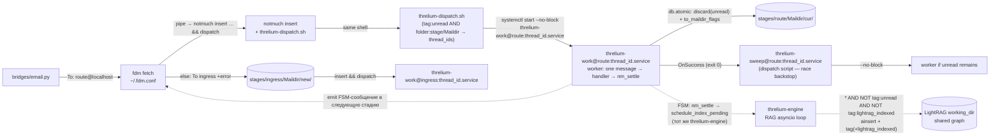

# INDEX — Архитектура индексации (notmuch + LightRAG)

> **Status**: Implemented (Ansible role + systemd user units + Python runners в `ansible/roles/threlium/files/scripts/threlium/`). Дальнейшие правки этого документа — отражение фактических изменений в коде.
>
> **Scope**: целевая архитектура хранилища писем (`stages/*/Maildir/` под единым notmuch-root) и графа знаний (LightRAG внутри `threlium-engine` на выделенном asyncio-loop). Заменяет фрагменты в [`FSM.md`](FSM.md), [`MESSAGES.md`](MESSAGES.md), [`ORCHESTRATION.md`](ORCHESTRATION.md), описывающие старую модель «выделенный `archive/Maildir` + `archive_worker` делает sweep+ainsert».
>
> **Что изменилось относительно старой схемы с отдельным `archive/Maildir`.** Физически нет `archive/Maildir`: каждый `stages/<stage>/Maildir/` — durable mailbox (stage worker никогда не удаляет файлы), а notmuch-root указывает на родительский `stages/`. Логический «архив» = весь union notmuch index. LightRAG-индексация выполняется **внутри** `threlium-engine.service` на выделенном asyncio-loop (батч `ainsert` после `nm_settle` по селектору settled-сообщений без тега `lightrag_indexed`). Отдельного `threlium-lightrag.service` и `.path`-watcher'ов нет. **fdm** (`~/.fdm.conf`, шаблон [`fdm.conf.j2`](../ansible/roles/threlium/templates/config/fdm.conf.j2)) после `match` выполняет **одно терминирующее** `pipe` → `notmuch insert --folder=<stage>/Maildir … && threlium-dispatch.sh` (без `cc`). RFC822 на wire до MDA нормализует Python (`RFC822_FOR_INSERT` в `mime_reform`). Ошибки handler'а в stage worker (§5.6): лог в journald, `nm_settle()` оригинала, **`exit 1`** — без error-mail и без отдельной стадии `errors`. Подробнее — глоссарий ([§12](#12-glossary--cross-references)) и журнал архитектурных решений ([§10](#10-architectural-decisions-log)).

Этот документ — каноничное описание архитектуры индексации: тег-таксономия, потоки событий, контракт между **fdm** (`fdm.conf`), stage worker'ами, RAG-loop движка и FSM-стадиями. Сам по себе он кода/шаблонов не вводит — фактическая реализация живёт в `ansible/roles/threlium/` (роль, шаблоны юнитов и Python-runner'ы); ссылки на пути ведут на актуальные файлы. При расхождении между этим документом и кодом — приоритет у кода, документ выравнивается отдельным коммитом.

---

## Оглавление

1. [Motivation](#1-motivation)
2. [Invariants](#2-invariants)
3. [Tag taxonomy](#3-tag-taxonomy)
4. [FDM: terminating insert](#4-mailfilter-terminating-insert)
5. [Stage workers (durable maildirs)](#5-stage-workers-durable-maildirs)
5b. [LightRAG indexing (RAG-loop)](#5b-lightrag-worker)
6. [Systemd units](#6-systemd-units)
7. [Enrich: notmuch context + query + LightRAG](#7-enrich-notmuch-context--query--lightrag)
8. [Ingress: fail-fast по FSM-инварианту](#8-ingress-fail-fast-по-fsm-инварианту)
9. [Recovery & idempotency](#9-recovery--idempotency)
10. [Architectural decisions log](#10-architectural-decisions-log)
11. [Dependencies & install](#11-dependencies--install)
12. [Glossary & cross-references](#12-glossary--cross-references)

---

## 1. Motivation

В старой схеме предполагался выделенный `archive/Maildir/`, в который mailfilter копировал каждое письмо через `cc "$ARCHIVE"` параллельно с доставкой `to "$STAGE"`, и единый `archive_worker`, который индексировал архив и делал LightRAG-`ainsert` в начале своей активации. Это даёт ряд избыточностей и крупную хрупкость:

- **Двойная доставка** на каждое письмо (`cc` + `to`) — два write-lock'а notmuch и две `rename(2)`-операции, причём `cc`-копия и `to`-копия физически одного содержимого.
- **`new/` всех стадий — эфемерное состояние**: stage worker удаляет файл (`os.remove(file_path)`) после успешной обработки. История трансфера тред'а живёт **только** в архиве. Это означает что любая операция «найти, где было сообщение в FSM» требует cross-reference между `archive/Maildir/` и stage Maildir'ом, которого уже нет.
- **Индексация только архива**: notmuch видит `archive/Maildir/`, не stage Maildir'ы. `notmuch search id:<...>` не различает «сообщение прошло через `enrich`» и «сообщение лежало в `archive/`» — в обоих случаях есть ровно одна копия в архиве.
- **`archive_worker` как монолит**: один процесс отвечает за (а) sweep `new/→cur/`, (б) batch `ainsert` в LightRAG, (в) tag commit. Crash в любой точке требует расчёта recovery-окна; вся ответственность сосредоточена в одном узле.
- **Риск «граф отстаёт от почты»**: без явной подачи истории писем в промпт reasoning имела бы только то, что успел проиндексировать LightRAG к моменту `aquery`.

**Цели**:

- **Один поток доставки** — нет `cc`. **fdm** после сопоставления правил выполняет одно **терминирующее** `pipe` → `notmuch insert --folder=<route>/Maildir …`: атомарная запись в stage Maildir + индексация одной транзакцией notmuch. Никакого second pass, никакого ARCHIVE-копирования.
- **Stage Maildir = durable mailbox**: stage worker **не удаляет** файлы. После успешной обработки делает `nm_settle()`-рецепт (`with db.atomic(): msg.tags.discard("unread"); msg.tags.to_maildir_flags()` — см. [§5.5.3](#553-notmuch-consistency-через-notmuch2mutabletagset)) → файл переезжает `new/<id>` → `cur/<id>:2,S` в собственном Maildir стадии. История трансфера тред'а живёт в union всех stage Maildir'ов.
- **Union notmuch index**: один `notmuch database.path = ~/threlium/stages` индексирует все stage Maildir'ы. Логический «архив» = весь индекс (`notmuch search '*'`). Запрос `thread:<tid>` возвращает все сообщения треда из всех стадий, через которые он прошёл, — без ARCHIVE-cross-reference.
- **LightRAG внутри `threlium-engine`**: один процесс движка держит выделенный asyncio-loop для `LightRAG`; батч-индексация **только settled** сообщений (выборка `* AND NOT tag:unread AND NOT tag:lightrag_indexed`) запускается **после** `nm_settle()` в FSM. Стабильные `file_paths` в графе (всегда `cur/<id>:2,S`), естественная защита от индексации полу-обработанных сообщений (если stage worker упал между `notmuch insert` и `nm_settle` — письмо в `new/+unread`, селектор его отсекает).
- **Ошибки без почтового recovery**: bridge и stage worker при сбое только логируют (journald) и завершаются с ненулевым кодом там, где это задано контрактом (§5.6, `threlium-bridge@.service` с `Restart=on-failure`). Отдельной стадии `errors/` и цепочки error-mail нет.
- **Контекст без барьера**: индексация после `nm_settle` не блокирует FSM (`schedule_index_pending`); enrich передаёт в `reasoning` гранулярные MIME-части (`<graph-answer>`, `<unified-mail-context>`, `<thread-memory>`, `<global-memory>`) через `build_enriched_multipart`, см. [§7](#7-enrich-notmuch-context--query--lightrag) и [`FSM.md` §5.2](FSM.md#52-контракт-тела-enrich--reasoning).

---

## 2. Invariants

Ниже — четыре инварианта:

| Инвариант | Контракт |
|---|---|
| **I1. Нет separate writer'а для архива** | Никаких `archive_worker` / `cc "$ARCHIVE"`. **fdm**-пайп делает одно `notmuch insert` в stage Maildir. Доставка и индексация — одна транзакция. |
| **I2. Единственный writer LightRAG = процесс `threlium-engine`** | Все вызовы `rag.ainsert(...)` ([§5b](#5b-lightrag-worker)) и tag commit `+lightrag_indexed` выполняются **только** на выделенном asyncio-loop внутри `threlium-engine.service` (один OS-процесс, один event loop для LightRAG). Это согласуется с требованием default-storage LightRAG (NanoVectorDB + NetworkX) не писать из нескольких **процессов**; отдельного `threlium-lightrag.service` нет. Stage worker'ы напрямую `ainsert` **не вызывают**. |
| **I3. Каждая стадия — единственный writer flag-операций над собственным Maildir** | `nm_settle()` (`discard("unread") + to_maildir_flags()`) и startup-recovery `from_maildir_flags()` для `folder:"<этот-stage>/Maildir" AND tag:unread` с фильтром фактического `cur/` path — **только** stage worker этой стадии. Индексатор LightRAG `to_maildir_flags()`/`from_maildir_flags()` **не вызывает** (только `Database.search`). Перекрёстная запись через границы стадий запрещена. |
| **I4. Durable storage: stage worker не удаляет файлы** | `os.remove(file_path)` исчезает из контракта стадии. После успешной обработки — `nm_settle()` (рецепт из [§5.5.3](#553-notmuch-consistency-через-notmuch2mutabletagset)). Файл навсегда (или до retention, см. [§10.1](#101-future-work-deferred)) остаётся доступен по `id:<Message-Id>` в `stages/<stage>/Maildir/cur/<id>:2,S`. |

Эти инварианты проверяются [acceptance-сценариями](#9-recovery--idempotency) implementation-плана.

---

## 3. Tag taxonomy

Система использует **ограниченный набор** доменных тегов в `notmuch` (ниже — те, что задаёт сам Threlium поверх дефолтов `notmuch insert`). Никаких pending-тегов: отсутствие финального state-тега = «требует обработки» в смысле LightRAG — этот принцип формулируется в [`MESSAGES.md` §5.4](MESSAGES.md).

| Тег | Семантика | Mutability | Кто ставит | Кто читает |
|---|---|---|---|---|
| `+route` | Маркер **только** первичной доставки bridge→ingress (Telegram/Matrix/email → `ingress@localhost` с `From: <channel>@localhost` и непустым `X-Threlium-Route`). Обычные FSM-переходы на тот же `ingress@` тег **не** получают. | ставится `notmuch insert` только с **`+route`** (без тега имени стадии); worker его не снимает (`nm_settle` трогает только `unread`) | fdm.conf: `+route` только при `match` по **строке From** (`^From:…`), не по произвольному заголовку — иначе подстрока `*@localhost` в Message-ID давала бы ложный `tag:route`; шаблон [`fdm.conf.j2`](../ansible/roles/threlium/templates/config/fdm.conf.j2) | long-running мосты (`tag:route AND from:telegram@localhost`, зеркально matrix/email); при egress FSM-резолве — ``resolve_route_for_egress_fsm_from_email`` → ``resolve_route_from_in_reply_to_ancestors`` (старт с якоря RA или листа), обход ``In-Reply-To``, на каждом предке ``tag:route`` и чтение wire через ``nm.header_field_optional`` |
| `+lightrag_indexed` | State-marker. `rag.ainsert(...)` для письма успешно завершён; граф LightRAG содержит сущности и связи из этого сообщения. | mutable, **только добавляется** | `threlium-engine` / RAG-loop (после успеха `ainsert`) | следующий RAG-drain (селектор исключает проиндексированные); диагностика |
| `+lightrag_skipped` | State-marker. Письмо **осознанно не** индексируется (render-fail / selector-drift, причина — `LightragDrainSkipReason`); терминальный, взаимоисключающий с `+lightrag_indexed`. | mutable, **только добавляется** | `threlium-engine` / RAG-loop (defensive-слой `_ainsert_batch`) | следующий RAG-drain (селектор исключает пропущенные); диагностика |

**Почему нет origin-маркера** (`+threlium`-подобного тега). Notmuch-база Threlium **выделенная** (`database.path = ~/threlium/stages`) и содержит исключительно письма, попавшие через FSM-bridges и **fdm**-контур. Внешних источников, замусоривающих DB, нет. Поэтому ставить тег «это наше» бессмысленно — это тавтология, а каждый лишний тег при `notmuch insert` = лишняя write-lock операция в hot path доставки. Все запросы оперируют отрицанием state-тегов без origin-якоря.

**Маркер `+error` (fdm `match unmatched`).** Ошибки **обработки** в worker/bridge не порождают отдельный класс писем в notmuch: диагностика в journald и failed systemd. Тег **`+error`** ставит только составное действие для «остатка» (`remove-header "to"` + `add-header "To"` + тот же `pipe` с `+error`) при **неканоническом** получателе (BUG-доставка на ingress), см. [`fdm.conf.j2`](../ansible/roles/threlium/templates/config/fdm.conf.j2).

### Принцип «нет pending-тегов»

В системе **не вводится** тег вида `+lightrag_pending` или `+needs_index`. Состояние «ждёт обработки LightRAG» выражается **отрицанием**: `* AND NOT tag:unread AND NOT tag:lightrag_indexed` (см. [§5b](#5b-lightrag-worker) и [§11.2](#112-notmuch-query-syntax--glob-ограничения)). Состояние «ждёт обработки stage worker'ом» = тег `unread` ещё стоит (`notmuch insert` в fdm-пайпе ставит его автоматически в момент создания файла в `new/`; stage worker снимает его атомарно через `nm_settle()` при переезде в `cur/`).

### Единый folder в каждой стадии

Внутри одной стадии все сообщения попадают в **тот же** Maildir-folder. Каталога `archive/.errors` как в старой схеме больше нет. Составное действие fdm для «остатка» при неканоническом `To:` переписывает только `To: ingress@localhost`, вставляет письмо в `stages/ingress/Maildir` с тегом `+error` — без имперсонации `error@` и без отдельной стадии.

---

<span id="4-mailfilter-terminating-insert"></span>

## 4. FDM: terminating insert

### 4.1 Идея

Python (`threlium.delivery.run_fdm`) передаёт **одно** письмо на stdin команде **`fdm -m -a stdin fetch`**. Конфиг — **`~/.fdm.conf`** (из шаблона [`fdm.conf.j2`](../ansible/roles/threlium/templates/config/fdm.conf.j2)); account `stdin` disabled stdin. После цепочки `match … action "…"` fdm выполняет **одно терминирующее** действие — **`pipe`** на минимальный shell, который экспортирует `HOME`, `NOTMUCH_CONFIG`, `THRELIUM_STAGE` и выполняет **`notmuch insert --folder=<stage>/Maildir … && exec …/threlium-dispatch.sh`**. RFC822 на stdin этой команды — байты **`RFC822_FOR_INSERT`** из :mod:`threlium.mail` (длинные однострочные заголовки на wire); внешний **`reformail` не используется**.

Атомарная запись в stage Maildir + индексация одной транзакцией notmuch (split-brain исключён: либо успех, либо команда `pipe` упала и fdm завершится с ошибкой). После успешного `pipe` для данного сообщения обработка в fdm для него заканчивается — никакой второй доставки в архив, никакого fan-out.

**Почему один `pipe`, а не старая пара `cc`+`to`.** В старой схеме с отдельным архивом был смысл в двух назначениях. Сейчас назначение **одно** (stage Maildir под union notmuch root); второй параллельный `notmuch insert` для того же `Message-ID` — лишняя транзакция и риск коллизий.

### 4.2 Стадийная ветка

Каждая стадия (кроме повторного описания ingress в цикле) — отдельный `action "ins_stage_<id>"` с `pipe` на `notmuch insert --folder=<id>/Maildir … && dispatch`.

`<id>` выбирается по заголовку **`To: <stage>@localhost`** (`enrich`/`reasoning`/…) — набор регулярных `match` в [`fdm.conf.j2`](../ansible/roles/threlium/templates/config/fdm.conf.j2) повторяет прежний порядок веток.

#### 4.2.1 Bridge→ingress и тег `route`

Перед общим `match` на `ingress@localhost` три **более узких** правила проверяют `From:` `telegram@localhost` / `matrix@localhost` / `email@localhost`. Для них — тот же `THRELIUM_STAGE=ingress` и та же папка `ingress/Maildir`, но в команде `notmuch insert` дополнительно передаётся **`+route`** (имя совпадает с ``NotmuchTag.ROUTE`` в Python). Общая ветка `ingress@` (внутренние переходы FSM) — insert **без** `+route`. Dispatch ищет треды через `tag:unread AND folder:ingress/Maildir` (путь относительно `database.path`).

### 4.3 Остаток после всех match (BUG-инвариант)

Именованное составное действие `insert_ingress_bug`: **`remove-header "to"`** + **`add-header "To"`** `ingress@localhost` + тот же **`pipe`** с `notmuch insert … +error && dispatch`.

Если письмо не попало ни в одну штатную ветку — заголовок `To:` приводится к ingress, письмо вставляется в `stages/ingress/Maildir` с тегом **`+error`**. Дальше оно обрабатывается тем же `ingress_router`, что и обычный ingress-трафик.

### 4.4 Замечание про дефолтные теги notmuch insert

`notmuch insert` для папки `new/` автоматически ставит:

- `+inbox` — оставляем как есть (лишняя tag-write операция в hot path не нужна; кому надо — пожалуйста, тег уже стоит).
- `+unread` — **сохраняется**: письмо физически в `new/`, конвенция «непрочитано» соблюдена. Тег служит **источником правды** о состоянии «требует обработки stage worker'ом» — пока он стоит, диспетчер активирует worker'а ([§5](#5-stage-workers-durable-maildirs)). Снимается worker'ом одним вызовом `nm_settle()` (`msg.tags.discard("unread") + msg.tags.to_maildir_flags()` под `db.atomic()`) в момент переезда в `cur/<id>:2,S` (см. [§5.5.4](#554-maildir-flag-sync-unread--seen)). Это же отсутствие `unread`-тега задаёт «settled»-критерий для селектора индексации ([§5b](#5b-lightrag-worker), [§11.2](#112-notmuch-query-syntax--glob-ограничения)).

В ветке BUG-инварианта дополнительно ставится тег `+error` (см. [`fdm.conf.j2`](../ansible/roles/threlium/templates/config/fdm.conf.j2)).

### 4.5 Граница Python ↔ fdm

Маршрутизация и `THRELIUM_STAGE` задаются **только** в `fdm.conf` (env внутри `pipe`). Python лишь сериализует `EmailMessage` через `fdm_bytes_from_message` / `RFC822_FOR_INSERT` и вызывает `run_fdm(bytes)`.

---

## 5. Stage workers (durable maildirs)

Единого `archive_worker` нет. Каждая стадия (`ingress`, `enrich`, `reasoning`, `reflect`, `egress_*`, `cli_*`, `subagent_intent`, `thread_memory`, `global_memory`) обслуживается инстансом воркера `threlium-work@<stage>:<thread_id>.service`, запускаемым после **`notmuch insert && threlium-dispatch.sh`** в том же shell, что выставляет fdm `pipe`, и dispatch-скриптом. Контракт стадии простой: получить FSM-сообщение, выполнить handler, settle-нуть его в собственный Maildir. LightRAG-индексация выполняется **внутри** `threlium-engine` ([§5b](#5b-lightrag-worker)), не в stage worker'е.

### 5.0 Общий поток событий



Координация между stage worker'ами и индексатором — **только** через теги в notmuch (и общий процесс движка для `schedule_index_pending` после settle). Стадия `enrich` **не** опрашивает готовность индекса по тегам — см. [§7](#7-enrich-notmuch-context--query--lightrag).

### 5.1 Триггер и сервис

Триггером для stage worker'ов является **тот же терминирующий пайп**, что настраивает **fdm**: после успешного `notmuch insert` в нём вызывается `threlium-dispatch.sh`. `notmuch insert` доставляет файл в `new/`, индексирует его и применяет теги — затем dispatch по `$THRELIUM_STAGE` (из env внутри `pipe`, выставленного fdm) выполняет `notmuch search --output=threads "tag:unread AND folder:<stage>/Maildir"` и для каждого `thread_id` стартует `systemctl --user start --no-block threlium-work@<stage>:<thread_id>.service`. Скрипт **fail-fast**: сбои `notmuch search` и `systemctl` завершают пайп или sweep с ненулевым кодом после успешной индексации письма (отката insert нет); при одном сбое `systemctl` в цикле остальные треды этого вызова не стартуют — подхватит следующая доставка или sweep ([ORCHESTRATION.md §3](ORCHESTRATION.md#3-механизм-post-insert-hook--dispatch-script)). Гонки нет: к моменту dispatch индекс уже содержит письмо, `thread_id` доступен.

Worker — `Type=exec` (submit завершается одним процессом; так systemd соблюдает `RestartSec` при `Restart=on-failure`, см. [ORCHESTRATION.md §5–6](ORCHESTRATION.md#5-гонки-восстановление-лимит-параллелизма)), не накапливает state между активациями — всё state в notmuch (тегах) и в файлах stage Maildir'а. Переход в `cur/` с флагом `Seen` делает worker через `nm_settle()` — это явная часть Maildir-жизненного цикла, см. [§5.5](#55-maildir-flow-newcur). После **успешного** завершения submit (`exit 0`) в `[Unit]` воркера срабатывает `OnSuccess=` → `threlium-sweep@<stage>:<thread_id>.service`, который вызывает тот же dispatch-скрипт — race backstop (см. [§5.1.1](#511-race-window-и-sweep)). При ошибке (`exit 1`) sweep не стартует — только `Restart=on-failure`.

**Список стадий — `threlium_fsm_mailbox_stages`** (Ansible-vars, фиксированный контракт; источник истины — `threlium/states/*.py`). Канонический состав и роль каждой стадии — [`FSM.md` §2.1](FSM.md#21-канонический-состав-стадий-threlium_fsm_mailbox_stages); активация template-инстансов — [§6](#6-systemd-units).

### 5.2 Per-message lifecycle

Stage worker — это per-message обработчик. На каждый запуск инстанса `threlium-work@<stage>:<thread_id>.service` он обрабатывает **одно** сообщение из треда (oldest-first FIFO через notmuch query):

```
# threlium-dispatch.sh — после insert из fdm pipe или из sweep unit
#   THRELIUM_STAGE из env (fdm pipe) или из %i (sweep)
#   notmuch search --output=threads "tag:unread AND folder:${STAGE}/Maildir" → thread_ids
#   UNITS=""; собрать threlium-work@${STAGE}:${tid#thread:}.service …
#   systemctl --user start --no-block $UNITS   # fail-fast; см. systemctl(1)

# python -m threlium.runners.engine_submit %i → JSON на сокет; ответ ok | error

# runners/engine/fsm.py — process_thread_message(stage_vo, tid, GLOBAL_CFG)
def pipeline(stage_vo, thread_id):
    settle_recovery_for_stage(stage_vo.value)    # §9.1
    file_path = _find_unread_in_thread(stage_vo, thread_id)
    if file_path is None:
        return                                   # тред уже продвинут
    inner = inner_message_id_for_path(file_path)  # до handler: settle по inner, не path
    out = _run_stage(stage_vo, file_path, config=GLOBAL_CFG)   # может бросить Exception
    if out:
        run_fdm(out)
    nm_settle(inner)
# Исключения ловит runners/engine/server.py → JSON error → submit exit 1; nm_settle не вызывается
```

**Свойства**:

- **Settle делает пайплайн движка, не handler**: handler получает `EmailMessage` и возвращает `EmailMessage | None` — settle после успешного `_run_stage` + опционального `run_fdm`. Тестируемость handler'ов — прямой вызов `main(msg, stage, config=…)` (см. [§10](#10-architectural-decisions-log) решение 5).
- **Общий код `nm_settle()` — в `threlium.nm`** (см. [§10](#10-architectural-decisions-log) решение 3): single source of truth для settle-операции, никакой дупликации по handler'ам стадий. Реализация — отдельный code-pivot (см. [§11.1 attribution](#111-чем-устанавливается)).
- **Dispatch script определяет frontier через notmuch query** (см. [§10](#10-architectural-decisions-log) решение 11). Dispatch-скрипт выполняет `notmuch search --output=threads "tag:unread AND folder:<stage>/Maildir"` и батчит `systemctl start` для найденных тредов. Движок по паре стадия×тред находит одно unread-письмо через `_find_unread_in_thread` — запрос `tag:unread AND to:<stage>@localhost AND thread:<thread_id>` → первый файл.
- **Serial-per-thread через systemd instance name**: одинаковый `<stage>:<thread_id>` = одинаковый systemd instance name = systemd сериализует (один активный инстанс submit). Движок обрабатывает одно письмо за запрос, sweep стартует следующий цикл для оставшихся.
- **Recovery через sweep backstop**: после **успешного** `ExecStart` в `threlium-work@` срабатывает `OnSuccess=` → `threlium-sweep@…`. Sweep вызывает тот же dispatch-скрипт. Backstop-таймеры per-stage **не нужны** (см. [§10](#10-architectural-decisions-log) решение 8).
- **Idempotency-критерий**: наличие `cur/<id>:2,S` (тег `unread` снят) для каждого message-id. Повторный `nm_settle()` на settled-сообщении — no-op (см. [§9.2](#92-idempotency-stage-worker-а)).

### 5.3 Почему нет stage-internal sweep-фазы

В прежней модели `archive_worker` имел стартовую sweep-фазу (`new/→cur/` для всех pending одной активацией) — это было оправдано, потому что `archive/Maildir/new/` обслуживался одним worker'ом, который и индексировал, и settle'ил, и нужно было амортизировать LightRAG-инициализацию между несколькими письмами.

Индексация LightRAG — **в движке** ([§5b](#5b-lightrag-worker)), а stage worker (через submit в engine) делает только handler + settle. Stage-internal sweep-фаза не нужна:

- Dispatch-скрипт стартует worker per-thread, worker обрабатывает одно сообщение — settle одной транзакции на одно сообщение атомарно и быстро. Хвосты подбирает sweep unit (активация через `OnSuccess` после **успешного** exit воркера).
- LightRAG-`initialize_storages()` — один раз при старте `threlium-engine` на выделенном RAG-loop ([I2](#2-invariants)).

Поэтому в stage worker фаз нет — только handler + `nm_settle()` per-message.

### 5.4 Lock-discipline

Резюме операций stage-worker'а с notmuch DB:

| Этап | Подсистема | Read/Write | Длительность lock |
|---|---|---|---|
| handler (`_run_stage` in-process) | — | — | — (handler работает с `EmailMessage`, не с notmuch DB напрямую) |
| `nm_settle(file_path)` (`discard("unread") + to_maildir_flags()` под `db.atomic()`) | notmuch | write (`db.atomic()`: `discard("unread")` ставится в Xapian-дельту; `MutableTagSet.to_maildir_flags()` **в момент вызова** через `rename(2)` libnotmuch'а переносит файл `new/<id>` → `cur/<id>:2,S` и накапливает path-update в той же дельте; коммит дельты — **на выходе** из `db.atomic()`. См. [§5.5.3](#553-notmuch-consistency-через-notmuch2mutabletagset) — момент `rename(2)` и момент Xapian-commit разнесены, recovery — [§9.1](#91-crash-matrix)) | short per транзакция; lock коротко удерживается, между транзакциями следующий `notmuch insert` из fdm может вставлять |

**notmuch write-contention**: параллельные `notmuch insert` от **fdm** (доставка следующего письма) в момент `nm_settle()` сериализуются Xapian write lock'ом. Per-message транзакция держит lock коротко (один `discard` + один `to_maildir_flags` + commit) — окно для следующей доставки остаётся.

Stage worker LightRAG **не задействует** — `ainsert` и тег `+lightrag_indexed` только на RAG-loop внутри `threlium-engine` ([I2](#2-invariants), [§5b](#5b-lightrag-worker)).

### 5.5 Maildir flow (new→cur)

Зафиксированный контракт worker'а: **в конце успешной обработки** одного сообщения (после возврата из handler'а) выполняется `nm_settle(file_path)` — рецепт переезда `new/<id>` → `cur/<id>:2,S` со синхронизацией notmuch path. Это per-message операция, не start-of-activation sweep.

Контракт ниже (§5.5.1–§5.5.5) **переиспользуется вербатим** из исходной спецификации; новых API не вводится. Меняется только:

- **префикс пути** (`archive/Maildir/` → `stages/<этот-stage>/Maildir/`),
- **locus вызова** (per-message в конце handler'а, не start-of-activation sweep),
- **subject настройки** (worker'у принадлежит **только его** stage Maildir; никакой кросс-стадийной synchronize-logic).

Общий код вынесен в `threlium.nm.nm_settle(path)` (см. [§10](#10-architectural-decisions-log) решение 3).

#### 5.5.1 Why — зачем вообще двигаем

Dispatch-скрипт запускает worker'ы для тредов с `tag:unread`. Если worker не settle'ит обработанное письмо, оно остаётся в `new/<id>+unread` и при следующем dispatch (из fdm-пайпа или sweep) будет пере-обработано — двойная работа.

Перемещение в `cur/<id>:2,S` решает три задачи:

- **Снимает `tag:unread`** — dispatch ищет треды через `tag:unread AND folder:<stage>/Maildir`, воркер выбирает письмо через `tag:unread AND to:<stage>@localhost` — settled-сообщения в их выборки не попадают.
- **Стабилизирует `file_paths`** для LightRAG: индексация идёт по селектору settled-сообщений (см. [§5b](#5b-lightrag-worker)) — сообщение попадает в выборку **только** после settle. Пути, которые попадают в LightRAG-граф через `entity.file_paths` / `relation.file_paths`, указывают на финальное `cur/<id>:2,S` и не «протухают» между ainsert и rename.
- **Следует Maildir-конвенции**: `cur/` — «обработанные/прочитанные» сообщения, флаг `:2,S` (Seen). Это стандарт, понятный любому Maildir-инструменту.

#### 5.5.2 What — что именно переименовывается

Имя итогового файла **выбирает** `notmuch2.MutableTagSet.to_maildir_flags()` сама — на основе текущего набора тегов сообщения. Маппинг tag↔flag фиксирован библиотекой (см. таблицу в [`notmuch2._tags`](file:///usr/lib/python3/dist-packages/notmuch2/_tags.py), строки 236–283):

| Тег notmuch (в момент `to_maildir_flags()`) | Maildir-флаг в имени файла |
|---|---|
| `unread` отсутствует | `S` (Seen) |
| `flagged` | `F` |
| `replied` | `R` |
| `passed` | `P` |
| `draft` | `D` |

Существующие флаги, **не** перечисленные в этой таблице, сохраняются в имени. Ручной шаблон `stages/<stage>/Maildir/new/<unique-id> -> stages/<stage>/Maildir/cur/<unique-id>:2,S` worker'ом не строится — это деталь библиотеки. Тело файла не модифицируется. Maildir uniqueness invariant сохраняется (база имени файла остаётся неизменной).

Per-message settle обрабатывает текущее обработанное письмо. Цепочка одна и та же — `discard("unread") + to_maildir_flags()` под `db.atomic()`:

| Категория | Что после `nm_settle()` | Дальнейшая судьба |
|---|---|---|
| Штатно обработанное письмо (handler вернулся без исключения, FSM-сообщение в следующую стадию emit'нуто) | в `cur/<id>:2,S` со стабильным path; `unread` снят | попадает в выборку `* AND NOT tag:unread AND NOT tag:lightrag_indexed`, drain в движке индексирует и ставит `+lightrag_indexed` |
| Письмо после исключения в handler ([§5.6](#56-universal-error-handling-в-runnersworkerpy)) | остаётся в `new/` с `+unread` (`nm_settle` не вызывается); отдельного error-mail нет | сбой виден в journald; воркер с `Restart=on-failure` и backoff рестартов ([ORCHESTRATION.md §5](ORCHESTRATION.md#5-гонки-восстановление-лимит-параллелизма)) **без** sweep; dispatch подберёт повтор после успеха или следующей доставки |

#### 5.5.3 Notmuch consistency через `notmuch2.MutableTagSet`

**Зачем штатный API.** `notmuch2` экспонирует операцию синхронизации Maildir-флагов и path-индекса как метод на `MutableTagSet` ([`notmuch2._tags`](file:///usr/lib/python3/dist-packages/notmuch2/_tags.py), строки 259–283), полностью соответствующий рецепту [Python bindings notmuch 0.40, раздел «MutableTagSet»](https://notmuchmail.org/doc/latest/python-bindings.html). Ручная связка `os.rename + db.add_message + db.remove_message` (или `notmuch reindex 'id:<message-id>'`) воспроизводит ту же логику с дополнительными crash-окнами, требует от worker'а вычислять `:2,FLAGS`-суффикс по таблице маппинга и сложнее тестируется. Использование `to_maildir_flags()` устраняет целый класс ошибок: «забыли про вторую копию multi-file сообщения», «забыли вычислить `:2,FLAGS`-суффикс», «забыли про порядок флагов», «забыли вызвать `db.add_message` для нового path».

**Один API-блок.** Контракт `nm_settle(inner: NotmuchMessageIdInner)` целиком сводится к каноническому 3-шаговому рецепту upstream-документации (общий код в `threlium.nm`, см. [§10](#10-architectural-decisions-log) решение 3). На границе FSM сразу после find: `inner = inner_message_id_for_path(file_path)` — до долгого handler'а.

```python
# threlium/nm.py (схема)
def nm_settle(inner: NotmuchMessageIdInner) -> None:
    with notmuch_database(write=True) as db:
        _prepare_settle_target(db, inner)  # recovery: query / from_maildir_flags в cur/
        with db.atomic():
            msg = db.find(inner.value)
            msg.tags.discard("unread")
            msg.tags.to_maildir_flags()
```

**API-нюанс.** Методы `to_maildir_flags()` и `from_maildir_flags()` живут на [`notmuch2.MutableTagSet`](file:///usr/lib/python3/dist-packages/notmuch2/_tags.py), т.е. вызываются как `msg.tags.to_maildir_flags()`, **не** как метод на `notmuch2.Message`. Форма `msg.tags_to_maildir_flags()` (без `.tags.`) — `AttributeError`, частая ошибка по памяти.

**Где именно момент `rename(2)` и где момент Xapian-commit.** Это два разных момента в одной транзакции, и их важно не путать:

- `MutableTagSet.to_maildir_flags()` — внутри своего вызова, прямо в этой строке Python-кода — поручает libnotmuch выполнить `rename(2)` файла `new/<id>` → `cur/<id>:2,S` и обновить путь сообщения в Xapian-дельте. См. комментарий в патче `lib/message.cc` 2012 года ([notmuch ML, 013158](https://notmuchmail.org/pipermail/notmuch/2012/013158.html)): *«rename() is atomic so after a crash the file should appear under the old or new name»*. Сам POSIX-`rename(2)` атомарен и **не откатывается** abort'ом Xapian-транзакции — это операция филесистемы, а не Xapian.
- Выход из `db.atomic()` (`AtomicContext.__exit__`) — это commit-граница notmuch: накопленная Xapian-дельта (изменения тегов + новый path сообщения) коммитится одной транзакцией. По upstream-документации Python bindings: *«AtomicContext does not imply durability, it only ensures the changes are performed atomically»*. Т.е. atomic — про all-or-nothing, не про fsync.

**Возможные crash-окна** (исчерпывающая декомпозиция):

- **До `to_maildir_flags()`** (например, между `discard("unread")` и `to_maildir_flags()`) — `rename(2)` ещё не вызван, файл в `new/`, тег `unread` снят только in-memory, Xapian не закоммитил. Abort откатывает всё: индекс возвращается к `tag:unread + path=new/<id>`, файл там же. После следующего **успешного** прохода воркера sweep через `OnSuccess` запустит dispatch-скрипт; при ошибке до успеха — `Restart`/следующая доставка.
- **После `rename(2)` (внутри `to_maildir_flags()`), но до выхода из `db.atomic()`** — файл уже физически в `cur/<id>:2,S` (libnotmuch сделал `rename(2)` немедленно), Xapian ещё не закоммитил. Сигнатура такого crash'а — query `folder:"<stage>/Maildir" AND tag:unread` с фильтром фактического `cur/` path. Восстановление: на старте каждого worker'а вызывается `settle_recovery_for_stage(stage)` — для всех сообщений по этой сигнатуре `MutableTagSet.from_maildir_flags()` под `db.atomic()` читает суффикс `:2,S` файла и снимает с сообщения тег `unread`, плюс синхронизирует path. Recovery — единственный способ выровнять состояние, потому что libnotmuch не откатывает `rename(2)` при abort транзакции. Подробнее в [§9.1](#91-crash-matrix).

**Multi-file сообщения.** `to_maildir_flags()` обрабатывает все файлы одного `Message-ID` одновременно (см. [`notmuch2._tags`](file:///usr/lib/python3/dist-packages/notmuch2/_tags.py), строки 278–279). Worker'у не нужно итерировать по файлам — один вызов на сообщение покрывает весь дубликат-набор.

**Контракт документа.** После завершения `nm_settle(file_path)` для конкретного `<message-id>`:

```
notmuch search id:<message-id>
```

→ возвращает запись с актуальным path в `cur/<id>:2,S` (или с другим набором флагов, если до settle сообщение уже имело `flagged`/`replied`/…). Тег `unread` отсутствует. Доменный тег Threlium (`+lightrag_indexed`) сохраняется — он ортогонален Maildir-флагам и не маппится таблицей `_tags.py`.

#### 5.5.4 Maildir flag sync: unread → Seen

В Maildir состояние «прочитанности» письма выражается **двумя** связанными вещами, которые `notmuch2.MutableTagSet.to_maildir_flags()` держит синхронными в момент вызова (а не отложенно через периодический `notmuch new`):

| Слой | В `new/<id>` (после доставки `notmuch insert`) | В `cur/<id>:2,S` (после `nm_settle()`) |
|---|---|---|
| Maildir info-flag | отсутствует (`new/` ⇒ «непрочитано» по конвенции) | `S` = Seen — выставлен `to_maildir_flags()` по таблице маппинга, потому что тег `unread` отсутствует |
| Notmuch tag `unread` | присутствует (терминирующий `notmuch insert` его не снимает; см. [§4](#4-mailfilter-terminating-insert)) | отсутствует — снят явным `msg.tags.discard("unread")` непосредственно перед `to_maildir_flags()` ([§5.5.3](#553-notmuch-consistency-через-notmuch2mutabletagset)) |

**Логика перехода**:

1. Mailfilter намеренно **не передаёт** `-unread` в `notmuch insert`. Тег `+unread` отражает реальное состояние «лежит в `new/`, ещё не обработано».
2. Stage worker в конце успешной обработки одного сообщения (после возврата handler'а) делает `nm_settle(file_path)` под `db.atomic()`-транзакцией: `discard("unread") + to_maildir_flags()`. **Один вызов библиотеки** атомарно синхронизирует оба слоя.
3. Суффикс `:2,S` в имени файла = Maildir Seen-флаг. Маппинг `unread отсутствует -> S` зафиксирован в [`notmuch2._tags`](file:///usr/lib/python3/dist-packages/notmuch2/_tags.py) (строки 236–283).
4. Индексатор (RAG-loop в `threlium-engine`) видит письмо в выборке `* AND NOT tag:unread AND ...` (см. [§5b](#5b-lightrag-worker), [§11.2](#112-notmuch-query-syntax--glob-ограничения)).

**Свойства**:

- Тег `+unread` — **источник правды о незавершённой обработке** stage worker'ом с момента доставки до момента переезда в `cur/`. Полезный диагностический сигнал: `tag:unread` показывает «письма, которые ещё ждут settle» (например, после crash до `db.atomic.__exit__`).
- Никакой race между **fdm/notmuch insert** и worker по этому тегу: insert его не трогает после записи, worker снимает его явно одной операцией под `db.atomic()`.
- **Часть контракта `nm_settle()`**: `discard("unread")` **обязателен** перед `to_maildir_flags()`, иначе библиотека не добавит `S`-флаг и файл останется в `new/` с тем же именем (письмо «прилипнет» к `new/` несмотря на попытку settle).

**Контракт после `nm_settle(file_path)`**: для затронутого письма notmuch tag `unread` отсутствует, Maildir flag `S` присутствует, оба слоя согласованы. Селектор индексации `NOT tag:unread` его подхватывает.

#### 5.5.5 Atomicity и crash safety

`rename(2)` внутри `MutableTagSet.to_maildir_flags()` выполняется libnotmuch'ом немедленно в момент вызова, атомарен в пределах одного filesystem (а `new/` и `cur/` всегда в одном Maildir → один FS) и **не откатывается** abort'ом Xapian-транзакции (см. [§5.5.3](#553-notmuch-consistency-через-notmuch2mutabletagset), упомянутый комментарий в `lib/message.cc` патча 2012 года). Выход из `db.atomic()` — это commit-граница notmuch: накопленная Xapian-дельта (изменения тегов + новый path сообщения) коммитится одной транзакцией. Возможные точки краха:

- **После libnotmuch'овского `rename(2)` (внутри `to_maildir_flags()`), до выхода из `db.atomic()`**: файл уже физически в `cur/<id>:2,S`, Xapian не закоммитил → теги в индексе всё ещё `unread`, path всё ещё `new/<id>`. Сигнатура — query `folder:"<stage>/Maildir" AND tag:unread` с фильтром фактического `cur/` path. Recovery: на старте каждого worker'а вызывается `settle_recovery_for_stage(stage)` — для всех сообщений по этой сигнатуре `MutableTagSet.from_maildir_flags()` под `db.atomic()` читает суффикс `:2,S` файла и снимает с сообщения тег `unread`, плюс синхронизирует path. Это **единственный** способ выровнять состояние (libnotmuch не откатывает `rename(2)`). Повторный `to_maildir_flags()` для уже-в-`cur/` файла с правильным суффиксом — no-op. Подробнее в [§9.1](#91-crash-matrix).
- **Между обработкой разных сообщений**: одно сообщение полностью обработано (файл в `cur/`, тег снят, path в DB актуален), следующее ещё ждёт. Sweep unit запускает dispatch-скрипт, query `tag:unread AND folder:<stage>/Maildir` — возвращает только незавершённые. Settled-сообщения в выборку не попадают. Идемпотентность гарантирована построением.
- **Между завершением stage handler'а и `nm_settle()`**: handler уже emit'нул FSM-сообщение в следующую стадию через **`run_fdm`** (= `notmuch insert` в fdm-пайпе), оригинал ещё `new/+unread`. Crash здесь приводит к **двойной обработке** при следующей активации (handler выполнится ещё раз, ещё раз emit'нет FSM-сообщение). Это known trade-off at-least-once семантики (см. [§9.1](#91-crash-matrix), сценарий «handler уже emit'нул, settle не дошёл»). Mitigation: handler'ы должны быть idempotent (тот же вход → тот же выход; повторный emit FSM-сообщения с тем же `Message-ID` → notmuch insert no-op).

### 5.6 Universal error handling в `runners/engine`

<a id="56-universal-error-handling-в-runnersworkerpy"></a>

**Контракт.** Обработчик сокета (`runners/engine/server.py`) оборачивает `process_thread_message` (см. `runners/engine/fsm.py`) в `try/except Exception`. При любом исключении в handler'е или в шагах до `nm_settle` (включая сбой `run_fdm` до settle):

1. **Ответ клиенту submit:** JSON с `status: error`, текстом и traceback (попадает в лог через stderr submit / journald).
2. **`nm_settle(file_path)` не вызывается** — оригинал остаётся в `new/` с `+unread`; повторную попытку даёт sweep/dispatch ([§9.1](#91-crash-matrix)). Это отличается от старой схемы с best-effort settle при ошибке; инвариант «не терять письмо» обеспечивается backlog + sweep.
3. **`threlium.runners.engine_submit`** выходит ненулём → без `OnSuccess`/sweep; при **`Restart=on-failure`** systemd повторит submit с backoff (`RestartSec` → `RestartMaxDelaySec`, см. [ORCHESTRATION.md §5](ORCHESTRATION.md#5-гонки-восстановление-лимит-параллелизма)). Отдельных error-mail и стадии `errors/` нет.

**Bridge** (`runners/bridge.py`): при ошибке обработки одного сообщения канал логирует контекст и traceback, затем **`sys.exit(1)`** — для `threlium-bridge@.service` срабатывает `Restart=on-failure`.

Никакого отдельного MDA-запуска для error-mail, никакого `From: error@localhost` со стороны engine/bridge.

---

<a id="5b-lightrag-worker"></a>

## 5b. LightRAG indexing (RAG-loop)

Индексация выполняется **внутри** `threlium-engine.service`: после успешного `nm_settle()` FSM вызывает drain на выделенном asyncio-loop с тем же селектором settled-сообщений. Отдельного `threlium-lightrag.service` и `.path`-watcher'ов нет ([I2](#2-invariants)).

### 5b.1 Триггер

Нет PathChanged-триггера: индексация запускается **синхронно после settle** текущего письма (очередь pending добирается батчами до пустого селектора или `MAX_ITERATIONS`). Нет settle — для этого запроса drain не вызывается; pending в `cur/` дождутся следующего settle в любом треде.

**Без `.timer`** — отдельного таймера для LightRAG нет (см. [§10](#10-architectural-decisions-log) решение 2; recovery через следующий settle, а не через отдельный systemd-сервис).

### 5b.2 Селектор pending-сообщений

Селектор собирается **только** через доменные VO в [`lightrag_drain_query.lightrag_drain_pending_search()`](../ansible/roles/threlium/files/scripts/threlium/lightrag_drain_query.py) (`NotmuchQueryConnective` / `NotmuchQueryField` / `NotmuchTag`, см. [`TYPES.md`](TYPES.md)); та же строка используется и в e2e-helpers для idle-wait/count:

```
* AND NOT tag:unread AND NOT tag:lightrag_indexed AND NOT tag:lightrag_skipped
  AND NOT tag:context_summarized AND (to:ingress@localhost OR to:egress_router@localhost OR …)
```

- `*` — все письма union index'а; `database.path` уже ограничивает область деревом `stages/`.
- `NOT tag:unread` — **«settled»-критерий**. После `nm_settle()` тег `unread` снят атомарно (см. [§5.5.4](#554-maildir-flag-sync-unread--seen)). Это эквивалентно «лежит в `cur/`» по построению — никакая post-фильтрация в Python по `"/Maildir/cur/" in filename` не нужна. Префикс-glob по `folder` в notmuch **невалиден** (см. [§11.2](#112-notmuch-query-syntax--glob-ограничения)).
- `NOT tag:lightrag_indexed` — pending для индексации.
- `NOT tag:lightrag_skipped` — осознанно пропущенные drain'ом (render-fail / selector-drift, см. [§5b.3](#5b3-цикл-индексации)); не вечный retry.
- `NOT tag:context_summarized` — оригиналы, схлопнутые `summarize_context`, в граф не идут (их смысл уже в `summarize_memory@`).
- **Содержательность = наличие `<history>`-части** (`message_has_history`), а не `To:`-стадия. notmuch не индексирует MIME-части по Content-ID, поэтому селектор даёт лишь tag-негативы (дешёвый pre-filter), а финальный предикат `message_has_history` применяется load-time в [`runners/lightrag/_drain.py`](../ansible/roles/threlium/files/scripts/threlium/runners/lightrag/_drain.py) (письма без history — только `<system>`/control — помечаются `+lightrag_skipped`). Это тот же предикат, что у enrich/enrich_fast: единый контракт, без `CONTEXT_ROLE_BY_TO_STAGE`/SERVICE-таблицы. Отличие потребителей: enrich собирает `<history>` обходом IRT-цепочки треда (memory — отдельные бакеты), drain сканирует union-индекс глобально, см. [§7](#7-enrich-notmuch-context--query--lightrag).

### 5b.3 Цикл индексации

```
loop iteration in 1..MAX_ITERATIONS:
    pending = notmuch_search(SELECTOR)
    if not pending:
        break

    for batch in chunks(pending, INSERT_BATCH=16):
        texts = []
        for fp, mid_inner, tid in batch:
            msg = email_message_from_path(fp)
            thread_term = tid.as_notmuch_thread_term() if tid else "thread:unknown"
            texts.append(render_lightrag_ingest_document(msg, thread_term=thread_term))
        ids        = [mid_inner.value for _, mid_inner, _ in batch]
        file_paths = [str(fp) for fp, _, _ in batch]   # cur/<id>:2,S
        await rag.ainsert(texts, ids=ids, file_paths=file_paths)
        tag_ids = [mid_inner for _, mid_inner, _ in batch]
        notmuch_batch_tag(tag_ids, "+lightrag_indexed")
```

**Свойства цикла**:

- **Стабильные `file_paths` в графе**: к моменту `ainsert` файл уже в `cur/<id>:2,S` (это и есть «settled»-критерий в селекторе). LightRAG хранит `file_paths` в `entity.file_paths` / `relation.file_paths` (для citation) — теперь эти ссылки указывают на финальное стабильное расположение.
- **Защита от индексации полу-обработанных сообщений**: если stage worker упал между `notmuch insert` (из fdm) и `nm_settle()`, недо-обработанное письмо в `new/<id>+unread` НЕ попадает в граф — селектор `NOT tag:unread` его отсекает. Settle-cycle защищает граф как side-effect.
- **Load-time предикат + `lightrag_skipped`**: notmuch-селектор ([§5b.2](#5b2-селектор-pending-сообщений)) даёт лишь tag-негативы. После парсинга drain применяет `message_has_history(msg)`; письма без `<history>`-части (только `<system>`/control) либо с упавшим рендером (`render_failed`) помечаются `+lightrag_skipped` (`LightragDrainSkipReason` в логах) и `ainsert` не вызывается. Тег исключает повторный pending — нет вечного retry. `lightrag_indexed` и `lightrag_skipped` взаимоисключающие.
- **Не трогает Maildir-файлы вообще**: никаких `to_maildir_flags()`/`from_maildir_flags()` — это монополия stage worker'ов на их собственные Maildir'ы ([I3](#2-invariants)). Индексатор работает только с notmuch-query + `rag.ainsert` + tag commit `+lightrag_indexed`.
- **Один writer в OS-процессе**: все `ainsert` идут на одном asyncio-loop внутри `threlium-engine` (см. [I2](#2-invariants)); параллельных **процессов**-писателей в `working_dir/` нет.
- **Амортизация**: внутри `INSERT_BATCH` LightRAG делает dedup-on-insert в RAM до flush'а на диск — повторяющиеся сущности из разных писем сливаются за один проход без дополнительного round-trip.
- **E2e LiteLLM route correlation** (`THRELIUM_E2E_LITELLM_ROUTE_CORRELATION`): эффективный размер батча индексации на RAG-loop принудительно **1** (независимо от `THRELIUM_LIGHTRAG_INSERT_BATCH`), чтобы HTTP-корреляция к LiteLLM однозначно соответствовала одному документу в `ainsert`; в `ansible/group_vars/e2e.yml` для insert batch уже задано `1`, что совпадает с этим инвариантом.
- **Маршрутизация LiteLLM:** секция `litellm` в `config/threlium.yaml` (единый конфиг, `ThreliumSettings` из `threlium/settings.py`). Плейбук кладёт YAML в `$THRELIUM_HOME/config/threlium.yaml`; env-override — `THRELIUM_LITELLM__MAX_RETRIES` (дефолт 3; в e2e часто `0` для WireMock). HTTP-таймауты к провайдеру — поля `timeout` в `llm_endpoints` / `embedding_endpoints` (Ansible: `threlium_reasoning_timeout_sec`, `threlium_lightrag_embedding_timeout_sec`). Схема типов — [`docs/TYPES.md`](TYPES.md).
- **Гарантия «нет дыр»**: `+lightrag_indexed` ставится **после** возврата из `ainsert` для соответствующего батча; до commit тега письмо остаётся в селекторе следующего drain, повторный `ainsert` безопасен (dedup).
- **Safety bound**: `MAX_ITERATIONS=256` (`THRELIUM_LIGHTRAG_MAX_ITERATIONS` env, дефолт 256) защищает от бесконечного крутения при патологическом burst-потоке. При исчерпании — warning + возврат; pending в `cur/` дождутся следующего settle.

**Контракт строки для `ainsert`** — synthetic `multipart/mixed` RFC822 из `render_lightrag_ingest_document(msg, thread_term=…)`: заголовки и `Content-Type` собираются в Python из `EmailMessage` и сериализуются `email.policy.default` (тот же контракт, что у `BytesParser(policy=default)` в чанкере); тело — **по одной inline `text/plain` на каждую `<history>`-часть** исходного письма (CID `<{sha256(body)}@history>`), **без** слияния в одно plain-тело (см. [ADR 0001](adr/0001-lightrag-ingest-chunking-enrich.md), [§7.6](#76-per-thread-scoping-soft-через-маркеры)). В **синтетической** копии для индексации добавляется заголовок `X-Threlium-Thread-Id` (на Maildir/notmuch **не** пишется). Чанкинг (`threlium_email_chunking_func`) парсит ту же строку и режет **по отдельным `<history>`-частям**: малая часть (`tokens ≤ chunk_token_size`) → один чанк, большая → окно/overlap внутри части; к каждому фрагменту приклеивается префикс с `Thread-Id` / `From` / `To` / `Subject` / `X-Threlium-LightRAG-Chunk` (сквозной номер чанка 1..N по документу) / …; документ без непустых `<history>`-частей — `ValueError` (fail-fast). Размер окна тела и overlap задаются `THRELIUM_LIGHTRAG_CHUNK_BODY_*` и согласуются с `LightRAG(chunk_token_size=…, chunk_overlap_token_size=…)`.

**Идемпотентность повторного `ainsert`**: при крахе между `ainsert` и tag commit (см. [§9.1](#91-crash-matrix)) следующая активация повторно вызовет `ainsert` для тех же `ids`. LightRAG dedup-on-insert делает операцию безопасной: либо коллизия `id` → no-op, либо merge в существующие узлы без дублирования. В обоих случаях граф остаётся консистентным.

### 5b.4 LightRAG embedded API contract

Индексация использует LightRAG как **встроенную** Python-библиотеку (никакого отдельного daemon'а / HTTP-сервера для графа). Контракт API зафиксирован под установленную версию `lightrag-hku>=1.4.15,<2.0.0` ([§11](#11-dependencies--install)).

#### 5b.4.1 Импорты

```python
from lightrag import LightRAG, QueryParam
from lightrag.utils import EmbeddingFunc
from lightrag.prompt import PROMPTS
```

#### 5b.4.2 Конструктор

```python
rag = LightRAG(
    working_dir=THRELIUM_LIGHTRAG_WORKING_DIR,
    llm_model_func=threlium_llm_func,
    embedding_func=EmbeddingFunc(
        embedding_dim=EMBED_DIM,
        max_token_size=EMBED_MAX_TOKENS,
        func=threlium_embed_func,
    ),
    addon_params={
        "language": "Russian",
        "entity_types": [...],     # фиксируется implementation-планом
    },
    kv_storage="JsonKVStorage",
    vector_storage="NanoVectorDBStorage",
    graph_storage="NetworkXStorage",
    doc_status_storage="JsonDocStatusStorage",
    chunk_token_size=CHUNK_BODY_TOKENS,
    chunk_overlap_token_size=CHUNK_OVERLAP_TOKENS,
    chunking_func=threlium_email_chunking_func,
)
```

**Чанкинг Threlium**: `CHUNK_*` вычисляются из `THRELIUM_LIGHTRAG_CHUNK_BODY_TOKENS` и `THRELIUM_LIGHTRAG_CHUNK_BODY_OVERLAP_PCT` в [`runners/lightrag.py::_build_rag`](../ansible/roles/threlium/files/scripts/threlium/runners/lightrag.py); `threlium_email_chunking_func` — [`lightrag_chunking.py`](../ansible/roles/threlium/files/scripts/threlium/lightrag_chunking.py).

**Замечание по `addon_params`**: язык и `entity_types` задаются именно через `addon_params` (либо env-переменные `SUMMARY_LANGUAGE` / `ENTITY_TYPES`), **не** через `PROMPTS["DEFAULT_LANGUAGE"]` / `PROMPTS["DEFAULT_ENTITY_TYPES"]` — таких ключей в `lightrag.prompt.PROMPTS` нет. Кастомизировать сами тексты промптов следует через `PROMPTS["entity_extraction_system_prompt"]`, `PROMPTS["entity_extraction_user_prompt"]`, `PROMPTS["entity_extraction_examples"]`, `PROMPTS["rag_response"]`, `PROMPTS["keywords_extraction"]` — fixed-key замены до создания инстанса.

**Реализация в Threlium**: `addon_params` собирается не литералом в Python, а рендером шаблона `prompts/runners/lightrag/addon_params.j2` (см. [`runners/lightrag.py::_addon_params`](../ansible/roles/threlium/files/scripts/threlium/runners/lightrag.py)). Defaults (`language=Russian`, фиксированный список `entity_types`) живут внутри шаблона; ENV `THRELIUM_LIGHTRAG_LANGUAGE` и CSV `THRELIUM_LIGHTRAG_ENTITY_TYPES` пробрасываются как Jinja2-переменные `language`/`entity_types` и при пустом значении не подменяют шаблонный default. Один user-editable артефакт = одно место для правки. Любое изменение `entity_types` на лету — известный риск дрейфа схемы графа ([§10.1](#101-future-work-deferred)).

#### 5b.4.3 Lifecycle

```python
await rag.initialize_storages()       # внутри сам зовёт initialize_pipeline_status()
try:
    await rag.ainsert(texts, ids=ids, file_paths=file_paths)
finally:
    await rag.finalize_storages()      # flush на диск
```

`LightRAG.initialize_storages()` сам вызывает `initialize_pipeline_status(workspace=self.workspace)` — отдельный явный вызов не обязателен (но безвреден).

#### 5b.4.4 State, обязательный для переживания рестарта

Вся `working_dir/` целиком. Внутри:

| Файл / шаблон | Что хранит |
|---|---|
| `vdb_*.json` (`vdb_chunks.json`, `vdb_entities.json`, `vdb_relationships.json`) | NanoVectorDB — векторы и payload'ы |
| `graph_chunk_entity_relation.graphml` (или `.pickle`) | NetworkX-граф сущностей и рёбер |
| `kv_store_*.json` (`full_docs`, `text_chunks`, `full_entities`, `full_relations`, и др.) | JSON KV-stores (мета-документы, чанки, summary entity) |
| `doc_status*.json` | статусы документов (`processing` / `processed` / `failed`) для checkpoint resume |
| `kv_store_llm_response_cache.json` | LLM cache (ответы entity extraction по hash'ам чанков) |

Если потерять `working_dir/` — придётся переиндексировать всю историю union notmuch index'а (стоимость = LLM-токены × число writeен). Selector тот же ([§5b.2](#5b2-селектор-pending-сообщений)), просто без `NOT tag:lightrag_indexed` (после потери `working_dir/` тег надо снять со всех писем оператором, либо инициировать reindex с очищенным состоянием — это операционная процедура, см. [§10.1](#101-future-work-deferred)).

#### 5b.4.5 LLM / Embedding бэкенды

Проект уже использует `litellm` для LLM-вызовов (см. [`pyproject.toml`](../pyproject.toml) и [`ansible/roles/threlium/files/scripts/pyproject.toml`](../ansible/roles/threlium/files/scripts/pyproject.toml) — `litellm` в основных `dependencies`). На дизайн-уровне фиксируется:

- `threlium_llm_func` — тонкая async-обёртка над `litellm.acompletion(...)` с retry и timeout.
- `threlium_embed_func` — тонкая async-обёртка над `litellm.aembedding(...)` (либо прямо `openai.AsyncOpenAI().embeddings.create(...)`, если так дешевле).

Точные сигнатуры, retry-политика, выбор моделей — implementation-плана.

**PROMPTS overlay (default-on)**: до создания `LightRAG(...)` в `_build_rag` вызывается [`threlium.lightrag_prompts.install_overlay()`](../ansible/roles/threlium/files/scripts/threlium/lightrag_prompts.py). Он подменяет каждый ключ в `lightrag.prompt.PROMPTS`, для которого мы храним локальный шаблон `prompts/lightrag/<key>.j2` (12 ключей, верифицированы как копии PROMPTS из `lightrag-hku v1.4.15`). Контракт оверлая:

- Включён по умолчанию; выключение — `THRELIUM_LIGHTRAG_PROMPTS_OVERLAY=0` (или `false`/`no`/`off`).
- Ключи, которых в текущей версии `lightrag-hku` нет, пропускаются с `log("lightrag", ...)` (без исключения). Это позволяет не пиннить версию `lightrag-hku`: апгрейд библиотеки безопасен, устаревшие ключи в overlay просто перестанут применяться. Обратная сторона — оператор отвечает за наблюдение качества KG после апгрейда.
- Тип значения сохраняется: `entity_extraction_examples` и `keywords_extraction_examples` — list-typed (рендер заворачивается в список из одного элемента; внутри LightRAG они склеиваются через `"\n".join`).
- Внутренние плейсхолдеры в шаблонах сохраняются в формате `str.format` (`{language}`, `{input_text}`, …) — это контракт LightRAG, Jinja2 их не трогает.

Шаблоны под `prompts/lightrag/` — единственное место, где оператор правит тексты внутренних промптов LightRAG: код Threlium их не сшивает, лишь подменяет.

**Enrich → LightRAG**: сначала формируется seed-план задач (`lightrag/enrich_task_plan.j2` → LiteLLM) — **до** обращения к графу; тексты всех подзадач ledger подмешиваются в графовый запрос. Затем **один** Jinja-шаблон `lightrag/lightrag_query.j2` (без отдельного plan-LLM) собирает строку запроса (user intent → seed-подзадачи → recent thread context), которая капится по токенам с конца (`trim_from_end_tokens` / `lightrag_query_budget`) и идёт одним `rag.aquery`; `system_prompt` = `lightrag/rag_response.j2` (soft-приоритет текущего треда и `From:` memory-mailbox'ов). Ответ графа рендерится в prose (`lightrag/graph_answer*.j2`) и становится отдельной MIME-частью `<graph-answer>` в `multipart/mixed` сообщении (см. [`states/enrich.py`](../ansible/roles/threlium/files/scripts/threlium/states/enrich.py), [§7.5](#75-query-call-always-on), [§7.6](#76-per-thread-scoping-soft-через-маркеры)). После графа второй LLM-проход (`lightrag/enrich_task_hypotheses.j2` → LiteLLM, score 1) на полном контексте (порядок `graph → memory → existing_subtasks → unified`, тоже token-capped) добавляет **новые проверяемые гипотезы** в тот же ledger; seed + гипотезы пишутся одним `<task-init>` и единым детерминированным `<task-state>` (без отдельного письма / `tasks_upsert`). Контекст треда едет гранулярными `<history>`-частями (как `enrich_fast` splice), memory-записи — `lightrag/mail_context.j2` в `<thread-memory>` / `<global-memory>`.

---

## 6. Systemd units

`threlium-archive.{path,service,timer}` и `threlium-stage@.{path,service}` в текущем контракте нет. Stage worker'ы запускаются после **`notmuch insert && threlium-dispatch.sh`** в fdm `pipe` → `threlium-work@<stage>:<thread_id>.service`. Sweep unit (`OnSuccess` после успешного exit воркера) — race backstop. Индексация LightRAG — **внутри** `threlium-engine.service` ([§5b](#5b-lightrag-worker)); отдельных systemd-юнитов `threlium-lightrag*` нет.

### 6.1 Stage workers

Stage worker'ы запускаются через тот же dispatch после insert, без `threlium-stage@.path`-watcher'ов. Архитектура:

1. **fdm** (`fdm.conf.j2`, `~/.fdm.conf`): терминирующая доставка — `notmuch insert … && …/threlium-dispatch.sh`.

2. **Dispatch script** (`threlium-dispatch.sh`): получает `$THRELIUM_STAGE` из env (тот же `pipe`, что выставил fdm) или из `%i` (sweep), выполняет `notmuch search --output=threads "tag:unread AND folder:${STAGE}/Maildir"` и для каждого треда стартует `systemctl --user start --no-block threlium-work@${STAGE}:${tid#thread:}.service` (префикс `thread:` снимается из вывода CLI). **Fail-fast** (`set -e`): ошибки notmuch и systemd не подавляются; при сбое пайпа/sweep — ненулевой exit, insert уже в индексе ([ORCHESTRATION.md §3](ORCHESTRATION.md#3-механизм-post-insert-hook--dispatch-script)).

3. **Worker / submit** (`threlium-work@.service.j2`): `Type=exec`, `ExecStart=… python -m threlium.runners.engine_submit %i`, `[Unit]` **`Wants=`**/**`After=`** `threlium-engine.service`, **`OnSuccess=threlium-sweep@%i.service`**, `StartLimitIntervalSec=0`. FSM выполняется в `threlium-engine.service` (`python -m threlium.runners.engine`). Per-thread мьютекс — по имени инстанса: пока инстанс активен, повторный `start` — no-op. `[Service]`: `Restart=on-failure`, backoff рестартов (см. [ORCHESTRATION.md §5](ORCHESTRATION.md#5-гонки-восстановление-лимит-параллелизма), [`PLAYBOOK.md` §7.1.1](PLAYBOOK.md#711-systemd--backoff-рестартов)). Подробный контракт — [ORCHESTRATION.md §3](ORCHESTRATION.md#3-механизм-post-insert-hook--dispatch-script).

4. **Sweep** (`threlium-sweep@.service.j2`): `Type=exec`, без `Restart=`, `ExecStart=threlium-dispatch.sh %i`. Активируется через `OnSuccess=` на воркере после **успешного** завершения submit. Это race backstop — закрывает окно между последним query worker'а и его exit, а также подбирает оставшиеся unread после успешной обработки.

`WantedBy=paths.target` — каноничный «бакет» для пользовательских `.path`-юнитов согласно `systemd.special(7)`. В headless-сценарии Threlium (см. [`ARCHITECTURE.md`](ARCHITECTURE.md), `loginctl enable-linger` — единственная root-задача после bootstrap, [`PLAYBOOK.md`](PLAYBOOK.md)) `paths.target` подтягивается user-инстансом через `basic.target` без участия `graphical-session.target`. Для текущего контракта Threlium отдельных per-stage `.path` под LightRAG нет — см. [§5b](#5b-lightrag-worker).

<a id="62-lightrag-worker"></a>

### 6.2 LightRAG (без отдельных systemd-юнитов)

Индексация и `aquery` для enrich идут через **один** экземпляр LightRAG в процессе `threlium-engine`: фоновый поток с единственным `asyncio` event loop, старт при поднятии движка (`start_rag_loop_thread`), остановка при завершении процесса. Юнитов `threlium-lightrag@*.path` / `threlium-lightrag.service` и CLI `python -m threlium.runners.lightrag` в поставке нет — см. `runners/lightrag.py`, `runners/engine/server.py`, `runners/engine/fsm.py`.

### 6.3 Активация через Ansible

<a id="63-активация-инстансов-через-ansible-loop"></a>

Канонический состав FSM-стадий — [`FSM.md` §2.1](FSM.md#21-канонический-состав-стадий-threlium_fsm_mailbox_stages). Роль деплоит `threlium-engine.service`, `threlium-work@.service`, `threlium-sweep@.service`, `threlium-dispatch.sh` и шаблон **`fdm.conf`**; **не** деплоит per-stage path-watcher'ы для LightRAG.

> `threlium-stage@.path` и `threlium-stage@.service` **удалены** — stage worker'ы запускаются через fdm-пайп после insert, без per-stage PathChanged watcher'ов. Ansible деплоит `threlium-dispatch.sh`, `threlium-sweep@.service` и `threlium-work@.service` — template-юниты без per-stage инстансирования (инстанс создаётся dispatch-скриптом динамически по `<stage>:<thread_id>`).

**Любое добавление новой стадии**:

1. `threlium/states/<X>.py` — handler.
2. Добавить `<X>` в `threlium_fsm_mailbox_stages` Ansible-var.
3. Добавить `match` + `action` в `fdm.conf.j2` с `THRELIUM_STAGE="<X>"` для `To: <X>@localhost`.

Отдельного шага «включить lightrag path» нет. Stage worker'ы запускаются через `notmuch insert && threlium-dispatch.sh`.

### 6.4 Cur-only инвариант (селектор, не path-unit)

«Только settled» выражается **селектором** `NOT tag:unread` ([§5b.2](#5b2-селектор-pending-сообщений), [§11.2](#112-notmuch-query-syntax--glob-ограничения)): письмо в `new/+unread` не индексируется. Stage worker'ы триггерятся после успешного `notmuch insert` в fdm `pipe` (и сразу dispatch в том же shell), а не через PathChanged на `new/`. Отдельного systemd `PathChanged=…/cur/` для LightRAG нет — settle и последующий drain выполняются в одном пайплайне движка.

### 6.5 Backstop-таймеров нет

Ни у stage workers, ни у RAG-drain (см. [§10](#10-architectural-decisions-log) решения 2 и 8). Recovery — событийный:

- Застрявшее в `new/+unread` сообщение подхватит sweep unit после **успешной** обработки другого сообщения (`OnSuccess`) или следующая доставка через fdm — dispatch-скрипт перепроверяет backlog. Если за время race window появились новые unread — стартует новый worker.
- Pending в `cur/` без `+lightrag_indexed` подхватит **следующий** успешный `nm_settle` + `schedule_index_pending` в `threlium-engine` (любая стадия / тред).
- Universal error-handling в engine ([§5.6](#56-universal-error-handling-в-runnersworkerpy)): исключение handler'а → JSON-ошибка, submit **`exit 1`**, оригинал остаётся `+unread` (failed unit; петли через error-mail нет).

Юниты `threlium-archive.*` старой схемы (`.path.j2`, `.service.j2`, backstop-`.timer`) и `threlium-stage@.{path,service}` юниты удалены полностью из `templates/systemd/user/`.

### 6.6 Естественная фора индексации

Mailfilter делает `notmuch insert` → файл в `stages/<stage>/Maildir/new/`. После успешного handler'а FSM в `threlium-engine` делает `nm_settle` → файл в `cur/<id>:2,S`, затем **в том же процессе** вызывается drain на RAG-loop (`ainsert` батчами). Параллельные settle в разных тредах сериализуются на одном asyncio-loop для LightRAG — отдельного «второго PathChanged» и отдельного одноразового RAG-юнита нет.

В нормальных условиях к моменту `enrich` для свежего письма `ainsert` часто уже завершён (`ainsert` на батч существенно дешевле полного `build_index`). Если очередь RAG-loop отстаёт, `aquery` всё равно выполняется по текущему графу, а непроиндексированные письма остаются видны в блоке **unified mail context** ([§7.3](#73-composing-the-enrichment-payload-user--lightrag-block)).

Координация — через теги в notmuch и общий процесс движка; отдельных `Requires=` / `After=` между «lightrag unit» и worker'ами нет (юнитов lightrag нет).

---

## 7. Enrich: notmuch context + query + LightRAG

Индексация после `nm_settle` **не блокирует** FSM: `schedule_index_pending` ставит drain в очередь на RAG-loop (без ожидания). Контекст для LLM — `UnifiedEmailContext` (`all_messages`, `thread_memory_msgs`, `global_memory_msgs`), задаётся сборкой из notmuch; ограничения — env (`THRELIUM_ENRICH_CONTEXT_*`, `THRELIUM_ENRICH__CONTEXT_MAX_CHARS`, `THRELIUM_ENRICH_DUP_FULL_BODY` по умолчанию выкл., `THRELIUM_LIGHTRAG_QUERY_*`, `THRELIUM_LIGHTRAG_LLM_MAX_TOKENS`). Ранее существовавший барьер `wait_for_indexed` и шаблон `enrich/stale_context_notice.j2` удалены.

### 7.3 Composing the enrichment payload (granular multipart)

Результат enrich — `multipart/mixed` с гранулярными MIME-частями по Content-ID (`build_enriched_multipart`):

1. **`<user-message>`** — рендер `prompts/lightrag/enrich_incoming_user_text.j2` по входящему `EmailMessage`.
2. **`<graph-answer>`** — prose-сэмпл LightRAG (`graph_answer*.j2`: formulated query, subgraph, answer).
3. **`<unified-mail-context>`** — хронология треда + memory-письма, рендер `lightrag/mail_context.j2` по `UnifiedEmailContext.all_messages`.
4. **`<thread-memory>`** — только thread_memory-записи текущего треда (`lightrag/mail_context.j2` по `thread_memory_msgs`).
5. **`<global-memory>`** — global_memory-записи из всех тредов (`lightrag/mail_context.j2` по `global_memory_msgs`).
6. **`<response-state>`** (extra_parts) — пересчёт из CRDT через `_collect_extra_parts`.
7. **`<plan-state>`** (extra_parts) — carry-over из предыдущего enriched-сообщения.

Общий лимит размера — `THRELIUM_ENRICH__CONTEXT_MAX_CHARS` / `trim_context_text`. При отставании `ainsert` — граф может быть неполным, но сырой поток писем в `<unified-mail-context>`. Канонические Content-ID и порядок — [`FSM.md` §5.2](FSM.md#52-контракт-тела-enrich--reasoning).

### 7.5 Query-call (always-on)

Скелет вызова в enrich'е (один Jinja на строку запроса — без отдельного plan-LLM, далее один `aquery` + гранулярная сборка MIME-частей; см. [`states/enrich.py`](../ansible/roles/threlium/files/scripts/threlium/states/enrich.py), [§5b.4.5](#5b45-llm--embedding-бэкенды)):

```python
ctx = build_unified_email_messages(settings=config, leaf_inner=inner, thread_id=tid)
user_message_text = render_prompt("lightrag/enrich_incoming_user_text.j2", incoming=msg).strip()
# Seed-план задач формируется ДО графа; его подзадачи подмешиваются в запрос.
task_parts, ledger_after_seed = _build_task_seed_defs(config=config, inner=inner, user_message_text=user_message_text)
subtask_texts = [s.text.value for s in ledger_after_seed.subtasks]
# Один Jinja собирает строку запроса (user intent → seed subtasks → recent thread context).
query = render_prompt(
    "lightrag/lightrag_query.j2",
    incoming_user_message=user_message_text,
    subtasks=subtask_texts,
    extra_instructions=config.lightrag.aquery_hints,
    thread_context=_render_thread_context(ctx.all_messages),
)
# Cap с конца по токенам (единый tiktoken_model_name): хвост = старый thread context режется первым.
query = trim_from_end_tokens(build_tokenizer(config), query, lightrag_query_budget(config))
raw_result = await rag.aquery(query, param=QueryParam(...), system_prompt=...)  # один проход
envelope = _build_lightrag_envelope(raw_result=raw_result, ...)
graph_answer = EnrichGraphAnswerText.parse(json.dumps(envelope, indent=2))
# Шаг 7: late hypotheses на полном контексте (graph → memory → existing_subtasks → unified), тоже token-capped.
# Backpack: granular <history> CID (не merged unified) + <graph-answer> + <task-init> + memory.
backpack = build_context_backpack_multipart(msg, user_message_text=..., graph_answer=graph_answer, history_parts=..., ...)
```

**Опции `QueryParam.mode`** (см. `lightrag/base.py`):

| Mode | Когда использовать |
|---|---|
| `"hybrid"` | **Рекомендуется** для нашего use-case — комбинирует local (entity-context) и global (community-keywords) retrieval. |
| `"mix"` | Дефолт LightRAG: интегрирует knowledge graph и vector retrieval. Альтернатива hybrid'у при бенчмарке. |
| `"local"` | Только entity-локальный context — дешевле, но узкий охват. |
| `"global"` | Только high-level keywords — пригодно для абстрактных вопросов. |
| `"naive"` | Без graph-tricks, чистый vector RAG — fallback при подозрении на проблему с графом. |
| `"bypass"` | Возврат сырого LLM-ответа без RAG — для отладки. |

Конкретный `mode` фиксируется implementation-планом (вероятно — `"hybrid"`).

**`aquery` на том же инстансе, что и `ainsert`**: enrich вызывает `aquery` через `run_rag_coroutine` на выделенном RAG-loop внутри `threlium-engine` (см. [`states/enrich.py`](../ansible/roles/threlium/files/scripts/threlium/states/enrich.py)). Кратковременные partial-state reads во время очередного `ainsert` на том же loop — допустимая деградация. **Запрещено** поднимать второй OS-процесс с записью в тот же `working_dir/` (отдельный скрипт / второй engine) — только один writer-процесс ([I2](#2-invariants), [§9.3](#93-manual-race-на-ragainsert)).

### 7.6 Per-thread scoping (soft, через маркеры)

**Имя секции — историческое:** литералки `[Scope:…]` в теле писем для `ainsert` **больше не используются** (см. [ADR 0001](adr/0001-lightrag-ingest-chunking-enrich.md)). **Проблема та же:** `QueryParam` не даёт жёсткого pre-filter по `thread_id`/`file_paths`; остаётся soft-steering через текст запроса и `system_prompt`.

**Текущий путь:**

1. **Insert** ([§5b.3](#5b3-цикл-индексации)): в строку для `ainsert` попадает синтетический RFC822: **оболочка** — `EmailMessage` + `policy.default` (копия выбранных заголовков из settled письма + `X-Threlium-Thread-Id`); **тело** — по одной inline `text/plain` на каждую `<history>`-часть (CID `<{sha256(body)}@history>`), без слияния. Кастомный `chunking_func` режет по отдельным `<history>`-частям и повторяет thread id и заголовки в префиксе каждого чанка — стабильный сигнал для entity extraction **без** маркеров в wire-теле memory→ingress.

2. **Query** (`enrich`): один LLM формулирует retrieval-вопрос (с учётом seed-плана задач, сформированного ранее); итоговый `aquery_question` = вопрос + перечень подзадач ledger; `lightrag/rag_response.j2` задаёт `system_prompt` для `aquery` и **мягко** приоритизирует текущий `thread:{tid}` и письма с `From:` на `thread_memory@` / `global_memory@` (см. текст шаблона), не отключая cross-thread ассоциации shared-графа.

```python
system_prompt = render_prompt("lightrag/rag_response.j2", scope=f"thread:{tid}")
graph_section = await rag.aquery(
    aquery_question,
    param=QueryParam(mode="hybrid"),
    system_prompt=system_prompt,
)
```

**Свойства:**

- Один вызов `aquery` на проход enrich (без `query_data + manual compose`).
- Cross-thread ассоциации и факты из `global_memory@` остаются достижимыми в одном `working_dir/`.
- Разделение thread vs global на **записи** — по адресу стадии / `From:`; на **чтение** — по инструкциям в Jinja для LLM и графа.

**Граничные случаи:**

- Если понадобится **strict** scoping (compliance / multi-tenant) — переход на `query_data + post-filter` или отдельный LightRAG `workspace` фиксируется как migration path в [§10.1](#101-future-work-deferred).

### 7.7 Reasoning: per-route tool-spec в шаблонах + jsonschema

Стадия `reasoning@localhost` ([`ARCHITECTURE.md` §6.1](ARCHITECTURE.md#61-reasoninglocalhost)) использует OpenAI-compatible **tool calls** для выбора следующей FSM-стадии. Контракт:

- На каждый ключ из `ROUTE_TO_ADDRESS` (`egress_router`, `cli_intent`, `thread_memory`, `global_memory`, `subagent_intent`, `reflect`) — **отдельный** tool-spec, целиком живущий в шаблоне `prompts/reasoning/<route>/tool_spec.j2`. Каждый spec — JSON с полной OpenAI-схемой (`type=function`, `function.name`, `function.description`, `function.parameters` — JSON-Schema Draft 2020-12 с `additionalProperties: false` и `maxLength`-лимитами).
- **Identity naming**: `function.name == route_key` — обязательный инвариант, проверяется на старте в `load_tools_for_routes()` (`states/reasoning_tool_spec.py`); рассинхронизация → `RuntimeError`. Этим мы избавляемся от мэппинга «имя tool'а ↔ имя стадии» в Python.
- В дополнение к tool-spec'у, для каждой стадии живут `prompts/reasoning/<route>/email_subject.j2` и `email_body.j2` — то, как `args` из `tool_call` превращаются в Subject и тело письма следующей стадии. Никаких хардкодов в Python — например, `cli_intent` рендерит каноничный JSON-payload `{"cli": {"argv": [...], "cwd": "..."}}`, который ожидает `cli_fsm.parse_cli_intent_payload`.
- Передача в LiteLLM: `litellm.completion(..., tools=tools, tool_choice="required")`. Успешное завершение стадии — только валидный `tool_call` по одному из маршрутов; plain-text без tool — `ReasoningStageError` (tool-only).
- Валидация ответа: если был `tool_call`, его `arguments` (всегда строка JSON) разбираются и проверяются `jsonschema.validate(...)`; ошибки схемы — `jsonschema.ValidationError` (проброс в движок как исключение handler'а, [§5.6](#56-universal-error-handling-в-runnersworkerpy): JSON-ошибка, `exit 1`).
- **Нет plain-text egress**: при отсутствии `tool_call` — `ReasoningStageError` (пустой ответ — `LLM returned neither tool_call nor text`; непустой текст без tool — `tool-only policy`).

Точки расширения для оператора:

1. Добавить опции/ограничения существующему маршруту — правка `prompts/reasoning/<route>/tool_spec.j2` (например, ужесточить `maxLength` или добавить `enum`-ограничения).
2. Сменить контракт тела следующей стадии — правка `email_body.j2` того же route'а.

`msgspec`-структуры (старый `FsmTransition`) для этого больше не нужны: единственный «контракт типов» — JSON-Schema внутри шаблона. `msgspec` остаётся в зависимостях для других модулей.

---

## 8. Ingress: fail-fast по FSM-инварианту

`ingress` — единая точка входа FSM (см. [`SUBAGENT_TABLE.md`](SUBAGENT_TABLE.md)). Для ветки HITL классификация родителя идёт по цепочке только `In-Reply-To` (от ответа пользователя вверх), с барьером по письмам, доставленным на `cli_resume@localhost`; иначе lookup родителя по union notmuch index сохраняется (родитель может лежать в любом `stages/`-Maildir). Далее определяется тип перехода (regular reply / HITL return / external) и выполняется роутинг в следующую стадию.

Lookup parent'а для не-HITL сценариев = `notmuch query по всему union индексу` (нет привязки к конкретной стадии — родитель может физически лежать в любом stage Maildir, через который тред проходил).

`ingress.py` разводит случаи так:

| Случай | Семантика | Действие | Обоснование |
|---|---|---|---|
| **Case 1**: `parent_file is None` | reply на чужой Message-ID — треда у нас нет в union индексе. Это валидный внешний сценарий (новая переписка от внешнего отправителя). | **Graceful**: маршрутизация в `enrich@localhost`, в **начало body** прибавить orphan-notice для LLM (рендер `prompts/ingress/orphan_notice.j2` — пользовательски редактируемый шаблон, по умолчанию начинается с `[Threlium notice: ...]`). | Это не нарушение инварианта, это норма для внешнего трафика. LLM должен знать, что контекст ограничен текущим письмом. |

> Для входящих по email Case 1 на практике не достигается: email-мост отсекает reply на неизвестный непосредственный родитель раньше (`orphan_skip`, см. [IDENTITY_AND_CHECKPOINTS.md](IDENTITY_AND_CHECKPOINTS.md) § Дедупликация) — письмо в FSM не попадает. Case 1 остаётся актуальным для остальных каналов и внутренних переходов.
| **Case 2**: parent есть в индексе, IRT-обход → From: не `cli_hitl_out` | Обычное продолжение треда или субагентная обработка — `ingress` маршрутизирует в `enrich`. | **Graceful**: маршрутизация в `enrich@localhost`. | Штатный не-HITL сценарий для внутренних FSM-переходов. |

**Дополнительно**: импорт и вызов `run_notmuch_new` исчезают из `ingress.py` и `cli_resume.py`. Стадии не индексируют (см. [I1](#2-invariants), [I2](#2-invariants)).

---

## 9. Recovery & idempotency

Stage worker'ы и RAG-drain в движке спроектированы idempotent: повторная обработка на любом этапе безопасна.

### 9.1 Crash matrix

| Точка краха | Что осталось на диске | Что осталось в notmuch | Что осталось в LightRAG `working_dir` | Действие следующего запуска |
|---|---|---|---|---|
| Внутри `notmuch insert` из fdm `pipe` (между `rename(2)` и Xapian-commit) | Файл в `stages/<stage>/Maildir/new/` либо отсутствует | то же либо отсутствует | без изменений | `notmuch insert` атомарен в пределах Xapian-транзакции — либо файл и индекс есть, либо ни того, ни другого. Команда `pipe` падает при любой failure — bridge или внешний sender повторит доставку. |
| Внутри stage `nm_settle()`, **после** libnotmuch'овского `rename(2)` (внутри `MutableTagSet.to_maildir_flags()`), но **до** выхода из `db.atomic()` (Xapian ещё не закоммитил) | Файл уже в `stages/<stage>/Maildir/cur/<id>:2,S` (libnotmuch сделал `rename(2)` немедленно — он атомарен и **не откатывается** abort'ом Xapian-транзакции, см. [§5.5.3](#553-notmuch-consistency-через-notmuch2mutabletagset)) | tag-изменения и path-update **откачены** Xapian'ом: notmuch ещё указывает на `stages/<stage>/Maildir/new/<id>` (несуществующий путь), тег `unread` на месте. Сигнатура — query `folder:"<этот-stage>/Maildir" AND tag:unread` с фильтром фактического `cur/` path. | без изменений | Recovery: на старте worker'а вызывается `settle_recovery_for_stage(stage)` — для всех сообщений с `folder:"<этот-stage>/Maildir" AND tag:unread` с фильтром фактического `cur/` path библиотека `MutableTagSet.from_maildir_flags()` под `db.atomic()` выравнивает теги по реальным Maildir-флагам файла (снимает `unread` потому что `S` присутствует) и обновляет path. Это **единственный** способ выровнять состояние, потому что libnotmuch не откатывает `rename(2)`. После recovery worker продолжает с поиском unread в треде. |
| Между завершённым stage-handler'ом (FSM-сообщение в следующую стадию emit'нуто) и `nm_settle()` оригинала | Файл всё ещё в `stages/<stage>/Maildir/new/<id>` с `+unread` | тот же | без изменений | **At-least-once семантика**: после следующего успешного прохода sweep через `OnSuccess` или следующая доставка запустит dispatch — возможен повторный worker. Mitigation: handler'ы должны быть idempotent (повторный `notmuch insert` с тем же `Message-ID` — no-op в Xapian; FSM-обработчик в следующей стадии увидит дубликат и обработает его как обычный re-delivery). |
| Crash handler'а во время обработки конкретного сообщения (исключение / ненулевой rc subprocess'а) | Файл в `stages/<stage>/Maildir/new/<id>` с `+unread` | то же | без изменений | Worker логирует traceback, делает `nm_settle()` оригинала, **`exit 1`** — юнит в failed, детали в journald; FSM не продвигается для этого сообщения до вмешательства оператора / повторной обработки (sweep может снова вызвать worker, если политика допускает). |
| Между успехом `rag.ainsert(batch)` и tag commit `+lightrag_indexed` ([§5b.3](#5b3-цикл-индексации)) | Файлы пакета **уже в `cur/`** | без тега `+lightrag_indexed` | граф **уже** содержит сущности и связи из батча (LightRAG flush'нул `vdb_*.json` / `kv_store_*` / `graph_*` внутри `ainsert`) | Следующий `schedule_index_pending` (после любого последующего успешного settle в движке) снова увидит письма как pending и завершит тег; повторный `ainsert` безопасен (dedup-on-insert). |
| Внутри `ainsert(batch)` (процесс движка прерван между чанками одного документа) | Файлы в `cur/` | без тега | LightRAG `doc_status*.json` помечает документы как `processing` — checkpoint resume позволяет продолжить с того же места при следующем запуске | Следующий `ainsert` видит `doc_status=processing` для незавершённых, автоматически дозавершает их, потом тег. |
| `systemctl stop threlium-engine` во время in-flight `ainsert`/`aquery` на RAG-loop (cancel задач + `finalize_storages`) | Файлы в `cur/` | без тега (если тег ещё не поставлен) | как «внутри `ainsert`» — `doc_status=processing` или частичный граф после flush | Следующий drain / рестарт engine; повторный `ainsert` безопасен (dedup). |
| Между завершением RAG-batch'а (или `MAX_ITERATIONS`-bailout) и steady state, при пустом `new/` всех стадий и непустом pending в `cur/` | Pending в `cur/` со стабильными path | без `+lightrag_indexed` | без изменений | **Backstop-таймера для lightrag нет** (см. [§10](#10-architectural-decisions-log) решение 2). Recovery — событийный: следующий успешный settle в любом треде снова вызовет `schedule_index_pending`. Trade-off — упавший batch + полное затишье потока (нет новых settle): pending дожидается следующего settle. Принято как осознанный compromise (см. [§10](#10-architectural-decisions-log) решение 2). |

### 9.2 Idempotency stage-worker'а

| Операция | Idempotent? | Механизм |
|---|---|---|
| handler (`_run_stage` in-process) | зависит от handler'а — **должен быть** idempotent (см. контракт стадии в [`FSM.md`](FSM.md)) | повторный emit FSM-сообщения с тем же `Message-ID` через fdm `pipe` — no-op в Xapian (`notmuch insert` дедуплицирует) |
| `nm_settle(inner)` | да | (a) выборка `tag:unread AND folder:"<stage>/Maildir"` не возвращает уже-перенесённые письма, поэтому повторный запуск не делает лишней работы; (b) `to_maildir_flags()` для файла, уже находящегося в `cur/<id>:2,S` с правильными флагами, — no-op; (c) startup-вызов `from_maildir_flags()` для `folder:"<stage>/Maildir" AND tag:unread` с фильтром фактического `cur/` path лечит unread-десинхронизацию после crash между `rename(2)` и Xapian-commit'ом (см. [§5.5.3](#553-notmuch-consistency-через-notmuch2mutabletagset), [§9.1](#91-crash-matrix)) |

#### 9.1.1 Инцидент th-agent (2026-05-19)

Подтверждённые первопричины волны дублирующих egress на одном notmuch-треде (`thread:0000000000000001`, 28 сообщений):

| Гипотеза | Подтверждение | Mitigation (P0) |
|---|---|---|
| **B — settle по устаревшему path** | `LookupError` в `nm_settle` при `db.get(file_path)` после rename/crash; inner по Message-ID в индексе оставался валидным | Публичный API `nm_settle(inner)`; `inner_message_id_for_path` сразу после find; recovery через `inner.as_notmuch_term()` / `from_maildir_flags()` в `cur/` |
| **C — обрыв submit при enrich >60s** | journal: `work_failed_socket` при handler ~76s при `socat -t 60`; engine продолжал работу → повторные work/dispatch, `+unread` не снят | снят `socat -t`; лимиты в Python (LiteLLM, `EngineWireError`) |
| **D — ложный exit 0 submit** | `printf \| socat` EOF до `EngineWireOk` → пустой ответ, `OnSuccess`, лавина enrich, `BrokenPipeError` | `python -m threlium.runners.engine_submit` (`wire_io`, `readline`) |

Симптом **>1 egress на follow-up** оставлен намеренно (без egress dedup) — индикатор остаточных сбоев, не метрика успеха P0. Подробнее: [`docs/adr/0002-fsm-settle-inner-socat-th-agent-2026-05-19.md`](adr/0002-fsm-settle-inner-socat-th-agent-2026-05-19.md).

### 9.2b Idempotency RAG-drain

<a id="92b-idempotency-rag-drain"></a>

| Операция | Idempotent? | Механизм |
|---|---|---|
| `notmuch_search(SELECTOR)` ([§5b.2](#5b2-селектор-pending-сообщений)) | да | чистая read-only выборка; уже-проиндексированные (`+lightrag_indexed`) не возвращаются |
| `render_lightrag_ingest_document(...)` | да | детерминирован при том же MIME и `thread_term` |
| `rag.ainsert(texts, ids=ids, file_paths=...)` | да | LightRAG dedup-on-insert: повтор с теми же `ids` → no-op либо merge без дублирования сущностей |
| `notmuch_batch_tag(batch, "+lightrag_indexed")` | да | `notmuch tags.add` идемпотентен |

### 9.3 Manual race на `rag.ainsert`

Если оператор запустит **второй** процесс с записью в тот же `working_dir/` (например, дубликат `threlium-engine` или вспомогательный скрипт с `ainsert`) параллельно с рабочим движком, два процесса попытаются одновременно писать в одно хранилище. Default-storage LightRAG (NanoVectorDB + NetworkX, JSON/Pickle) **не поддерживает** concurrent writes — параллельные `ainsert` могут **повредить** хранилище (lost-write на JSON-файлах, рассинхронизация vector index ↔ graph). Это серьёзная проблема: повреждённый JSON-store ломает все последующие `aquery` до восстановления из backup'а или полной переиндексации.

В норме **один** процесс `threlium-engine` держит единственный RAG-loop; реальная race возможна **только** при операторском вмешательстве или ошибочном втором деплое. Защиты на уровне `flock` **не вводится** (см. [§10.1](#101-future-work-deferred)).

**Операционное правило** (см. [`PLAYBOOK.md`](PLAYBOOK.md)): не запускать второй writer в тот же `THRELIUM_LIGHTRAG_WORKING_DIR` параллельно с штатным `threlium-engine.service`. Отдельного CLI `python -m threlium.runners.lightrag` в поставке нет.

**Аналогичное правило для stage worker'ов**: каждая стадия — единственный writer **своих** flag-операций ([I3](#2-invariants)). Параллельный обход оркестрации (второй `start` на том же `%i` пока первый активен — no-op у systemd; но двойной вызов FSM вне штатного контура) грозит race на одном сообщении. Mitigation: не запускать обработку в обход `threlium-work@`/`threlium-engine` для того же треда.

---

## 10. Architectural decisions log

Open questions закрыты — список фиксированных решений ниже. Каждое решение коротко мотивировано и cross-link'нуто на соответствующие §5/§5b/§6/§9/§11. Пункт «Future work / deferred» ([§10.1](#101-future-work-deferred)) — единственный явный TODO.

1. **Cur-only LightRAG индексация.** Селектор `* AND NOT tag:unread AND NOT tag:lightrag_indexed` ([§5b.2](#5b2-селектор-pending-сообщений)). Триггер — **`nm_settle` + `schedule_index_pending` в `threlium-engine`** на выделенном RAG-loop ([§5b.1](#5b1-триггер)); отдельных systemd PathChanged на `cur/` для LightRAG нет. Cur-only выражается **через тег `unread`**, а не через path-glob (`folder:"**/Maildir/cur"` невалидно в notmuch — звёздочка только суффиксная; см. [§11.2](#112-notmuch-query-syntax--glob-ограничения)). Это устраняет stale `file_paths` (путь в графе всегда `cur/<id>:2,S`) и защищает от индексации полу-обработанных сообщений (если stage worker упал между `notmuch insert` (fdm) и `nm_settle` — сообщение в `new/+unread`, селектор его отсекает).

2. **Без отдельного systemd-`.timer` для drain LightRAG** ([§5b.1](#5b1-триггер), [§6.5](#65-backstop-таймеров-нет)). Индексация не по cron; recovery — через следующий settle. Отдельного `threlium-lightrag.service` нет.

3. **Общий код settle — в `threlium.nm.nm_settle(path)`** ([§5.5.3](#553-notmuch-consistency-через-notmuch2mutabletagset)). Вызывается из `runners/engine/fsm.py` после успешного handler'а вместо `os.remove(file_path)` в старой схеме. Никакой дупликации в handler'ах стадий — single source of truth для атомарной операции `with db.atomic(): discard("unread") + to_maildir_flags()`. Реализация — отдельный code-pivot.

4. **Dispatch-скрипт запускает worker'ы только для `tag:unread` тредов** ([§5.2](#52-per-message-lifecycle)). Settled-сообщения (без `tag:unread`) не попадают в thread-level query `tag:unread AND folder:<stage>/Maildir`. Recovery застрявшего в `new/+unread` файла после crash — следующая доставка fdm, ручной dispatch, успешный проход с `OnSuccess`→sweep, плюс `from_maildir_flags()` startup-recovery (см. [§9.1](#91-crash-matrix)).

5. **Движок FSM держит байтовую границу с fdm; handler — чистый `(msg, stage, config) → EmailMessage | None`** ([§5.2](#52-per-message-lifecycle)). `_run_stage` в `runners/engine/fsm.py` читает Maildir-файл (`read_bytes`), парсит через `parse_rfc822`, вызывает `main(msg, stage, config=cfg)` in-process и при непустом результате сериализует → `run_fdm`. Settle делает пайплайн после возврата handler'а; при отладке handler допустим прямой вызов `main(..., config=Config(...))` вне движка.

6. **fdm `pipe` + dispatch + sweep вместо PathChanged + dispatcher** ([§6](#6-systemd-units)). Stage worker'ы запускаются через `notmuch insert && threlium-dispatch.sh` (notmuch thread query по `folder:` → `systemctl start threlium-work@<stage>:<thread_id>`). Sweep unit (`threlium-sweep@.service`, активация через `OnSuccess` после успешного exit воркера) — race backstop. `threlium-stage@.{path,service}` и `runners/dispatcher.py` **удалены**. Единый template воркера `threlium-work@.service` (`%i = <stage>:<thread_id>`, per-thread мьютекс по имени инстанса; подробности — [ORCHESTRATION.md §3](ORCHESTRATION.md#3-механизм-post-insert-hook--dispatch-script)). **LightRAG** — in-process в `threlium-engine` (RAG-loop, [§5b](#5b-lightrag-worker), [§6.2](#62-lightrag-worker)). Список стадий — `threlium_fsm_mailbox_stages` Ansible-var (фиксированный контракт, источник истины — `threlium/states/*.py`); добавление новой стадии = `<X>.py` + `<X>` в `threlium_fsm_mailbox_stages` + ветка в `fdm.conf.j2` ([§6.3](#63-активация-через-ansible)).

7. **notmuch `database.path` = один root над `stages/`**, например `~/threlium/stages` (см. [`PLAYBOOK.md`](PLAYBOOK.md)). Все stage Maildirs — обычные `Maildir/` под этим root'ом, индексируются единым `notmuch new`/`notmuch insert`. Per-stage configs не делаем — усложнило бы бэкап/миграцию без выгоды.

8. **Backstop-таймеры per-stage НЕ нужны** ([§6.5](#65-backstop-таймеров-нет)). Если stage worker упал и оставил письмо в `new/+unread`, восстановление — `Restart=on-failure`, следующая доставка fdm, либо успешный проход другого сообщения с последующим `OnSuccess`→sweep. Отдельный таймер не требуется.

9. **Universal error handling в `runners/engine`** ([§5.6](#56-universal-error-handling-в-runnersengine)) — см. текущую реализацию: при исключении до `nm_settle` — JSON-ошибка на сокете, submit **`exit 1`**, оригинал остаётся `+unread`. Никакого error-mail и никакой стадии `errors/`. Bridge — аналогично по политике «лог + `exit 1`» для `Restart=on-failure`.

10. **Решение 10 (errors-stage / Rule 0) снято** — отдельная стадия `errors` и ingress Rule 0 по `From: error@` **не используются**; прежнее описание оставлено только в истории git при необходимости археологии.

11. **Dispatcher и worker читают frontier стадии через notmuch, а не через `Path.iterdir()` + `BytesHeaderParser`** ([§5.2](#52-per-message-lifecycle), [§11.2](#112-notmuch-query-syntax--glob-ограничения), [`ORCHESTRATION.md` §3](ORCHESTRATION.md#3-механизм-post-insert-hook--dispatch-script)). Источник истины для «лежит в `new/`» — атомарный инвариант пары:

    * терминирующий `notmuch insert` в fdm `pipe` (см. [§4](#4-mailfilter-terminating-insert)) создаёт файл в `stages/<stage>/Maildir/new/` и в той же транзакции выставляет дефолтный `+inbox +unread`;
    * `nm_settle()` (см. [§5.5.3](#553-notmuch-consistency-через-notmuch2mutabletagset)) под `db.atomic()` снимает `unread` и через `MutableTagSet.to_maildir_flags()` переносит файл в `cur/<id>:2,S`.

    Из этой пары следует точная эквивалентность

    ```
    файл в stages/<S>/Maildir/new/  ⇔  message в индексе с tag:unread AND folder:"<S>/Maildir"
    ```

    Здесь `folder:` — boolean prefix-term Xapian'а, указывающий на каталог, **содержащий** `new/`/`cur/`/`tmp/` (т.е. сам Maildir стадии), и не рекурсирующий внутрь подкаталогов; путь относителен к `database.path = $THRELIUM_HOME/stages` (то есть БЕЗ префикса `stages/`). Сужения «именно в `new/`» добивается tag-фильтр `tag:unread` — по инварианту выше непрочитанные ⇔ в `new/`. Эмпирически запрос `folder:"<S>/Maildir/new"` даёт 0 совпадений — `folder:` matches только сам Maildir-каталог. Подробнее о синтаксисе — [§11.2](#112-notmuch-query-syntax--glob-ограничения).

    с единственной race-точкой — окно между libnotmuch'овским `rename(2)` (внутри `MutableTagSet.to_maildir_flags()`) и Xapian-commit'ом на выходе из `db.atomic()`; формальная декомпозиция момента rename и момента commit'а — [§5.5.3](#553-notmuch-consistency-через-notmuch2mutabletagset). Окно лечится `settle_recovery_for_stage()` на старте каждого worker'а ([§9.1](#91-crash-matrix), recovery через `MutableTagSet.from_maildir_flags()`). На стороне worker'а дополнительная защита — `Path.is_file()`-проверка результата `db.find(...)`.

    **Дизайн dispatch-скрипта**: `threlium-dispatch.sh` (после insert из fdm `pipe` или из sweep) выполняет `notmuch search --output=threads "tag:unread AND folder:${STAGE}/Maildir"` — thread-level query через CLI notmuch (prefix-term `folder:` по Maildir стадии). Для каждого треда стартует `systemctl --user start --no-block threlium-work@${STAGE}:${tid#thread:}.service`; ошибки notmuch и `systemctl` **не** глотаются (`set -e`), откат уже выполненного `notmuch insert` не гарантируется. Это заменяет удалённый `runners/dispatcher.py` с его `iter_new_frontier()` + `_walk_to_root()` + b62-root lookup — notmuch `thread_id` даёт thread-grouping нативно, без In-Reply-To графа в Python.

    **Дизайн движка FSM**: `runners/engine/fsm.py` по запросу (стадия + `thread_id`) выполняет `_find_unread_in_thread(stage, thread_id)` — notmuch query `tag:unread AND to:<stage>@localhost AND thread:<thread_id>` → первый файл (oldest-first FIFO). Без цикла — один message per запрос; хвосты подбирает sweep после успешного exit (`OnSuccess`). Если query пуст — штатный выход; тред уже продвинут или нет работы.

12. **Единый подход к чтению метаданных пост-notmuch писем** ([§5.5.3](#553-notmuch-consistency-через-notmuch2mutabletagset), [§11.2](#112-notmuch-query-syntax--glob-ограничения), code: [`threlium.nm`](../ansible/roles/threlium/files/scripts/threlium/nm.py), [`notmuch-config.j2`](../ansible/roles/threlium/templates/config/notmuch-config.j2)). Любое чтение заголовков уже-индексированного письма (то есть письма, прошедшего `notmuch insert` в fdm-пайпе — см. [§4](#4-mailfilter-terminating-insert)) выполняется через единый API:

    * :func:`threlium.nm.notmuch_database` — открытие union-индекса только как ``with notmuch_database(write=…) as db`` на один связный набор операций (не держать открытым на всю стадию FSM).
    * `threlium.nm.message_id_for(file_path) -> NotmuchMessageIdInner` — inner `messageid` через `Database.get(filename)`; при отсутствии записи, пустом или непарсящемся id — `RuntimeError` (инвариант fdm `pipe` ⇄ notmuch).
    * Для :class:`notmuch2.Message`, полученного из индекса (`db.messages`, `db.get`), — :func:`threlium.nm.require_inner_message_id_from_notmuch_message`: без читаемого Message-ID — `RuntimeError` (без молчаливых пропусков в бизнес-логике).

    **Резолв маршрута по цепочке** — примитив ``threlium.ingress_route_resolve.resolve_route_from_in_reply_to_ancestors(start_inner)``: точка входа — inner ``Message-ID`` уже в union-индексе (письмо узла уже проиндексировано; без узла или при разрыве ``In-Reply-To`` — ``RuntimeError``); предки по ``In-Reply-To``. Для **задач egress** старт задаётся обёрткой ``resolve_route_for_egress_fsm_from_email`` (``Message-ID`` текущего конверта), затем тот же примитив. На **каждом** сообщении проверяются ``tag:route`` и непустой ``X-Threlium-Route`` (`nm.header_field_optional`). Первое совпадение даёт `ResolvedRoute`; иначе ``RuntimeError`` (инвариант FSM). Канал берётся из JSON wire и сверяется с **local-part** ``From:`` целиком (нижний регистр), как поле ``channel`` в том же JSON (`ingress_route_resolve`, `channel_slug_from_localpart`). Для e2e-корреляции LiteLLM к HTTP — wire с **самого старого** в треде письма с ``tag:route``: обёртка `resolve_route_from_thread_oldest_route_tag` или то же тело под открытым `db` — `resolve_route_from_thread_oldest_route_tag_under_db`; сборка заголовков — `build_litellm_correlation_headers` (MIME) / `build_litellm_correlation_headers_from_notmuch` (индексатор LightRAG, без парса Maildir ради envelope). Для уже известного пути к файлу уместны `nm.message_id_for` и `header_field_optional` на :class:`notmuch2.Message`; воркер читает байты файла для полного `parse_rfc822` и проверяет непустой `Message-ID` до handler'а ([`FSM.md` §4.2](FSM.md#42-что-делает-воркер-перед-вызовом-handler-а)). Сценарии egress, где нужен wire предка, **не обязаны** знать Maildir-path предка.

    Кастомные заголовки Threlium задаются в ``[index]`` ``notmuch-config.j2`` (``index.header.<Префикс>`` → RFC-имя; правила префикса — ``notmuch-config(1)``). Xapian ``MAX_PROB_TERM_LENGTH = 64``: base62 wire (Route ~152 символов, Space-Id ~98, MID local-part ~96) отбрасывается; для поиска используются SHA256 hex-компаньоны ``X-Threlium-Space-Hash`` и ``X-Threlium-Irt-Hash`` (ровно 64 символа). Чтение полных значений заголовков — ``header_field_optional`` / ``msg.header('X-Threlium-Route')``.

    Полный MIME-разбор по байтам — в воркере, в `bridges/email` (IMAP) и где нужно **тело** (unified mail context / lightrag ingest). Стадии (`states/*.py`), мосты после insert (`bridges/telegram.py`, `bridges/matrix.py` — :func:`threlium.nm.notmuch_database` + ``db.messages`` + ``header_field_optional``), `logutil` (контекст в логах через опциональный ``email``) — **без** `BytesHeaderParser` по путям только для заголовков. Это исключает класс багов «индекс говорит одно, файл другое» (после `nm_settle` файл переехал в `cur/<id>:2,S` — index path обновлён, file-parse по старому пути упал бы `OSError`); даёт согласованность с Xapian; единый набор API-семантик (`None` при отсутствии вместо смеси `OSError`/`KeyError`).

### 10.1 Future work (deferred)

- **Retention/cleanup для durable stage maildirs**: TTL/quota/прунинг по тегам. Стадии больше не эфемерны (worker.py не удаляет файлы, см. [I4](#2-invariants)), значит `cur/` будет расти линейно. Нужен будущий механизм (отдельный `threlium-retention.{service,timer}`?), но сейчас не делается. Зафиксировано как known future-work.
- **Migration soft → strict scoping** ([§7.6](#76-per-thread-scoping-soft-через-маркеры)): если cross-thread утечки в graph-секции (`--- lightrag context ---`, литералы — [`FSM.md` §5.2](FSM.md#52-контракт-тела-enrich--reasoning)) станут критичны (compliance / приватность), переход на (a) `query_data + post-filter` по тексту/метаданным в ответе, либо (b) LightRAG-`workspace` per-thread с потерей dedup и отдельной пропагацией global-знаний. Без runtime-данных не выбираем.
- **Migration на cross-process safe storage** (PostgreSQL+AGE / Neo4j+Milvus): триггер — потребность в cross-process write concurrency либо горизонтальном масштабировании. На текущем дизайне выгоды нет (один writer-процесс = `threlium-engine`). Migration path известен (LightRAG поддерживает свапаемые `kv_storage` / `vector_storage` / `graph_storage`), реализация — отдельная задача.
- **Согласованность графа при смене `addon_params.entity_types` / `PROMPTS`**: LightRAG не имеет аналога full-reindex по флагу. Старые сущности, извлечённые с предыдущим набором типов, останутся в графе как есть — будет дрейф схемы. Безопасный переход: остановить `threlium-engine` → удалить `working_dir/` → переиндексировать всю history (оператор должен снять `+lightrag_indexed` со всех писем — `notmuch tag -lightrag_indexed -- '*'`, дальше следующие settle/drain подхватят). Стоимость = LLM-токены × число писем.
- **Persona / тон шаблонов RAG-ответа**: пользовательски редактируемые шаблоны живут в `$THRELIUM_HOME/prompts/` (раскладка по стадиям `lightrag/enrich_*.j2`, `lightrag/mail_context.j2`, `lightrag/rag_response.j2` и т.д.). Открытый вопрос: единая persona на все вызовы или per-stage. Implementation-план фиксирует выбор.
- **Лимиты размера unified mail context**: при очень длинных тредах `THRELIUM_ENRICH_CONTEXT_*` и `THRELIUM_ENRICH__CONTEXT_MAX_CHARS` определяют глубину и обрезку; при необходимости можно сузить window или усилить тримминг в коде.
- **Авто-карантинный тег для «битых» писем**: если `rag.ainsert` падает нетранзиторно, `+lightrag_indexed` не ставится — письмо остаётся в селекторе drain; контекст для reasoning всё равно может включить его тело через `unified_messages`. Без отдельного авто-тега для «битых» писем — open.

---

## 11. Dependencies & install

Дизайн рассчитан на рантайм-зависимости из `dependencies` пакета `threlium` ([`ansible/roles/threlium/files/scripts/pyproject.toml`](../ansible/roles/threlium/files/scripts/pyproject.toml)), в т.ч. `lightrag-hku[api]` и `litellm`. Корневой [`pyproject.toml`](../pyproject.toml) дублирует тяжёлые пины для dev-venv из корня репозитория. Опциональные группы — только `dev` / `e2e` на уровне `threlium-infra`.

```toml
# scripts/pyproject.toml — фрагмент
[project]
dependencies = [
    "lightrag-hku[api]>=1.4.15,<2.0.0",
    "litellm>=1.83.14,<2.0.0",
    # …imap-tools, jinja2, jsonschema, msgspec, numpy, pybase62, python-telegram-bot
]
```

Опция `[api]` подключает встроенный FastAPI-сервер и Web UI; для embedded-режима, описанного здесь ([§5b.4](#5b4-lightrag-embedded-api-contract)), они не требуются, но и не мешают — мы поддерживаем «полную» установку, чтобы оператор мог при необходимости поднять локальный UI поверх того же `working_dir/`.

### 11.1 Чем устанавливается

Ansible-роль ставит рантайм через `pip install -e .` из каталога `ansible/roles/threlium/files/scripts/` (см. [`PLAYBOOK.md`](PLAYBOOK.md)); в `dependencies` пакета `threlium` уже входят `lightrag-hku[api]`, `litellm`, `numpy` и остальной рантайм.

Минимально необходимые для дизайна, описанного здесь, пакеты:

| Пакет | Версия | Зачем |
|---|---|---|
| `lightrag-hku[api]` | `>=1.4.15,<2.0.0` | Ядро embedded LightRAG (`LightRAG`, `QueryParam`, `EmbeddingFunc`, `PROMPTS`) — единственный используемый API ([§5b.4](#5b4-lightrag-embedded-api-contract)). Тянет за собой `nano-vectordb`, `networkx`, `tiktoken`, `numpy`, `aiohttp`, `tenacity`, `fastapi`/`uvicorn` (для `[api]`-extras), и др. — это нормально, всё ставится автоматически. |
| `litellm` | `>=1.83.14,<2.0.0` | Унифицированный async-доступ к LLM/embedding-провайдерам. Используется в `threlium_llm_func` / `threlium_embed_func` ([§5b.4.5](#5b45-llm--embedding-бэкенды)). |
| `notmuch2` (system + bindings) | актуальная из дистрибутива | `notmuch insert` (CLI из fdm `pipe`), python-bindings для `nm_settle()`-операций. **API-контракт notmuch2 — таблица §11.1.1 ниже.** На Debian/Ubuntu пакет — `python3-notmuch2`. **Не тянется через pip**, ставится через системный package manager. |
| `fdm` | актуальная из дистрибутива | MDA: `fdm -m -a stdin fetch` + `~/.fdm.conf` ([§4](#4-mailfilter-terminating-insert)). Системный пакет Debian/Ubuntu. |

#### 11.1.1 notmuch2 API contract

Новых notmuch2 API относительно прежнего контракта не вводится. Контракт (что используется и что **не** используется):

| API | Используется? | Где / зачем |
|---|---|---|
| `notmuch2.Database.atomic()` | да | Контекст-менеджер для одной Xapian-транзакции в `nm_settle()` ([§5.5.3](#553-notmuch-consistency-через-notmuch2mutabletagset)) и при `notmuch_batch_tag(+lightrag_indexed)` на RAG-loop ([§5b.3](#5b3-цикл-индексации)) |
| `notmuch2.Message.tags` (`MutableTagSet`) с методом `discard(name)` | да | Снятие тега `unread` в `nm_settle()` ([§5.5.4](#554-maildir-flag-sync-unread--seen)) |
| `MutableTagSet.to_maildir_flags()` | да | По таблице tag↔flag вычисляет требуемые Maildir-флаги; libnotmuch **в момент вызова** через `rename(2)` переносит файл (`new/<id>` → `cur/<id>:2,S` при снятии `unread`) и накапливает path-update в Xapian-дельте текущей `db.atomic()`-транзакции (commit — на выходе из `db.atomic()`). Метод вызывается как `msg.tags.to_maildir_flags()` (на `MutableTagSet`, не на `Message` — форма `msg.tags_to_maildir_flags()` без `.tags.` — `AttributeError`). Основа `nm_settle()` ([§5.5.3](#553-notmuch-consistency-через-notmuch2mutabletagset)) |
| `MutableTagSet.from_maildir_flags()` | да | Startup-recovery при `folder:"<этот-stage>/Maildir" AND tag:unread` с фильтром фактического `cur/` path — лечит crash-окно «после `rename`, до Xapian-commit'а» ([§9.1](#91-crash-matrix)) |
| `notmuch2.Database.search(query)` | да | (a) Stage worker — выборка `tag:unread AND folder:"<этот-stage>/Maildir"` для startup-обхода; (b) RAG-drain — выборка по селектору ([§5b.2](#5b2-селектор-pending-сообщений)); (c) enrich — сбор `unified_messages` / запросы по треду для контекста ([§7](#7-enrich-notmuch-context--query--lightrag)) |
| `notmuch2.Database.add_message` | **не используется** | Связка `os.rename + db.add_message + db.remove_message` старой схемы заменена одним `to_maildir_flags()`; `add_message` для новых писем не используется — новые сообщения попадают в индекс только через CLI `notmuch insert` из fdm `pipe` |
| `notmuch2.Database.remove_message` | **не используется** | Стадии файлы не удаляют ([I4](#2-invariants)), так что и записей удалять не нужно |
| `notmuch reindex` (CLI) | **не используется** | `to_maildir_flags()` сам обновляет path-индекс — отдельный `notmuch reindex 'id:<...>'` не нужен |

**Attribution**: `nm_settle()` (atomic `discard("unread") + to_maildir_flags()`) вызывается **каждым stage worker'ом для своего Maildir** через общий хелпер `threlium.nm.nm_settle(path)` (per-message в конце handler'а). Тот же модуль на старте делает `from_maildir_flags()`-recovery через `folder:"<этот-stage>/Maildir" AND tag:unread` с фильтром фактического `cur/` path. Handler'ы стадий API `notmuch2` напрямую **не вызывают** — этим занимается раннер через `nm_settle`; handler — чистый `(msg, stage, config) → EmailMessage | None` без знания о Maildir (см. [§10](#10-architectural-decisions-log) решение 5).

Lightrag-worker `notmuch2` API почти не использует — только `Database.search` для выборки и `MutableTagSet.add` для commit `+lightrag_indexed`. `to_maildir_flags`/`from_maildir_flags` он **не трогает** ([I3](#2-invariants), [§5b.3](#5b3-цикл-индексации)).

### 11.2 Notmuch query syntax — glob-ограничения

Эта подсекция фиксирует контракт для всех селекторов в проекте. Используется как авторитетная ссылка из всех мест, где в этом и связанных документах упоминаются notmuch-запросы.

- **`folder:`** — точное совпадение имени папки относительно root'а notmuch DB. Без рекурсии. Префикс-glob `folder:"**/..."` **не работает** (звёздочка только суффиксная в notmuch ≥0.24).
- **Пользовательские префиксы** (`index.header.*` в `notmuch-config`, см. [notmuch-config(1)](https://notmuchmail.org/doc/latest/man1/notmuch-config.html)): в строке запроса используется **имя префикса** (например `Threlium:term`), а не литерал `header.` из INI. Общий синтаксис и встроенные префиксы — [notmuch-search-terms(7)](https://notmuchmail.org/doc/latest/man7/notmuch-search-terms.html) (в т.ч. «User defined prefixes»; для `id:`/`mid:` — inner Message-ID **без** угловых скобок). Альтернативный синтаксис S-expression — [notmuch-sexp-queries(7)](https://notmuchmail.org/doc/latest/man7/notmuch-sexp-queries.html): в таблице полей для `_user_` (кастомные заголовки) указано **wildcard yes**, **regex no**; модификатор `(regex …)` к таким полям не даёт той же семантики, что `from:/…/` или `subject:/…/` в инфиксном запросе.
  - Префикс `Threliumspacehash:` индексирует `X-Threlium-Space-Hash` — SHA256 hex (64 символа) от b62-wire пространства диалога. Запрос `Threliumspacehash:"<hex>"` находит якорное `tag:route` письмо моста за O(1) по Xapian-индексу. Полный b62-wire хранится в `X-Threlium-Route` (не индексируется: >64 символов, отбрасывается Xapian `MAX_PROB_TERM_LENGTH`).
  - Префикс `Threliumirthash:` индексирует `X-Threlium-Irt-Hash` — SHA256 hex (64 символа) от значения `In-Reply-To`. Запрос `Threliumirthash:"<hex>"` находит письмо-потомок по `Message-ID` родителя за O(1) (используется для обнаружения существующего egress-archive при ретрае). Стандартный `In-Reply-To` (local-part ~96 символов base62) не индексируется напрямую по той же причине лимита Xapian.
- **Notmuch path term** — отдельный search term notmuch, такой же query-оператор, как `folder`. В штатных селекторах Threlium не используется: union DB уже указывает на `stages/`, stage scope выражается через `folder`, а состояние `new/cur` выражается тегами.
- **Звёздочка `*`** — как самостоятельный query term означает весь union index.
- Источники: [notmuch-search-terms(7)](https://notmuchmail.org/doc/latest/man7/notmuch-search-terms.html), [notmuch-sexp-queries(7)](https://notmuchmail.org/doc/latest/man7/notmuch-sexp-queries.html), архив рассылки notmuch (2015/020305).

**Следствие**: «индексировать только `cur/`» не выражается через query по файловому пути. Поэтому семантика «settled» выражается через **тег `unread`**:

- терминирующий `notmuch insert` (fdm `pipe`) создаёт файл в `new/<id>` и автоматически проставляет ему тег `unread` (стандартное поведение `notmuch insert` для `new/`).
- stage worker в конце успешной обработки делает `nm_settle(path)` = `with db.atomic(): msg.tags.discard("unread"); msg.tags.to_maildir_flags()` — файл переезжает в `cur/<id>:2,S`, тег `unread` снят атомарно.
- LightRAG worker запрашивает: `* AND NOT tag:unread AND NOT tag:lightrag_indexed` — это и есть «settled, ещё не проиндексировано».
- Никакой post-фильтрации в Python по `"/Maildir/cur/" in filename` НЕ нужно — `NOT tag:unread` эквивалентно «в `cur/`» по построению (`nm_settle` атомарно делает оба перехода).

**Запасной вариант** (если когда-нибудь tag-инвариант сломается): wide-query `* AND NOT tag:lightrag_indexed` + Python-фильтр по `msg.filenames` с проверкой `"/Maildir/cur/" in str(fn)`. **Не используется как штатный путь** — добавляет лишнюю нагрузку на парсинг путей и зависит от формата Maildir-имён.

**Сужение запросов**:

- На конкретную стадию: `folder:"<stage>/Maildir"` (точное совпадение каталога, содержащего `new/`/`cur/`/`tmp/`; путь относителен к `database.path`, без префикса `stages/`).
- На frontier стадии (канонический селектор для dispatch-скрипта и worker'а, см. [§10](#10-architectural-decisions-log) решение 11): dispatch-скрипт — `tag:unread AND folder:<stage>/Maildir` (thread-level); worker — `tag:unread AND to:<stage>@localhost AND thread:<thread_id>` (per-thread). Оба — boolean-term intersect prefix-terms в Xapian, операция стоит миллисекунды. Эквивалентно «лежит в `new/`» по построению из инварианта `notmuch insert` (fdm) ⇄ `nm_settle()` (см. [§5.5.3](#553-notmuch-consistency-через-notmuch2mutabletagset)).
- На сигнатуру crash'а в окне `nm_settle()` (recovery, см. [§9.1](#91-crash-matrix)): `folder:"<stage>/Maildir" AND tag:unread` с фильтром фактического `cur/` path — файл уже settled на диске, индекс ещё нет; `MutableTagSet.from_maildir_flags()` под `db.atomic()` приводит к согласованности.
- На все стадии: `*`.
- На конкретный тред в union: `thread:<tid>` — никакого path-фильтра не нужно, `thread:` сам ограничивает выборку (см. [§7.3](#73-composing-the-enrichment-payload-user--lightrag-block)).
- На письма bridge→ingress при recovery в мостах: `tag:route AND from:telegram@localhost` (и зеркально для matrix). Имя тега совпадает с `+route` из §4.2.1.
- На носителей `X-Threlium-Route` в цепочке `References` / `In-Reply-To` (резолв для egress): один запрос `((id:<inner1>) OR (id:<inner2>) OR …) AND tag:route` к `db.messages`, затем `msg.header("X-Threlium-Route")` — без обхода Maildir path (см. §10 п. 12, [`nm.index_headers_by_inner_ids_route_tag`](../ansible/roles/threlium/files/scripts/threlium/nm.py)).

### 11.3 Установка вручную (для разработки)

```bash
# Из каталога пакета (как Ansible) — тянет lightrag-hku, litellm и остальное:
cd ansible/roles/threlium/files/scripts && python -m pip install -e .

sudo apt install notmuch python3-notmuch2 fdm
```

Проверка установки LightRAG:

```bash
python -c "import lightrag; from importlib.metadata import version; print(version('lightrag-hku'))"
```

### 11.4 Версионная политика

- `lightrag-hku` зафиксирован как `>=1.4.15,<2.0.0`. Major-bump (2.x) — потенциально breaking; апгрейд требует ревизии storage-layout, ключей `PROMPTS`, поведения `addon_params` и сигнатур `ainsert` / `aquery`.
- `notmuch` — берём системный (там же, где runtime). Жёсткой минимальной версии не объявляем; проверка через smoke-test в [`TESTING.md`](TESTING.md).

---

## 12. Glossary & cross-references

Глоссарий ниже — **мастер-источник терминов** этой архитектуры. Остальные документы (`ARCHITECTURE.md`, `FSM.md`, `MESSAGES.md`, `ORCHESTRATION.md`, `PLAYBOOK.md`, `MEMORY_TABLE.md`, `SUBAGENT_TABLE.md`, `TESTING.md`) ссылаются сюда вместо своих копий определений.

### 12.1 Термины

| Термин | Определение |
|---|---|
| **Archive** | Не отдельный физический Maildir, а **alias для union notmuch search** по всем `stages/*/Maildir/`. «Archive» = `notmuch search '*'` по выделенному Threlium notmuch root'у (`database.path = ~/threlium/stages`). Любая операция «найти, где было сообщение в FSM» = `notmuch search id:<...>` по union'у — индекс возвращает `cur/<id>:2,S`-путь в той стадии, где сообщение последним osело. Отдельного `archive/Maildir/` физически нет. |
| **Stage Maildir** | `stages/<stage>/Maildir/` — **durable mailbox** для конкретной FSM-стадии. Stage worker этой стадии — единственный writer flag-операций ([I3](#2-invariants), [§5.5](#55-maildir-flow-newcur)). После `nm_settle()` файлы остаются в `cur/<id>:2,S` навсегда (или до retention, см. [§10.1](#101-future-work-deferred)). Ранее использовавшаяся ephemeral-семантика (`os.remove(file_path)` по успеху) **отменена**. |
| **Union index** | Единый notmuch DB поверх всего `stages/`-tree. `database.path = ~/threlium/stages` (один root, см. [§10](#10-architectural-decisions-log) решение 7). Все stage Maildir'ы автоматически индексируются вместе; `notmuch search '*'` возвращает все письма всех стадий. Логически = «архив», физически = union всех durable stage Maildir'ов. |
| **FSM stage** | Логический узел графа FSM (`ingress`, `enrich`, `reasoning`, `reflect`, `egress_*`, `cli_*`, `subagent_intent`, `thread_memory`, `global_memory`). Имеет **durable** Maildir-очередь `stages/<stage>/Maildir/` ([Stage Maildir](#121-термины)). Канонический состав и роль каждой стадии — [`FSM.md` §2.1](FSM.md#21-канонический-состав-стадий-threlium_fsm_mailbox_stages); деплой стадий без per-stage LightRAG path — [§6.3](#63-активация-через-ansible). |
| **RAG-loop (LightRAG)** | Единый экземпляр LightRAG в процессе `threlium-engine`: фоновый asyncio-loop, `ainsert` + тег `+lightrag_indexed` после settle ([§5b](#5b-lightrag-worker), [§6.2](#62-lightrag-worker)). Селектор pending: `* AND NOT tag:unread AND NOT tag:lightrag_indexed`. Отдельных `threlium-lightrag*` systemd-юнитов нет. |
| **`nm_settle()`** | Общий settle-хелпер в `threlium.nm` (см. [§10](#10-architectural-decisions-log) решение 3). Канонический 3-шаговый рецепт upstream-документации notmuch python bindings (см. [§5.5.3](#553-notmuch-consistency-через-notmuch2mutabletagset)): `with db.atomic(): msg = db.find(message_id); msg.tags.discard("unread"); msg.tags.to_maildir_flags()`. Внутри вызова `MutableTagSet.to_maildir_flags()` libnotmuch немедленно делает `rename(2)` файла `new/<id>` → `cur/<id>:2,S` (POSIX-атомарно) и накапливает path-update в Xapian-дельте; выход из `db.atomic()` коммитит дельту одной Xapian-транзакцией. `rename(2)` не откатывается abort'ом транзакции — race-окно лечится `settle_recovery_for_stage()` (см. [§9.1](#91-crash-matrix)). Вызывается из `runners/engine/fsm.py` после возврата из handler'а; handler о нём не знает. |
| **Working dir** | `THRELIUM_LIGHTRAG_WORKING_DIR` — единое разделяемое хранилище LightRAG (NanoVectorDB + NetworkX + JSON KV/status). Один на всю систему; все письма (треды + global_memory) в одном графе. Запись в хранилище — только из процесса `threlium-engine` ([I2](#2-invariants)). |
| **Workspace** | Встроенный LightRAG-механизм изоляции данных в одном `working_dir`'е (через namespace-префикс). **В нашем дизайне не используется** — выбран shared-режим; мягкое разведение тредов — через ingest-строку (`X-Threlium-Thread-Id`) и Jinja `lightrag/rag_response.j2` при `aquery` ([§7.6](#76-per-thread-scoping-soft-через-маркеры)), а не storage-разделение. |
| **Embedded LightRAG** | Режим работы LightRAG как Python-библиотеки внутри процесса `threlium-engine`, без отдельного daemon'а или HTTP-сервера для графа ([§5b.4](#5b4-lightrag-embedded-api-contract)). |
| **Insert deduplication** | Поведение `rag.ainsert` при коллизии `ids` или совпадающих сущностях: сущность с таким именем уже существует → не дублируется, описание мерджится с новым контекстом. Основа [idempotency](#92b-idempotency-rag-drain) и cross-thread пропагации global-знаний. |
| **Indexed** | Состояние письма: `rag.ainsert(...)` для письма успешно завершён. Маркируется тегом `+lightrag_indexed`. |
| **Settled** | Состояние письма: `nm_settle(file_path)` выполнен — файл в `cur/<id>:2,S`, тег `unread` снят. Эквивалентно «обработано stage worker'ом» и одновременно «допускается селектором индексации» (`NOT tag:unread`). |
| **Barrier** | *Исторически:* ожидание `+lightrag_indexed` в `enrich` с таймаутом. **Сейчас** не используется: drain ставится через `schedule_index_pending`, опора на теги в enrich снята; тредовая хронология — `unified_messages` ([§7](#7-enrich-notmuch-context--query--lightrag)). |
| **Enrichment multipart (`build_enriched_multipart`)** | Гранулярные MIME-части по Content-ID: `<user-message>`, `<graph-answer>`, `<unified-mail-context>`, `<thread-memory>`, `<global-memory>`, `<response-state>`, `<plan-state>`. `extract_part_by_content_id` извлекает отдельную часть по Content-ID; reasoning собирает промпт через per-part trim + Jinja2-шаблон (см. [§7.3](#73-composing-the-enrichment-payload-granular-multipart); [`FSM.md` §5.2](FSM.md#52-контракт-тела-enrich--reasoning)). |
| **Stale graph vs mail context** | `aquery` читает текущее состояние графа (может отставать от последних `ainsert`); параллельно тот же MIME передаёт хронологию писем треда через `unified_messages`, чтобы reasoning не зависела только от скорости индексации. |
| **Synthetic ingest document** | `multipart/mixed` RFC822-текст для `ainsert`: копия заголовков в `EmailMessage` + `X-Threlium-Thread-Id` + по одной inline `text/plain` на каждую `<history>`-часть (CID `<{sha256(body)}@history>`, без слияния), сериализация `policy.default` (согласована с чанкером). Заголовок `X-Threlium-Thread-Id` только в этой строке (не в Maildir). См. [ADR 0001](adr/0001-lightrag-ingest-chunking-enrich.md), [§5b.3](#5b3-цикл-индексации). |
| **Atomic insert** | Запись письма в stage Maildir через `notmuch insert`: файл создаётся в Maildir и индексируется одной транзакцией. Split-brain «есть файл, нет в индексе» исключён. Делает только shell внутри fdm `pipe` ([§4](#4-mailfilter-terminating-insert)). |
| **Maildir flow (new→cur)** | Процесс перемещения письма из `stages/<stage>/Maildir/new/` (только что доставлено через `notmuch insert`) в `stages/<stage>/Maildir/cur/<id>:2,S` (стабильный обработанный путь). Выполняется **в конце успешной обработки одного сообщения** через `nm_settle()` в движке (`msg.tags.discard("unread") + msg.tags.to_maildir_flags()` под `db.atomic()`). Библиотека сама делает `rename(2)`, выбирает Maildir-флаги по таблице маппинга и обновляет path-индекс — без ручного `os.rename`, без `notmuch reindex`, без `db.add_message` / `db.remove_message`. Это даёт стабильные `file_paths` в LightRAG-графе перед `ainsert` (индексация только после settle) и устраняет рассинхронизацию «файл переместился, индекс не знает». См. [§5.5](#55-maildir-flow-newcur), [§5.5.3](#553-notmuch-consistency-через-notmuch2mutabletagset). Recovery через sweep после успешного exit (`OnSuccess`) — backstop-таймеров нет ([§6.5](#65-backstop-таймеров-нет), [§10](#10-architectural-decisions-log) решение 8). |
| **`threlium_fsm_mailbox_stages`** | Ansible-переменная (в `vars/main.yml`): зеркало канонического состава FSM-стадий из `threlium/states/*.py`. Состав, роль каждой стадии и контракт расширения — [`FSM.md` §2.1](FSM.md#21-канонический-состав-стадий-threlium_fsm_mailbox_stages); деплой без per-stage LightRAG path — [§6.3](#63-активация-через-ansible). |

### 12.2 Кросс-ссылки

- [`FSM.md`](FSM.md) — граф состояний и стадий FSM, контракты переходов, инвариант «стадия не индексирует архив».
- [`CONTEXT_CONTRACT.md`](CONTEXT_CONTRACT.md) — **источник истины** по наполнению контекста: CID `<hash@history>` / `<hash@system>`, score/origin, дедуп, сбор `enrich`/`enrich_fast`, презентация reasoning, LightRAG-индексация, модель «callee владеет историей».
- [`FORMAL_REASON_GATE.md`](FORMAL_REASON_GATE.md) — цикл `formal_reason`, relay `<system>` / CID, `FormalReasonResultPayload`, strict gate и ограничение tools.
- [`MESSAGES.md`](MESSAGES.md) — wire-формат писем, заголовки `X-Threlium-*`, тегирование как state-маркер индексации.
- [`ORCHESTRATION.md`](ORCHESTRATION.md) — systemd-обвязка, оркестрация stage worker'ов и долгоживущего `threlium-engine` (включая RAG-loop).
- [`SUBAGENT_TABLE.md`](SUBAGENT_TABLE.md) — матрица делегирования и роутинг ingress, контракт HITL и маркеры `subagent_intent` / `subagent_end`.
- [`MEMORY_TABLE.md`](MEMORY_TABLE.md) — `thread_memory` / `global_memory` как FSM-stage'ы. Граф LightRAG общий; разведение записей — по mailbox стадии / `From:`, чанки несут thread id из ingest-строки; см. [§7.6](#76-per-thread-scoping-soft-через-маркеры).
- [`PLAYBOOK.md`](PLAYBOOK.md) — операционные процедуры (`database.path = ~/threlium/stages`, деплой user-юнитов, миграция со старого `archive/Maildir/`).
- [`ARCHITECTURE.md`](ARCHITECTURE.md) — общий обзор архитектуры (после реализации §8.5/§8.6 будут ссылаться сюда как на источник истины об индексации).
- [`TESTING.md`](TESTING.md) — стратегия тестирования (`assert_notmuch_thread_fully_in_union`, e2e).
