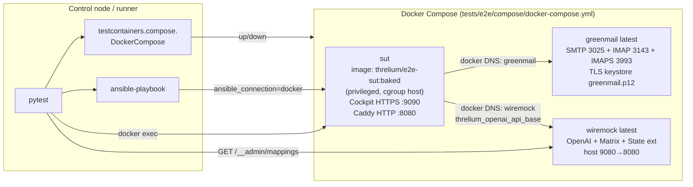

# Threlium — тестирование: e2e через Testcontainers и Docker Compose

Документ описывает e2e-контур Threlium: harness, режимы прогона, что проверяется сегодня. Поведение самого плейбука (классы операций, ограничения, тег **refresh**) — в [`PLAYBOOK.md §2.1`](PLAYBOOK.md#21-текущее-поведение-повторного-прогона-и-его-границы); здесь — только тестовые последствия.

**Статус.** В репозитории реализованы harness и **один** сквозной L0-smoke (`test_mailflow_e2e.py`) — это заготовка, а не регрессионная матрица. Матрица сценариев FSM (`cli_exec`, `subagent_intent`/`subagent_end`, HITL, `thread_memory`/`global_memory`, ошибки, мульти-каналы) будет наращиваться **поверх того же harness'а** — через новые каталоги JSON-маппингов в [`tests/e2e/wiremock_stubs/<сценарий>/`](../tests/e2e/wiremock_stubs/) (§4.4), **контекст WireMock State Extension** на прогон (сид из pytest + `state-matcher` в стабах) и pytest-регистрацию через Admin API без замены инфраструктуры.

**Источники истины.**

| Документ                                 | Зона ответственности                                                                                           |
| ---------------------------------------- | -------------------------------------------------------------------------------------------------------------- |
| [INDEX.md](INDEX.md)                     | Master-контракт INDEX: §1 storage model (union root `stages/`, нет `archive/Maildir`), §4 fdm terminating insert ([якорь](INDEX.md#4-mailfilter-terminating-insert)), §5.5.3 `nm_settle()`, §5.6 universal error handling, §5b LightRAG-воркер, §11 dependencies. e2e-инварианты ниже выводятся из этой модели. |
| [ARCHITECTURE.md §1.3](ARCHITECTURE.md#13-политика-тестирования) | Политика: единственный pytest-слой — e2e в `tests/e2e/`; изоляция WireMock — [E2E_ISOLATION.md](E2E_ISOLATION.md). |
| [PLAYBOOK.md §2.1](PLAYBOOK.md#21-текущее-поведение-повторного-прогона-и-его-границы) | Классы операций (A/B), ограничения повторного прогона, тег **refresh**. |
| [ORCHESTRATION.md](ORCHESTRATION.md)     | Контракт *Serial-per-thread, parallel-across-threads*: `threlium-dispatch.sh` + `threlium-work@<stage>:<thread_id>.service` как per-thread мьютекс + долгоживущий `threlium-engine` (включая RAG-loop для LightRAG). Обоснование shared SUT + параллельных xdist-воркеров: [§1 инварианты](ORCHESTRATION.md#1-целевые-инварианты), [§2 thread_id как ключ](ORCHESTRATION.md#2-notmuch-thread_id-как-ключ-инстанса-воркера), [§3 параллельность между тредами](ORCHESTRATION.md#3-механизм-post-insert-hook--dispatch-script). |
| [MESSAGES.md](MESSAGES.md), [SUBAGENT_TABLE.md](SUBAGENT_TABLE.md), [MEMORY_TABLE.md](MEMORY_TABLE.md) | Инварианты FSM/памяти и обработки ошибок ([`INDEX.md` §5.6](INDEX.md#56-universal-error-handling-в-runnersworkerpy)), которые потенциально покрываются e2e.                    |

> **Терминологическая ремарка.** Слово «archive» в этом документе встречается в **двух омонимичных** значениях, и их нельзя путать:
>
> 1. **Bundle archive** (`*.tar.gz` post-deploy, `community.general.archive`, `cleanup_stale_bundle_archives`, `ansible/artifacts/`) — упаковка артефактов установки на control node после прогона плейбука. Это файлы для разбора/CI, не часть рантайма Threlium.
> 2. **Mail archive (старая схема)** — выделенный `archive/Maildir/` под отдельным `notmuch database.path`, в который раньше писал `cc "$ARCHIVE"` через **fdm**/MDA. **Сейчас этого контура нет**: union notmuch root указывает на `stages/`, каждое письмо durable хранится в `stages/<stage>/Maildir/cur/<id>:2,S` после `nm_settle()` ([`INDEX.md` §1](INDEX.md#1-motivation), [`MESSAGES.md` §1](MESSAGES.md#1-раскладка-хранения)). Все assert-функции и хелперы вида `*_archive*` исторически называют именно это — их семантика заменяется на «весь тред в union notmuch index'е поверх `stages/`».
>
> Bundle-archive-логика остаётся как есть; mail-archive-проверки переинтерпретируются на union index.

---

## 1. Что и почему тестируется

**Политика** ([ARCHITECTURE.md §1.3](ARCHITECTURE.md#13-политика-тестирования)): **единственный** автоматизированный pytest-gate — **e2e** в `tests/e2e/` (маркеры `e2e`, `e2e_live`, при необходимости `mailflow`). Отдельных каталогов `tests/unit/` и `tests/integration/` нет. Изоляция параллельных сценариев на общем WireMock — по [E2E_ISOLATION.md](E2E_ISOLATION.md) (State Extension + ``X-Threlium-Route`` + при необходимости ``live_lane``).

**Почему e2e главный:** поведение системы эмерджентно (composite из **`fdm`** + `~/.fdm.conf` (`match` + `pipe` → `notmuch insert... && threlium-dispatch.sh`), `notmuch`, FSM, **RAG-loop внутри** `threlium-engine`, LLM); единица изоляции в проде — связка **submit** `threlium-work@` ↔ долгоживущий **`threlium-engine`** (`threlium.runners.engine`; handler стадии — **in-process** в движке); инварианты оркестрации (`serial-per-thread`, форк треда, fdm `insert && dispatch`, `threlium-sweep@` backstop) надёжнее всего видны при живом `systemd --user` в SUT.

**Что реализовано сегодня (e2e):** compose-harness (`sut` + `greenmail` + `wiremock`); pytest-фикстуры с polling'ом и диагностикой; стратегия baked-образа SUT; **WireMock** как **единственный** HTTP-mock для OpenAI-совместимых вызовов из SUT (`threlium_openai_api_base` → `http://wiremock:8080`; суффиксы `/chat/completions`, `/embeddings` — см. `wiremock_client`); **WireMock State Extension** (JAR в compose, §4.4) + статические `*.json` сценария только в `tests/e2e/wiremock_stubs/<тест>/` (без общего каталога маппингов между тестами); лидер compose регистрирует инфраструктурный [`compose_bootstrap/`](../tests/e2e/wiremock_stubs/compose_bootstrap/) (`recordState` + embeddings readiness, `upsert_wiremock_compose_bootstrap_stubs`); литералы и `stub_tag` задаются в **соответствующем** модуле `tests/e2e/test_*.py` (те же строки, что передаются в `upsert_wiremock_mapping_directory` как `stub_tag` для `metadata.threlium_e2e_stub_tag`); в `tests/e2e/mock_templates/` и `register_from_template` — только **наследие**, новые сценарии — только JSON в git (§4.4.2); SMTP-инъектор; pytest-файлы — `test_greenmail_delivery_e2e.py` (GreenMail + IMAP + Maildir smoke + стабы `test_greenmail_delivery_e2e/` на общем WireMock, `e2e_live`), `test_mailflow_e2e.py` (L0 happy-path на стабах, `e2e_live` + `mailflow`), `test_matrix_wiremock_live_e2e.py` (Matrix + OpenAI на WireMock, `e2e_live`; Ansible в этом тесте не вызывается), `test_reasoning_litellm_mock_live.py` (изолированная стадия reasoning против WireMock).

**Knowledge corpus:** после правок в `ansible/roles/threlium/files/knowledge/` прогонять `ansible/roles/threlium/files/scripts/verify_knowledge_snippets.py` (`.venv`, проверка JSON-примеров `formal_reason` через тот же pipeline, что `formal_reason.py`).

**Дополнительные mailflow-сценарии (2026-05):** каждый модуль — свой каталог [`tests/e2e/wiremock_stubs/<имя_модуля>/`](../tests/e2e/wiremock_stubs/) и уникальный `stub_tag` ([`E2E_ISOLATION.md`](E2E_ISOLATION.md)): `test_memory_query_e2e.py`, `test_formal_reason_chain_e2e.py`, `test_formal_reason_violation_e2e.py`, `test_formal_reason_inference_e2e.py`, `test_formal_reason_query_e2e.py`, `test_summarize_context_e2e.py`, `test_reasoning_litellm_context_trim_e2e.py`, `test_cli_discovery_chain_e2e.py`, `test_unified_context_roles_e2e.py`, `test_fsm_handler_failure_e2e.py`, `test_response_table_e2e.py`, `test_orphan_skip_e2e.py` (без WM), `test_imap_checkpoint_resume_e2e.py` (act1 — минимальные стабы в `test_imap_checkpoint_resume_e2e/`, act2–3 — IMAP/checkpoint), `test_knowledge_bootstrap_live_e2e.py`, `test_lightrag_index_filter_e2e.py` (селективная индексация LightRAG: `ingress@` → `lightrag_indexed`, SERVICE/не-whitelist стадии не индексируются; **переиспользует** стабы `test_mailflow_e2e/`).

**Что не реализовано** (план, не код): полная матрица HITL/subagent IRT-depth, тесты оркестрации и гонок (dispatch ↔ LightRAG `cur/`-only, [`INDEX.md` §5b](INDEX.md#5b-lightrag-worker)), санкционированные узкие теги плейбука кроме **deploy**/**refresh**, тесты ограничений повторного прогона из [PLAYBOOK.md §2.1.4](PLAYBOOK.md#214-известные-ограничения--то-что-действительно-не-покрывается-ни-a-ни-b).

Формулировки «e2e проверяет X» ниже — это контракт **инфраструктуры** (harness умеет дождаться X, помочь с assert'ом и диагностикой), а не «тест на X уже написан». Новый тест добавляется файлом в `tests/e2e/`; изоляция WireMock на общем инстансе — **контекст State** (имя контекста = b62-wire ``X-Threlium-Route`` как после email-моста для пары ``From`` + inner ``Message-ID`` инъекции — [`e2e_smtp_inject_ingress_route_wire_for_message_id`](../tests/e2e/helpers.py), сид/teardown через [`wiremock_client.py`](../tests/e2e/wiremock_client.py), §4.4) **плюс** отдельный каталог `wiremock_stubs/<имя_теста>/`, **фиксированный** `stub_tag` и литералы в том же pytest-модуле, согласованные с JSON и входом теста. **Запрещено** собирать или патчить **тела маппингов** из pytest (временные каталоги, `replace` по JSON, Jinja2 перед Admin API, Python-сборка `mapping` под сценарий): маппинги живут в git как `*.json`. **Разрешено** в рантайме: `POST` сида состояния и `DELETE` контекста State, `upsert`/`register` **уже готовых** JSON с диска, встроенный response-templating в ответах (§4.4). При необходимости `-e threlium_reasoning_model=…` в ansible. Дефолт [`group_vars/e2e.yml`](../ansible/group_vars/e2e.yml) уже направляет SUT на `wiremock`; отдельного compose-сервиса LiteLLM proxy в репозитории нет.

---

## 2. Архитектура harness'а



| Слой                       | Роль                                                                                                                                                                                              |
| -------------------------- | ------------------------------------------------------------------------------------------------------------------------------------------------------------------------------------------------- |
| **pytest + conftest.py**   | Жизненный цикл session-fixture `compose_stack`, выбор образа SUT, диагностика при падении.                                                                                                         |
| **Testcontainers**         | `DockerCompose` как контекстный менеджер — единая точка `stop()`. В python-реализации **нет Ryuk**; хвосты аварийных прогонов подбирает `stop_stale_compose_projects` / `discover_compose_projects_for_e2e_compose_dir` (preflight: все проекты из каталога compose).     |
| **Docker Compose**         | [`tests/e2e/compose/docker-compose.yml`](../tests/e2e/compose/docker-compose.yml) — `sut`, `greenmail`, `wiremock`.                                                                                 |
| **Ansible**                | `run_e2e_site_playbook` (`wipe_sync`) — только `--tags refresh` (harness без полного deploy). Запекание — полный `site.yml` в `bake_e2e_sut_image.sh` (чистка `never+refresh` при обычном прогоне не выполняется). |
| **WireMock (OpenAI/Matrix)** | Сервис `wiremock` (`wiremock/wiremock:latest`, **9080**→8080, `--global-response-templating`). JAR **wiremock-state-extension** в [`docker-compose.yml`](../tests/e2e/compose/docker-compose.yml) → `/var/wiremock/extensions/` (см. [`compose/wiremock/README.md`](../tests/e2e/compose/wiremock/README.md)). SUT: `http://wiremock:8080` (`threlium_openai_api_base`). Pytest: `wait_for_wiremock_ready`, Admin API (`wiremock_client`: `upsert_wiremock_mapping_directory`, `upsert_wiremock_compose_bootstrap_stubs`, `wiremock_state_seed_context`, `wiremock_state_seed_live_lane`; полный сброс State Store — `wiremock_state_reset_all_contexts` в `pytest_sessionfinish`, см. [`docs/E2E_ISOLATION.md`](./E2E_ISOLATION.md)); стабы — JSON в `wiremock_stubs/<тест>/`; при подъёме стека — `wiremock_stubs/compose_bootstrap/`; assert по журналу — `stub_tag` + `GET /__admin/requests`, хелперы в `helpers.py`. |
| **GreenMail**              | `greenmail/standalone:latest` (без фиксации тега); `./greenmail.p12` → `/home/greenmail/greenmail.p12`; в `GREENMAIL_OPTS`: `setup.test.all`, `hostname=0.0.0.0`, `users=test:secret@localhost,pytest:secret@localhost`, `tls.keystore.file`/`password`. Порты +3000: SMTP **3025**, plain IMAP **3143** (pytest с хоста), **IMAPS 3993** для моста в SUT; инвентарь: [`e2e.yml`](../ansible/group_vars/e2e.yml) (`threlium_fetchmail_imap_port`, TLS, `threlium_imap_ssl_verify`).                                                             |

**Shared Compose + filelock (hintgrid-модель).** По умолчанию e2e запускается **однопоточным** `pytest` / `pytest tests/e2e` — один процесс, shared compose и filelock работают (лидер = единственный участник). Параллельный стресс / контракт параллельности — явно `pytest tests/e2e -n 8` (или иной `-n>1`), как отдельная команда в CI или локально. **Не** указывать `addopts = -n 8` в `pyproject.toml`. Все xdist-воркеры делят **один** compose-проект: первый воркер под `FileLock` поднимает стек и записывает координационные файлы (`ready.flag` + `runtime.json`) в стабильный каталог под `$TMPDIR` (функция `e2e_compose_coord_paths()` в `helpers.py`, привязка к корню checkout); остальные воркеры читают `project_name` и `discover_runtime`. Имя проекта: `threlium_e2e_shared_{token_hex(3)}` — **без** суффикса воркера.

**Сброс «мёртвых» координаторов.** Если координационные файлы ещё есть, а соответствующий compose-проект уже остановлен (например после ручного `docker compose down`), лидер при следующем `pytest` проверяет через Docker API, что для записанного `project_name` все сервисы из набора (`sut`, `greenmail`, `wiremock`) имеют **running**-контейнеры; иначе удаляет оба файла и выполняет обычный путь лидера (новый проект, `compose up`). В stderr печатается строка `coordinator stale (no healthy compose stack), resetting shared flags`. Ручное удаление файлов в каталоге координаторов (`e2e_compose_coord_dir()`) по-прежнему допустимо.

**Controller hint file.** После успешного старта стека контроллер (или единственный процесс) записывает `threlium_e2e_<hash>.json` в `$TMPDIR` — collision-safe по хешу `cwd`. Содержимое: `project_name`, `pid`, `cwd`, `started_at` (ISO-8601 UTC, момент готовности стека), `runtime_json` (абсолютный путь к `e2e_shared_runtime.json` или `null`). Файл удаляется в `pytest_sessionfinish`. При xdist путь `runtime_json` может указывать на ФС воркера-лидера — для ручного `cat` ориентироваться на машину, где крутился pytest; для автоматики достаточно `project_name`.

**Изоляция сценариев и параллельный e2e.** Не отдельный compose на воркер, а **уникальный notmuch-тред** и однозначные почтовые якоря на ингест (разные треды при `-n>1`). Для **WireMock** на общем инстансе: контекст State для оси LiteLLM — **тот же b62-wire**, что уходит в ``X-Threlium-Route`` (сид ``wiremock_state_seed_context`` с ключом из [`e2e_smtp_inject_ingress_route_wire_for_message_id`](../tests/e2e/helpers.py) для того же inner ``Message-ID`` и ``From``, что в SMTP-инъекции, §4.4) плюс литералы и `stub_tag` в модуле того же сценарного теста и в `*.json`. Нормативный guard по ``GET /__admin/requests/unmatched`` — **глобальный**, без фильтра по заголовкам ([`pytest_runtest_call`](../tests/e2e/conftest.py) до и после тела теста); сам хук guard локами не сериализуют; единственный межпроцессный ``FileLock`` разрешён только внутри [`wiremock_unmatched_request_entries`](../tests/e2e/wiremock_client.py) вокруг этого Admin GET (иначе 500 WireMock при параллельных опросах). При ``pytest -n N`` параллельные воркеры одновременно бьют в один WM — каждый запрос должен матчиться своими стабами, иначе появится unmatched и любой воркер упадёт на assert. FSM рассчитан на *thread-parallel* обработку (нормативно: [ORCHESTRATION.md §1–§3](ORCHESTRATION.md#1-целевые-инварианты)); параллельный прогон **проверяет** этот контракт. См. [MESSAGES.md §2](MESSAGES.md#2-канонизация-идентификаторов-на-границах-системы) для правил уникальных `Message-ID`.

**WireMock при `pytest -n>1`.** На общем инстансе не вызывать [`wiremock_state_reset_all_contexts`](../tests/e2e/wiremock_client.py), не чистить весь журнал через [`reset_request_journal`](../tests/e2e/wiremock_client.py) (`DELETE /__admin/requests`) и не делать глобальный `DELETE /__admin/mappings` из кода сценариев — затронутся чужие воркеры (bootstrap для Matrix/sync и state-setup исчезнут). Исключение для инфраструктуры — один координированный cold reset на инвокацию pytest ([`_e2e_wiremock_journal_reset_once`](../tests/e2e/conftest.py): остановка user-pipeline на SUT, [`reset_non_bootstrap_wiremock_mappings`](../tests/e2e/wiremock_client.py) — удаление только не-bootstrap маппингов по тегу, журнал, Store State, Maildir, upsert `compose_bootstrap/`, запуск engine). Глобальный сброс Store State между тестами не делайте из сценариев (function-teardown — см. prepare/teardown). Модули, которые полагаются на ручной полный сброс WM без координатора, прогоняйте **serial** (`pytest -n0` на файл) либо с уникальным `correlation_key` и без глобальных reset'ов.

**Запрет `xdist_group("exclusive")`.** Маркер `pytest.mark.xdist_group("exclusive")` и любая exclusive-сериализация e2e-тестов через pytest-xdist **запрещены** — это политика проекта. Такой подход противоречит цели одновременно нагружать и xdist-воркеры, и несколько notmuch-тредов в SUT. При проблемах с гонками нужно расширять якоря и хелперы, а не отключать параллельность.

**Два уровня почтовых проверок (shared GreenMail INBOX).**

При `-n>1` все xdist-воркеры делят один GreenMail (входящие инъекции — INBOX `test`/`secret`; ответ агента по умолчанию — INBOX `pytest`/`secret`, см. `THRELIUM_E2E_GREENMAIL_REPLY_USER`); IMAP bridge в SUT забирает письма из учётки fetchmail без фильтрации по тестам. Каждый assert, связанный с почтой, должен различать «своё» от «чужого» по якорям.

- **Уровень 1 — инфраструктура (обязателен для любого теста, шлющего письмо).** Уникальные `Message-ID`/`Subject` → SMTP inject → `wait_for_greenmail_inbox_message` по якорю (present) → `wait_for_greenmail_inbox_message_gone` по тем же якорям (gone). Цель: GreenMail → IMAP bridge **забрал именно то письмо**, которое отправил тест. Ответ агента не обязателен — система может быть сломана, но инфраструктура доставки/забора должна отличать «своё» от чужого.
- **Уровень 2 — полный контур продукта (поверх уровня 1).** Дополнительно: notmuch, WireMock (HTTP OpenAI), `wait_for_greenmail_user_reply` с привязкой к входному потоку (`raw_id=` — inner исходного `Message-ID` SMTP-инъекции, совпадает с первым токеном `In-Reply-To` на ответе в ящике `pytest@`; см. `MESSAGES.md` §2 и `egress_email`). Когда тест явно проверяет исходящий ответ агента — хелпер отбирает ответ по **`In-Reply-To`** (и при необходимости по маркерам subject/body), а не по служебному заголовку Route на внешнем SMTP (его снимает `egress_email` перед `msmtp`). Тесты уровня 1 хелпер ответа **не обязаны** вызывать.

**Корреляция ответа по `In-Reply-To`.** Финальный email к пользователю содержит первый токен `In-Reply-To`, восстановленный из `reply_target_rfc_message_id` маршрута — это **исходный внешний** `Message-ID` входящего письма ([`MESSAGES.md` §2](MESSAGES.md#2-канонизация-идентификаторов-на-границах-системы)). Для e2e SMTP-инъекции передайте в `wait_for_greenmail_user_reply` тот же inner, что в `--message-id` / фикстуре (`raw_id`). Для WireMock State и заголовка на LiteLLM используйте [`e2e_smtp_inject_ingress_route_wire_for_message_id`](../tests/e2e/helpers.py) от того же inner ``Message-ID`` и ``From``. Строка [`e2e_smtp_inject_ingress_route_wire()`](../tests/e2e/helpers.py) (без ``reply_target`` в JSON) — только для отладки b62 «только origin», **не** как ключ State для реальной инъекции и **не** как критерий письма в GreenMail.

**Политика teardown (reuse).** `pytest_sessionfinish` **не** вызывает `compose down` — стек остаётся поднятым для повторных прогонов и ручной отладки. Явный `compose down` — по opt-in env `THRELIUM_E2E_COMPOSE_DOWN=1`. Очистка — CI-агент или разработчик. Следующий прогон: preflight снимает **все** compose-проекты из `tests/e2e/compose` (любой `-p`, не только `threlium_e2e_*`); если остановлен именно текущий проект из `runtime.json`, координаторы сбрасываются автоматически (см. абзац «Сброс мёртвых координаторов» выше).

**Ожидание сервисов — `tenacity`.** Все poll'ы (`wait_for_greenmail_ready`, `wait_for_notmuch_message`, `wait_for_wiremock_ready` и т.д.) реализованы через [`tenacity`](https://tenacity.readthedocs.io/) (`@retry` / `wait_exponential` / `stop_after_delay`) — обёртки `poll_until` (fixed) и `poll_until_backoff` (exponential) в `helpers.py`.

**`site.yml` на живом `sut`.** Сценарные e2e-тесты с маркером `e2e_live` **не** вызывают `ansible-playbook`. Идемпотентный прогон `site.yml` (или ручной деплой) — до прогона сценариев, если работаете с **уже поднятым** стеком без свежего rebake, например `pytest -n0 tests/e2e/wipe_sync.py` или отдельный CI-шаг; **после** `wipe_bake` отдельный `wipe_sync` не нужен (полная выкатка уже в bake — §3). Только код `scripts/threlium` и `prompts/` на уже запущенном SUT без плейбука — см. [FSTS_SYNC.md](FSTS_SYNC.md).

**Миграция со старой раскладки.** Baked-образ или данные, собранные до введения каталога `~/threlium/{data,agent}` (например артефакты под `/root/...` или старый `THRELIUM_HOME`), **автоматически не переносятся**. Нужен полный rebake (`pytest -n0 tests/e2e/wipe_bake.py` / ручной bake) либо ручная миграция данных и конфигов на новые пути и повторный прогон плейбука.

**Preflight (лидер перед `compose up`):**

1. `stop_compose_projects_for_e2e_compose_dir()` (алиас `stop_stale_compose_projects`) — `docker compose down --remove-orphans --volumes` всем проектам из каталога compose (по лейблам Compose v2); падаем, если что-то осталось.
2. `cleanup_stale_bundle_archives()` — старые `threlium-bundle-*.tar.gz` в `ansible/artifacts/`.

**Prereq — hard failure, не skip.** Отсутствие Linux / Docker daemon / extras `[e2e]` даёт `pytest.fail(..., pytrace=False)` в `compose_stack` у тестов, которые эту фикстуру запрашивают. Прятать дефект среды за зелёным skip'ом проект не разрешает. Без Docker автоматизированного pytest-gate для продукта нет — остаются статический анализ (`mypy`/`pyright`/`ruff`) и ручная проверка.

---

## 3. Режимы прогона

**Канон CI / полной подготовки после rebake:** `pytest -n0 tests/e2e/wipe_bake.py` → `pytest tests/e2e` (при необходимости с `-n`). Отдельный `pytest -n0 tests/e2e/wipe_sync.py` **сразу после** `wipe_bake` **не** нужен: bake уже делает полную свежую выкатку `site.yml` в образ и поднимает консистентный SUT. `wipe_sync` остаётся для случая **уже поднятого** контейнера без rebake — только harness (**`--tags refresh`**), без повторного полного deploy. Файлы `wipe_*.py` **не** входят в дефолтную коллекцию `pytest tests/e2e` (имена вне `test_*.py`); не расширяйте в `pyproject.toml` шаблон `python_files` до `*.py`, иначе wipe снова смешаются со сценариями.

**Дефолтный прогон — однопоточный** `pytest tests/e2e` (без `-n`): shared compose и filelock работают, единственный процесс — всегда лидер. Параллельный стресс / контракт параллельности — **явно** `-n 8` (или иной `-n>1`), как отдельная команда в CI или локально. `addopts = -n 8` в `pyproject.toml` **не** указывать.

| Команда                                                 | Что происходит                                                                                                                                                                 | Когда                                                             |
| ------------------------------------------------------- | ------------------------------------------------------------------------------------------------------------------------------------------------------------------------------ | ----------------------------------------------------------------- |
| `pytest tests/e2e`                                      | Autouse поднимает или присоединяет shared compose (`compose_stack` в `conftest.py`: при отсутствии координаторов — attach к уже healthy стеку или preflight + `compose up`). Сценарные тесты с ``e2e_live`` ждут уже развёрнутый ``sut`` (часто после ``wipe_sync`` или ручного compose; после свежего ``wipe_bake`` отдельный ``wipe_sync`` не обязателен — §3). | Ежедневная работа, правки FSM / тестов.       |
| `pytest tests/e2e -n 8`                                 | Параллельный стресс: 8 xdist-воркеров на один shared compose. Проверяет thread-parallel контракт FSM. | Стресс-тест параллельности, CI.                                   |
| `pytest -n0 tests/e2e/wipe_bake.py`                     | Полный bake образа SUT (полный `site.yml` без `--skip-tags`) + сброс координаторов + `compose down`/`up` + post-up (см. модуль). | Релиз, правки `site.yml` / ролей / apt/pip-зависимостей / bootstrap-образа. |
| `pytest -n0 tests/e2e/wipe_sync.py`                     | Только harness: `ansible-playbook … --tags refresh` (без полного deploy). | Уже поднятый `sut` без rebake: очистка mail-state + рестарт user-units. **Не** дублирует кодовый sync — для кода см. [FSTS_SYNC.md](FSTS_SYNC.md). |
| `pytest tests/e2e -n 1`                                 | Тот же кодпуть, один воркер `gw0` — всегда лидер. Для пошаговой отладки.                                                                                                      | Отладка единичного теста.                                          |

**Инвариант.** Запекание — полный деплой в **отдельном** bake-контейнере: только `wipe_bake.py` (или env `THRELIUM_E2E_REBUILD_BAKED_IMAGE=1` в сессии с тестами, где лидер `compose_stack` делает `ensure_e2e_sut_image_exists(force_rebuild=True)`); `site.yml` внутри bake не пропускает тег `refresh` глобально — задачи **`never+refresh`** (чистка) при обычном прогоне **не** выполняются. ``pytest tests/e2e`` поднимает или переиспользует compose-инстанс ``sut`` с baked-образом. Отдельный ``wipe_sync`` (**только** ``--tags refresh``) на живом контейнере — **вне** сценарных live-тестов ([PLAYBOOK.md §2.1](PLAYBOOK.md#21-текущее-поведение-повторного-прогона-и-его-границы), ``wipe_sync.py``).

---

## 4. Компоненты harness'а

### 4.1. Compose-стек

Ключевые решения в [`tests/e2e/compose/docker-compose.yml`](../tests/e2e/compose/docker-compose.yml):

- **`sut` — privileged + cgroup host + mount `/sys/fs/cgroup`.** Нужно для `loginctl enable-linger`, `systemctl --user`, `.path`-юнитов с inotify и транзитивных cgroup'ов ([ORCHESTRATION.md §3](ORCHESTRATION.md#3-механизм-post-insert-hook--dispatch-script), [§5](ORCHESTRATION.md#5-гонки-восстановление-лимит-параллелизма)).
- **Bootstrap bake: Ubuntu 24.04 (Noble).** Образ `geerlingguy/docker-ubuntu2404-ansible`; итоговый baked — полный `site.yml` на этой базе. MDA в контейнере — **`fdm`** из apt роли; нормативная доставка — [ARCHITECTURE.md §8.4](ARCHITECTURE.md#84-доставка-maildrop).
- **Динамический host-port** (`"3025"`, а не `"3025:3025"`). Реальный порт pytest находит через `_mapped_port`. Снимает конфликт параллельных запусков.
- **Веб-архив:** Cockpit на SUT слушает HTTPS :9090 (compose `9090:9090`); Caddy — HTTP :8080 в e2e (без TLS на краю). Приёмка playbook с control node бьёт в корень края Caddy (прокси на Cockpit) и в `/webmail/`. Пакет Cockpit через symlink `~/.local/share/cockpit/<пакет>`. `cockpit_origins_extra` в [e2e.yml](../ansible/group_vars/e2e.yml). См. [defaults](../ansible/roles/threlium/defaults/main.yml) и §6.4.
- **`greenmail`:** TLS через PKCS#12 [`greenmail.p12`](../tests/e2e/compose/greenmail.p12) (SAN `DNS:localhost`, `DNS:greenmail`, `IP:127.0.0.1`; монтирование — [`docker-compose.yml`](../tests/e2e/compose/docker-compose.yml)). Мост в SUT подключается по **IMAPS :3993** с выставленными в [e2e.yml](../ansible/group_vars/e2e.yml) `threlium_fetchmail_tls` / `threlium_imap_ssl_verify`; pytest-хелперы с хоста для INBOX используют plain **3143**.

**Пересборка `greenmail.p12` / `greenmail.crt` (при смене SAN или срока):** из каталога `tests/e2e/compose/` выполнить `openssl req -x509 -newkey rsa:4096 -sha256 -days 3650 -nodes -keyout greenmail.key -out greenmail.crt -subj "/CN=localhost" -addext "subjectAltName=DNS:localhost,DNS:greenmail,IP:127.0.0.1"`, затем `openssl pkcs12 -export -inkey greenmail.key -in greenmail.crt -out greenmail.p12 -name greenmail -passout pass:changeit` (пароль согласовать с `GREENMAIL_OPTS`). Приватный ключ в репозиторий не коммитить.

### 4.2. Pytest-фикстуры (`tests/e2e/conftest.py`)

| Фикстура                   | Скоуп     | Что делает                                                                                                                                                                                     |
| -------------------------- | --------- | ---------------------------------------------------------------------------------------------------------------------------------------------------------------------------------------------- |
| `compose_stack`            | session   | Shared compose: под `FileLock` лидер при необходимости сбрасывает «мёртвые» `ready.flag`/`runtime.json` в стабильном каталоге под `/tmp`, затем либо **attach** к уже healthy стеку (`discover_live_e2e_project_name`), либо prereq-check → preflight cleanup → `ensure_e2e_sut_image_exists` → `DockerCompose.start()` → write `runtime.json` + `ready.flag`. Фолловеры — read `project_name` из JSON. Общий путь: `discover_runtime` → `wait_for_wiremock_ready` (tenacity). Для тестов в `tests/e2e/test_*.py` фикстура подтягивается **autouse**. После `yield` стек **не** гасится (reuse). |
| `mailflow_processed_stack` | function (`test_mailflow_e2e.py`) | SMTP inject, ожидание IMAP \\Seen и FSM; якоря — ``Message-ID`` и correlation/route (notmuch/GreenMail без subject); ``deployed_stack`` — только live ``project_name``. |

### 4.3. Helpers (`tests/e2e/helpers.py`)

Слой драйвера (~1600 строк). Функциональные группы:

| Группа                           | Ключевые функции                                                                                                         |
| -------------------------------- | ------------------------------------------------------------------------------------------------------------------------ |
| Runtime и compose-обвязка        | `discover_runtime`, `e2e_shared_compose_stack_is_healthy`, `_mapped_port`, `_compose_container`, `service_exec`, `compose_logs`                                  |
| SUT image strategy               | `resolve_e2e_sut_image`, `ensure_e2e_sut_image_exists`, `_run_bake_for_e2e_sut_image`, `e2e_rebuild_baked_image_requested` |
| Cleanup                          | `discover_compose_projects_for_e2e_compose_dir`, `stop_compose_projects_for_e2e_compose_dir` (`stop_stale_compose_projects`), `cleanup_stale_bundle_archives`                                                            |
| Polling (tenacity)               | `poll_until` (fixed interval), `poll_until_backoff` (exponential) — фасады над `tenacity.Retrying` с progress-логированием каждые 15 с |
| GreenMail                        | `wait_for_greenmail_ready`, `wait_for_greenmail_inbox_message(_host)`, `wait_for_greenmail_inbox_message_seen_host`, `wait_for_greenmail_user_reply`                    |
| IMAP bridge (IDLE)               | ``wait_for_greenmail_inbox_message_gone_host`` — якорное письмо ушло из INBOX UNSEEN (мост обработал и сделал ``UID MOVE`` в ``imap_processed_folder``); ``wait_for_greenmail_inbox_message_seen_host`` (``\\Seen`` в INBOX) — legacy, неприменим при включённом MOVE    |
| Notmuch / Maildir                | `email_ingress_notmuch_id_inner` (inner после моста для `id:`), `wait_for_notmuch_message`, `assert_notmuch_thread_fully_in_stages` (тред целиком в union notmuch index'е поверх `stages/`), `mailflow_wait_fsm_maildir_activity` — **без** записи в notmuch/Maildir из тестов; см. §8 политика честности. |
| WireMock / OpenAI journal        | `assert_wiremock_mailflow_received_chat_completion_posts` (журнал Admin API: `POST /chat/completions` с `stub_tag` и якорем письма в теле)                      |
| Ansible                          | `run_e2e_site_playbook`, `ensure_e2e_ansible_collections`                                                                  |
| Диагностика                      | `dump_failure_artifacts`, `mailflow_pipeline_diag`, `mailflow_fsm_maildir_systemd_snapshot`                                |

**Константы контракта** (сознательные мосты между тестами и конфигом):

```python
E2E_BAKED_SUT_IMAGE = "threlium/e2e-sut:baked"
E2E_THRELIUM_USER = "threlium"
E2E_REMOTE_REPO_PATH = "/home/threlium/threlium/agent"
E2E_REMOTE_THRELIUM_HOME = "/home/threlium/threlium/data"
E2E_REMOTE_POSIX_HOME = "/home/threlium"
E2E_WIREMOCK_CONTAINER_PORT = 8080
E2E_FETCHMAIL_USER, E2E_FETCHMAIL_PASS = "test", "secret"
E2E_REPLY_SUBJECT, E2E_REPLY_BODY_SNIPPET = "e2e reply", "ok from llm-mock"
E2E_FSM_MAILBOX_STAGE_IDS = (...)  # синхронно с ansible/roles/threlium/vars/main.yml
```

### 4.4. WireMock: OpenAI HTTP mock (e2e)

**Compose.** Сервис `wiremock` — образ `wiremock/wiremock:latest`, хост **9080** → контейнер **8080**, флаг **`--global-response-templating`**. JAR **wiremock-state-extension** (standalone) монтируется в **`/var/wiremock/extensions/`** ([`docker-compose.yml`](../tests/e2e/compose/docker-compose.yml)); расширение подхватывается classpath официального образа. Детали, примеры и смоук — [`tests/e2e/compose/wiremock/README.md`](../tests/e2e/compose/wiremock/README.md), [`scripts/smoke_wiremock_openai.sh`](../tests/e2e/compose/scripts/smoke_wiremock_openai.sh).

**SUT и пути запросов.** SUT ходит на `http://wiremock:8080` по docker DNS (`threlium_openai_api_base` в [`ansible/group_vars/e2e.yml`](../ansible/group_vars/e2e.yml), `threlium_openai_api_key: e2e-test-key`). Клиент в приложении — `litellm` Python SDK с префиксом модели `openai/…`; запросы уходят на **`/chat/completions`** и **`/embeddings`** (без префикса `/v1/`, см. [`wiremock_client.py`](../tests/e2e/wiremock_client.py)). С хоста pytest порт — `_mapped_port("wiremock", E2E_WIREMOCK_CONTAINER_PORT)`.

**Регистрация и State.** (1) Инфраструктурный каталог [`wiremock_stubs/compose_bootstrap/`](../tests/e2e/wiremock_stubs/compose_bootstrap/) — `recordState` (публичный endpoint `/__threlium/e2e/state/setup`, см. [`000_e2e_state_setup.json`](../tests/e2e/wiremock_stubs/compose_bootstrap/000_e2e_state_setup.json) и [`wiremock_e2e_state_setup_post_url`](../tests/e2e/wiremock_client.py)) и embeddings readiness для probe; регистрируется через [`upsert_wiremock_compose_bootstrap_stubs`](../tests/e2e/wiremock_client.py) (лидер compose при подъёме стека; при ``pytest -n N`` — ``FileLock`` в [`e2e_compose_coord_dir`](../tests/e2e/helpers.py): общий каталог с **фиксированными** ``id`` в JSON, параллельный ``POST`` без блокировки даёт 422). (2) Все маппинги сценария — `wiremock_stubs/<имя_теста>/*.json` через [`upsert_wiremock_mapping_directory`](../tests/e2e/wiremock_client.py) (стабильный `id`: `wiremock_stub_id_for_e2e_stub_relpath`). В `metadata` мержится `threlium_e2e_stub_tag` ([`stub_tag_metadata`](../tests/e2e/wiremock_client.py)): по нему фильтруют журнал и чистят записи (`remove_wiremock_journal_by_stub_tag`, assert'ы в [`helpers.py`](../tests/e2e/helpers.py)). **Жизненный цикл контекста State:** `wiremock_state_seed_context` (POST на тот же публичный URL setup-стаба, тело `{"correlation_key": "<b62-wire X-Threlium-Route>"}`); в function-teardown сценария контекст **не** удаляют (поздний трафик SUT); полный сброс контекстов — `wiremock_state_reset_all_contexts` в [`pytest_sessionfinish`](../tests/e2e/conftest.py) (см. [`wiremock_client.py`](../tests/e2e/wiremock_client.py)).

**Matrix + OpenAI на одном инстансе.** Тот же `wiremock` обслуживает **Matrix Client-Server** (`/_matrix/…`) и OpenAI-совместимые пути — см. [`test_matrix_wiremock_live_e2e.py`](../tests/e2e/test_matrix_wiremock_live_e2e.py). **Telegram Bot API + OpenAI** — см. [`test_telegram_wiremock_live_e2e.py`](../tests/e2e/test_telegram_wiremock_live_e2e.py) (`THRELIUM_TELEGRAM_BOT_API_BASE` → WireMock, два каталога стабов: личка и forum topic).

**Статические JSON и Jinja2.** Нормативно маппинги — **только** закоммиченные JSON. Каталог [`mock_templates/`](../tests/e2e/mock_templates/) и `register_from_template` — **наследие**, для новых e2e не использовать (§4.4.2).

#### 4.4.x. Политика стабов: WireMock State Extension + журнал

**Изоляция на общем WireMock** (один compose, в т.ч. `pytest -n …`): расширение **WireMock State** — в JSON **`state-matcher`** с `hasContext`, где имя контекста совпадает с **конкретным строковым значением** заголовка ``X-Threlium-Route`` у запроса к LiteLLM (шаблон из заголовка — как в стабах, напр. ``{{request.headers.[x-threlium-route]}}``). Это **не** проверка «заголовок непустой»: набор идентификаторов инъекции известен заранее, pytest **до** SMTP и шагов SUT считает тот же b62-wire, что мост выведет на конверте из тех же ``From`` и inner ``Message-ID`` ([`e2e_smtp_inject_ingress_route_wire_for_message_id`](../tests/e2e/helpers.py)), и вызывает **`wiremock_state_seed_context`** с этим **ожидаемым** ключом; запрос с другим значением заголовка или без сида не получает совпадение контекста. Полный сброс контекстов — в [`pytest_sessionfinish`](../tests/e2e/conftest.py). Запросы **без тела** (например Matrix GET), где нельзя заякорить коррелятор в `bodyPatterns`, изолируйте через **`state-matcher`**, а не через размытые regex по URL.

**POST с телом** (`/chat/completions`, `/embeddings`): по-прежнему нужны **узкие** `bodyPatterns` и обязательные литералы (совпадающие между телом запроса и стабами git — задаются рядом со сценарием в `tests/e2e/test_*.py`, см. например [`test_mailflow_e2e.py`](../tests/e2e/test_mailflow_e2e.py)); не объединяйте «коррелятор **или** только модель» в одном широком `matches` — иначе матчится чужой трафик. **`stub_tag` в `metadata`** нужен для фильтрации **matched-журнала** в pytest и для `remove_wiremock_journal_by_stub_tag` / `remove_wiremock_mappings_by_stub_tag` (Admin API `remove-by-metadata`); **не** выбирает стаб на стороне WireMock. Записи в **`GET /__admin/requests/unmatched`** не чистятся `remove-by-metadata` по `stub_tag`; после старта прогона их не сбрасывают — только assert'ы (глобально пустой unmatched). Для ``/embeddings`` в mailflow используйте **фиксированный замкнутый набор** маппингов каталога `wiremock_stubs/test_mailflow_e2e/` (см. константы `MAILFLOW_E2E_STUB_DIR` в [`test_mailflow_e2e.py`](../tests/e2e/test_mailflow_e2e.py)), без широкого fallback на все тела. Сценарий [`test_mailflow_e2e.py`](../tests/e2e/test_mailflow_e2e.py) готовит WireMock через [`prepare_wiremock_scenario`](../tests/e2e/wiremock_client.py); финальный assert «ноль unmatched» — **глобально** по инстансу (см. [`assert_wiremock_mailflow_zero_unmatched`](../tests/e2e/helpers.py)).

**Не использовать** общие каталоги стабов и завышенный **`priority`**, чтобы перехватывать чужой трафик на общем инстансе — изоляция через **WireMock State** (`hasContext` по ``X-Threlium-Route``), при необходимости **`live_lane`**, и отдельный каталог на тест (или подшаг); норматив — [`E2E_ISOLATION.md`](E2E_ISOLATION.md). Внутри **одного** каталога порядок матчинга задаётся **state-matcher**, узкими **`bodyPatterns`** и заголовками — **`priority` в стабах не используется**. Вариативность **между** прогонами одного сценария — `{{randomValue …}}` в ответах (§«Динамические ответы» ниже).

#### 4.4.x1. WireMock State: канонический цикл изоляции

**Prepare / teardown.** [`prepare_wiremock_scenario`](../tests/e2e/wiremock_client.py): upsert каталога сценария, затем [`remove_wiremock_journal_by_stub_tag`](../tests/e2e/wiremock_client.py) с тем же `stub_tag`, что в `metadata` (только matched-журнал), затем [`wiremock_state_seed_context`](../tests/e2e/wiremock_client.py). [`teardown_wiremock_scenario`](../tests/e2e/wiremock_client.py) после теста **не** чистит журнал WireMock (matched остаётся для отладки). Контексты State в function-teardown не удаляют (поздний трафик SUT). Полный сброс контекстов — [`wiremock_state_reset_all_contexts`](../tests/e2e/wiremock_client.py) в [`pytest_sessionfinish`](../tests/e2e/conftest.py) **после** просушки user-scope workers и глобально пустого unmatched (таймаут `THRELIUM_E2E_SESSIONFINISH_DRAIN_SEC`, см. [`E2E_ISOLATION.md`](E2E_ISOLATION.md)). Очистка журнала (`reset_request_journal`) на этом этапе **запрещена** — стабы гарантированно покрывают весь трафик SUT пока State жив. Полный журнал через [`reset_request_journal`](../tests/e2e/wiremock_client.py) в **коде сценариев** на общем WM не вызывать. **Исключение:** один раз за **инвокацию** `pytest` (при `pytest -n N` — один раз на все воркеры через маркер в каталоге координаторов, см. [`e2e_compose_coord_dir`](../tests/e2e/helpers.py)) — [`_e2e_wiremock_journal_reset_once`](../tests/e2e/conftest.py): очистка Maildir SUT ([`e2e_flush_sut_fsm_maildirs`](../tests/e2e/helpers.py)), затем [`reset_request_journal`](../tests/e2e/wiremock_client.py) (matched **и** unmatched); затем проверка пустого unmatched; других автоматических полных сбросов журнала нет.

**Asserts по unmatched.** Нормативно журнал несматченных пуст **глобально**: [`assert_wiremock_unmatched_journal_empty`](../tests/e2e/wiremock_client.py) в [`pytest_runtest_call`](../tests/e2e/conftest.py) после setup фикстур — до и после **тела** каждого `tests/e2e/test_*.py`; опрос — [`assert_wiremock_zero_unmatched_requests`](../tests/e2e/wiremock_client.py) без `x_threlium_route_wire`; обёртка mailflow — [`assert_wiremock_mailflow_zero_unmatched`](../tests/e2e/helpers.py). Фильтр ``x_threlium_route_wire`` не заменяет этот guard (у несматченного запроса может не быть ``X-Threlium-Route``). **Запрещено:** любые локи харнесса вокруг guard'а **кроме** единственного Admin GET внутри [`wiremock_unmatched_request_entries`](../tests/e2e/wiremock_client.py); повторный полный сброс журнала WM после [`_e2e_wiremock_journal_reset_once`](../tests/e2e/conftest.py); истинный параллелизм опирается на корректные стабы и State, а не на сериализацию всего pytest-хука.

**Аудит `X-Threlium-Route` в прод-коде.** Исходящие completion/embedding к OpenAI-совместимому base URL проходят через [`merge_litellm_call_kwargs_and_log`](../ansible/roles/threlium/files/scripts/threlium/litellm_client.py) при включённой корреляции; прямых вызовов LiteLLM к тому же base URL в обход этого модуля в дереве [`ansible/roles/threlium/files/scripts/threlium/`](../ansible/roles/threlium/files/scripts/threlium/) не найдено (проверка `rg`: `from litellm import` указывает только на [`litellm_client.py`](../ansible/roles/threlium/files/scripts/threlium/litellm_client.py)).

**Связка с SUT:** идентификаторы моделей в рантайме — из ``threlium.yaml`` (секция ``settings.litellm``; Ansible подставляет в ``config/threlium.yaml``); стабы WireMock согласуют те же строки в теле POST, где это требуется.

#### 4.4.y. Режим HTTP-корреляции LiteLLM → WireMock

**Включение.** В типичном SUT для e2e режим уже включён: [`ansible/group_vars/e2e.yml`](../ansible/group_vars/e2e.yml) задаёт `threlium_e2e_litellm_route_correlation: true`, что попадает в окружение процесса как **`THRELIUM_E2E_LITELLM_ROUTE_CORRELATION`** и поле ``ThreliumSettings`` / ``settings.e2e.litellm_route_correlation``. Для локальных прогонов кода вне ansible: `export THRELIUM_E2E_LITELLM_ROUTE_CORRELATION=1` или в pytest — `monkeypatch.setenv("THRELIUM_E2E_LITELLM_ROUTE_CORRELATION", "1")`. По умолчанию роли ([`defaults/main.yml`](../ansible/roles/threlium/defaults/main.yml)) — **выключено** (не прод-трафик).

**Смысл.** Чтобы на общем WireMock отличать параллельные запросы LiteLLM, в каждый вызов (через [`merge_litellm_call_kwargs_and_log`](../ansible/roles/threlium/files/scripts/threlium/litellm_client.py)) подмешиваются **только** заголовки из белого списка: с конверта обрабатываемого письма — `From`, `To`, `Message-ID`, `In-Reply-To`; **`X-Threlium-Route`** в снимке корреляции берётся **только** из корня треда в notmuch ([`resolve_route_from_thread_oldest_route_tag`](../ansible/roles/threlium/files/scripts/threlium/ingress_route_resolve.py) / один сеанс READ и [`resolve_route_from_thread_oldest_route_tag_under_db`](../ansible/roles/threlium/files/scripts/threlium/ingress_route_resolve.py)), не с MIME конверта; плюс **`X-Threlium-Call-Site`** — источник вызова (`fsm`, `lightrag_index`, … — enum [`LitellmCallSite`](../ansible/roles/threlium/files/scripts/threlium/types/litellm_call_site.py)). Сборка с MIME — [`build_litellm_correlation_headers`](../ansible/roles/threlium/files/scripts/threlium/litellm_correlation_headers.py); при уже открытом индексе и `notmuch2.Message` (индексатор LightRAG) — [`build_litellm_correlation_headers_from_notmuch`](../ansible/roles/threlium/files/scripts/threlium/litellm_correlation_headers.py), без повторного парса Maildir ради тех же заголовков. Снимок живёт в **`threading.local`** ([`litellm_route_context`](../ansible/roles/threlium/files/scripts/threlium/litellm_route_context.py): `set` / `clear` на границах стадий, без стека). :func:`merge_litellm_call_kwargs_and_log` при флаге вызывает внутренний :func:`_merge_litellm_extra_route_headers`, который в [`litellm_client`](../ansible/roles/threlium/files/scripts/threlium/litellm_client.py) одним проходом переносит снимок TLS в ``extra_headers`` копии kwargs до вызова LiteLLM (параллельные embeddings / другой OS-поток клиента). В HTTP корреляции **нет** `X-Threlium-Thread-Id`, отдельного synthetic Message-ID и прочих лишних `X-Threlium-*` — см. белый список в [`litellm_correlation_headers.py`](../ansible/roles/threlium/files/scripts/threlium/litellm_correlation_headers.py) и сборку снимка в [`litellm_correlation_headers.py`](../ansible/roles/threlium/files/scripts/threlium/litellm_correlation_headers.py).

**Связка с LightRAG.** При включённом флаге эффективный **`insert_batch`** на RAG-loop всегда **1** (независимо от `THRELIUM_LIGHTRAG_INSERT_BATCH`), чтобы один проход `ainsert` соответствовал одному набору заголовков; [`run_rag_coroutine`](../ansible/roles/threlium/files/scripts/threlium/runners/lightrag.py) под тем же **`asyncio.Lock`**, что и [`drain_all_pending`](../ansible/roles/threlium/files/scripts/threlium/runners/lightrag.py), чтобы не было гонки TLS с индексацией. Обзор инварианта — [`INDEX.md` §5b](INDEX.md#5b-lightrag-worker); контроль корреляции заголовков и последовательности вызовов — mailflow/live e2e и стабы WireMock ([E2E_ISOLATION.md](E2E_ISOLATION.md)). **Ошибки `/embeddings` в upstream LightRAG:** при upsert векторного хранилища батчи вызывают embedding через `asyncio.gather` без подавления исключений — сбой провайдера обрывает вставку; на пути запроса (`kg_query`) пакетный pre-compute эмбеддингов часто обёрнут в `try/except` (warning и ветки с отсутствующими тензорами).

**Как пользоваться в тестах.**

1. **Полный mailflow / FSM в SUT:** ничего дополнительно не подмешивать из pytest — движок сам выставляет TLS на время handler'а стадии и indexer'а; для WireMock по-прежнему нужны сид State и `state-matcher` по **`X-Threlium-Route`** (§4.4.x), ключ сида тот же b62-wire, что даёт [`e2e_smtp_inject_ingress_route_wire_for_message_id`](../tests/e2e/helpers.py).
2. **Узкий тест, вызывающий `*.main(msg, …)` без обёртки FSM** (например живой reasoning против WireMock): выставить окружение с флагом корреляции; письмо должно быть в union-notmuch так, чтобы тред содержал корневое `tag:route` (как после [`e2e_smtp_inject_ingress_route_wire_for_message_id`](../tests/e2e/helpers.py)); обернуть вызов в `set_litellm_http_correlation(build_litellm_correlation_headers(msg, call_site=LitellmCallSite.FSM))` и `clear_litellm_http_correlation()` в `finally` — образец в [`test_reasoning_litellm_mock_live.py`](../tests/e2e/test_reasoning_litellm_mock_live.py).

#### 4.4.2. Константы сценария, State и запрет генерации маппингов из pytest

**SoT** для `*_STUB_DIR`, `*_STUB_TAG` и сценарных литералов, повторяемых в JSON и во входных данных теста — модуль соответствующего сценария (`tests/e2e/test_*.py`) рядом с каталогом `wiremock_stubs/<имя>/`. Поток **State** (сид, teardown, префикс контекста) — §4.4.x и [`wiremock_client.py`](../tests/e2e/wiremock_client.py).

**Запрещено:** собирать или патчить **JSON-маппинги** вне git (временные каталоги, `str.replace` / Jinja2 по файлам стабов перед Admin API, Python-сборка тела `mapping` под сценарий). Это не относится к **HTTP-вызовам** сида State и `DELETE` контекста — это не изменение маппингов.

**Разрешено:** (1) статические `*.json` в `wiremock_stubs/`; (2) шаблоны **ответов** WireMock (`{{randomValue …}}`, см. ниже); (3) новые константы и JSON-файлы в каталоге теста; (4) **`wiremock_state_*`**, `upsert_wiremock_compose_bootstrap_stubs`, `upsert_wiremock_mapping_directory` / `register_wiremock_mapping_directory` для файлов из репозитория.

**Корреляция между модулями** — State + узкие паттерны + отдельные каталоги; пример смежного smoke — [`test_greenmail_delivery_e2e/`](../tests/e2e/wiremock_stubs/test_greenmail_delivery_e2e) с `GREENMAIL_SMOKE_BODY_ANCHOR`.

#### Динамические ответы WireMock и взаимодействие с LightRAG

**Зачем динамика.** (1) **Дедуп мостов** (Matrix): одинаковые `event_id` / зафиксированный `next_batch` на каждом прогоне дают повтор ингеста в notmuch — ответы первого `/sync` и ответы `m.room.message` шаблонизируют через **Handlebars** (`"transformers": ["response-template"]`, плюс глобальный флаг compose): `{{randomValue …}}` в **строковых** полях `jsonBody` или целиком **`body`** как JSON-строка, если нужен динамический **ключ** объекта (например `rooms.join["!…:mock"]` в ответе `/sync` — в чистом `jsonBody` ключи не шаблонизируются).

**(2) Кэш LLM в lightrag-hku** на долгоживущем SUT: при повторном `aquery` с тем же текстом запроса и теми же извлечёнными keywords LightRAG может **не вызывать** HTTP backend (ключевые слова — `cache_type="keywords"`, финальный ответ — `cache_type="query"`, извлечение сущностей при индексе — промпт с **текстом чанка**). Тогда в журнале WireMock нет ожидаемых фаз (assert смотрит **исходящие** POST). Практика из сценария Matrix e2e: варьировать через стабы то, что входит в хэш/промпт — уникальный суффикс в ответе **планировщика enrich** (`080_chat_enrich_plan.json`), в JSON **keywords** (`090_chat_lightrag_keywords.json`), в теле **первого matrix-сообщения** (`compose_bootstrap/020_matrix_sync.json`); для chat/embeddings — **контекст WireMock State** (§4.4.x) и в `bodyPatterns` **`MATRIX_WIREMOCK_CORRELATION_ID` и модель как отдельные обязательные условия** (не объединяйте «коррелятор ИЛИ модель» в одном regex).

**WireMock OSS и metadata.** На образе `wiremock/wiremock:latest` в шаблонах ответа **не** работает подстановка вида `{{stub.metadata.…}}` (в ответе получается пустая подстановка). Для вариативности между запусками без смены констант между тестами опирайтесь на **`{{randomValue}}` в ответах** (см. выше); не добавляйте второй слой «шаблонизации до `upsert`» из pytest.

**Как live-тест идентифицирует успех при фиксированном корреляторе сценария.** См. [`test_matrix_wiremock_live_e2e.py`](../tests/e2e/test_matrix_wiremock_live_e2e.py): ожидание **PUT** `…/send/m.room.message` в журнале (по шаблону URL) и [`assert_wiremock_matrix_e2e_openai_coverage`](../tests/e2e/wiremock_client.py) по POST `/chat/completions` и `/embeddings` с фильтром по `stub_tag` и стабильным маркерам в телах запросов; изоляция сценария на общем инстансе — **State** (§4.4.x), а не по конкретному `event_id` комнаты. Для Telegram — [`test_telegram_wiremock_live_e2e.py`](../tests/e2e/test_telegram_wiremock_live_e2e.py): **POST** `…/sendMessage` и [`assert_wiremock_telegram_e2e_openai_coverage`](../tests/e2e/wiremock_client.py) (в т.ч. `message_thread_id` для forum topic).

**Новый сценарий — новые JSON-стабы.** Добавляйте маппинги под фактические фазы FSM и подстроки промптов; при необходимости отдельные модели в ansible (`-e threlium_reasoning_model=…`).

**Почему детерминизм.** e2e проверяет **контур**, а не качество модели: стаб → ответ → журнал/инварианты. Стохастика реального LLM сломала бы этот контракт.

#### 4.4.1. Эталон L0 (Python) и сценарные стабы WireMock

Модуль [`threlium_e2e_l0.py`](../tests/e2e/reference_l0/threlium_e2e_l0.py) — **не** runtime в compose; он документирует прежнюю семантику CustomLLM L0. В e2e те же фазы воспроизводятся **стабами** в `wiremock_stubs/` (паритет по подстрокам промптов / фазам LightRAG). Изоляция нескольких прогонов на **одном** WireMock — §4.4.x и [E2E_ISOLATION.md](E2E_ISOLATION.md).

**Контракт тест ↔ стабы (по смыслу L0):**

1. Тест инжектирует письмо с **жёстким `Message-ID`**, содержащим уникальный **префикс сценария** (например `<e2e-scenario-A-001@localhost>`). Префикс согласуется с таблицей `E2E_L0_SCENARIOS` в handler.
2. Для каждого исходящего FSM-конверта новый `Message-ID` задаётся через [`RfcMessageIdWire.internal_for_fsm()`](../ansible/roles/threlium/files/scripts/threlium/types/rfc.py) (каноничная форма `<b62@localhost>`); цепочка `References` собирается **простой конкатенацией** уже известных идентификаторов без отдельного прохода «канонизации References» (см. [`threlium.fsm_emit.emit_transition_preserving_payload`](../ansible/roles/threlium/files/scripts/threlium/fsm_emit.py)). Промпт `user.j2` передаёт `References:` как часть header-блока в `messages[role=user].content`.
3. Handler извлекает header-блок, парсит токены `<...>` из `References:` и `In-Reply-To:`, и для каждого канонического токена `<b62...@localhost>` декодирует id в оригинальный `message_id` (та же семантика, что `RfcMessageIdWire.native_from_canonical_str` для `EmailNativeId`, реализовано в mock без импорта `threlium.types`).
4. Декодированные id матчатся **по префиксу** против таблицы `E2E_L0_SCENARIOS` (first-match-wins). Результат подставляется в **tool_calls** для маршрута `egress_router` (`subject` / `body`). Если ни одно правило не сработало, используются дефолтные `E2E_REPLY_*`.
5. **`Subject` не используется** как ключ маршрутизации, **кроме** явного маркера ``e2e_subagent_table_chain`` в L0-mock для усечённой цепочки [`SUBAGENT_TABLE.md`](SUBAGENT_TABLE.md) (L0→``subagent_intent``→L1→``subagent_end``→ответ пользователю): см. ``threlium_e2e_l0.py`` и ``E2E_SUBAGENT_TABLE_LIVE_SUBJECT_MARKER`` в ``tests/e2e/helpers.py``, тест ``test_mailflow_live_only_e2e.py`` (маркер ``e2e_live``). Отдельно: полный цикл по матрице [`SUBAGENT_TABLE.md`](SUBAGENT_TABLE.md) (L0→L1→L2, HITL на L2) — mock различает фазы по числу токенов ``X-Threlium-Hop-Budget`` и Subject ``subagent: task``; маркер тела ``e2e_subagent_hitl_matrix`` на L0, префикс корневого ``Message-ID`` ``e2e-hitl-mx-``; live-тест ``test_live_subagent_hitl_matrix_full_cycle_on_running_stack`` ждёт ``CLI_INTENT`` в notmuch-треде (``poll_notmuch_thread_in_stage_folder``), затем HITL-письмо в GreenMail (IMAP UID SEARCH). Ещё: [`MEMORY_TABLE.md`](MEMORY_TABLE.md) §1 (``thread_memory``) — маркеры ``e2e_memory_thread_live`` и ``e2e-mem-tm-``, ожидание стадии ``thread_memory`` в notmuch, тест ``test_live_memory_table_thread_memory_on_running_stack``. CLI-only: ``cli_intent_deny`` / ``test_live_cli_intent_deny_on_running_stack`` (deny политики); ``cli_intent_allow_echo`` / ``test_live_cli_intent_allow_echo_on_running_stack`` (``echo`` → ``cli_exec``); отказ после HITL — стабы ``hitl_matrix_resume_no`` / ``test_live_hitl_user_rejects_cli_on_running_stack`` (ответ ``no``, без ``cli_exec``).

**HTTP-mock в e2e:** только WireMock (§4.4). Эталон L0 для паритета стабов — [`reference_l0/threlium_e2e_l0.py`](../tests/e2e/reference_l0/threlium_e2e_l0.py) (отдельный compose-сервис LiteLLM proxy не используется).

**LightRAG и эмбеддинги (эталон L0):** ответы для вызовов без `Message context (headers):` (worker LightRAG, enrich) классифицируются по **последнему user/system** и подстрокам из шаблонов [`ansible/roles/threlium/files/prompts/lightrag/`](../ansible/roles/threlium/files/prompts/lightrag/) (см. `LightragPhase` в [`threlium_e2e_l0.py`](../tests/e2e/reference_l0/threlium_e2e_l0.py)); в WireMock те же различения — отдельные маппинги с `bodyPatterns` под те же маркеры. Смена текста j2 может потребовать синхронного обновления стабов в `tests/e2e/wiremock_stubs/` — это ожидаемая связка, не регресс продукта. При наличии во flat запроса маркера ``e2e_subagent_hitl_matrix`` к суффиксу текстовых ответов LightRAG (не gleaning и не чистый JSON keywords) эталон L0 добавлял строку ``# e2e_lr_hitl_matrix`` — в WireMock тот же признак моделируется соответствующими JSON-ответами стабов (наряду с ``X-Threlium-Hop-Budget`` / Subject), без изменений кода приложения.

**Глубина цепочки:** число токенов в `References` отражает стадию цепочки FSM. Сценарные правила могут учитывать `len(decoded_ids)` для смены ответа на разных hop'ах (пока не реализовано в таблице, но архитектура допускает).

**Синхронизация с `helpers.py`:** если mock меняет `subject`/`body` под сценарий, `wait_for_greenmail_user_reply` должен получать согласованные `subject_substring`/`body_substring`, либо mock сохраняет общий префикс L0 для обратной совместимости.

### 4.5. SMTP-инъектор (`tests/e2e/smtp_inject.py`)

SMTP-клиент на хосте pytest'а с фиксированным письмом. Пара `(Subject, Message-ID)` — якорь всех дальнейших проверок.

```python
msg["From"], msg["To"] = "pytest@localhost", "test"
msg["Subject"], msg["Message-ID"] = "e2e inbound", "<e2e-inbound@localhost>"
```

### 4.6. Smoke: `fdm` в SUT

Проверка, что MDA доступен там, где выполняется `~/.fdm.conf` ([INDEX.md §4](INDEX.md#4-mailfilter-terminating-insert)): в shell SUT выполнить `fdm -V` или `command -v fdm` и при необходимости `fdm -nf "$HOME/.fdm.conf"` (синтаксис конфига).

---

## 5. Стратегия образа SUT: запекание полного деплоя, reuse через слои Docker

### 5.1. Идея в двух фразах

1. **Bake** — на bootstrap-образе (`geerlingguy/docker-ubuntu2404-ansible:latest`) прогоняем тот же `site.yml`, что и в проде, → `docker commit` в `threlium/e2e-sut:baked`. В образе — развёрнутая система, а не голый Ubuntu.
2. **Тесты** исполняются в baked-контейнере; mailflow-тест вызывает `site.yml` повторно, чтобы **артефакты Threlium (класс B)** доехали до T₁ ([PLAYBOOK.md §2.1](PLAYBOOK.md#21-текущее-поведение-повторного-прогона-и-его-границы)).

**Инвариант:** запекать нужно **однажды**. Источник правды — `site.yml`, отдельного Dockerfile нет.

### 5.2. Что это значит для тестов

| Правка в репо                                                 | Класс операции | Режим                                                                                                |
| ------------------------------------------------------------- | -------------- | ---------------------------------------------------------------------------------------------------- |
| FSM-скрипты, unit-файлы, шаблоны конфигов, env-значения       | (B)            | `pytest` — `site.yml` перетрёт артефакты до T₁.                                                     |
| Новая apt/pip-зависимость, смена `lightrag-hku` / bootstrap-образа | (A)        | `pytest -n0 tests/e2e/wipe_bake.py` — baked перепекается, класс (A) актуализируется (включая новый `lightrag/working_dir/` под чистым корнем). |
| Удалён скрипт / юнит из репо                                  | (B) + огр. 1    | `pytest -n0 tests/e2e/wipe_bake.py` — см. ограничение 1 в [PLAYBOOK.md §2.1.4](PLAYBOOK.md#214-известные-ограничения--то-что-действительно-не-покрывается-ни-a-ни-b). |
| Код долгоживущего бриджа, unit-файл не менялся                | (B) + огр. 2    | `pytest` — отдельный прогон **`refresh`** или `wipe_sync` принудительно рестартует бриджи (только в e2e!).                        |

Ограничения штатного `site.yml` (удалённые файлы не чистятся, долгоживущие сервисы не рестартуются, апгрейды класса (A) не доезжают сами) — свойства прод-плейбука, не тестов; перечислены в [PLAYBOOK.md §2.1.4](PLAYBOOK.md#214-известные-ограничения--то-что-действительно-не-покрывается-ни-a-ни-b). E2e **обходит** огр. 2 через harness **`refresh`** (`daemon-reload` + `state: restarted`), а не устраняет его — в прод-сценарии disaster-recovery ручной `systemctl --user restart threlium-bridge@*.service` по-прежнему нужен.

### 5.3. Решение `ensure_e2e_sut_image_exists`

1. Тег: `$THRELIUM_E2E_SUT_IMAGE` или дефолт `threlium/e2e-sut:baked`.
2. `THRELIUM_E2E_REBUILD_BAKED_IMAGE=1` в сессии, где лидер `compose_stack` вызывает `ensure_e2e_sut_image_exists(force_rebuild=True)` → принудительный bake под файловым локом `/tmp/threlium_e2e_bake_image.lock` (`pytest-xdist`-safe). Полный цикл со сбросом compose — `pytest -n0 tests/e2e/wipe_bake.py`.
3. Иначе если `docker image inspect` ок — reuse (основной быстрый путь).
4. Иначе если тег не дефолтный — не bake'аем (кастомный тег не перезаписываем `docker commit`'ом).
5. Иначе `THRELIUM_E2E_AUTO_BAKE_IF_MISSING` (дефолт on) → bake под локом.

При старте в stderr печатается одна строка с резолвом тега и флагом принудительной пересборки.

### 5.4. Ручной bake

```bash
# опц.
export THRELIUM_E2E_BAKE_IMAGE=localhost/threlium-e2e-sut:2026-04-14
export THRELIUM_E2E_SUT_BOOTSTRAP_IMAGE=geerlingguy/docker-ubuntu2404-ansible:latest

./tests/e2e/scripts/bake_e2e_sut_image.sh
```

Скрипт: compose up с bootstrap-образом → `ansible-playbook site.yml` → `docker commit` → compose down. Дистрибуция образа — `docker push <tag>` либо `docker save | docker load`.

### 5.5. Когда пересобирать

`THRELIUM_E2E_REBUILD_BAKED_IMAGE=1` или явный шаг `pytest -n0 tests/e2e/wipe_bake.py` имеют смысл при: изменениях задач `site.yml` / ролей / списков пакетов / pip-версий; смене bootstrap-образа; фиксации «эталона с нуля» перед релизом. Правки только в Python-коде Threlium, в тестах или документации — **не** повод пересобирать.

---

## 6. Деплой в SUT

### 6.1. Инвентарь и конфиг

| Файл                                                                    | Роль                                                                                                                                                              |
| ----------------------------------------------------------------------- | ----------------------------------------------------------------------------------------------------------------------------------------------------------------- |
| [`ansible/inventory/e2e/hosts.yml`](../ansible/inventory/e2e/hosts.yml) | Хост `sut` с `ansible_connection: docker`, `ansible_host: "{{ e2e_sut_container_id }}"` (id передаётся через `-e`).                                               |
| [`ansible/ansible-e2e.cfg`](../ansible/ansible-e2e.cfg)                 | Конфиг e2e: `collections_path`, без глобального `skip_tags`. [`bake_e2e_sut_image.sh`](../tests/e2e/scripts/bake_e2e_sut_image.sh) — полный `site.yml`. |
| [`ansible/ansible.cfg`](../ansible/ansible.cfg)                         | Прод-конфиг: без `skip_tags`; чистка harness — только задачи `never+refresh`.                                                                                                                           |
| [`ansible/group_vars/e2e.yml`](../ansible/group_vars/e2e.yml)           | `ansible_user=root` (docker); `threlium_user`/`threlium_home`/`threlium_repo_path` — **дефолты роли** (двухпользовательская модель: агент `threlium`, данные `/home/threlium/threlium/data`, репо `.../agent`). `threlium_openai_api_base=http://wiremock:8080`, `threlium_bundle_enabled=false`. Веб-архив: `threlium_mail_archive_web_enabled: true`, край Caddy по умолчанию как в defaults (`threlium_mail_archive_caddy_*`), `cockpit_origins_extra`, `threlium_agent_login_password` — пароль Cockpit/PAM для `threlium_user`. |
| [`ansible/collections/requirements.yml`](../ansible/collections/requirements.yml) | `community.docker` (connection) + `community.general` (`archive` для post-deploy bundle).                                                                     |

`helpers.ensure_e2e_ansible_collections` доустанавливает коллекции перед каждым прогоном, если маркеры не найдены.

### 6.2. Тег `refresh`

При **запекании** образа (`bake_e2e_sut_image.sh` / `wipe_bake.py`) выполняется полный `site.yml`; задачи **`never+refresh`** (сброс Maildir, массовый restart) при обычном прогоне **не** выполняются. На **уже поднятом** shared `sut` только harness выполняет `wipe_sync` / `run_e2e_site_playbook(..., ansible_tags="refresh")`.

Конец `site.yml` — `import_tasks: tasks/refresh.yml` без тегов на импорте. При ``--tags refresh``: в `site.yml` выполняются задачи **`deploy`+`refresh`** (код в `scripts/`, `env/threlium.env`, шаблоны; **не** выполняется ``pip install -e .``), затем **`never`+`refresh`** (чистка Maildir/notmuch/LightRAG и systemd).

1. **Сброс mail-state:** `rm` в каждом `(cur|new|tmp)` для всех стадийных Maildir'ов под `stages/<id>/Maildir` из `threlium_fsm_mailbox_stages` + полная очистка `lightrag/working_dir/` (граф пишет RAG-loop в `threlium-engine`, [`INDEX.md` §5b](INDEX.md#5b-lightrag-worker)) + удаление `.notmuch` под `database.path = {{ threlium_home }}/stages` + `notmuch new`.
2. **Systemd refresh:** `daemon-reload` + `restart` для worker/sweep/**engine**/bridge-юнитов (инстансы **`threlium-bridge@<chan>.service`**; отдельных `threlium-lightrag*` юнитов нет).

**WireMock плейбук не поднимает** — это compose-сервис `wiremock` (§4.4); pytest регистрирует маппинги через Admin API.

### 6.3. `run_e2e_site_playbook`

```python
cmd = [
    "ansible-playbook", "playbooks/site.yml",
    "-i", "inventory/e2e/hosts.yml",
    "-e", f"e2e_sut_container_id={container_id}",
    "-e", f"threlium_repo_path={E2E_REMOTE_REPO_PATH}",
]
subprocess.run(cmd, cwd=root / "ansible",
               env={**os.environ, "ANSIBLE_CONFIG": "ansible-e2e.cfg"},
               stdout=sys.stderr, stderr=sys.stderr)
```

- `stdout=sys.stderr` — ansible-лог в stderr теста (удобно с `-vv -s` и в CI).
- При ненулевом коде — `dump_failure_artifacts(project_name)` в сообщение `RuntimeError`, пока стек жив.
- При заданных `THRELIUM_E2E_ANSIBLE_TAGS` / `THRELIUM_E2E_ANSIBLE_SKIP_TAGS` к команде добавляются `--tags` / `--skip-tags` (см. §8.1).

### 6.4. Веб-архив почты (Caddy, Cockpit, Roundcube, Dovecot) в e2e

**Плейбук.** В конце `site.yml` при `threlium_mail_archive_web_enabled` подключаются [tasks/mail_archive_web.yml](../ansible/playbooks/tasks/mail_archive_web.yml) и [tasks/mail_archive_web_acceptance.yml](../ansible/playbooks/tasks/mail_archive_web_acceptance.yml). Acceptance: край Caddy — корень (→ Cockpit) и `/webmail/` (Roundcube), с control node в e2e — HTTP; manifest.json, symlink, index.html. MHonArc не используется — см. [ansible/README.md](../ansible/README.md). Секреты (такие как `des_key` для Roundcube) снабжены флагом `no_log: true`, поэтому они не утекают в логи CI при `-vvv`.

**e2e-инвентарь:** в [group_vars/e2e.yml](../ansible/group_vars/e2e.yml) веб-стек **включён**; compose `9090:9090` и `8080:8080` (Caddy HTTP); `cockpit_origins_extra`. Вход в Cockpit: **`threlium`** / **`threlium_agent_login_password`**. Приёмка: `http://127.0.0.1:8080/` и `http://127.0.0.1:8080/webmail/`; интерактивно Cockpit при пробросе :9090: `https://127.0.0.1:9090`.

**Rebake `threlium/e2e-sut:baked`:** при первом включении веб-стека (или смене apt/packaging под него) образ `bake` **по смыслу** стоит пересобрать, чтобы pre-baked тег содержал Caddy/Cockpit/Roundcube/Dovecot; это **отдельный** шаг (скрипт [bake_e2e_sut_image.sh](../tests/e2e/scripts/bake_e2e_sut_image.sh) или `pytest -n0 tests/e2e/wipe_bake.py` / `THRELIUM_E2E_REBUILD_BAKED_IMAGE=1`, см. §5.5), не обязан совпадать с каждой сессией pytest. Пока baked не обновлён, обычный `pytest` с [run_e2e_site_playbook](../tests/e2e/helpers.py) всё равно дотянет `site.yml` по актуальному `e2e.yml` в живом контейнере (см. §3 и §5).

---

## 7. Тесты

### 7.1. `test_greenmail_delivery_e2e.py` — smoke транспорта

| Инвариант                              | Как                                                                                                          |
| -------------------------------------- | ------------------------------------------------------------------------------------------------------------ |
| Compose + порты GreenMail маппятся      | `compose_stack` + `wait_for_greenmail_ready`.                                                                |
| SMTP → IMAP доставка                    | `smtplib.SMTP.send_message` на хосте → `wait_for_greenmail_inbox_message_host`.                              |
| WireMock при заборе в SUT               | Стабы ``test_greenmail_delivery_e2e`` (якорь в теле/теме); без ручной подкладки писем в notmuch/Maildir — §8. |

Если этот smoke упал — дальнейший mailflow на том же стеке неинтерпретируем, пока не починят транспорт.

### 7.2. `test_mailflow_e2e.py` — сквозной L0-happy-path

Путь письма:

```
SMTP inject → GreenMail → IMAP bridge → **`run_fdm`** (`fdm -m -a stdin fetch`, `~/.fdm.conf`: `pipe` → `notmuch insert --folder=ingress/Maildir … && threlium-dispatch.sh`)
  → stages/ingress/Maildir/new/<id>  (после успешного insert в том же пайпе)  threlium-dispatch.sh
       └─ notmuch search "tag:unread AND folder:ingress/Maildir" → threlium-work@ingress:<thread_id>.service
            └─ handler ingress → **`run_fdm`** → stages/enrich/Maildir/new/<id> [+unread +inbox]
            └─ nm_settle(orig)  → stages/ingress/Maildir/cur/<id>:2,S
                                    │
                                    ▼ PathChanged on cur/
                                 threlium-engine (RAG-loop: schedule_index_pending после settle)
                                    └─ rag.ainsert(...) + tag(+lightrag_indexed)
  → enrich (LightRAG read-only: `rag.aquery` + unified thread context → WireMock `POST /embeddings`)
  → reasoning (litellm SDK → WireMock `POST /chat/completions`, tool call: route=egress_router)
  → egress_router → egress_email (msmtp → GreenMail) → пользовательский ответ в INBOX
```

| # | Инвариант                                         | Функция                                         | Что изолирует                                     |
| - | ------------------------------------------------- | ----------------------------------------------- | ------------------------------------------------- |
| 0 | GreenMail получил SMTP                             | `wait_for_greenmail_inbox_message`              | Compose-сеть + SMTP.                              |
| 1 | IMAP bridge обработал письмо (IDLE → `\Seen`)       | `wait_for_greenmail_inbox_message_gone`          | Якорное письмо исчезает из **UNSEEN** (в ящике остаётся прочитанным).    |
| 2 | FSM-стадия увидела письмо в `new/`                | `mailflow_wait_fsm_maildir_activity`            | `systemd --user` + fdm `notmuch insert && threlium-dispatch.sh` в том же `pipe`. |
| 3 | Письмо в union notmuch-индексе                     | `wait_for_notmuch_message`                      | Atomic `notmuch insert` из fdm ([`INDEX.md` §4](INDEX.md#4-mailfilter-terminating-insert), [`MESSAGES.md` §3](MESSAGES.md#3-mailfilter-snippet)). |
| 4 | WireMock получил хотя бы один POST `/chat/completions` | `assert_wiremock_mailflow_received_chat_completion_posts` | Reasoning/`enrich`-LightRAG-`aquery` реально ходили в WireMock (инвариант tool-calling). |
| 5 | Весь тред durable в union notmuch index'е         | `assert_notmuch_thread_fully_in_stages` | После `nm_settle()` каждый шаг лежит в `stages/<stage>/Maildir/cur/<id>:2,S`; запрос `thread:<tid> AND NOT tag:unread` возвращает settled-сообщения треда. Ловит «письмо потерялось между стадиями» и «`nm_settle()` не отработал». |
| 6 | Ответ пользователю доставлен                      | `wait_for_greenmail_user_reply`                 | `egress_email → msmtp → GreenMail`; корреляция по `In-Reply-To` vs исходный MID инъекции (`raw_id`). |
| 7 | Нет «висящих» unread в треде после успеха (планируемый) | (новый assert: `notmuch search 'thread:<tid> AND tag:unread'` пуст) | После цепочки `nm_settle()` не остаётся unread в треде ([`INDEX.md` §5.5](INDEX.md#5-stage-workers-durable-maildirs)). |
| 8 | LightRAG-индекс пополнился (планируемый)           | (новый assert: `notmuch search 'tag:lightrag_indexed AND thread:<tid>' >= N`) | RAG-loop в `threlium-engine` выполнил drain после settle; селектор `* AND NOT tag:unread AND NOT tag:lightrag_indexed` ([`INDEX.md` §5b](INDEX.md#5b-lightrag-worker)). |

Порядок фиксированный: падение раннего инварианта блокирует поздние — точечное сообщение об ошибке.

### 7.3. Сбой handler / LLM: e2e (планируемый)

Ошибки **не** порождают error-mail и отдельную FSM-стадию. Контракт — [`INDEX.md` §5.6](INDEX.md#56-universal-error-handling-в-runnersworkerpy): лог в journald, `nm_settle()` оригинала у worker, **`exit 1`** (`Type=exec`; sweep **не** стартует; **`Restart=on-failure`**, **`RestartSec=1s`**); мосты — лог + **`exit 1`** и `Restart=on-failure` у `threlium-bridge@`.

Планируемый сценарный тест: стаб WireMock (первый `POST /chat/completions` от `reasoning` → `500` / невалидный JSON) → assert на **failed** для соответствующего `threlium-work@…` и наличие traceback в `journalctl --user -u 'threlium-work@*'`; при необходимости — assert, что оригинал после политики §5.6 не застревает в `new/+unread` без намерения теста. Расширение — через те же фикстуры (`mailflow_processed_stack`) и новые JSON в `wiremock_stubs/`.

### 7.4. Диагностика при падении

`dump_failure_artifacts(project_name)` (из `pytest_sessionfinish`, `run_e2e_site_playbook`, `test_full_mailflow_deploy_and_pipeline`):

1. `mailflow_fsm_maildir_systemd_snapshot` — счётчики `(new|cur|tmp)` по всем стадийным Maildir'ам под `stages/` + `systemctl --user show` FSM-сервисов + `threlium-engine.service` + `list-units --failed` + содержимое `lightrag/working_dir/` (размеры файлов графа, без сырых данных).
2. `compose_logs(project_name)` — `docker logs --tail=500` по каждому контейнеру.
3. `loginctl show-user root`, `journalctl --user -u 'threlium-*' -n 200` (включает `threlium-engine`, `threlium-work@*`, `threlium-sweep@*`).
4. `notmuch count '*'`, `notmuch count 'tag:lightrag_indexed'`, `readlink + sed` на `~/.fdm.conf`, `cat` `config/threlium.yaml`/`threlium.env`/`~/.msmtprc`, `journalctl --user -u 'threlium-bridge@email' -n 200`.
5. `docker logs` greenmail.
6. **WireMock** — `describe_wiremock_admin_state(...)` в диагностике: краткое состояние Admin API + журнал (см. `helpers.dump_failure_artifacts` / `mailflow_pipeline_diag`).

В mailflow-тесте дополнительно — `mailflow_pipeline_diag(anchor_message_id=…)` (tag- и folder-запросы поверх union notmuch index'а: `thread:<id>` для полного треда, `thread:<id> AND tag:unread` для застрявших в `new/`, `thread:<id> AND tag:lightrag_indexed` для прогресса LightRAG-воркера; плюс снимок WireMock Admin API и journalctl).

---

## 8. Переменные окружения

Ни одна не обязательна для дефолтного прогона. Обычный `pytest tests/e2e` и при необходимости `wipe_bake` покрывают полную подготовку; `wipe_sync` — только если нужен только harness (**`--tags refresh`**) на **уже** поднятом SUT без rebake (§3).

| Переменная                           | Дефолт                                          | Назначение                                                                                              |
| ------------------------------------ | ----------------------------------------------- | ------------------------------------------------------------------------------------------------------- |
| `THRELIUM_E2E_REBUILD_BAKED_IMAGE`    | unset                                           | `1`/`true`/`yes`/`on` — принудительный bake при подъёме стека лидером `compose_stack` (см. §5.3).                                                     |
| `THRELIUM_E2E_SUT_IMAGE`              | `threlium/e2e-sut:baked`                        | Образ сервиса `sut`. Не-дефолтный тег отключает auto-bake.                                              |
| `THRELIUM_E2E_BAKE_IMAGE`             | `threlium/e2e-sut:baked`                        | Целевой тег `docker commit` в `bake_e2e_sut_image.sh`.                                                  |
| `THRELIUM_E2E_SUT_BOOTSTRAP_IMAGE`    | `geerlingguy/docker-ubuntu2404-ansible:latest`  | Upstream-образ для bake.                                                                                 |
| `THRELIUM_E2E_AUTO_BAKE_IF_MISSING`   | on                                              | `0`/`false`/`no`/`off` — не bake'ать при отсутствии baked-тега (жёстко падать).                         |
| `THRELIUM_E2E_PROJECT`                | `threlium_e2e`                                  | Префикс имени compose-проекта.                                                                           |
| `THRELIUM_E2E_THRELIUM_USER`          | `threlium`                                      | Имя агент-пользователя в SUT (совпадает с дефолтом роли).                                                |
| `THRELIUM_E2E_REMOTE_REPO_PATH`       | `/home/threlium/threlium/agent`                 | `threlium_repo_path` внутри `sut`.                                                                       |
| `THRELIUM_E2E_REMOTE_THRELIUM_HOME`   | `/home/threlium/threlium/data`                  | `THRELIUM_HOME` внутри `sut`.                                                                            |
| `THRELIUM_E2E_REMOTE_POSIX_HOME`      | `/home/threlium`                                | POSIX home агента в `sut`.                                                                               |
| `THRELIUM_E2E_FETCHMAIL_USER/PASS`    | `test`/`secret`                                 | Синхронно с `greenmail.users` (первый пользователь) и `threlium_fetchmail_{user,pass}` (IMAP-креды bridge).                   |
| `THRELIUM_E2E_GREENMAIL_REPLY_USER`   | `pytest`                                        | IMAP-логин для `wait_for_greenmail_user_reply` (ящик получателя ответа — local part из `EmailIngressRoute.origin` при smtp inject). Пароль тот же, что `THRELIUM_E2E_FETCHMAIL_PASS`; пользователь должен быть в `greenmail.users`. |
| `THRELIUM_E2E_TIMEOUT_ANSIBLE`        | `1200` (20 мин)                                 | Таймаут `ansible-playbook` в `run_e2e_site_playbook` / `wipe_sync.py` (сек); поведенческие ожидания e2e — только `THRELIUM_E2E_POLL_SHORT`. |
| `THRELIUM_E2E_COMPOSE_DOWN`           | unset                                           | `1`/`true`/`yes`/`on` — явный `compose down` после сессии (opt-in; по умолчанию стек остаётся для reuse). |
| `THRELIUM_E2E_POLL_SHORT`             | `30`                                            | Единый таймаут poll'ов и сетевых probe'ов e2e (IMAP/SMTP сокеты, `poll_until`, `service_exec` в сценариях, ожидание WireMock и т. п.).                                         |
| `THRELIUM_E2E_SESSIONFINISH_DRAIN_SEC` | `120`                                          | Перед `wiremock_state_reset_all_contexts` в `pytest_sessionfinish`: ожидание idle user-units SUT и пустого журнала `GET /__admin/requests/unmatched` (см. `docs/E2E_ISOLATION.md`). |
| `THRELIUM_E2E_POLL_INTERVAL`          | `2.0`                                           | Интервал probe'ов в `poll_until`.                                                                        |
| `THRELIUM_E2E_ANSIBLE_TAGS`          | unset                                           | Передаётся в `ansible-playbook --tags` (например `repo`). Пусто = полный `site.yml`.                    |
| `THRELIUM_E2E_ANSIBLE_SKIP_TAGS`     | unset                                           | Передаётся в `ansible-playbook --skip-tags` (например `refresh`).                                    |

**Политика таймаута e2e.** Дефолт ``THRELIUM_E2E_POLL_SHORT=30`` — постоянная проектная установка: его не повышают, чтобы «дождаться» медленного контура. Если прогон не укладывается, чинят стабы WireMock, входные данные теста или код продукта (не таймаут). Исключение по смыслу — только ``THRELIUM_E2E_TIMEOUT_ANSIBLE`` для ``ansible-playbook`` / ``wipe_sync``.

**Политика честности e2e (сценарии против продукта).** Код продукта в репозитории из тестов **не** меняют; значения таймаутов поведенческих ожиданий **не** подменяют (см. выше). Запрещено **проталкивать** данные в notmuch, в Maildir или иные хранилища **внутри контейнера SUT** (в т.ч. ``notmuch insert``/ручная подкладка писем в ``new``), а также любые приёмы, которые подменяют бизнес-логику, чтобы тест «прошёл». Задача сценария — от входного запроса (SMTP / живой контур) до наблюдаемого ответа убедиться, что цепочка работает; если assert не выполняется — это баг в стабах, в подготовке данных теста или в продукте. **Разрешено** использовать notmuch и чтение с диска **только для чтения** и сверки промежуточного состояния (например ``notmuch count``/``search``, просмотр Maildir после того, как туда положил **продукт**).

---

## 8.1. Быстрый цикл разработки: `--tags repo`

Плейбук [`site.yml`](../ansible/playbooks/site.yml) размечен тегами:

| Тег                    | Что охватывает                                                                                   |
| ---------------------- | ------------------------------------------------------------------------------------------------ |
| `bootstrap`            | Первичная подготовка хоста: apt, user, dirs, git init, linger, Maildir, acceptance, bundle.       |
| `repo`                 | Выкладка кода/конфигов, venv, pip install, systemd units, daemon-reload, enable/start.            |
| `repo, bootstrap`      | Задачи, входящие в оба пути (getent/set_fact, deploy, symlinks, venv, units).                    |
| `acceptance, bootstrap` | Проверки корректности после деплоя (существование файлов, import, notmuch init).                 |
| `refresh`          | Сброс Maildir/notmuch + systemd restart (harness e2e; задачи с `never+refresh`).                    |
| `mail_archive_web`     | Веб-стек (Caddy, Cockpit, Roundcube, Dovecot), не входит в `repo`.                                                |

**Полный деплой** (по умолчанию): `ansible-playbook site.yml ...` без `--tags` — все задачи.

**Быстрый инкрементальный цикл** (правки Python-кода, шаблонов, конфигов): на уже развёрнутом (baked) SUT нужен только `repo`-путь, без apt/user/acceptance:

```bash
# Вручную (ansible): e2e vars — из inventory/e2e/group_vars/ (symlink на group_vars/e2e.yml)
ansible-playbook playbooks/site.yml -i inventory/e2e/hosts.yml \
  -e e2e_sut_container_id=<ID> \
  --tags repo

# Через pytest (e2e):
THRELIUM_E2E_ANSIBLE_TAGS=repo pytest tests/e2e -vv
```

**Ограничения:** `--tags repo` предполагает, что на SUT уже выполнен полный деплой (пользователь, каталоги, apt-пакеты, git init). Для миграции схем, смены apt/pip-зависимостей или первого запуска — всегда полный плейбук.

---

## 9. Команды

```bash
# Установка (e2e; optional extras см. §1 / pyproject.toml).
python3 -m venv .venv && .venv/bin/pip install -e ".[e2e,dev]"

# Обычный прогон e2e — однопоточный, baked-образ (дефолт).
pytest tests/e2e -vv

# Параллельный стресс / контракт параллельности — явно -n 8.
pytest tests/e2e -n 8 -vv

# Полная подготовка: bake (полный site.yml в образ + compose), затем сценарии.
# wipe_sync сразу после wipe_bake не нужен — bake уже делает свежую полную выкатку.
pytest -n0 tests/e2e/wipe_bake.py -vv -s
pytest tests/e2e -vv -s

# Только harness (--tags refresh) на уже поднятом sut (без rebake):
# pytest -n0 tests/e2e/wipe_sync.py -vv -s

# CI-эквивалент принудительного bake в одной сессии с тестами (без wipe compose).
THRELIUM_E2E_REBUILD_BAKED_IMAGE=1 pytest tests/e2e -n 8 -vv -s

# Отладка одного теста.
pytest tests/e2e/test_greenmail_delivery_e2e.py -vv -s

# Явный compose down после прогона (opt-in).
THRELIUM_E2E_COMPOSE_DOWN=1 pytest tests/e2e -vv

# Ручной bake с отдельным тегом для registry.
./tests/e2e/scripts/bake_e2e_sut_image.sh
```

**Post-deploy bundle в e2e выключен** (`threlium_bundle_enabled: false`). Для разового снятия — прогнать плейбук вручную с `-e threlium_bundle_enabled=true`; состав архива — [PLAYBOOK.md §11](PLAYBOOK.md#11-post-deploy-bundle). Preflight pytest удаляет старые bundle-архивы из `ansible/artifacts/`.

`pytest-xdist` **поддерживается** для e2e (стресс: `pytest tests/e2e -n 8`), но **не обязателен** для дефолтного прогона. Обычный `pytest` / `pytest tests/e2e` запускает e2e в одном процессе; shared compose и filelock работают в обоих режимах. Координация — `filelock` на пути из `e2e_compose_coord_paths()`; bake SUT-образа — `fcntl`-лок. Ожидания сервисов — `tenacity`.

---

## 10. Связь документов

| Файл                                         | Роль                                                                                                                |
| -------------------------------------------- | ------------------------------------------------------------------------------------------------------------------- |
| [INDEX.md](INDEX.md)                         | Master-контракт INDEX: storage model, fdm `pipe` → `notmuch insert…`, `nm_settle()`, universal error handler, LightRAG-воркер, dependencies. e2e-инварианты выводятся отсюда. |
| [ARCHITECTURE.md](ARCHITECTURE.md)           | §1.3 — политика e2e как единственного quality gate. Инварианты, которые проверяются.                                 |
| [PLAYBOOK.md](PLAYBOOK.md)                   | Плейбук, прогоняемый в `sut`. §2.1 — классы операций, ограничения, тег **refresh** как тестовая надстройка.           |
| [ORCHESTRATION.md](ORCHESTRATION.md)         | Контракт systemd-оркестрации (FSM stage workers + `threlium-engine` с RAG-loop), проверяемый на живом `sut`. |
| [MESSAGES.md](MESSAGES.md)                   | Раскладка Maildir, fdm / MDA snippet (§3), stage/LightRAG worker (§5) — прямой контроль в `assert_notmuch_thread_fully_in_stages` (union index поверх `stages/`). |
| [SUBAGENT_TABLE.md](SUBAGENT_TABLE.md) / [MEMORY_TABLE.md](MEMORY_TABLE.md) | Правила роутеров / переходы памяти. Усечённый цикл без L2/HITL — L0-mock + ``test_mailflow_live_only_e2e.py`` (``e2e_live``); трёхуровневый сценарий с HITL на L2 — тот же mock + ``test_live_subagent_hitl_matrix_full_cycle_on_running_stack`` (§4.4.1); §1 ``thread_memory`` — ``test_live_memory_table_thread_memory_on_running_stack``; CLI deny / allow / HITL+``no`` — ``test_live_cli_intent_deny_on_running_stack``, ``test_live_cli_intent_allow_echo_on_running_stack``, ``test_live_hitl_user_rejects_cli_on_running_stack``. |
| [ansible/README.md](../ansible/README.md)    | Конфиги, Galaxy-коллекции, запуск pytest.                                                                            |
