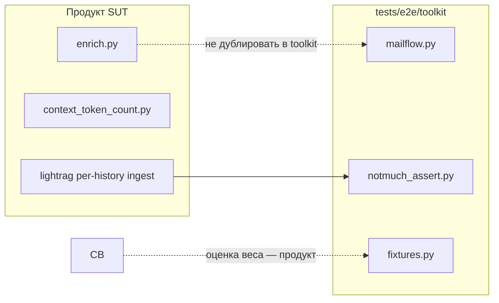

# Брифинг: рефакторинг e2e harness → `tests/e2e/toolkit/`

Документ для передачи контекста в другую сессию (продукт, WireMock, документация, новые e2e).
Нормативные контракты тестов и изоляции — по-прежнему в
[`TESTING.md`](../TESTING.md), [`E2E_ISOLATION.md`](../E2E_ISOLATION.md).

См. также параллельные брифинги (логика **не** менялась, только перенос кода harness):

- [`enrich_task_hypotheses_briefing.md`](enrich_task_hypotheses_briefing.md) — второй LLM в enrich, RAG warmup
- [`summarize_context_overflow_e2e_briefing.md`](summarize_context_overflow_e2e_briefing.md) — multi-turn prior inject, `MailflowScenarioSpec`
- [`system_cid_lightrag_per_history_briefing.md`](system_cid_lightrag_per_history_briefing.md) — per-history LightRAG asserts

**Дата работы:** 2026-06-02  
**Статус:** реализовано в репозитории  
**Поведение e2e:** семантика сценариев сохранена; изменена только структура импортов и расположение кода  
**Проверка:** `pytest tests/e2e/ --collect-only` — **57** тестов, без ошибок импорта  
**Полный smoke mailflow на живом стеке:** в этой сессии **не** перегонялся (нужен `wipe_bake` / attach-only stack)

---

## Цель эпика

Разбить бывший монолитный `tests/e2e/helpers.py` (~4600 строк, **удалён**) на пакет
[`tests/e2e/toolkit/`](../../tests/e2e/toolkit/) с гранулярными модулями, разорвать цикл
`helpers` ↔ `wiremock_client`, сохранить семантику сценариев из параллельных эпиков
2026-06-02.

| Было | Стало |
|------|--------|
| Один файл `helpers.py` | Пакет `tests/e2e/toolkit/` (~26 модулей) |
| `from .helpers import X` | `from .toolkit import X` (или подмодуль) |
| `helpers.py` как фасад | **Файл удалён** — только `toolkit` |
| `wiremock_client` → `helpers` | `wiremock_client` → `toolkit.{constants,coord,poll,runtime}` |

---

## Структура `tests/e2e/toolkit/`

```text
tests/e2e/toolkit/
  __init__.py              # публичный re-export (как бывший helpers)
  README.md                # deploy: wipe_bake для Python на SUT
  constants.py             # REPO_ROOT, таймауты, stub_tag map, E2E_* users
  coord.py                 # xdist compose coord + controller hint
  poll.py                  # poll_until, poll_until_backoff, mailflow_log_phase
  remote_boot.py           # REMOTE_PROBE_LOGGER_BOOT (heredoc на SUT)
  notmuch_snippets.py      # общие _paths / _first_thread для heredoc
  runtime.py               # E2EComposeRuntime, service_exec, discover_runtime
  compose_lifecycle.py     # compose up/down, bake, discover_live_e2e_project_name
  bridges/
    email.py, matrix.py, telegram.py, correlation.py
  fixtures.py              # e2e_dense_threlium_ctx_body, trim/summarize bodies
  greenmail.py             # IMAP/SMTP waits (host-first)
  smtp_ingress.py          # smtp_inject_inbound
  cleanup.py               # flush greenmail/fsm, e2e_clean_sut_messages_for_test
  knowledge.py             # bootstrap corpus, embeddings wait
  pipeline.py              # stop/start threlium user units на SUT
  ansible.py               # run_e2e_site_playbook, hop budget
  notmuch_assert.py        # assert_notmuch_*, wait_for_notmuch_message
  lightrag_assert.py       # lightrag index filter asserts
  wiremock_assert.py       # assert_wiremock_mailflow_* (делегат wiremock_client)
  diag.py                  # mailflow_pipeline_diag, dump_failure_artifacts
  workers.py               # wait_for_sut_threlium_user_workers_idle
  mailflow.py              # MailflowScenarioSpec, inject, assert pipeline
  imap_checkpoint.py       # IMAP processed folder helpers
```

**Не тронуты** (как и раньше, sibling-модули):

- [`tests/e2e/wiremock_client.py`](../../tests/e2e/wiremock_client.py) — Admin API, State, стабы
- [`tests/e2e/formal_reason_assertions.py`](../../tests/e2e/formal_reason_assertions.py) — journal formal_reason
- [`tests/e2e/mail_wire.py`](../../tests/e2e/mail_wire.py), [`sut_user_systemd.py`](../../tests/e2e/sut_user_systemd.py)

---

## Ключевые изменения в harness (не продукт)

### 1. Импорты во всех e2e

Все `tests/e2e/test_*.py`, [`conftest.py`](../../tests/e2e/conftest.py),
[`wipe_bake.py`](../../tests/e2e/wipe_bake.py), [`wipe_sync.py`](../../tests/e2e/wipe_sync.py),
[`test-runs/fsts_between_test_reset.py`](../../test-runs/fsts_between_test_reset.py):

```python
from .toolkit import MailflowScenarioSpec, poll_until, REPO_ROOT
# или
from tests.e2e.toolkit.mailflow import mailflow_inject_and_wait
```

### 2. Разрыв цикла `helpers` ↔ `wiremock_client`

[`wiremock_client.py`](../../tests/e2e/wiremock_client.py) импортирует нижний слой toolkit:

- `tests.e2e.toolkit.constants` — `POLL_INTERVAL`, `TIMEOUT_POLL_SHORT`
- `tests.e2e.toolkit.coord` — `e2e_compose_coord_dir`
- `tests.e2e.toolkit.poll` — `poll_until`
- `tests.e2e.toolkit.runtime` — `_compose_container`

Lazy-import cleanup SUT в `prepare_wiremock_scenario` — из `toolkit.cleanup`, `toolkit.compose_lifecycle`, `toolkit.workers`.

### 3. `notmuch_snippets.py` — дедуп heredoc

Общие фрагменты `_paths` / `_first_thread` для remote Python на SUT вынесены в
[`notmuch_snippets.py`](../../tests/e2e/toolkit/notmuch_snippets.py); подставлены в
`diag.py`, `notmuch_assert.py`, `lightrag_assert.py` (меньше копипаста, одна точка правки протокола stdout).

### 4. `MailflowScenarioSpec` и mailflow DSL

Живут в [`toolkit/mailflow.py`](../../tests/e2e/toolkit/mailflow.py):

- `@dataclass(frozen=True) MailflowScenarioSpec` (поля summarize/trim **сохранены**)
- `mailflow_inject_and_wait` — в т.ч. цикл **prior-turn** с `In-Reply-To` на **ответ агента**
- `assert_full_mailflow_pipeline`

См. [`summarize_context_overflow_e2e_briefing.md`](summarize_context_overflow_e2e_briefing.md) — контракт multi-turn **не** упрощать.

### 5. Стабилизация `_inject_rag_warmup` (гонка bootstrap)

После cold journal-reset `bootstrap_knowledge` раздувает `vdb_chunks.json` (~8 KiB) → старый код
считал vectordb «готовым» и пропускал warmup → падение mailflow за ~1 с.

**Исправление в harness:** skip полного warmup только если `vdb_chunks` ≥ **32 KiB**
(порог `_RAG_WARMUP_SKIP_MIN_BYTES` в `mailflow._inject_rag_warmup`).

См. [`enrich_task_hypotheses_briefing.md`](enrich_task_hypotheses_briefing.md) §«Гонки e2e».

### 6. WireMock: enrich call-sites для mailflow

Добавлены сценарные стабы (изоляция `stub-mailflow-e2e-01` + `X-Threlium-Thread-Root`):

| Файл | Call-site |
|------|-----------|
| [`081_chat_enrich_task_plan.json`](../../tests/e2e/wiremock_stubs/test_mailflow_e2e/081_chat_enrich_task_plan.json) | `enrich_task_plan` |
| [`083_chat_enrich_task_hypotheses.json`](../../tests/e2e/wiremock_stubs/test_mailflow_e2e/083_chat_enrich_task_hypotheses.json) | `enrich_task_hypotheses` |

В [`test_mailflow_e2e.py`](../../tests/e2e/test_mailflow_e2e.py): `MAILFLOW_SPEC.min_chat_completion_posts=3`.

Bootstrap fail-open по-прежнему: `compose_bootstrap/009_*`, `010_*`.

### 7. Документация (точечно)

- [`E2E_ISOLATION.md`](../E2E_ISOLATION.md) — matrix/telegram helpers → `toolkit/bridges/*`
- [`docker-compose.yml`](../../tests/e2e/compose/docker-compose.yml), `bake_e2e_sut_image.sh` — ссылка на `toolkit/constants.py`
- [`TESTING.md`](../TESTING.md) — **ещё** содержит старые ссылки на `helpers.py` (нужен отдельный проход замены на `toolkit/`)

---

## Разделение слоёв (важно для других эпиков)



- **Harness** не меняет `enrich.py`, `context_token_count.py`, промпты.
- **`concat_history_parts_text`** в assert'ах LightRAG **не** смешивать с enrich/summarize
  ([`system_cid_lightrag_per_history_briefing.md`](system_cid_lightrag_per_history_briefing.md)).

---

## Что **не** делали / out of scope

- Unit-тесты на toolkit (политика проекта — только e2e).
- Полный прогон всех 57 e2e на baked-образе после рефакторинга.
- Унификация GreenMail host/container в один `Protocol` (host-путь основной; container-функции оставлены).
- Полная замена ссылок `helpers.py` в [`TESTING.md`](../TESTING.md) (большой документ — отдельная задача).
- Удаление скриптов [`scripts/split_e2e_toolkit.py`](../../scripts/split_e2e_toolkit.py) / `extract_e2e_toolkit.py` (вспомогательные для миграции).

---

## Чеклист для следующей сессии

1. **Импорты:** в новом коде — только `tests.e2e.toolkit` или подмодуль; `helpers.py` **нет**.
2. **Доки:** точечно заменить в `TESTING.md` / `PLAYBOOK.md` ссылки `tests/e2e/helpers.py` → `tests/e2e/toolkit/...`.
3. **Smoke e2e** (живой стек после `wipe_bake`):
   - `test_mailflow_e2e.py::test_full_mailflow_deploy_and_pipeline`
   - `test_summarize_context_e2e.py::test_summarize_overflow_full_pipeline`
   - `test_lightrag_index_filter_e2e.py`
   - `test_task_ledger_e2e.py`
4. **После cold reset:** первый mailflow — проверить, что `_inject_rag_warmup` не падает за ~1 с (порог 32 KiB).
5. **Журнал WM:** после mailflow — `enrich_task_plan` + `enrich_task_hypotheses` с тем же `X-Threlium-Thread-Root`; unmatched пуст.
6. **Продукт на SUT:** attach-only pytest **не** обновляет Python — нужен `wipe_bake` / `wipe_sync` или `docker cp` (см. `toolkit/README.md`).

---

## Команды

```bash
# Сборка тестов (быстро)
.venv/bin/python -m pytest tests/e2e/ --collect-only -q

# Smoke mailflow (attach-only, полный вывод)
.venv/bin/python -m pytest -n0 -vv -s \
  tests/e2e/test_mailflow_e2e.py::test_full_mailflow_deploy_and_pipeline

# Аудит tool stubs
.venv/bin/python scripts/audit_wiremock_tool_stubs.py
```

---

## Быстрые отсылки

| Вопрос | Ответ |
|--------|--------|
| Куда импортировать harness? | `from tests.e2e.toolkit import …` или `tests.e2e.toolkit.mailflow` |
| Где `MailflowScenarioSpec`? | `tests.e2e.toolkit.mailflow` |
| Где `e2e_thread_root_mid_for_message_id`? | `tests.e2e.toolkit.bridges.email` |
| Где `poll_until`? | `tests.e2e.toolkit.poll` |
| `REPO_ROOT` в toolkit | `Path(__file__).resolve().parents[3]` (на уровень глубже, чем в старом helpers) |
| Re-export `e2e_threlium_user_unit_journalctl_bash` | `toolkit.__init__` из `sut_user_systemd` |
