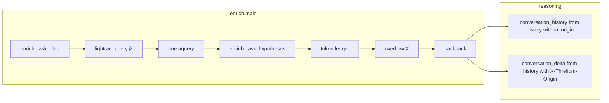

# Брифинг: упрощённый enrich (11 шагов) + вычистка мёртвого кода

Документ для передачи контекста в другую сессию. Нормативные контракты — в
[`CONTEXT_CONTRACT.md`](../CONTEXT_CONTRACT.md) §4–5,
[`FSM.md`](../FSM.md) §5.2,
[`INDEX.md`](../INDEX.md) §7,
[`TYPES.md`](../TYPES.md) § enrich tool bridge.

Планы реализации (не редактировать в сессиях):
`.cursor/plans/simplified_enrich_pipeline_7b0c296e.plan.md`,
`.cursor/plans/dead_code_cleanup_41ec4415.plan.md`.

См. также соседние брифинги (разные эпики, не смешивать):
[`enrich_task_hypotheses_briefing.md`](enrich_task_hypotheses_briefing.md) (late hypotheses, один `<task-init>`),
[`summarize_context_overflow_e2e_briefing.md`](summarize_context_overflow_e2e_briefing.md) (история отладки overflow; MCKP устарел),
[`e2e_toolkit_refactor_briefing.md`](e2e_toolkit_refactor_briefing.md).

**Дата работы:** 2026-06-04  
**Статус кода:** реализовано в рабочей копии (коммит — по запросу пользователя)  
**Smoke:** import всех затронутых модулей — OK; e2e `test_unified_context_roles_e2e` + `test_summarize_context_e2e` — запускать после bake/deploy SUT

---

## Цель (два связанных эпика)

### A. Упрощённый enrich — линейный пайплайн из 11 шагов

Заменить старый контур (plan-LLM `enrich_query_plan` → `enrich_aquery_user` → MCKP 4-bucket → merged `<unified-mail-context>`) на:

- один Jinja [`lightrag_query.j2`](../../ansible/roles/threlium/files/prompts/lightrag/lightrag_query.j2) + **один** `aquery`;
- seed (`enrich_task_plan`) **до** RAG, hypotheses (`enrich_task_hypotheses`) **после** RAG;
- token-ledger + overflow-by-X → `summarize_context` (granular `SummarizeHistoryUnit`);
- выход в reasoning — **backpack** [`build_context_backpack_multipart`](../../ansible/roles/threlium/files/scripts/threlium/mime_reform.py), не merged blob.

### B. Вычистка мёртвого кода и legacy MIME

Удалить всё, что больше не вызывается из runtime, и **полностью** убрать поддержку MIME CID `<unified-mail-context>` (legacy merged unified).

---

## Архитектура (текущий продакшен-путь)

```text
enrich.main (один hop):
  1 user_query          require_enrich_user_query_text + enrich_incoming_user_text.j2
  2 unified messages    build_unified_email_messages
  3a seed               invoke_task_plan_subtasks (081 wiremock)
  3b query jinja        lightrag_query.j2 (intent → seed subtasks → thread context)
  4 cap query           trim_from_end_tokens / lightrag_query_budget
  5 aquery              run_lightrag_aquery (один раз)
  6 graph               format_graph_answer_part → <graph-answer>
  7 hypotheses          enrich_task_hypotheses.j2 (graph→memory→ledger→unified), cap
  8 task mime           _finalize_task_mime_parts → <task-init> + <task-state>
  9 token ledger        mandatory + history tokens vs reasoning_effective_budget
 10 overflow X          oldest <history> CID → summarize_context (если excess>0)
 11 backpack            build_context_backpack_multipart → reasoning@
```



---

## Что удалено

| Артефакт | Было | Сейчас |
|----------|------|--------|
| Plan-LLM | `enrich_query_plan.j2`, tool `enrich_query_plan`, stub `080_*` | **удалено**; запрос = `lightrag_query.j2` |
| MCKP | `context_budget.py`, `solve_mckp`, tier/priority settings | **удалено**; `context_token_count.py` + token ledger |
| Merged MIME | `build_enriched_multipart`, CID `<unified-mail-context>` | **удалено**; granular `<{hash}@history>` |
| Pre-RAG overflow | ранний summarize до RAG | **удалено**; только post-ledger шаг 10 |
| `scipy` dep | только для MCKP | **удалён** из `pyproject.toml` |
| Settings | `plan_recent_n`, `summarize_batch_max_messages`, `summarize_trigger_min_excess_chars`, `tier1_full`, `priority_*`, … | **удалены** |

### Файлы DELETE (ключевые)

- `ansible/roles/threlium/files/prompts/lightrag/enrich_query_plan.j2` (ранее)
- `ansible/roles/threlium/files/prompts/lightrag/enrich_aquery_user.j2` (ранее)
- `ansible/roles/threlium/files/prompts/lightrag/tools/enrich_query_plan_tool_spec.j2`
- `ansible/roles/threlium/files/scripts/threlium/context_budget.py`
- `tests/e2e/wiremock_stubs/**/080_chat_enrich_plan.json` (все каталоги)

### Python: вычищенные символы

- `EnrichQueryPlanToolArgs`, `parse_enrich_query_plan_assistant`, `LitellmCallSite.ENRICH_QUERY_PLAN`, `EnrichToolFunctionName.ENRICH_QUERY_PLAN`
- `EnrichQueryPlanThreadSkeletonEntry`, `EnrichQueryPlanRecentMessageEntry`
- `build_enriched_multipart`, `EnrichPartId.UNIFIED_MAIL_CONTEXT`

---

## Что осталось (не путать с legacy)

| Имя | Назначение |
|-----|------------|
| `EnrichUnifiedMailContextText` | **VO строки** для hypotheses prompt и синтеза `<conversation_history>` — **не** MIME CID |
| `unified_mail_context` в `enrich_task_hypotheses.j2` | rendered full thread text (`mail_context.j2`), не часть backpack |
| `enrich_task_plan` / `enrich_task_hypotheses` | единственные enrich task LLM call sites |
| WireMock `081_*` / `083_*` | seed plan / late hypotheses |
| `tier_preview_chars` | preview в `_render_mail_context_full` (hypotheses only) |
| `_LEGACY_UNIFIED_MAIL_CONTEXT_CID` в `mime_reform.py` | только чтобы **не копировать** старый blob в `enrich_fast` splice |

---

## Token budget (единый токенайзер)

Модуль [`context_token_count.py`](../../ansible/roles/threlium/files/scripts/threlium/context_token_count.py):

- `lightrag.tiktoken_model_name` → `TiktokenTokenizer` (тот же, что LightRAG chunking)
- `trim_from_end_tokens` — cap с конца (хвост thread context / unified в hypotheses режется первым)
- Бюджеты: `lightrag_query_budget`, `hypotheses_prompt_budget`, `reasoning_effective_budget`, `summarize_content_budget`
- Настройки: `model_context_tokens`, `*_overhead_tokens`, `context_safety_margin_tokens` в `EnrichSettings` / `group_vars/e2e.yml`

**Overflow (шаг 10):** `excess = total_tokens − effective_budget(reasoning)`; при `excess > 0` — всегда summarize (без `summarize_trigger_min_excess_chars`). Payload: `SummarizeHistoryUnit[]` (`cid`, `text`, `source_mid`). Pack: [`summarize_pack.py`](../../ansible/roles/threlium/files/scripts/threlium/summarize_pack.py) + multi-round в [`summarize_context.py`](../../ansible/roles/threlium/files/scripts/threlium/states/summarize_context.py).

---

## Контракт enrich → reasoning (backpack)

[`build_context_backpack_multipart`](../../ansible/roles/threlium/files/scripts/threlium/mime_reform.py):

- Mandatory: `<user-message>`, `<graph-answer>`, `<thread-memory>`, `<global-memory>` (если непусты), `<task-init>`, `<task-state>`, `<response-state>`
- Unified-история: **только** leaf `<{sha256(body)}@history>` (как splice в `enrich_fast`), **без** merged `<unified-mail-context>`

[`ReasoningEnrichContext.from_email`](../../ansible/roles/threlium/files/scripts/threlium/types/reasoning.py):

| Части `<history>` | Куда в `reasoning/user.j2` |
|-------------------|----------------------------|
| **без** `X-Threlium-Origin` | `<conversation_history>` (join `---`) |
| **с** `X-Threlium-Origin` (enrich_fast relay) | `<conversation_delta>` `[from: origin]` |

Legacy read CID `<unified-mail-context>` **удалён**. `splice_e_prev_with_history` **пропускает** старый blob при копировании `E_prev`.

Глобальный cap в [`reasoning.py`](../../ansible/roles/threlium/files/scripts/threlium/states/reasoning.py): `trim_from_end_tokens(..., reasoning_effective_budget)` на собранный user prompt.

---

## E2E / WireMock

| Stub | Call site | Статус |
|------|-----------|--------|
| `080_chat_enrich_plan.json` | `enrich_query_plan` | **удалены все** |
| `081_chat_enrich_task_plan.json` | `enrich_task_plan` | **сохранены** |
| `083_*` | `enrich_task_hypotheses` | **сохранены** |

[`wiremock_client.py`](../../tests/e2e/wiremock_client.py): assert на `enrich_query_plan` снят; требуется `extract_query_keywords` для LightRAG.

**Регрессии для прогона после deploy:**

- `tests/e2e/test_unified_context_roles_e2e.py` — `<conversation_history>` с ingress/observe маркерами
- `tests/e2e/test_summarize_context_e2e.py` — token overflow → summarize → re-enrich

E2e vars: `ansible/group_vars/e2e.yml` — уменьшенный `model_context_tokens` (1400) для предсказуемого overflow.

---

## Документация (обновлено точечно)

Канон: `CONTEXT_CONTRACT.md`, `FSM.md` §5.2, `INDEX.md` §7, `ARCHITECTURE.md`, `TYPES.md`, `TESTING.md`, `MESSAGES.md`, `E2E_ISOLATION.md`, `ARTICLE.md`, `skills/implementation-plan-formation.md`.

Briefing: этот файл + баннеры в `summarize_context_overflow_e2e_briefing.md`, правки в `enrich_task_hypotheses_briefing.md`, `dedup_audit_followups_briefing.md`, `e2e_toolkit_refactor_briefing.md`.

Import: баннер в начале [`docs/import/Debugging Mailflow E2E Tests.md`](../import/Debugging%20Mailflow%20E2E%20Tests.md) — agent-log с устаревшими терминами.

---

## Ключевые файлы (куда смотреть)

| Область | Файл |
|---------|------|
| Оркестрация 11 шагов | `ansible/roles/threlium/files/scripts/threlium/states/enrich.py` |
| Token cap / budget | `ansible/roles/threlium/files/scripts/threlium/context_token_count.py` |
| RAG query jinja | `ansible/roles/threlium/files/prompts/lightrag/lightrag_query.j2` |
| Task LLM | `states/enrich_task_llm.py`, `enrich_tool_bridge.py` |
| Summarize pack | `summarize_pack.py`, `states/summarize_context.py` |
| Backpack MIME | `mime_reform.py` (`build_context_backpack_multipart`, `splice_e_prev_with_history`) |
| Reasoning read | `types/reasoning.py`, `states/reasoning.py` |
| Defaults | `ansible/roles/threlium/vars/main.yml`, `ansible/host_vars/th-agent.yml`, `ansible/group_vars/e2e.yml` |

---

## Проверка для новой сессии

```bash
# Import smoke
PYTHONPATH=ansible/roles/threlium/files/scripts ./.venv/bin/python -c "
from threlium.states import enrich, enrich_fast, reasoning, summarize_context
from threlium.mime_reform import build_context_backpack_multipart
"

# Grep gate (ansible Python — только legacy constant для splice)
rg 'enrich_query_plan|context_budget|build_enriched_multipart' ansible/roles/threlium/files/scripts --glob '*.py'

# E2e (долгие — в фоне, после bake)
pytest tests/e2e/test_unified_context_roles_e2e.py tests/e2e/test_summarize_context_e2e.py -v
```

После удаления `scipy` — пересобрать образ SUT / `uv sync` в scripts venv.

---

## Не делать в follow-up без отдельного решения

- Возвращать `enrich_query_plan` / второй RAG / MCKP
- Восстанавливать MIME CID `<unified-mail-context>` как writer
- Переименовывать `EnrichUnifiedMailContextText` / поле `unified_mail_context` в hypotheses (это не legacy MIME, только имя поля)
- Писать unit-тесты (политика проекта: только e2e)

---

## Открытые хвосты

1. **Bake + e2e** на свежем SUT после удаления `scipy` и смены enrich/reasoning.
2. **`mail_context.j2` tier 2/3** — ветки не используются (`tier_assignments={}`); можно упростить отдельным PR.
3. **`scripts/migrate_wiremock_call_sites.py`** — `enrich_plan` в имени файла мапится на `enrich_task_plan` (legacy migration helper).
