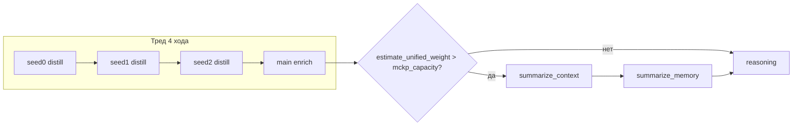

# Брифинг: overflow summarize — фикс оценки веса + e2e multi-turn

Документ для передачи контекста в другую сессию. Нормативные контракты — в
[`CONTEXT_CONTRACT.md`](../CONTEXT_CONTRACT.md) §4.1, §5 и [`E2E_ISOLATION.md`](../E2E_ISOLATION.md);
см. также [`system_cid_lightrag_per_history_briefing.md`](system_cid_lightrag_per_history_briefing.md)
(параллельный рефакторинг ingest/chunking **не** меняет enrich/summarize-оценку),
[`e2e_toolkit_refactor_briefing.md`](e2e_toolkit_refactor_briefing.md) (harness: `toolkit/mailflow.py`, `toolkit/fixtures.py`).

**Дата работы:** 2026-06-02  
**Smoke e2e:** `test_summarize_context_e2e.py::test_summarize_overflow_full_pipeline` — **PASSED** (~89 с), лог `test-runs/.smoke_summarize_context.log`

---

## Цель эпика

1. Починить **продуктовую** оценку переполнения unified: `history_body_chars` должна совпадать с
   тем, что реально рендерится (`concat_history_parts_text` / Jinja `history_text`).
2. Перестроить e2e **без** переполнения одним `ingress_distill`: несколько ходов треда
   накапливают `<history>` в unified, overflow → `summarize_context` на **главном** ходе.
3. Статические WireMock-стабы: один distill-стаб с **встроенным** шаблонизатором WireMock
   (не генерация стабов на лету в pytest).

---

## Проблема 1 — занижение веса unified (баг в продукте)

### Симптом

`summarize_context` / `summarize_memory` не вызывались при длинном треде: enrich шёл сразу в
reasoning, e2e падал с `NOTMUCH_STAGE_FOLDER_EMPTY stage='summarize_context'`.

### Корневая причина

| Слой | Поведение |
|------|-----------|
| Рендер unified, summarize input, Jinja `history_text` | **Все** непустые `<history>` (`concat_history_parts_text`) |
| `history_body_chars` → `estimate_unified_weight` → overflow в `enrich.main` | Было: длина **только первой** `<history>` |

После успешного `ingress_distill` порядок частей: `user_reply_language` → `step_back_notes` →
`open_gaps` → **`user_query` последним** (`types/ingress_distill.py`). Первая часть ~30 символов,
основной бриф ~1300+ — оценка веса была в **10× ниже** фактического.

Комментарий в `enrich.py` («согласовано с реальной сборкой») при multi-part history был неверен.

### Исправление

**`context_budget.py` — `history_body_chars`**

```python
combined = concat_history_parts_text(msg)
if combined.strip():
    return len(combined)
```

Тот же текст, что в `mail_context.j2` (tier 1/2) и в `_emit_summarize_overflow` (`bodies`).

**Точечно в доках:** `CONTEXT_CONTRACT.md` §4.1 (overflow ↔ `history_body_chars`);
комментарий в `enrich.py` у условия overflow.

### Связь с рефакторингом system-CID / LightRAG

Параллельная сессия убрала `concat_history_parts_text` из **LightRAG ingest** (per-history
chunking). Для **enrich / summarize / MCKP** `concat_history_parts_text` **остаётся** —
фикс оценки веса с этим согласован, конфликта нет.

---

## Проблема 2 — неверный e2e-сценарий и стаб distill

### Старый сценарий (сломан)

- Одно (или одно seed + одно main) письмо с **огромным** сырым телом (`e2e_summarize_overflow_inject_body`, ~25k pad).
- Стаб `075_chat_ingress_distill.json` возвращал `user_query` ~25k → **`maxLength` 8000**
  (`distill_max_chars`) → `jsonschema.ValidationError` → **fallback** distill.
- Fallback: `trim_context_text` с начала → пропадал `E2E-SUM-ORIG-HEAD-MARKER`, оставался pad/tail.

Архитектурно summarize должен сжимать **накопленный unified** (старые ходы), а не один
переполненный distill; distill при этом должен оставаться **под cap**.

### Новый сценарий

**3 prior-хода + 1 основной** (`summarize_overflow_prior_turns=3` в `SUMMARIZE_CONTEXT_SPEC`).

| Ход | Сырое тело inject | Distill-бриф (WireMock) | Эффект |
|-----|-------------------|-------------------------|--------|
| seed[0..2] | Малое (HEAD + PAD 500 + tail) | templated `user_query` ~1347 chars (все history) | Накопление в unified, **без** overflow |
| main | Плотное (`e2e_dense_threlium_ctx_body`) | тот же стаб, уникальный MID в brief | 4-е письмо → overflow → summarize |

**Threading:** каждый следующий inbound — `In-Reply-To` на **ответ агента** предыдущего хода
(egress glue-record), не на собственную seed-инъекцию → IRT → `tasks_upsert` наследует ledger,
`phase_tasks_ledger_done` в WireMock не сбрасывается.

**Дедуп:** `EnrichContentId.from_history_body` — одинаковый distill-текст схлопывается.
Уникальность: `{{request.headers.[message-id]}}` в `user_query` стаба
(`response-template` transformer).

### Калибровка веса (e2e `group_vars/e2e.yml`)

- `context_max_chars: 8000`
- `mckp_capacity ≈ 4667` (минус бюджеты user + extra по приоритетам)
- `summarize_trigger_min_excess_chars: 100` → порог **4767**
- Оценка на письмо (tier1, все history): **~1447** (`body_chars` ~1347 + header 100)
- 3 письма: **4341** (< 4767) — prior не триггерят summarize
- 4 письма: **5788** (> 4767) — overflow на **main** enrich

В стабе **50** повторов `accumulation-filler` (было 60 — давало overflow уже на 3-м ходе).

---

## Ключевые изменения в коде / тестах

### Продукт

```
ansible/roles/threlium/files/scripts/threlium/
  context_budget.py     # history_body_chars → concat_history_parts_text
  states/enrich.py      # комментарий у overflow-порога
docs/CONTEXT_CONTRACT.md   # §4.1: overflow ↔ history_body_chars (точечно)
```

### E2e

```
tests/e2e/
  test_summarize_context_e2e.py   # summarize_overflow_prior_turns=3
  toolkit/mailflow.py               # цикл prior-turn seed; поле MailflowScenarioSpec
  wiremock_stubs/test_summarize_context_e2e/
    075_chat_ingress_distill.json # response-template + Message-ID в user_query; 50 fillers
```

**Ассерты** (`_assert_summarize_pipeline_artifacts`) без изменений по смыслу:

- `summarize_context` / `summarize_memory` в notmuch;
- `tag:context_summarized`;
- в summarize LLM input: `## User intent`, `E2E-SUM-ORIG-HEAD-MARKER`, **нет** `E2E-SUM-ORIG-PAD-MARKER`;
- в reasoning: `E2E-SUM-CONTEXT-MARKER`, pad не протёк.

---

## Деплой на SUT (важно для отладки)

Лёгкий e2e-прогон (**без** `wipe_bake`) **не** обновляет Python в контейнере. После правки
`context_budget.py` на хосте SUT продолжал отдавать старую `history_body_chars` (первая history) —
тест снова падал, пока файл не скопировали:

```bash
docker cp ansible/roles/threlium/files/scripts/threlium/context_budget.py \
  threlium_e2e_shared_<id>-sut-1:/home/threlium/threlium/agent/scripts/threlium/context_budget.py
```

Проверка:

```bash
docker exec <sut> .../python3 -c "import inspect; from threlium.context_budget import history_body_chars; print(inspect.getsource(history_body_chars))"
```

**Закрепить в образе:** `wipe_bake` / `wipe_sync` (как в брифинге system-CID).

WireMock-стабы подхватываются pytest при старте сессии (каталог `stub_dir` в spec) — отдельный
`docker cp` для JSON не нужен, если тест перезапускается с обновлённым репо на хосте.

---

## Проверка

| Что | Результат |
|-----|-----------|
| `test_summarize_overflow_full_pipeline` | **PASSED** ~89 s |
| `summarize_context` / `summarize_memory` в thread | OK |
| `tag:context_summarized` | OK |
| WireMock summarize input | HEAD есть, PAD нет |
| Предыдущий прогон (старый SUT + старый стаб) | FAIL: пустой `summarize_context` (~120 s) |

---

## Диагностика (шпаргалка)



1. **Нет summarize_context:** `docker exec` → `history_body_chars` на SUT; число `<history>` на
   письме; `journalctl` `overflow_to_summarize` / `summarize_overflow_skip_no_history`.
2. **Нет HEAD в summarize input:** distill fallback (stub `user_query` > 8000) или validation error.
3. **Дедуп схлопнул тред:** одинаковый `user_query` без templating Message-ID.

---

## Out of scope / не трогали

- `message_content_score` — по-прежнему с **первой** `<history>` (tier-ranking, не объём).
- `test_summarize_idempotent_second_enrich` — не перегонялся в этой сессии.
- Полный `wipe_bake` после фикса продукта.
---

## Следующие шаги (если продолжать)

1. **Bake/deploy:** `context_budget.py` (+ при необходимости остальные изменённые модули) в образ SUT.
2. **E2e:** прогнать `test_summarize_idempotent_second_enrich` на том же стеке.
4. **Опционально:** unit-free проверка `history_body_chars == len(concat_history_parts_text)` в
   dev-скрипте или smoke-хелпере (в проекте unit-тесты запрещены).

---

## Быстрые отсылки

| Вопрос | Ответ |
|--------|--------|
| Когда вызывается summarize? | `enrich.main`: `estimate_unified_weight(...) - mckp_capacity > summarize_trigger_min_excess_chars` |
| Что суммаризируется? | `concat_history_parts_text` по `ctx.all_messages[:batch_max]` |
| Откуда user_message в enrich? | `last_history_text` / distill `user_query`, **не** весь unified |
| Cap distill | `distill_max_chars` = 8000 (`ingress_distill_tool_spec.j2`) |
| Уникальность брифа в e2e | WireMock `{{request.headers.[message-id]}}` в стабе distill |
